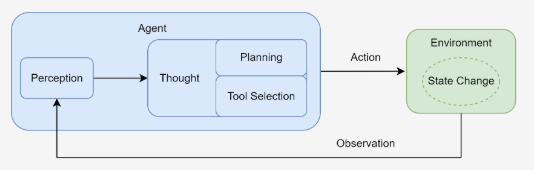

# 什么是智能体


在人工智能领域，智能体被定义为任何能够通过**传感器（Sensors）**感知其所处 **环境（Environment）**，并 **自主** 地通过 **执行器（Actuators）**采取**行动（Action）**以达成特定目标的实体。

- **环境是智能体所处的外部世界**，通过其**传感器持续地感知环境**状态。
- 获取信息后，智能体需要采取行动来对环境施加影响，它**通过执行器来改变环境的状态**。执行器可以是**物理设备**（如机械臂、方向盘）或**虚拟工具**（如执行一段代码、调用一个服务）。
- **自主性（Autonomy）真正赋予智能体"智能"** 的，它能够**基于其感知和内部状态进行独立决策，以达成其设计目标**。
- 这种从**感知到行动的闭环**，构成了所有智能体行为的基础

# 发展过程

发展过程：经历了一条从简单到复杂、从被动反应到主动学习的清晰演进路线。

1. **反射智能体（Simple Reflex Agent）**：决策核心由工程师明确设计的“条件-动作”规则构成，完全依赖于当前的感知输入，不具备记忆或预测能力，**无法应对需要理解上下文的复杂任务**。
2. **基于模型的反射智能体（Model-Based Reflex Agent）**：引入了“状态”的概念，这类智能体拥有一个内部的 **世界模型（World Model）。**这个内部模型让智能体拥有了初级的“记忆”，使**其决策不再仅仅依赖于瞬时感知，而是基于一个更连贯、更完整的世界状态理解**。
3. **基于目标的智能体（Goal-Based Agent）**：它的行为不再是被动地对环境做出反应，而是**主动地、有预见性地选择能够导向某个特定未来状态的行动**
4. **基于效用的智能体（Utility-Based Agent）**：当多个目标需要权衡时，它为每一个可能的世界状态都赋予一个效用值，这个值代表了满意度的高低。智能体的核心目标不再是简单地达成某个特定状态，而是**最大化期望效用**。
5. **学习型智能体（Learning Agent）**：之前都依然依赖于人类设计师的先验知识，这种智能体能不依赖预设，而是**通过与环境的互动自主学习**。一个学习型智能体包含一个性能元件（即我们前面讨论的各类智能体）和一个学习元件。**学习元件通过观察性能元件在环境中的行动所带来的结果来不断修正性能元件的决策策略**。


按历史分析，其历程如下

**1、基于符号与逻辑（规则）的早期智能体**：受数理逻辑和计算机科学基本原理的影响。

- 核心内容
  - 范式：符号主义（Symbolicism），也被称为“逻辑AI”或“传统AI”
  - 智慧”完全来源于设计者预先编码的知识库和推理规则，而非通过自主学习获得。
- 过程
  1. **物理符号系统假说（PhysicalSymbol SystemHypothesis, PSSH）**：由一组可被区分的符号和一系列对这些符号进行操作的过程组成，这些符号可以组合成更复杂的结构（例如表达式），而过程则可以创建、修改、复制和销毁这些符号结构。
  2. **专家系统（Expert System）**：模拟人类专家在特定领域内解决问题的能力。**智能体现组件：知识库和推理机，展示了符号AI在专业领域的“深度”**
  3. **SHRDLU**：用户通过自然语言向SHRDLU下达指令或提问，SHRDLU则在虚拟世界中执行动作或给出文字回答。在 **“广度”**上实现了革命性的突破，首次将**多个独立的人工智能模块（如语言解析、规划、记忆）集成在一个统一的系统中，并使它们协同工作**

* 根本性挑战：
  * **常识知识与知识获取瓶颈**：完全依赖于其知识库的质量和完备性。
  * 框架问题与系统脆弱性：
    * **框架问题（Frame Problem）**：为每个动作显式地声明所有不变的状态，在计算上是不可行的，而人类却能毫不费力地忽略不相关的变化。
    * **系统脆弱性（Brittleness）**：完全依赖预设规则，导致其行为非常“脆弱”。遇到规则之外的任何微小变化或新情况，系统便可能完全失灵

**2、马文·明斯基的心智社会**：这里的智能体指的是一个极其简单的、专门化的心智过程，它自身是“无心”的。

- **涌现（Emergence）**：复杂的、有目的性的智能行为，并非由某个高级智能体预先规划，而是**从大量简单的底层智能体之间的局部交互中自发产生**的。**没有任何一个智能体或机构拥有整个任务的全局规划。这个由无数“无心”的智能体组成的社会，通过简单的激活和抑制规则相互作用时，一个看似高度智能的行为，就自然而然地涌现了出来。**
- 启发：分布式人工智能（Distributed Artificial Intelligence, DAI）和 多智能体系统（Multi-Agent System, MAS）提供了概念列基础，启发点如下
  - **去中心化控制（Decentralized Control）**：不存在中央控制器
  - **涌现式计算（Emergent Computation）**：杂问题的解决方案可以**从简单的局部交互规则中自发产生**。
  - **智能体的社会性（Agent Sociality）**：强调了智能体之间的交互（激活、抑制）。

3、**学习范式的演进与现代智能体**：构建能从经验和数据中自动获取知识与能力的系统。**符号主义提供了逻辑推理的框架，联结主义和强化学习提供了学习与决策的能力，而大型语言模型则提供了前所未有的、通过预训练获得的世界知识和通用推理能力。**

- **联结主义（Connectionism）**：与符号主义自上而下、依赖明确逻辑规则的设计哲学不同，**联结主义是一种自下而上的方法，其灵感来源于对生物大脑神经网络结构的模仿，核心思想**

  - **知识的分布式表示**：知识并非以明确的符号或规则形式存储在某个知识库中，而是**以连接权重的形式**，分布式地**存储在大量简单的处理单元（即人工神经元）的连接之间**。整个网络的连接模式本身就构成了知识。
  - **简单的处理单元：每个神经元只执行非常简单的计算**
  - 通过**学习调整权重**：系统通过接触大量样本，根据某种学习算法（如反向传播算法）**自动、迭代地调整神经元之间的连接权重，从而使得整个网络的输出逐渐接近期望的目标**。
  - **联结主义主要解决了感知问题（例如，“这张图片里有什么？”）**
- **基于强化学习的智能体：**

  - **强化学习（Reinforcement Learning, RL）：专注于解决序贯决策问题的学习范式**。并非直接从标注好的静态数据集中学习，而是**通过智能体与环境的直接交互，在“试错”中学习如何最大化其长期收益**。
  - **强化学习的框架核心要素**
    - **智能体（Agent）**：学习者和决策者。
    - **环境（Environment）**：能体**外部**的一切，是智能体与之交互的对象。
    - **状态（State, S）**：对**环境在某一时刻的特定描述**，是智能体做出决策的依据。
    - **行动（Action, A）**：智能体根**据当前状态所能采取的操作**。
    - **奖励（Reward, R）**：环境在智能体执行一个行动后，反馈给智能体的一个标量信号，用于**评价该行动在特定状态下的好坏**。
- **基于大规模数据的预训练**：如何让智能体在开始学习具体任务前，就先具备对世界的广泛理解？这一问题的解决方案，最终在自然语言处理（Natural Language Processing, NLP）领域中浮现，其核心便是基于大规模数据的预训练（Pre-training）。

  - 从**特定任务到通用模型**
    - 传统的自然语言处理模型通常是为单一特定任务，这种模式导致了几个问题：模型的知识面狭窄、每一个新任务都需要耗费大量的人力去标注数据。
    - **预训练与微调（Pre-training, Fine-tuning）：通用文本数据经过自监督学习形成基础模型，随后通过特定任务数据进行微调，最终适应各项下游任务。**
      - **预训练（Pre-training）：自监督学习（Self-supervised Learning）的方式**训练一个超大规模的神经网络模型。是学习语言本身内在的规律、语法结构、事实知识以及上下文逻辑。最常见的目标是“预测下一个词”。
      - **微调（ Fine-tuning）**：完成预训练后，这个模型就已经学习到了和数据集有关的丰富知识。之后，**针对特定的下游任务，只需使用少量该任务的标注数据对模型进行微调**，即可让模型适应对应任务。
  - 传统的自然语言处理模型通常是为单一特定任务，这种模式导致了几个问题：模型的知识面狭窄、每一个新任务都需要耗费大量的人力去标注数据。
  - **预训练与微调（Pre-training, Fine-tuning）：通用文本数据经过自监督学习形成基础模型，随后通过特定任务数据进行微调，最终适应各项下游任务。**
    - **预训练（Pre-training）：自监督学习（Self-supervised Learning）的方式**训练一个超大规模的神经网络模型。是学习语言本身内在的规律、语法结构、事实知识以及上下文逻辑。最常见的目标是“预测下一个词”。
    - **微调（ Fine-tuning）**：完成预训练后，这个模型就已经学习到了和数据集有关的丰富知识。之后，**针对特定的下游任务，只需使用少量该任务的标注数据对模型进行微调**，即可让模型适应对应任务。
  - **预训练（Pre-training）：自监督学习（Self-supervised Learning）的方式**训练一个超大规模的神经网络模型。是学习语言本身内在的规律、语法结构、事实知识以及上下文逻辑。最常见的目标是“预测下一个词”。
  - **微调（ Fine-tuning）**：完成预训练后，这个模型就已经学习到了和数据集有关的丰富知识。之后，**针对特定的下游任务，只需使用少量该任务的标注数据对模型进行微调**，即可让模型适应对应任务。
  - **大型语言模型的诞生与涌现能力**：**当模型的规模（参数量、数据量、计算量）跨越某个阈值后，它们开始展现出未被直接训练的、预料之外涌现能力（Emergent Abilities）**


# 大语言模型驱动的新范式智能体

**传统智能体的能力源于工程师的显式编程与知识构建**，其**行为模式是确定且有边界**的；

而 **LLM 智能体**则通过在海量数据上的预训练，**获得了隐式的世界模型与强大的涌现能力，使其能够以更灵活、更通用的方式应对复杂任务**。

这种差异使得 **LLM 智能体可以直接处理高层级、模糊且充满上下文信息的自然语言指令**。


以一个“智能旅行助手”为例来说明。

- 在 LLM 智能体出现之前，规划旅行通常意味着用户需要在多个专用应用（如天气、地图、预订网站）之间手动切换，并由用户自己扮演信息整合与决策的角色。
- 而一个 LLM 智能体则能将这个流程整合起来。当接收到“规划一次厦门之旅”这样的模糊指令时，它的工作方式体现了以下几点：

  - **规划与推理**：智能体首先会**将这个高层级目标分解为一系列逻辑子任务**，例如：`[确认出行偏好] -> [查询目的地信息] -> [制定行程草案] -> [预订票务住宿]`。这是一个**内在的、由模型驱动的规划过程**。
  - **工具使用**：在执行规划时，**智能体识别到信息缺口，会主动调用外部工具来补全**。例如，它会调用天气查询接口获取实时天气，并基于“预报有雨”这一信息，在后续规划中倾向于推荐室内活动。
  - **动态修正** ：在交互过程中，智能体会将用户的反馈（如“这家酒店超出预算”）视为新的约束，并据此调整后续的行动，重新搜索并推荐符合新要求的选项。整个“**查天气 → 调行程 → 订酒店** ”的流程，展现了其根据上下文动态修正自身行为的能力。

总而言之，我们正从开发专用自动化工具转向构建能自主解决问题的系统**。核心不再是编写代码，而是引导一个通用的“大脑”去规划、行动和学习**。

# 智能体的类型

**基于内部决策架构的分类：依据智能体内部决策架构的复杂程度**，传统智能体的演进路径本身就构成了最经典的分类阶梯

**基于时间与反应性的分类**：从智能体处理决策的时间维度进行分类，**关注智能体是在接收到信息后立即行动，还是会经过深思熟虑的规划再行动**。

- **反应式智能体 (Reactive Agents)**：这类智能体对环境刺激做出**近乎即时的响应，决策延迟极低**。

  - 通常遵循从感知到行动的直接映射，不进行或只进行极少的未来规划
  - 优点：速度快、计算开销低
- **规划式智能体(Deliberative Agents)**：在行动前会**进行复杂的思考和规划**。它们不会立即对感知做出反应，而是会先利用其内部的世界模型，系统地探索未来的各种可能性，评估不同行动序列的后果，以期找到一条能够达成目标的最佳路径 。

  - **基于目标 和 基于效用 的智能体**是典型的规划式智能体
- **混合式智能体(Hybrid Agents)**：旨在结合上面两者的优点，**实现反应与规划的平衡**。

  - **规划(Reasoning)**：在**“思考”阶段**，LLM 分析当前状况，规划出下一步的合理行动。这是一个审议过程。
  - **反应(Acting & Observing)**：在“**行动”和“观察”阶段**，智能体与外部工具或环境交互，并立即获得反馈。这是一个反应过程。

**基于知识表示的分类**：探究智能体**用以决策的知识**，究竟是**以何种形式存于**其“思想”之中。

- **符号主义 AI（Symbolic AI）**：常被称为**传统人工智能**，其核心信念是：**智能源于对符号的逻辑操作**。

  - 主要优势在于**透明和可解释**：推理步骤明确，其决策过程可以被完整追溯，这在金融、医疗等高风险领域至关重要。
  - **脆弱性：它依赖于一个完备的规则体系**，但在充满模糊和例外的现实世界中，任何未被覆盖的新情况都可能导致系统失灵，这就是所谓的“知识获取瓶颈”
- **亚符号主义 AI（Sub-symbolic AI）**：或称**连接主义**，知识并非显式的规则，而是**内隐地分布在一个由大量神经元组成的复杂网络中，是从海量数据中学习到的统计模式**。

  - 神经网络和深度学习是其代表。
  - 强大之处在于其模式识别能力和对噪声数据的鲁棒性 。它能够轻松处理图像、声音等非结构化数据，这在符号主义 AI 看来是极其困难的任务。
  - 这种强大的直觉能力也伴随着不透明性。
- **神经符号主义 AI（Neuro-Symbolic AI）：也称神经符号混合主义**。它的目标，是融合两大范式的优点，创造出一个**既能像神经网络一样从数据中学习，又能像符号系统一样进行逻辑推理的混合智能体**。

  - **系统 1 是快速、凭直觉、并行的思维模式**，类似于**亚符号主义 AI** 强大的模式识别能力。
  - **系统 2 是缓慢、有条理、基于逻辑的审慎思维**，恰如**符号主义 AI** 的推理过程。

# 智能体的构成

## 任务环境定义

在人工智能领域，通常使用**PEAS 模型**来**精确描述一个任务环境**，即分析其 **性能度量(Performance)、环境(Environment)、执行器(Actuators)和传感器(Sensor**s) 。

以智能旅行助手为例：如何运用 PEAS 模型对其任务环境进行规约。

| 维度                   | 描述                                                      |
| ---------------------- | --------------------------------------------------------- |
| Performance(性能度量） | 在预算和时间内，最大化用户满意度与行程合理性              |
| Environment(环境）     | 航旅预订网站、地图服务、天气预报API等网络服务             |
| Actuators（执行器）    | 调用API的函数、向用户界面生成和显示格式化文本             |
| Sensors（传感器）      | 解析API返回的数据（如JSON，HTML）、读取用户输入的自然语言 |

LLM 智能体所处的数字环境展现出若干复杂特性，这些特性直接影响着智能体的设计

1. 环境通常是 **部分可观察**的 ：要求智能体必须**具备记忆（记住已查询过的航线）和探索（尝试不同的查询日期）的能力**
2. 行动的结果也**并非总是确定**的：根据结果的可预测性，环境可分为 **确定性和 随机性。要求智能体必须具备处理不确定性、监控变化并及时决策的能力。**
3. 环境中还可能存在其他行动者，从而形成**多智能体(Multi-agent) 环境**：它们的行动（例如，订走最后一张特价票）会直接改变旅行助手所处环境的状态，这对智能体的快速响应和策略选择提出了更高要求。
4. 几乎所有任务都发生在 **序贯 且 动态**的环境中：要求**智能体的“感知-思考-行动-观察”循环必须能够快速、灵活地适应持续变化的世界**。
   * “**序贯”**意味着**当前动作会影响未来**；
   * **“动态”**则意味着**环境自身可能在智能体决策时发生变化**。

## 智能体的运行机制

智能体并非一次性完成任务，而是**通过一个持续的循环与环境进行交**互，这个核心机制被称为 **智能体循环 (Agent Loop)**。

这个循环主要包含以下几个相互关联的阶段：

1. **感知 (Perception)**：循环的起点。智能体通过其**传感器（例如，API 的监听端口、用户输入接口）接收来自环境的输入信息**。这些信息，即 **观察 (Observation)，既可以是用户的初始指令，也可以是上一步行动所导致的环境状态变化反馈**。
2. **思考 (Thought)**：接收到观察信息后，智能体进入其核心决策阶段。对于 LLM 智能体而言，这**通常是由大语言模型驱动的内部推理过程**。“思考”阶段可进一步细分为两个关键环节：
   * **规划 (Planning)**：基于当前的观察和其内部记忆，更新对任务和环境的理解，并制定或调整一个行动计划。
   * **工具选择 (Tool Selection)**：根据当前计划，智能体从其可用的工具库中，选择最适合执行下一步骤的工具，并确定调用该工具所需的具体参数。
3. **行动 (Action)**：决策完成后，**智能体通过其执行器（Actuators）执行具体的行动**。常表现为调用一个选定的工具（如代码解释器、搜索引擎 API），从而对环境施加影响，意图改变环境的状态。
   * **行动并非循环的终点**。智能体的**行动会引起环境 (Environment)的 状态变化 (State Change)，环境随即会产生一个新的观察 (Observation)作为结果反馈**。这个新的观察又会在下一轮循环中被智能体的感知系统捕获，形成一个持续的“感知-思考-行动-观察”的闭环。
   * 智能体正是通过不断重复这一循环，逐步推进任务，从初始状态向目标状态演进。



## 感知与行动

**交互协议 (Interaction Protocol)来规范其与环境之间的信息交换**。

- 目的：**让 LLM 能够有效驱动这个循环**
- 这一协议**体现在对智能体每一次输出的结构化定义上**。智能体的输出不再是单一的自然语言回复，**而是一段遵循特定格式的文本，其中明确地展示了其内部的推理过程与最终决策**。

这个结构通常包含两个核心部分：

1. **Thought (思考)**：智能体**内部决策的“快照”**。以自然语言形式**阐述了智能体如何分析当前情境、回顾上一步的观察结果、进行自我反思与问题分解，并最终规划出下一步的具体行动。**
2. **Action (行动)**：智能体**基于思考后，决定对环境施加的具体操作**，通常以函数调用的形式表示。


例如，一个正在规划旅行的智能体可能会生成如下格式化的输出：

```Bash
Thought: 用户想知道北京的天气。我需要调用天气查询工具。
Action: get_weather("北京")
```

这里的 `Action`字段构成了对外部世界的指令。

- 一个外部的 解析器 (Parser) 会捕捉到这个指令，并调用相应的 `get_weather`函数。
- 行动执行后，环境会返回一个结果。
  - 例如，`get_weather`函数可能返回一个包含详细天气数据的 JSON 对象。
  - 然而，原始的机器可读数据（如 JSON）通常包含 LLM 无需关注的冗余信息，且格式不符合其自然语言处理的习惯。

因此，**感知系统的一个重要职责就是扮演传感器的角色：将这个原始输出处理并封装成一段简洁、清晰的自然语言文本**，即观察。

```Bash
Observation: 北京当前天气为晴，气温25摄氏度，微风。
```

**这段 `Observation`文本会被反馈给智能体，作为下一轮循环的主要输入信息，供其进行新一轮的 `Thought`和 `Action`。**

综上所述，通过这个**由 Thought、Action、Observation 构成的严谨循环**，LLM 智能体得以将内部的语言推理能力，与外部环境的真实信息和工具操作能力有效地结合起来。

# 实现一个简单智能体

1、指令模板：驱动真实 LLM，使用提示词工程（Prompt Engineering），告诉LLM 它应该**扮演什么角色、拥有哪些工具、以及如何格式化它的思考和行动**

2、工具：查询真实天气和搜索并推荐旅游景点， **按照prompt的工具格式定义方法（http请求）** 即可，并将工具放入字典

3、接入llm：定义llmClient及接口

4、执行行动循环：通过prompt定义的返回格式，通过工具字典映射，执行方法

# 智能体应用的协作模式

协作模式主要分为两种：**基于智能体在任务中的角色和自主性程度**

- 一种是作为**高效工具**，深度融入我们的工作流；
  - 智能体被**深度集成到开发者的工作流**中，作为一种强大的辅助工具。
  - **增强而非取代**开发者的角色：通过自动化处理繁琐、重复的任务，让开发者能更专注于创造性的核心工作。
  - AI 编程辅助工具示例如：GitHubCopilot、Claude Code、Trae、Cursor
- 另一种则是**作为自主的协作者，与其他智能体协作**完成复杂目标
  - 自主协作者：将智能体的自动化程度提升到了一个全新的层次
  - **智能体会像一个真正的项目成员一样，独立地进行规划、推理、执行和反思，直到最终交付成果**
  - 标志着我们与 AI 的关系**从“命令-执行”演变为“目标-委托”**。智能体不再是被动的工具，而是**主动的目标追求者**。
  - 架构范式
    - **单智能体自主循环**：通用智能体通过“思考-规划-执行-反思”的闭环，不断进行自我提示和迭代，以完成一个开放式的高层级目标。
    - **多智能体协作**：拟人类团队的协作模式来解决复杂问题。细分为不同模式：
      - **角色扮演式对话**：CAMEL框架，两个智能体（例如，“程序员”和“产品经理”）设定明确的角色和沟通协议，让它们在一个结构化的对话中协同完成任务。
      - **织化工作流**：MetaGPT或CrewAI模拟一个分工明确的“虚拟团队”（如软件公司或咨询小组）。每个智能体都有预设的职责和工作流程（SOP），通过层级化或顺序化的方式协作，产出高质量的复杂成果（如完整的代码库或研究报告）。
    - **高级控制流架构**：LangGraph框架，则更侧重于为智能体提供更强大的底层工程基础。它**将智能体的执行过程建模为状态图（State Graph）**，从而能更灵活、更可靠地实现循环、分支、回溯以及人工介入等复杂流程。

# Workflow 和 Agent区别

它们都旨在实现任务自动化，但其底层逻辑、核心特征和适用场景却截然不同。

**Workflow 是让 AI 按部就班地执行指令，而 Agent 则是赋予 AI 自由度去自主达成目标**。

workflow**核心：对一系列任务或步骤进行预先定义的、结构化的编排**

基于大型语言模型的智能体：**具备自主性的、以目标为导向的系统**，能够在一定程度上理解环境、进行推理、制定计划，并动态地采取行动以达成最终目标。LLM 在其中扮演着“大脑”的角色。
