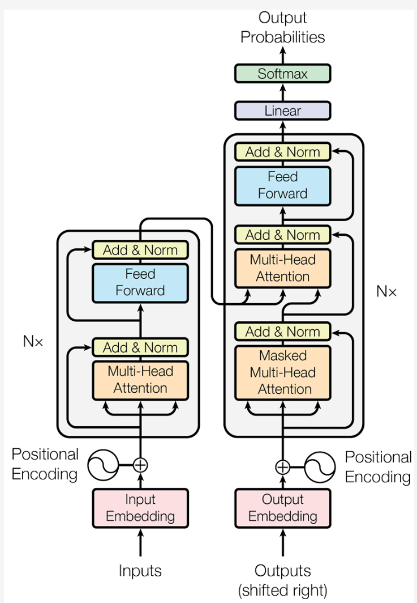
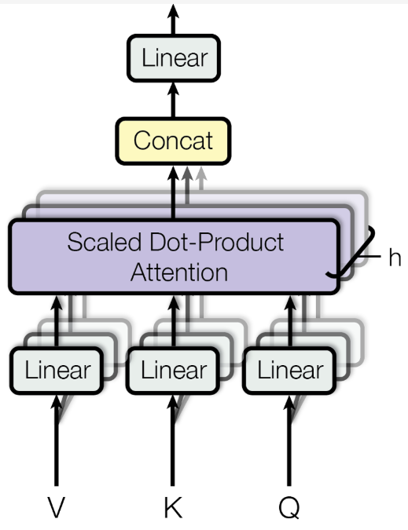

# 架构演进

## 1、N-gram

最初，**统计方法**是语言模型的主流，

* **核心思想是，一个句子出现的概率，等于该句子中每个词出现的条件概率的连乘（链式法则）**。
* 问题：部分词序列可能从未在训练数据中出现过。

解决上面的问题，便出现 **马尔可夫假设 (Markov Assumption)**

- **核心思想**是：我们不必回溯一个词的全部历史，可以近似地认为，**一个词的出现概率只与它前面有限的 $n−1$ 个词有关**
- 基于这个假设建立的语言模型，我们称之为 **N-gram模型，"N" 代表我们考虑的上下文窗口大小**
- 思想：最可能出现的，就是我们在数据中看到次数最多的。
- 缺陷：
  - **数据稀疏性 (Sparsity)**：如果一个词序列从未在语料库中出现，其概率估计就为 0。虽然可以通过平滑 (Smoothing) 技术缓解，但无法根除。
  - **泛化能力差**：模型无法理解词与词之间的语义相似性

## 2、神经网络语言模型与词嵌入

为了**解决上面的问题（泛化能力差）**，引入了 **神经网络语言模型与词嵌入**

- 提出思想：用连续的向量来表示词。
- 核心思想步骤
  1. **构建一个语义空间**：创建一个高维的连续向量空间，然后将词汇表中的每个词都映射为该空间中的一个**点（词嵌入 (Word Embedding)或词向量）**。在这个空间里，**语义上相近的词，它们对应的向量在空间中的位置也相近**。
  2. **学习从上下文到下一个词的映射**：利用神经网络的强大拟合能力，来学习一个函数。这个函数的**输入是前 $n−1$ 个词的词向量，输出是词汇表中每个词在当前上下文后出现的概率分布**。

* **词嵌入是在模型训练过程中自动学习得到的**。
  * 模型为了完成“预测下一个词”这个任务，会不断调整每个词的向量位置，最终使这些向量能够蕴含丰富的语义信息。
  * 一旦我们将词转换成了向量，我们就可以用数学工具来度量它们之间的关系。最常用的方法是余弦相似度 (Cosine Similarity)，它通过计算两个向量夹角的余弦值来衡量它们的相似性。
* **缺点：上下文窗口是固定的**

## 3、RNN

为了**打破固定窗口的限制，循环神经网络 (RNN)** 应运而生

- 核心思想：**为网络增加“记忆”能力**
- RNN 的设计引入了一个**隐藏状态 (hidden state)**向量，我们可以将其理解为**网络的短期记忆**。
- 基本思想：在处理序列的每一步，网络都会读取当前的输入词，并**结合它上一刻的记忆（即上一个时间步的隐藏状态），然后生成一个新的记忆（即当前时间步的隐藏状态）传递给下一刻**。这个**循环往复的过程，使得信息可以在序列中不断向后传递**。
- **缺点：长期依赖问题 (Long-term Dependency Problem)，**问题出现原因：****
  - 在**训练过程中，模型需要通过反向传播算法根据输出端的误差来调整网络深处的权重**。
  - 对于 RNN 而言，**序列的长度就是网络的深度**。
  - 当**序列很长时，梯度在从后向前传播的过程中会经过多次连乘，这会导致梯度值快速趋向于零****（梯度消失）或变得极大（梯度爆炸）。**
  - **梯度消失**使得**模型无法有效学习**到序列早期信息对后期输出的影响，即**难以捕捉长距离的依赖关系**。

## 4、LSTM

为了**解决长期依赖问题，长短时记忆网络 (Long Short-Term Memory, LSTM）** 被设计出来

- LSTM 是一种特殊的 RNN，
- 其**核心创新**在于引入了**细胞状态 (Cell State）** 和一套精密的 **门控机制 (Gating Mechanism)**
  - **细胞状态**：可以看作是一条**独立于隐藏状态的信息通路**，允许**信息在时间步之间更顺畅地传递**。
  - **门控机制**：则是**由几个小型神经网络构成**，它们可以**学习如何有选择地让信息通过，从而控制细胞状态中信息的增加与移除**。这些门包括：
    - **遗忘门 (Forget Gate)**：决定从上一时刻的细胞状态中丢弃哪些信息。
    - **输入门 (Input Gate)**：决定将当前输入中的哪些新信息存入细胞状态。
    - **输出门 (Output Gate)**：决定根据当前的细胞状态，输出哪些信息到隐藏状态。

**RNN瓶颈：它必须按顺序处理数据**

> 第 t 个时间步的计算，必须等待第 t−1 个时间步完成后才能开始。
>
> 意味着 RNN 无法进行大规模的并行计算，在处理长序列时效率低下，这极大**地限制了模型规模和训练速度的提升**。

## 5、Transformer

为了解决RNN的顺序处理问题，**Transformer**出现了，它完全抛弃了循环结构，转而完全依赖一种名为**注意力 (Attention)**的机制来捕捉序列内的依赖关系，从而**实现了真正意义上的并行计算**。

# Transformer架构

## Encoder-Decoder概念

**最初**的 Transformer 模型是**为端到端任务机器翻译而设计**的。宏观上遵循了一个经典的**编码器-解码器 (Encoder-Decoder）**架构。

**编码器 (Encoder)**：任务是“**理解** ”输入的整个句子。**读取所有输入词元，最终为每个词元生成一个富含上下文信息的向量表示**

**解码器 (Decoder)**：任务是“**生成** ”目标句子。它会**参考自己已经生成的前文，并“咨询”编码器的理解结果，来生成下一个词**。

## 自注意力机制

**自注意力 (Self-Attention)**：允许模型在处理序列中的每一个词时，都能兼顾句子中的所有其他词，并为这些词**分配不同的“注意力权重”**。**权重越高**的词，代表其与当前词的**关联性越强**，其信息也应该在当前词的表示中占据更大的比重。

自注意力机制为每个输入的词元向量引入了三个可学习的角色：

- **查询 (Query, Q)**：代表**当前词元**，它**正在主动地“查询”其他词元以获取信息**。
- **键 (Key, K)**：代表句子中**可被查询的词元“标签”或“索引”**。
- **值 (Value, V)**：代表**词元本身所携带的“内容”或“信息”**。

这**三个向量都是由原始的词嵌入向量乘以三个不同的、可学习的权重矩阵 ($W^Q,W^K,W^V$) 得到**的。

计算过程可以分为以下几步（类别高效的开卷考试）

1. **准备“考题”和“资料”**：对于句子中的每个词，都**通过权重矩阵生成其$Q,K,V$向量**。
2. **计算相关性**得分：要**计算词$A$的新表示，就用词$A$的$Q$向量，去和句子中所有词（包括$A$自己）的$K$向量进行点积运算**。这个得分**反映了其他词对于理解词$A$的重要性**。
3. **稳定化与归一化**：将得到的所有分数除以一个**缩放因子$\sqrt{d_{k}}$（$d_{k}$是$K$向量的维度），以防止梯度过小**，然后用**Softmax函数将分数转换成总和为1的权重，也就是归一化**的过程。
4. **加权求和**：将**上一步得到的权重分别乘以每个词对应的$V$向量，然后将所有结果相加**。最终得到的向量，就是**词$A$融合了全局上下文信息后的新表示**。

这个过程可以用一个简洁的公式来概括：

$$
\text{Attention}(Q,K,V)=\text{softmax}\left(\frac{QK^{T}}{\sqrt{d_{k}}}\right)V
$$

## 多头注意力

如果只进行一次上述的**注意力计算（即单头），模型可能会只学会关注一种类型的关联**。

- 比如，在处理 "it" 时，可能只学会了关注主语。
- 但语言中的关系是复杂的，我们**希望模型能同时关注多种关系（如指代关系、时态关系、从属关系等）**。
- **多头注意力机制应运而生**。

思想：把一次做完变成分成几组，分开做，再合并。

> 这种设计让模型能够共同关注来自不同位置、不同表示子空间的信息，极大地增强了模型的表达能力。

计算流程：

1. 它将原始的 **Q, K, V 向量在维度上切分成 h 份（h 就是“头”数）**，**每一份都独立地进行一次单头注意力的计算**。
2. 这就好比让 h 个不同的“专家”从不同的角度去审视句子，**每个专家都能捕捉到一种不同的特征关系**。
3. 最后，**将这 h 个专家的“意见”（即输出向量）拼接起来**，
4. **再通过一个线性变换进行整合**，就得到了最终的输出。

## 前馈神经网络

在每个 Encoder 和 Decoder 层中，多头注意力子层之后都跟着一个 **逐位置前馈网络(Position-wise Feed-Forward Network, FFN)**

如果说**注意力层的作用是从整个序列中“动态地聚合”相关信息**，那么**前馈网络的作用从这些聚合后的信息中提取更高阶的特征**

“**逐位置**”：它意味着这**个前馈网络会独立地作用于序列中的每一个词元向量**。

- 对于一个长度为 `seq_len` 的序列，这个 FFN 实际上会被调用 `seq_len` 次，每次处理一个词元。
- 所有位置共享的是同一组网络权重。
- 设计作用：既保持了对每个位置进行独立加工的能力，又大大减少了模型的参数量。
- 组成：**两个线性变换和一个 ReLU 激活函数**组成：

  $$
  mathrm{FFN}(x)=\max\left(0, xW_{1}+b_{1}\right) W_{2}+b_{2}
  $$

  - $x$是注意力子层的输出。
  - $W_1,b_1,W_2,b_2$是可学习的参数。
  - 第一个线性层的输出维度 `d_ff` 会远大于输入的维度 `d_model`（例如 `d_ff = 4 * d_model`），经过 ReLU 激活后再通过第二个线性层映射回 `d_model` 维度。
  - 这种“先扩大再缩小”的模式，被认为有助于模型学习更丰富的特征表示。

## 残差连接与层归一化

在 Transformer 的每个编码器和解码器层中，所有子模块（如多头注意力和前馈网络）都被一个 `Add & Norm` 操作包裹。

这个组合是为了**保证 Transformer 能够稳定训练**。

- **残差连接 (Add)**：该操作将子模块的输入 `x` 直接加到该子模块的输出 `Sublayer(x)` 上。
  - 这一结构**解决了深度神经网络中的 梯度消失 (Vanishing Gradients)问题**
  - 在**反向传播时，梯度可以绕过子模块直接向前传播**，从而保证了即使网络层数很深，模型也能得到有效的训练。
  - 公式可以表示为：$\text{Output} = x + \text{Sublayer}(x)$。
- **层归一化 (Norm)**：该操作对单个样本的所有特征进行归一化，**使其均值为0，方差为1**。
  - 这解决了模型训练过程中的 **内部协变量偏移 (Internal Covariate Shift)** 问题，
  - **使每一层的输入分布保持稳定，从而加速模型收敛并提高训练的稳定性**。

## 位置编码

Transformer 的核心是自注意力机制，它通过计算序列中任意两个词元之间的关系来捕捉依赖。

- 问题：它**本身不包含任何关于词元顺序或位置的信息**。
- 如：于自注意力来说，“agent learns” 和 “learns agent” 这两个序列是完全等价的，因为它只关心词元之间的关系，而忽略了它们的排列。
- 为了解决这个问题，Transformer 引入了 **位置编码 (Positional Encoding)**

**位置编码的核心思想：为输入序列中的每一个词元嵌入向量，都额外加上一个能代表其绝对位置和相对位置信息的“位置向量”**。

- 位置向量不是通过学习得到的，而是**通过一个固定的数学公式直接计算得出，**
- 即使两个词元（例如，两个都叫 `agent` 的词元）自身的嵌入是相同的，但**由于它们在句子中的位置不同，它们最终输入到 Transformer 模型中的向量就会因为加上了不同的位置编码而变得独一无二**。
- 原论文中提出的位置编码使用正弦和余弦函数来生成：

  $$
  E_{(pos,2i)}=\sin\left(\frac{pos}{10000^{2i/d_{\text{model}}}}\right)，
  $$

  $$
  E_{(pos,2i+1)}=\cos\left(\frac{pos}{10000^{2i/d_{\text{model}}}}\right)
  $$

  - $pos$ 是词元在序列中的位置（例如，$0$，$1$，$2$，...）
  - $i$ 是位置向量中的维度索引（从 $0$ 到 $d_{\text{model}}/2$）
  - $d_{\text{model}}$是词嵌入向量的维度（与我们模型中定义的一致）

# Decoder-Only 架构

## 来源

基于 Transformer 的思想演变而来Decoder-Only 架构

Transformer的设计哲学是“先理解，再生成”。

- **编码器负责深入理解输入的整个句子**，形成一个包含全局信息的上下文记忆，
- 然后**解码器基于这份记忆来生成翻译**。

当任务转换为构建一个与人对话、创作、作为智能体大脑的通用模型时，或许我们并不需要那么复杂的结构

**OpenAI 在开发 GPT (Generative Pre-trained Transformer)时**，提出了一个**更简单的思想：语言的核心任务，不就是预测下一个最有可能出现的词吗？无论是回答问题、写故事还是生成代码，本质上都是在一个已有的文本序列后面，一个词一个词地添加最合理的内容。**

基于这个思想，**GPT 做了一个大胆的简化：它完全抛弃了编码器，只保留了解码器部分。这就是 Decoder-Only  架构的由来**

## 工作模式

Decoder-Only 架构的工作模式：自回归 (Autoregressive)，描述了一个非常简单的过程：

1. 给模型一个起始文本（例如 “Datawhale Agent is”）。
2. 模型预测出下一个最有可能的词（例如 “a”）。
3. 模型将自己刚刚生成的词 “a” 添加到输入文本的末尾，形成新的输入（“Datawhale Agent is a”）。
4. 模型基于这个新输入，再次预测下一个词（例如 “powerful”）。
5. 不断重复这个过程，直到生成完整的句子或达到停止条件。

## 掩码自注意力 (Masked Self-Attention)

解码器是如何**保证在预测第 `t` 个词时，不去“偷看”第 `t+1` 个词的答案，**通过**掩码自注意力 (Masked Self-Attention)**

工作原理

1. 在自注意力机制**计算出注意力分数矩阵（即每个词对其他所有词的关注度得分）之后，但在进行 Softmax 归一化之前，模型会应用一个“掩码”**。
2. 这个**掩码会将所有位于当前位置之后（即目前尚未观测到）的词元对应的分数，替换为一个非常大的负数**。
3. 当这个**带有负无穷分数的矩阵经过 Softmax 函数时，这些位置的概率就会变为 0**。
4. 这样一来，**模型在计算任何一个位置的输出时，都从数学上被阻止了去关注它后面的信息**。

掩码自注意力 (Masked Self-Attention)机制的**意义：保证了模型在预测下一个词时，能且仅能依赖它已经见过的、位于当前位置之前的所有信息，从而确保了预测的公平性和逻辑的连贯性。**

## Decoder-Only 架构优势

**1、训练目标统一**：模型的**唯一任务就是“预测下一个词”**，这个简单的目标非常适合在海量的无标注文本数据上进行预训练。

**2、结构简单，易于扩展**：更少的组件意味着更容易进行规模化扩展。今天的 GPT-4、Llama 等拥有数千亿甚至万亿参数的巨型模型，都是基于这种简洁的架构。

**3、天然适合生成任务** ：**其自回归的工作模式与所有生成式任务（对话、写作、代码生成等）完美契合**，这也是它能成为构建通用智能体基础的核心原因。
