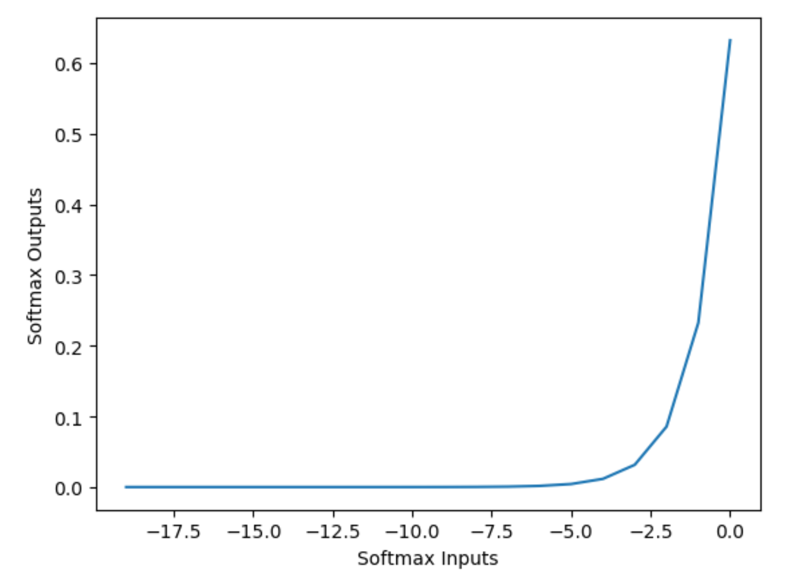
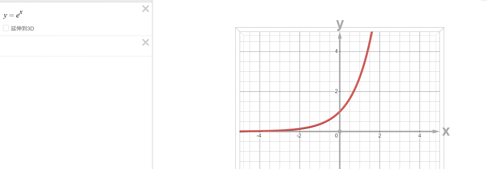
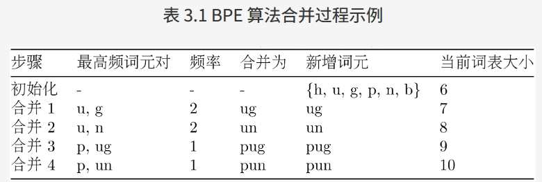

# 提示工程

如果我们把大语言模型比作一个能力极强的“大脑”，那么**提示 (Prompt)就是我们与这个“大脑”沟通的语言**

提示工程，就是**研究如何设计出精准的提示，从而引导模型产生我们期望输出的回复**。

## 模型采样参数

### 参数本质

使用大模型时，会经常看到**类似 `Temperature`这类的可配置参数，其本质是通过调整模型对 “概率分布” 的采样策略**，让输出匹配具体场景需求，**配置合适的参数可以提升Agent在特定场景的性能**

### Softmax

Softmax的含义就在于不再唯一的确定某一个最大值，而是为每个输出分类的结果都赋予一个概率值，表示属于每个类别的可能性。

传统的概率分布是由 Softmax 公式计算得到的：$p_i = \frac{e^{z_i}}{\sum_{j=1}^k e^{z_j}}$，

- k：输出节点的个数，即分类的类别个数
- $p_i$：为第i个节点的输出值
- 通过Softmax函数就可以将多分类的输出值转换为范围在[0, 1]和为1的概率分布。
- 作用：能将一个含任意实数的K维的向量z的“压缩”到另一个K维实向量σ(z) 中，使得每一个元素的范围都在(0,1)之间，并且所有元素的和为1。
- **单调性：单调递增**，函数图像如下

  

经过使用指数$e^{z_j}$形式的Softmax函数**能够将差距大的数值距离拉的更大**。

$y=e^{x}$指数函数图像



采样参数的**本质**就是在Softmax 公式 基础上，**根据不同策略“重新调整”或“截断”分布，从而改变大模型输出的下一个token**

### Temperature

`Temperature`：温度是控制模型输出 **“随机性” 与 “确定性”** 的关键参数。

原理是引入温度系数$T\gt0$,将 Softmax 改写为$p_i^{(T)} = \frac{e^{z_i / T}}{\sum_{j=1}^k e^{z_j / T}}$。

当**T变小时，分布“更加陡峭”，高概率项权重进一步放大，生成更“保守”且重复率更高的文本**。

当**T变大时，分布“更加平坦”，低概率项权重提升，生成更“多样”但可能出现不连贯的内容**。

温度分类：

- **低温度（0 $\leqslant$ Temperature $\lt$ 0.3）** ：输出更 “**精准、确定**”。适用场景： 事实性任务：如问答、数据计算、代码生成； 严谨性场景：法律条文解读、技术文档撰写、学术概念解释等场景。
- **中温度（0.3 $\leqslant$ Temperature $\lt$ 0.7）**：输出 “**平衡、自然**”。适用场景： 日常对话：如客服交互、聊天机器人； 常规创作：如邮件撰写、产品文案、简单故事创作。
- **高温度（0.7 $\leqslant$ Temperature $\lt$ 2）**：输出 “**创新、发散**”。适用场景： 创意性任务：如诗歌创作、科幻故事构思、广告 slogan brainstorm、艺术灵感启发； 发散性思考。

### Top-k

`Top-k `：其原理是将所有 token 按概率从高到低排序，取**排名前 k 个的 token 组成 “候选集”，随后对筛选出的 k 个 token 的概率进行 “归一化”**

公式： $\hat{p}_i = \frac{p_i}{\sum_{j \in \text{候选集}} p_j}$

与温度采样的区别与联系：

- 温度采样**通过温度 T 调整所有 token 的概率分布（平滑或陡峭），不改变候选 token 的数量（仍考虑全部 N 个）**。
- **Top-k 采样通过 k 值限制候选 token 的数量（只保留前 k 个高概率 token），再从其中采样**。当k=1时输出完全确定，退化为 “贪心采样”。

### Top-p

原理：**将所有 token 按概率从高到低排序，从排序后的第一个 token 开始，逐步累加概率，直到累积和首次达到或超过阈值 p**： $\sum_{i \in S} p_{(i)} \geq p$，此时累加过程中包含的所有 token 组成 “核集合”，**最后对核集合进行归一化**。

与Top-k的区别与联系：**相对于固定截断大小的 Top-k，Top-p 能动态适应不同分布的“长尾”特性，对概率分布不均匀的极端情况的适应性更好**。

### 参数关联

文本生成中，当同时设置 Top-p、Top-k 和温度系数时，这些参数会按照分层过滤的方式协同工作，其优先级顺序为：温度调整→Top-k→Top-p。

- 温度调整整体分布的陡峭程度，
- Top-k 会先保留概率最高的 k 个候选，
- 然后 Top-p 会从 Top-k 的结果中选取累积概率≥p 的最小集合作为最终的候选集。

不过，**通常 Top-k 和 Top-p 二选一即可，若同时设置，实际候选集为两者的交集**。

注意

- 如果将**温度设置为 0**，则 T**op-k 和 Top-p 将变得无关紧要**，**因为最有可能的 Token 将成为下一个预测的 Token**；
- 如果将 **Top-k 设置为 1**，**温度和 Top-p 也将变得无关**紧要，**因为只有一个 Token 通过 Top-k 标准，它将是下一个预测的 Token**。

## 样本提示

根据我们给模型提供示例（Exemplar）的数量，提示可以分为三种类型：

- **零样本提示 (Zero-shot Prompting)**：我们**不给模型任何示例**，直接让它根据指令完成任务。这得益于模型在海量数据上预训练后获得的强大泛化能力。
  ```
  // 直接向模型下达指令，要求它完成情感分类任务。

  文本:Datawhale的AI Agent课程非常棒！
  情感:正面

  ```
- **单样本提示 (One-shot Prompting)**：给模型**提供一个完整的示例，向它展示任务的格式和期望的输出风格**。模型会模仿给出的示例格式，为后续问题文本补全“正面”。
  ```
  // 我们先给模型一个完整的“问题-答案”对作为示范，然后提出我们的新问题。

  文本:这家餐厅的服务太慢了。
  情感:负面

  文本:Datawhale的AI Agent课程非常棒！
  情感:

  ```
- **少样本提示 (Few-shot Prompting)**：**提供多个示例，这能让模型更准确地理解任务的细节、边界和细微差别**，从而**获得更好的性能**。模型会综合所有示例，更准确地将最后一句的情感分类为“正面”。
  ```
  // 提供涵盖了不同情况的多个示例，让模型对任务有更全面的理解

  文本:这家餐厅的服务太慢了。
  情感:负面

  文本:这部电影的情节很平淡。
  情感:中性

  文本:Datawhale的AI Agent课程非常棒！
  情感:

  ```

## 指令调优的影响

**指令调优 (Instruction Tuning)**：一种微调技术，它**使用大量“指令-回答”格式的数据对预训练模型进行进一步的训练。经过指令调优后，模型能更好地理解并遵循用户的指令**。

和样本提示区别：

- **对“文本补全”模型的提示(你需要用少样本提示“教会”模型做什么)**
  ```
  这是一段将英文翻译成中文的程序。
  英文:Hello
  中文:你好
  英文:How are you?
  中文:

  ```
- **对“指令调优”模型的提示(你可以直接下达指令)**：
  ```
  请将下面的英文翻译成中文:
  How are you?

  ```

作用：指令调优的出现，极大地**简化了我们与模型交互的方式**，使得直接、清晰的自然语言指令成为可能。

## 基础提示技巧

**角色扮演 (Role-playing)**： 通过**赋予模型一个特定的角色，我们可以引导它的回答风格、语气和知识范围，使其输出更符合特定场景的需求**。

**上下文示例 (In-context Example)**：与少样本提示的思想一致，通过在提示中**提供清晰的输入输出示例，来“教会”模型如何处理我们的请求**，尤其是在处理复杂格式或特定风格的任务时非常有效。

## 思维链

**思维链 (Chain-of-Thought, CoT)**：一种强大的提示技巧，它通过**引导模型“一步一步地思考”，提升了模型在复杂任务上的推理能力**。

**实现 CoT 的关键，是在提示中加入一句简单的引导语，如“请逐步思考”或“Let's think step by step”**。

通过显式地展示其推理过程，模型不仅更容易得出正确的答案，也让它的回答变得更可信、更易于我们检查和纠正。

# 文本分词

**分词 (Tokenization)：将文本序列转换为数字序列的过程**

**分词器 (Tokenizer)作用**：定义**一套规则**，将原始文本切分成一个个最小的单元，我们称之为词元 (Token)

## 分词的必要性

**早期自然语言分词策略**：

- **按词分词 (Word-based)**：直接用空格或标点符号将句子切分成单词。导致的问题如下
  - **词表爆炸与未登录词(Out-Of-Vocabulary, OOV)**：
    - 一个语言的词汇量是巨大
    - 模型将无法处理任何未在词表中出现过的词
  - **语义关联的缺失**：难以捕捉词形相近的词之间的语义关系，训练数据中的低频词由于出现次数少，其语义也难以被模型充分学习
- **按字符分词 (Character-based)**：将文本切分成单个字符。
  - **不存在 OOV 问题**
  - **缺点：单个字符大多不具备独立的语义**，模型需要花费更多的精力去学习如何将字符组合成有意义的词，导致学习效率低下

**现代大语言模型**普遍采用**子词分词 (Subword Tokenization)** 算法

- **核心思想**是：将**常见的词（如 "agent"）保留为完整的词元**，同时将**不常见的词（如 "Tokenization"）拆分成多个有意义的子词片段**（如 "Token" 和 "ization"）
- **优点：既控制了词表的大小，又能让模型通过组合子词来理解和生成新词**

## 字节对编码算法解析

**字节对编码 (Byte-Pair Encoding, BPE)** 是最主流的子词分词算法之一（如GPT系列模型）

核心思想，可以理解为一个“贪心”的合并过程：

1. **初始化**：将**词表初始化**为所有在**语料库中出现过的基本字符**。
2. **迭代合并**：在**语料库上，统计所有相邻词元对的出现频率**，找到**频率最高的一对**，将它们**合并成一个新的词元，并加入词表**。
3. **重复** ：重复第 2 步，**直到词表大小达到预设的阈值**

示例如下：假设我们的迷你语料库是 `{"hug": 1, "pug": 1, "pun": 1, "bun": 1}`，并且我们想构建一个大小为 10 的词表。BPE 的训练过程可以用下表3.1来表示：**将频率最大的两个词合并为新词，直到预设的10，训练结束后，词表大小达到 10，我们就得到了新的分词规则。**



对于一个未见过的词 "bug"，分词器会先查找 "bug" 是否在词表中，发现不在；然后查找 "bu"，发现不在；最后查找 "b" 和 "ug"，发现都在，于是将其切分为 `['b', 'ug']`。

后续的许多算法都是在BPE的基础上进行优化的。其中，Google 开发的 WordPiece 和 SentencePiece 是影响力最大的两种。

- **WordPiece**：Google BERT 模型采用的算法，与 BPE 非常相似，合并词元的标准变为“能最大化提升语料库的语言模型概率”，它会**优先合并那些能让整个语料库的“通顺度”提升最大的词元对。**
- **SentencePiece**：Llama 系列模型采用了此算法。**特点是，将空格也视作一个普通字符（通常用下划线 `_` 表示），得分词和解码过程完全可逆，且不依赖于特定的语言**（例如，它不需要知道中文不使用空格分词）。

## 分词器意义

分词器的实际影响十分重要，这直接**关系到智能体的性能、成本和稳定性**：

- **上下文窗口限制**：模型的上下文窗口（如 8K, 128K）是以 **Token 数量** 计算的，而不是字符数或单词数。**同样一段话，在不同语言（如中英文）或不同分词器下，Token 数量可能相差巨大。**
- **API 成本**：模型 API 都是按 Token 数量计费的。了解你的文本会被如何分词，**是预估和控制智能体运行成本的关键一步**。
- **模型表现的异常**：在设计提示词和解析模型输出时，考虑到这些“陷阱”有助于提升智能体的鲁棒性。
  - 例如，模型可能很擅长计算 `2 + 2`，但对于 `2+2`（没有空格）就可能出错，因为后者**可能被分词器视为一个独立的、不常见的词元**。
  - **一个词因为首字母大小写不同，也可能被切分成完全不同的 Token 序列**，从而影响模型的理解。

# 调用大语言模型

除了使用API，还可以本地部署调用大模型

详细见另外一个文档

# 缩放法则

缩放法则（Scaling Laws）：揭示了**模型性能**与**模型参数量、训练数据量以及计算资源**之间存在着可预测的幂律关系。

- 揭示了模型性能与**模型参数量、训练数据量以及计算资源**之间存在着可预测的幂律关系。
- 只要我们持续、按比例地增加这三个要素，模型的性能就会可预测地、平滑地提升，而不会出现明显的瓶颈。、
- 这一发现为大模型的设计和训练提供了清晰的指导：**在资源允许的范围内，尽可能地扩大模型规模和训练数据量**。

**缩放法则最令人惊奇的产物是“能力的涌现”**。所谓能力涌现，是指**当模型规模达到一定阈值后，会突然展现出在小规模模型中完全不存在或表现不佳的全新能力**。

- 例如，**链式思考 (Chain-of-Thought)、指令遵循 (Instruction Following) 、多步推理、代码生成等能力**，都是在模型参数量达到数百亿甚至千亿级别后才显著出现的。
- 这种现象表明，**大语言模型不仅仅是简单地记忆和复述，它们在学习过程中可能形成了某种更深层次的抽象和推理能力**。

# 模型幻觉

模型幻觉（Hallucination）：大语言模型生成的内容与客观事实、用户输入或上下文信息相矛盾，或者生成了不存在的事实、实体或事件。

**本质：模型在生成过程中，过度自信地“编造”了信息，而非准确地检索或推理**。

根据其表现形式，幻觉可以被分为多种类型

- **事实性幻觉 (Factual Hallucinations)**： 模型生成**与现实世界事实不符**的信息。
- **忠实性幻觉 (Faithfulness Hallucinations)** ： 在文本摘要、翻译等任务中，生成的内容**未能忠实地反映源文本的含**义。
- **内在幻觉 (Intrinsic Hallucinations)**： 模型**生成的内容与输入信息直接矛盾**。

原因：

1. **训练数据中可能包含错误或矛盾**的信息
2. 模型的**自回归生成机制**决定了它只是在**预测下一个最可能的词元，而没有内置的事实核查模块**

为了提高大语言模型的可靠性，研究人员和开发者正在积极探索多种检测和缓解幻觉的方法：

- **数据层面**：通过**高质量数据清洗、引入事实性知识以及强化学习与人类反馈 (RLHF)** 等方式，从**源头减少幻觉**。
- 模型层面：探索新的模型架构，或让模型能够表达其对生成内容的不确定性。
- **推理与生成层面**：
  - **检索增强生成 (Retrieval-Augmented Generation, RAG)**：RAG 系统通过在生成之前从外部知识库（如文档数据库、网页）中检索相关信息，然后将检索到的信息作为上下文，引导模型生成基于事实的回答。
  - **多步推理与验证**： 引导模型进行**多步推理，并在每一步进行自我检查或外部验证**。
  - **引入外部工具**： 允许模型调用外部工具（如搜索引擎、计算器、代码解释器）来**获取实时信息或进行精确计算**。
