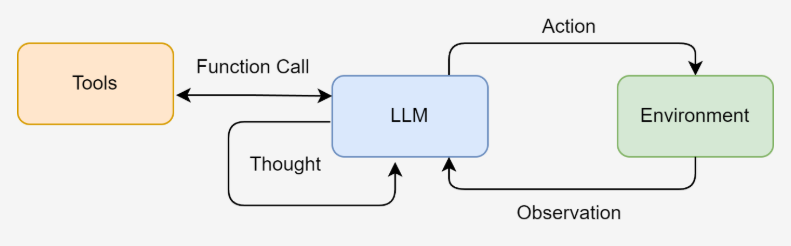
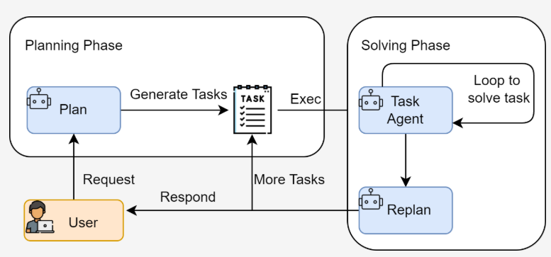
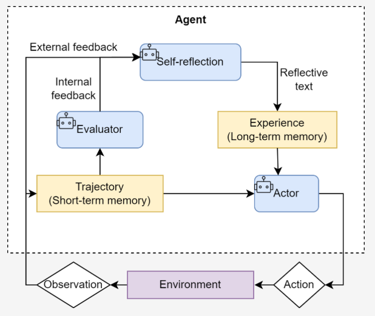

# ReAct

智能体范式 ：ReAct (Reason + Act)

核心思想：模仿人类解决问题的方式，将 **推理 (Reasoning)与行动 (Acting)** 显式地结合起来，形成一个“思考-行动-观察”的循环。

## 工作流程

在**ReAct诞生之前**，主流的方法可以分为两类

- “**纯思考”型：如思维链 (Chain-of-Thought)**，它能引导模型进行复杂的逻辑推理，但**无法与外部世界交互，容易产生事实幻觉**；
- “**纯行动**”型：模型**直接输出要执行的动作，但缺乏规划和纠错能力**。

ReAct认识到 **思考与行动是相辅相成的：思考指导行动，而行动的结果又反过来修正思考**。

**ReAct范式**通过一种**特殊的提示工程来引导模型**，使其每一步的输出都遵循一个固定的轨迹：

1. **Thought (思考)**：**分析**当前情况、分解任务、制定下一步计划，或者**反思**上一步的结果。
2. **Action (行动)**：智能体决定**采取的具体动作**，通常是调用一个外部工具
3. **Observation (观察)**：执行 **`Action`后从外部工具返回的结果**
4. 智能体将**不断重复**这个**Thought -> Action -> Observation**的循环，**将新的观察结果追加到历史记录**中，形成一个不断增长的上下文，**直到它在 `Thought`中认为已经找到了最终答案**，然后输出结果。

上面这个过程形成了一个强大的**协同效应：推理使得行动更具目的性，而行动则为推理提供了事实依据**。

协调循环如下



## 适用场景

**需要外部知识**的任务 ：如**查询实时**信息（天气、新闻、股价）、**搜索专业领域**的知识等。

**需要精确计算**的任务 ：将**数学问题交给计算器**工具，避免LLM的计算错误。

**需要与API交互**的任务：如**操作**数据库、调用某个服务的**API来完成特定功能**。

## 工具的定义与实现

如果说大语言模型是智能体的大脑，那么 **工具 (Tools)**就是其与外部世界交互的“手和脚”

分步进行：首先实现工具的核心功能，然后构建一个通用的工具管理器。

**1、实现工具的核心逻辑**：一个良好定义的工具应包含以下三个核心要素

* **名称 (Name)**： **一个简洁、唯一的标识符**，供智能体在 `Action` 中调用，例如 `Search`。
* **描述 (Description)**： 一段**清晰的自然语言描述，说明这个工具的用途**。这是整个机制中最关键的部分，因为大语言模型会依赖这段描述来判断何时使用哪个工具。
* **执行逻辑 (Execution Logic)**： **真正执行任务的函数或方法**。
* 示例代码如下
  ```python
  def search(query: str) -> str:
      """
      一个基于xxx工具。
      它会xxx，优先返回xxx
      """
     .....

  ```

**2、构建通用的工具执行器**：当智能体需要使用多种工具时（例如，除了搜索，还可能需要计算、查询数据库等），我们需**要一个统一的管理器来注册和调度这些工具**。为此，我们创建一个 `ToolExecutor` 类。

```python
from typing import Dict, Any

class ToolExecutor:
    """
    一个工具执行器，负责管理和执行工具。
    """
    def __init__(self):
        self.tools: Dict[str, Dict[str, Any]] = {}

    def registerTool(self, name: str, description: str, func: callable):
        """
        向工具箱中注册一个新工具。
        """
        if name in self.tools:
            print(f"警告:工具 '{name}' 已存在，将被覆盖。")
        self.tools[name] = {"description": description, "func": func}
        print(f"工具 '{name}' 已注册。")

    def getTool(self, name: str) -> callable:
        """
        根据名称获取一个工具的执行函数。
        """
        return self.tools.get(name, {}).get("func")

    def getAvailableTools(self) -> str:
        """
        获取所有可用工具的格式化描述字符串。
        """
        return "\n".join([
            f"- {name}: {info['description']}" 
            for name, info in self.tools.items()
        ])


```

3、测试：模拟一次调用，以验证整个流程是否正常工作。

## ReAct 智能体的编码

### 系统提示词设计

提示词是整个 ReAct 机制的基石，它为大语言模型提供了行动的操作指令。

我们需要精心设计一个模板，它将动态地插入可用工具、用户问题以及中间步骤的交互历史。

**模板定义了智能体与LLM之间交互的规范**：

- **角色定义**： “你是一个有能力调用外部工具的智能助手”，设定了LLM的角色。
- **工具清单 (`{tools}`)**： 告知LLM它有哪些可用的“手脚”。
- **格式规约 (`Thought`/`Action`)**： 这是最重要的部分，它**强制LLM的输出具有结构性，使我们能通过代码精确解析其意图**。
- **动态上下文 (`{question}`/`{history}`)**： 将用户的原始问题和不断累积的交互历史注入，让LLM基于完整的上下文进行决策。

```python
# ReAct 提示词模板
REACT_PROMPT_TEMPLATE = """
请注意，你是一个有能力调用外部工具的智能助手。

可用工具如下:
{tools}

请严格按照以下格式进行回应:

Thought: 你的思考过程，用于分析问题、拆解任务和规划下一步行动。
Action: 你决定采取的行动，必须是以下格式之一:
- `{{tool_name}}[{{tool_input}}]`:调用一个可用工具。
- `Finish[最终答案]`:当你认为已经获得最终答案时。
- 当你收集到足够的信息，能够回答用户的最终问题时，你必须在Action:字段后使用 Finish[最终答案] 来输出最终答案。

现在，请开始解决以下问题:
Question: {question}
History: {history}
"""

```

### 核心循环的实现

`ReActAgent` 的核心是一个循环，它不断地“格式化提示词 -> 调用LLM -> 执行动作 -> 整合结果”，直到任务完成或达到最大步数限制。

#### 主体循环

如下：`run` 方法是智能体的入口。它的 `while` 循环构成了 ReAct 范式的主体，`max_steps` 参数则是一个重要的安全阀，防止智能体陷入无限循环而耗尽资源。

```python
class ReActAgent:
    def __init__(self, llm_client: HelloAgentsLLM, tool_executor: ToolExecutor, max_steps: int = 5):
        self.llm_client = llm_client
        self.tool_executor = tool_executor
        self.max_steps = max_steps
        self.history = []

    def run(self, question: str):
        """
        运行ReAct智能体来回答一个问题。
        """
        self.history = [] # 每次运行时重置历史记录
        current_step = 0

        while current_step < self.max_steps:
            current_step += 1
            print(f"--- 第 {current_step} 步 ---")

            # 1. 格式化提示词
            tools_desc = self.tool_executor.getAvailableTools()
            history_str = "\n".join(self.history)
            prompt = REACT_PROMPT_TEMPLATE.format(
                tools=tools_desc,
                question=question,
                history=history_str
            )

            # 2. 调用LLM进行思考
            messages = [{"role": "user", "content": prompt}]
            response_text = self.llm_client.think(messages=messages)
        
            if not response_text:
                print("错误:LLM未能返回有效响应。")
                break

            # ... (后续的解析、执行、整合步骤)


```

#### 输出解析器的实现

LLM 返回的是纯文本，我们需要从中精确地提取出 `Thought`和 `Action`。这是通过几个辅助解析函数完成的，它们通常使用正则表达式来实现。

- `_parse_output`： 负责从LLM的完整响应中分离出 `Thought`和 `Action`两个主要部分。
- `_parse_action`： 负责进一步解析 `Action`字符串，例如从 `Search[华为最新手机]` 中提取出工具名 `Search` 和工具输入 `华为最新手机`。

```python
# (这些方法是 ReActAgent 类的一部分)
    def _parse_output(self, text: str):
        """解析LLM的输出，提取Thought和Action。
        """
        # Thought: 匹配到 Action: 或文本末尾
        thought_match = re.search(r"Thought:\s*(.*?)(?=\nAction:|$)", text, re.DOTALL)
        # Action: 匹配到文本末尾
        action_match = re.search(r"Action:\s*(.*?)$", text, re.DOTALL)
        thought = thought_match.group(1).strip() if thought_match else None
        action = action_match.group(1).strip() if action_match else None
        return thought, action

    def _parse_action(self, action_text: str):
        """解析Action字符串，提取工具名称和输入。
        """
        match = re.match(r"(\w+)\[(.*)\]", action_text, re.DOTALL)
        if match:
            return match.group(1), match.group(2)
        return None, None

```

#### 工具调用与执行

`Action`的执行中心。它首先检查是否为 `Finish`指令，如果是，则流程结束。否则，它会通过 `tool_executor`获取对应的工具函数并执行，得到 `observation`。

```python
# (这段逻辑在 run 方法的 while 循环内)
            # 3. 解析LLM的输出
            thought, action = self._parse_output(response_text)
        
            if thought:
                print(f"思考: {thought}")

            if not action:
                print("警告:未能解析出有效的Action，流程终止。")
                break

            # 4. 执行Action
            if action.startswith("Finish"):
                # 如果是Finish指令，提取最终答案并结束
                final_answer = re.match(r"Finish\[(.*)\]", action).group(1)
                print(f"🎉 最终答案: {final_answer}")
                return final_answer
        
            tool_name, tool_input = self._parse_action(action)
            if not tool_name or not tool_input:
                # ... 处理无效Action格式 ...
                continue

            print(f"🎬 行动: {tool_name}[{tool_input}]")
        
            tool_function = self.tool_executor.getTool(tool_name)
            if not tool_function:
                observation = f"错误:未找到名为 '{tool_name}' 的工具。"
            else:
                observation = tool_function(tool_input) # 调用真实工具


```

#### 观测结果的整合

形成闭环的关键，是将 `Action`本身和工具执行后的 `Observation`添加回历史记录中，为下一轮循环提供新的上下文。

通过将 `Observation`追加到 `self.history`，智能体在下一轮生成提示词时，就能“看到”上一步行动的结果，并据此进行新一轮的思考和规划。

```python
# (这段逻辑紧随工具调用之后，在 while 循环的末尾)
            print(f"👀 观察: {observation}")
        
            # 将本轮的Action和Observation添加到历史记录中
            self.history.append(f"Action: {action}")
            self.history.append(f"Observation: {observation}")

        # 循环结束
        print("已达到最大步数，流程终止。")
        return None

```

## ReAct 的特点

**高可解释性：透明。通过 `Thought` 链，我们可以清晰地看到智能体每一步的“心路历程”**——它为什么会选择这个工具，下一步又打算做什么。这对于理解、信任和调试智能体的行为至关重要。

**动态规划与纠错能力：ReAct 是“走一步，看一步”**。它根据**每一步从外部世界获得的 `Observation` 来动态调整后续的 `Thought` 和 `Action`**。如果**上一步的搜索结果不理想，它可以在下一步中修正搜索词，重新尝试**。

**工具协同能力：将大语言模型的推理能力与外部工具的执行能力结合起来**。LLM 负责运筹帷幄（规划和推理），工具负责解决具体问题（搜索、计算），二者协同工作，突破了单一 LLM 在知识时效性、计算准确性等方面的固有局限。

## ReAct 的固有局限性

**对LLM自身能力的强依赖：高度依赖于底层 LLM 的综合能力**。如果 LLM 的逻辑推理能力、指令遵循能力或格式化输出能力不足，就很**容易在 `Thought` 环节产生错误的规划，或者在 `Action` 环节生成不符合格式的指令**，导致整个流程中断。

**执行效率问题：完成一个任务通常需要多次调用 LLM**。每一次调用都伴随着网络延迟和计算成本。对于需要很多步骤的复杂任务，这种串行的“思考-行动”循环可能会导致较高的总耗时和费用。

**提示词的脆弱性：整个机制的稳定运行建立在一个精心设计的提示词模板**之上。**模板中的任何微小变动，甚至是用词的差异，都可能影响 LLM 的行为**。此外，**并非所有模型都能持续稳定地遵循预设的格式**，这增加了在实际应用中的不确定性。

**可能陷入局部最优：步进式的决策模式意味着智能体缺乏一个全局的、长远的规划**。可能会**因为眼前的 `Observation` 而选择一个看似正确但长远来看并非最优的路径**，甚至在某些情况下陷入“原地打转”的循环中。

## 调试技巧

当你构建的 ReAct 智能体行为不符合预期时，可以从以下几个方面入手进行调试：

**检查完整的提示词**：在每次调用 LLM 之前，将最终格式化好的、包含所有历史记录的完整提示词打印出来。这是**追溯 LLM 决策源头的最直接方式**。

**分析原始输出**：当输出解析失败时（例如，正则表达式没有匹配到 `Action`），务必将 LLM 返回的原始、未经处理的文本打印出来。这能帮助你**判断是 LLM 没有遵循格式，还是你的解析逻辑有误**。

**验证工具的输入与输出**：检查智能体**生成的 `tool_input` 是否是工具函数所期望的格式**，同时也要**确保工具返回的 `observation` 格式是智能体可以理解和处理**的。

**调整提示词中的示例 (Few-shot Prompting)**：如果**模型频繁出错**，可以在提示词中**加入一两个完整的“Thought-Action-Observation”成功案例，通过示例来引导模型更好地遵循你的指令**。

**尝试不同的模型或参数** ：更换一个**能力更强的模型，或者调整 `temperature` 参数**（通常**设为0以保证输出的确定性**），有时能直接解决问题。

# Plan-and-Solve

## 基本概念

**Plan-and-Solve**这种范式将任务处理明确地分为两个阶段：**先规划 (Plan)，后执行 (Solve)**。

如果说 **ReAct 像一个经验丰富的侦探，根据现场的蛛丝马迹（Observation）一步步推理，随时调整**自己的调查方向。

**Plan-and-Solve 则更像一位建筑师，在动工之前必须先绘制出完整的蓝图（Plan）**，然后**严格按照蓝图来施工（Solve）**。

意义：现在用的很多大模型工具的Agent模式都融入了这种设计模式。

## 工作原理

**核心动机：为了解决思维链在处理多步骤、复杂问题时容易“偏离轨道”的问题**。

Plan-and-Solve 将整个流程解耦为两个核心阶段

1. **规划阶段 (Planning Phase)**：首先，**智能体会接收用户的完整问题**。它的第一个任务不是直接去解决问题或调用工具，而是**将问题分解，并制定出一个清晰、分步骤的行动计划** 。这个**计划本身就是一次大语言模型的调用产物**。
2. **执行阶段 (Solving Phase)**： 在获得完整的计划后，智能体进入执行阶段。它会**严格按照计划中的步骤，逐一执行**。**每一步的执行都可能是一次独立的 LLM 调用，或者是对上一步结果的加工处理，直到计划中的所有步骤都完成，最终得出答案**。

工作流如下



## 适用场景

**多步数学应用题**：需要先列出计算步骤，再逐一求解。

需要**整合多个信息源的报告撰写** ：需要先规划好报告结构（引言、数据来源A、数据来源B、总结），再逐一填充内容。

**代码生成任务**：需要先构思好函数、类和模块的结构，再逐一实现。

## 规划阶段

通过提示词的设计，完成一个推理任务，这类任务的特点是，答案无法通过单次查询或计算得出，必须先将问题分解为一系列逻辑连贯的子步骤，然后按顺序求解。

目标问题：“一个水果店周一卖出了15个苹果。周二卖出的苹果数量是周一的两倍。周三卖出的数量比周二少了5个。请问这三天总共卖出了多少个苹果？”

如果大模型不能高质量的推理出准确的答案，可以参考这个设计模式来设计自己的Agent完成任务

1. **规划阶段 ：首先，将问题分解为三个独立的计算步骤**（计算周二销量、计算周三销量、计算总销量）。
2. **执行阶段：然后，严格按照计划，一步步执行计算**，并将每一步的结果作为下一步的输入，最终得出总和。

规划阶段目标：让大语言模型接收原始问题，并输出一个清晰、分步骤的行动计划。

- **要求：这个计划必须是结构化的**，以便我们的代码可以轻松解析并逐一执行。
- 因此，我们**设计的提示词需要明确地告诉模型它的角色和任务，并给出一个输出格式的范例**。

**提示词**通过以下几点确**保了输出的质量和稳定**性：

- **角色设定** ： “顶级的AI规划专家”，激发模型的专业能力。
- **任务描述** ： 清晰地定义了“分解问题”的目标。
- **格式约束**： 强制要求输出为一个 Python 列表格式的字符串，这极大地简化了后续代码的解析工作，使其比解析自然语言更稳定、更可靠。

````python
PLANNER_PROMPT_TEMPLATE = """
你是一个顶级的AI规划专家。你的任务是将用户提出的复杂问题分解成一个由多个简单步骤组成的行动计划。
请确保计划中的每个步骤都是一个独立的、可执行的子任务，并且严格按照逻辑顺序排列。
你的输出必须是一个Python列表，其中每个元素都是一个描述子任务的字符串。

问题: {question}

请严格按照以下格式输出你的计划,```python与```作为前后缀是必要的:
```python
["步骤1", "步骤2", "步骤3", ...]
```
"""
````


接下来，我们将这个提示词逻辑封装成一个 `Planner` 类（规划器）

```python
# 假定 llm_client.py 中的 HelloAgentsLLM 类已经定义好
# from llm_client import HelloAgentsLLM

class Planner:
    def __init__(self, llm_client):
        self.llm_client = llm_client

    def plan(self, question: str) -> list[str]:
        """
        根据用户问题生成一个行动计划。
        """
        prompt = PLANNER_PROMPT_TEMPLATE.format(question=question)
    
        # 为了生成计划，我们构建一个简单的消息列表
        messages = [{"role": "user", "content": prompt}]
    
        print("--- 正在生成计划 ---")
        # 使用流式输出来获取完整的计划
        response_text = self.llm_client.think(messages=messages) or ""
    
        print(f"✅ 计划已生成:\n{response_text}")
    
        # 解析LLM输出的列表字符串
        try:
            # 找到```python和```之间的内容
            plan_str = response_text.split("```python")[1].split("```")[0].strip()
            # 使用ast.literal_eval来安全地执行字符串，将其转换为Python列表
            plan = ast.literal_eval(plan_str)
            return plan if isinstance(plan, list) else []
        except (ValueError, SyntaxError, IndexError) as e:
            print(f"❌ 解析计划时出错: {e}")
            print(f"原始响应: {response_text}")
            return []
        except Exception as e:
            print(f"❌ 解析计划时发生未知错误: {e}")
            return []

```

## 执行器与状态管理

规划器 (`Planner`) 生成了清晰的行动蓝图后，我们就需要一个**执行器 (`Executor`) 来逐一完成计划中的任务**。


**执行器不仅负责调用大语言模型来解决每个子问题**，还承担着一个至关重要的**角色：状态管理** 。

状态管理作用：它必须**记录每一步的执行结果**，并将其作为上下文提供给后续步骤，**确保信息在整个任务链条中顺畅流动**

**执行器提示词的目标：是 在已有上下文的基础上，专注解决当前这一个步骤** 。

因此，提示词需要包含以下关键信息：

- **原始问题**： 确保模型**始终了解最终目标**。
- **完整计划** ： 让模型**了解当前步骤在整个任务中的位置。**
- **历史步骤与结果** ： **提供至今为止已经完成的工作，作为当前步骤的直接输入**。
- **当前步骤** ： **明确指示模型现在需要解决哪一个具体任务**。

```python
EXECUTOR_PROMPT_TEMPLATE = """
你是一位顶级的AI执行专家。你的任务是严格按照给定的计划，一步步地解决问题。
你将收到原始问题、完整的计划、以及到目前为止已经完成的步骤和结果。
请你专注于解决“当前步骤”，并仅输出该步骤的最终答案，不要输出任何额外的解释或对话。

# 原始问题:
{question}

# 完整计划:
{plan}

# 历史步骤与结果:
{history}

# 当前步骤:
{current_step}

请仅输出针对“当前步骤”的回答:
"""

```

将执行逻辑封装到 `Executor` 类中。这个类将循环遍历计划，调用 LLM，并维护一个历史记录（状态）。

```python
class Executor:
    def __init__(self, llm_client):
        self.llm_client = llm_client

    def execute(self, question: str, plan: list[str]) -> str:
        """
        根据计划，逐步执行并解决问题。
        """
        history = "" # 用于存储历史步骤和结果的字符串
    
        print("\n--- 正在执行计划 ---")
    
        for i, step in enumerate(plan):
            print(f"\n-> 正在执行步骤 {i+1}/{len(plan)}: {step}")
        
            prompt = EXECUTOR_PROMPT_TEMPLATE.format(
                question=question,
                plan=plan,
                history=history if history else "无", # 如果是第一步，则历史为空
                current_step=step
            )
        
            messages = [{"role": "user", "content": prompt}]
        
            response_text = self.llm_client.think(messages=messages) or ""
        
            # 更新历史记录，为下一步做准备
            history += f"步骤 {i+1}: {step}\n结果: {response_text}\n\n"
        
            print(f"✅ 步骤 {i+1} 已完成，结果: {response_text}")

        # 循环结束后，最后一步的响应就是最终答案
        final_answer = response_text
        return final_answer

```

## 整合

上面已经分别构建了负责“规划”的 `Planner` 和负责“执行”的 `Executor`。

最后一步是**将这两个组件整合到一个统一的智能体 `PlanAndSolveAgent` 中，并赋予它解决问题的完整能力**。

创建一个主类 `PlanAndSolveAgent`，它的职责非常清晰：接收一个 LLM 客户端，初始化内部的规划器和执行器，并提供一个简单的 `run` 方法来启动整个流程。

> 这个 `PlanAndSolveAgent` 类的设计体现了**“组合优于继承”**的原则。
>
> 它本身不包含复杂的逻辑，而是作为一个协调者 (Orchestrator)，清晰地调用其内部组件来完成任务。

```python
class PlanAndSolveAgent:
    def __init__(self, llm_client):
        """
        初始化智能体，同时创建规划器和执行器实例。
        """
        self.llm_client = llm_client
        self.planner = Planner(self.llm_client)
        self.executor = Executor(self.llm_client)

    def run(self, question: str):
        """
        运行智能体的完整流程:先规划，后执行。
        """
        print(f"\n--- 开始处理问题 ---\n问题: {question}")
    
        # 1. 调用规划器生成计划
        plan = self.planner.plan(question)
    
        # 检查计划是否成功生成
        if not plan:
            print("\n--- 任务终止 --- \n无法生成有效的行动计划。")
            return

        # 2. 调用执行器执行计划
        final_answer = self.executor.execute(question, plan)
    
        print(f"\n--- 任务完成 ---\n最终答案: {final_answer}")

```

# Reflection

**ReAct 和 Plan-and-Solve 范式**中，智能体一旦完成了任务，其工作流程便告结束。但是，它们**生成的初始答案，无论是行动轨迹还是最终结果，都可能存在谬误或有待改进之处**。

**Reflection 机制的核心思想**：正是为智能体**引入一种 事后（post-hoc）的自我校正循环** ，使其能够像人类一样，**审视自己的工作，发现不足，并进行迭代优化**。

## 核心思想

Reflection 机制的灵感来源于人类的学习过程

Reflexion 框架其核心工作流程可以概括为一个简洁的三步循环：执**行 -> 反思 -> 优化**

1. **执行 (Execution)**：首先，智能体**使用我们熟悉的方法（如 ReAct 或 Plan-and-Solve）尝试完成任务**，生成一个**初步**的解决方案或行动轨迹。这可以看作是“**初稿**”。
2. **反思 (Reflection)**：接着，智能体**进入反思阶段**。它会**调用一个独立的、或者带有特殊提示词的大语言模型实例，来扮演一个“评审员”的角色**。这个“评审员”会**审视第一步生成的“初稿”，并从多个维度进行评估**，
   * **事实性错误**：是否存在**与常识或已知事实相悖**的内容？
   * **逻辑漏洞** ：推理过程是否存在**不连贯或矛盾**之处？
   * **效率问题**：是否有**更直接、更简洁的路径**来完成任务？
   * **遗漏信息**：是否**忽略**了问题的某些**关键约束或方面**？ 根据评估，它会生成一段结构化的**反馈 (Feedback)**，指出具体的问题所在和改进建议。
3. **优化 (Refinement)**：后，智能体将“**初稿”和“反馈”作为新的上下文，再次调用大语言模型**，要求它根据反馈内容对初稿进行修正，**生成一个更完善的“修订稿”**。

这个循环可以重复进行多次，直到**反思阶段不再发现新的问题**，或者达到**预设的迭代次数上限**。



## 优点

**1、为智能体提供了一个内部纠错回路**，使其**不再完全依赖于外部工具的反馈**（ReAct 的 Observation），从而**能够修正更高层次的逻辑和策略错误**

**2、将一次性的任务执行，转变为一个持续优化的过程**，显著提升了复杂任务的最终成功率和答案质量。

**3、为智能体构建了一个临时的“短期记忆”**。

- 整个“执行-反思-优化”的轨迹形成了一个宝贵的经验记录，智能体不仅知道最终答案，还记得自己是如何从有缺陷的初稿迭代到最终版本的。
- 更进一步，这个**记忆系统还可以是 多模态**的  ，允许智能体反思和修正文本以外的输出（如代码、图像等），为构建更强大的多模态智能体奠定了基础。

## 案例

### 任务

目标任务是：“编写一个Python函数，找出1到n之间所有的素数 (prime numbers)。”

这个任务是检验 Reflection 机制的绝佳场景：

1. **存在明确的优化路径**：大语言模型**初次生成**的代码很可能是一个**简单但效率低下的递归**实现。
2. **反思点清晰** ：可以通过反思发现其“**时间复杂度过高”或“存在重复计算”**的问题。
3. **优化方向明确** ：可以**根据反馈，将其优化**为更高效的**迭代版本或使用备忘录模式的版本**。

### 短期记忆模块

Reflection 的核心在于迭代，而**迭代的前提是能够记住之前的尝试和获得的反馈**

短期记忆”模块是实现该范式的必需品。

**记忆模块将负责存储每一次“执行-反思”循环的完整轨迹**。

`Memory` 类的设计比较简洁，主体是这样的：

- 使用一个列表 `records` 来按顺序存储每一次的行动和反思。
- `add_record` 方法负责向记忆中添加新的条目。
- `get_trajectory` 方法是核心，它将记忆轨迹“序列化”成一段文本，可以直接插入到后续的提示词中，为模型的反思和优化提供完整的上下文。
- `get_last_execution` 方便我们获取最新的“初稿”以供反思。

```python
from typing import List, Dict, Any, Optional

class Memory:
    """
    一个简单的短期记忆模块，用于存储智能体的行动与反思轨迹。
    """

    def __init__(self):
        """
        初始化一个空列表来存储所有记录。
        """
        self.records: List[Dict[str, Any]] = []

    def add_record(self, record_type: str, content: str):
        """
        向记忆中添加一条新记录。

        参数:
        - record_type (str): 记录的类型 ('execution' 或 'reflection')。
        - content (str): 记录的具体内容 (例如，生成的代码或反思的反馈)。
        """
        record = {"type": record_type, "content": content}
        self.records.append(record)
        print(f"📝 记忆已更新，新增一条 '{record_type}' 记录。")

    def get_trajectory(self) -> str:
        """
        将所有记忆记录格式化为一个连贯的字符串文本，用于构建提示词。
        """
        trajectory_parts = []
        for record in self.records:
            if record['type'] == 'execution':
                trajectory_parts.append(f"--- 上一轮尝试 (代码) ---\n{record['content']}")
            elif record['type'] == 'reflection':
                trajectory_parts.append(f"--- 评审员反馈 ---\n{record['content']}")
    
        return "\n\n".join(trajectory_parts)

    def get_last_execution(self) -> Optional[str]:
        """
        获取最近一次的执行结果 (例如，最新生成的代码)。
        如果不存在，则返回 None。
        """
        for record in reversed(self.records):
            if record['type'] == 'execution':
                return record['content']
        return None

```

### 提示词设计

Reflection 机制需要多个不同角色的提示词来协同工作，有下面三种提示词

1. 初始执行提示词 (Execution Prompt)
2. 反思提示词 (Reflection Prompt)
3. 优化提示词 (Refinement Prompt)

**1、初始执行提示词 (Execution Prompt)：智能体首次尝试解决问题的提示词，内容相对直接，只要求模型完成指定任务**。

```python
INITIAL_PROMPT_TEMPLATE = """
你是一位资深的Python程序员。请根据以下要求，编写一个Python函数。
你的代码必须包含完整的函数签名、文档字符串，并遵循PEP 8编码规范。

要求: {task}

请直接输出代码，不要包含任何额外的解释。
"""

```

**2、反思提示词 (Reflection Prompt)：是 Reflection 机制的灵魂。它指示模型扮演“代码评审员”的角色**，对上一轮生成的代码进行批判性分析，并提供具体的、可操作的反馈。

````bash
REFLECT_PROMPT_TEMPLATE = """
你是一位极其严格的代码评审专家和资深算法工程师，对代码的性能有极致的要求。
你的任务是审查以下Python代码，并专注于找出其在<strong>算法效率</strong>上的主要瓶颈。

# 原始任务:
{task}

# 待审查的代码:
```python
{code}
```

请分析该代码的时间复杂度，并思考是否存在一种<strong>算法上更优</strong>的解决方案来显著提升性能。
如果存在，请清晰地指出当前算法的不足，并提出具体的、可行的改进算法建议（例如，使用筛法替代试除法）。
如果代码在算法层面已经达到最优，才能回答“无需改进”。

请直接输出你的反馈，不要包含任何额外的解释。
"""
````

**3、优化提示词 (Refinement Prompt)**：当收到反馈后，这个提示词将引导模型根据反馈内容，**对原有代码进行修正和优化**。

````bash

REFINE_PROMPT_TEMPLATE = """
你是一位资深的Python程序员。你正在根据一位代码评审专家的反馈来优化你的代码。

# 原始任务:
{task}

# 你上一轮尝试的代码:
{last_code_attempt}
评审员的反馈：
{feedback}

请根据评审员的反馈，生成一个优化后的新版本代码。
你的代码必须包含完整的函数签名、文档字符串，并遵循PEP 8编码规范。
请直接输出优化后的代码，不要包含任何额外的解释。
"""
````

### 智能体封装与实现

将这套提示词逻辑和 `Memory` 模块整合到 `ReflectionAgent` 类中。

```python
# 假设 llm_client.py 和 memory.py 已定义
# from llm_client import HelloAgentsLLM
# from memory import Memory

class ReflectionAgent:
    def __init__(self, llm_client, max_iterations=3):
        self.llm_client = llm_client
        self.memory = Memory()
        self.max_iterations = max_iterations

    def run(self, task: str):
        print(f"\n--- 开始处理任务 ---\n任务: {task}")

        # --- 1. 初始执行 ---
        print("\n--- 正在进行初始尝试 ---")
        initial_prompt = INITIAL_PROMPT_TEMPLATE.format(task=task)
        initial_code = self._get_llm_response(initial_prompt)
        self.memory.add_record("execution", initial_code)

        # --- 2. 迭代循环:反思与优化 ---
        for i in range(self.max_iterations):
            print(f"\n--- 第 {i+1}/{self.max_iterations} 轮迭代 ---")

            # a. 反思
            print("\n-> 正在进行反思...")
            last_code = self.memory.get_last_execution()
            reflect_prompt = REFLECT_PROMPT_TEMPLATE.format(task=task, code=last_code)
            feedback = self._get_llm_response(reflect_prompt)
            self.memory.add_record("reflection", feedback)

            # b. 检查是否需要停止
            if "无需改进" in feedback:
                print("\n✅ 反思认为代码已无需改进，任务完成。")
                break

            # c. 优化
            print("\n-> 正在进行优化...")
            refine_prompt = REFINE_PROMPT_TEMPLATE.format(
                task=task,
                last_code_attempt=last_code,
                feedback=feedback
            )
            refined_code = self._get_llm_response(refine_prompt)
            self.memory.add_record("execution", refined_code)
    
        final_code = self.memory.get_last_execution()
        print(f"\n--- 任务完成 ---\n最终生成的代码:\n```python\n{final_code}\n```")
        return final_code

    def _get_llm_response(self, prompt: str) -> str:
        """一个辅助方法，用于调用LLM并获取完整的流式响应。"""
        messages = [{"role": "user", "content": prompt}]
        response_text = self.llm_client.think(messages=messages) or ""
        return response_text


```

## 成本收益分析

主要成本

1. **模型调用开销增加：每进行一轮迭代，至少需要额外调用两次大语言模型**（一次用于反思，一次用于优化）。如果迭代多轮，API 调用成本和计算资源消耗将成倍增加。
2. **任务延迟显著提高**：Reflection 是一个串行过程，每一轮的优化都必须等待上一轮的反思完成。这使得**任务的总耗时显著延长**，**不适合对实时性要求高**的场景。
3. **提示工程复杂度上升**：Reflection 的成功在很大程度上**依赖于高质量、有针对性的提示词**。为“执行”、“反思”、“优化”等不同阶段设计和调试有效的提示词，需要投入更多的开发精力。

核心收益：

1. **解决方案质量的跃迁：最大的收益，将一个“合格”的初始方案，迭代优化成一个“优秀”的最终方案**。这种从功能正确到性能高效、从逻辑粗糙到逻辑严谨的提升，在很多关键任务中是至关重要的。
2. **鲁棒性与可靠性增强**：通过内部的自我纠错循环，智能体能够**发现并修复初始方案中可能存在**的逻辑漏洞、事实性错误或边界情况处理不当等**问题，从而大大提高了最终结果的可靠性**。

## 应用场景

Reflection 机制是一种典型的“以成本换质量”的策略。

它非常适合那些**对最终结果的质量、准确性和可靠性有极高要求，且对任务完成的实时性要求相对宽松**的场景，如下

- 生成关键的业务代码或技术报告。
- 在科学研究中进行复杂的逻辑推演。
- 需要深度分析和规划的决策支持系统。

如果应用场景需要快速响应，或者一个“大致正确”的答案就已经足够，那么使用更轻量的 ReAct 或 Plan-and-Solve 范式可能会是更具性价比的选择
