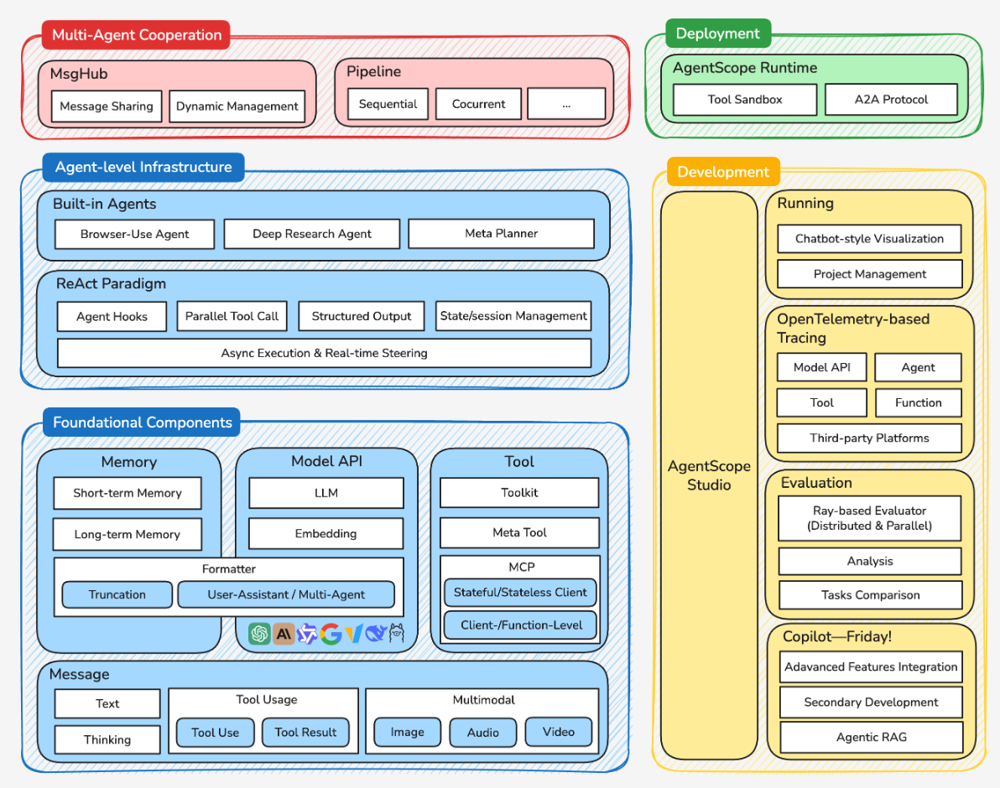

# 理念

AutoGen ：以对话驱动协作

**技术路径：工程化优先的多智能体平台**


# 设计

AgentScope 的核心差异

- 消息驱动的架构设计
- 工业级的工程实践：完整的"智能体操作系统"，为开发者提供了从开发、测试到部署的全生命周期支持。

设计：

- **组合式架构**：
- **消息驱动模式**



## 分层架构体系

**基础组件层 (Foundational Components)：为整个框架提供了核心的构建块**。

- `Message` 组件定义了**统一的消息格式**，支持从简单的文本交互到复杂的多模态内容；
- `Memory` 组件提供了**短期和长期记忆管理**；
- `Model API` 层抽象了对**不同大语言模型的调用**；
-  `Tool` 组件则**封装了智能体与外部世界交互**的能力

**智能体基础设施层 (Agent-level Infrastructure)**：不仅包含了**各种预构建的智能体**（如浏览器使用智能体、深度研究智能体），还实现了经典的 R**eAct 范式，支持智能体钩子、并行工具调用、状态管理**等高级特性。

- **重要优势**：支持 **异步执行与实时控制**

**多智能体协作层 (Multi-Agent Cooperation)：核心创新**，开发者可以轻松构建复杂的多智能体协作场景。

- **`MsgHub` 作为消息中心**，负责智能体间的消**息路由和状态管理**；
-  **`Pipeline` **系统则提供了灵活的**工作流编排能力，支持顺序、并发等多种执行模式**。

**开发与部署层 (Deployment & Development)**：

- **`AgentScope Runtime` **提供了生产级的**运行时环境**，
- **`AgentScope Studio` **则为开发者提供了**完整的可视化开发工具链**。

## 消息驱动（核心创新）

核心创新：**消息驱动架构**

**内容：所有的智能体交互都被抽象为 消息 的发送和接收，而不是传统的函数调用**。

将消息作为交互的基础单元，带来了几个关键优势：

- **异步解耦**: 消息的发送方和接收方在**时间上解耦，无需相互等待，天然支持高并发**场景。
- **位置透明** : 智能体**无需关心另一个智能体是在本地进程还是在远程服务器上，消息系统会自动处理路由**。
- **可观测性** : 每一条消**息都可以被记录、追踪和分析**，极大地简化了复杂系统的调试与监控。
- **可靠性**: 消息可以被**持久化存储和重试**，即使系统出现故障，也能保证交互的最终一致性，提升了系统的容错能力。

示例代码如下

```python
from agentscope.message import Msg

# 消息的标准结构
message = Msg(
    name="Alice",           # 发送者名称
    content="Hello, Bob!",  # 消息内容
    role="user",           # 角色类型
    metadata={             # 元数据信息
        "timestamp": "2024-01-15T10:30:00Z",
        "message_type": "text",
        "priority": "normal"
    }
)

```


## 生命周期管理

在 AgentScope 中，**每个智能体都有明确的生命周期**（初始化、运行、暂停、销毁等），并**基于一个统一的基类 `AgentBase` 来实现**。

**开发者通常只需要关注其核心的 `reply` 方法**。

这种设计模式**分离了智能体的内部逻辑与外部通信，开发者只需在 `reply` 方法中定义智能体“思考和回应”的方式即可**。

如下

```python
from agentscope.agents import AgentBase

class CustomAgent(AgentBase):
    def __init__(self, name: str, **kwargs):
        super().__init__(name=name, **kwargs)
        # 智能体初始化逻辑
  
    def reply(self, x: Msg) -> Msg:
        # 智能体的核心响应逻辑
        response = self.model(x.content)
        return Msg(name=self.name, content=response, role="assistant")
  
    def observe(self, x: Msg) -> None:
        # 智能体的观察逻辑（可选）
        self.memory.add(x)

```

## 消息传递机制

**消息中心 (MsgHub)：整个消息驱动架构的中枢**

- MsgHub 不仅负责**消息的路由和分发**，
- 还集成了**持久化和分布式通信**等高级功能

特点如下：

- 灵活的**消息路由**： 支持**点对点、广播、组播**等多种通信模式，可以**构建灵活复杂的交互网络**。
- 消息**持久化** : 能够将所有**消息自动保存到数据库**（如 SQLite, MongoDB），确保了**长期运行任务的状态可以被恢复**。
- 原生**分布式支持** : 这是 **AgentScope 的标志性特性**。
  - 智能体可以被**部署在不同的进程或服务器**上，
  - **`MsgHub` 会通过 RPC**（远程过程调用）自动**处理**跨节点的通信，对开发者完全透明。

# 实践：三国狼人杀游戏

## 需求分析

"三国狼人杀"将刘备、关羽、诸葛亮等经典角色引入游戏，每个智能体不仅要**完成狼人杀的基本任务**（如狼人击杀、预言家查验、村民推理），还要体现出对应三国人物的**性格特点和行为模式**。

## 架构设计与核心组件

```
游戏控制层 (LegendsOfTheThreeKingdomsProcess)
    ├── 游戏状态管理
    ├── 流程控制
    └── 胜负判定

智能体交互层 (MsgHub)
    ├── 消息路由
    ├── 并发处理
    └── 状态同步

角色建模层 (DialogAgent)
    ├── 角色提示词
    ├── 结构化输出
    └── 行为约束

```

将游戏逻辑划分为三个独立的层次，每个层次都映射了 AgentScope 的一个或多个核心组件：

- **游戏控制层 (Game Control Layer)**：由一个 `ThreeKingdomsWerewolfGame` 类作为游戏的主控制器，
  - **负责维护全局状态**（如玩家存活列表、当前游戏阶段）、
  - **推进游戏流程**（调用夜晚阶段、白天阶段）
  - 以及**裁定胜负**。
- **智能体交互层 (Agent Interaction Layer)**：完全由 `MsgHub` 驱动。
  - **所有智能体间的通信**，
  - 无论是狼人间的秘密协商，还是白天的公开辩论，都通过消息中心进行路由和分发。
- **角色建模层 (Role Modeling Layer)**：每个玩家都是一个**基于 `DialogAgent` 的实例**。
  - 我们通过**精心设计的系统提示词**，为每个智能体**注入了“游戏角色”和“三国人格”**的双重身份。

## 消息驱动的游戏流程

以**消息驱动 代替状态**机 来**管理游戏流程，**游戏流程被自然地**建模为一系列定义好的消息交互模式****。**

优势在于，**游戏逻辑被清晰地表达为“在特定上下文中，以何种模式进行消息交换”**，而不是一连串僵硬的状态转换。


白天讨论（全员广播）、预言家查验（点对点请求）等阶段也都遵循同样的设计范式。

```python
async def werewolf_phase(self, round_num: int):
    """狼人阶段 - 展示消息驱动的协作模式"""
    if not self.werewolves:
        return None
    
    # 通过消息中心建立狼人专属通信频道
    async with MsgHub(
        self.werewolves,
        enable_auto_broadcast=True,
        announcement=await self.moderator.announce(
            f"狼人们，请讨论今晚的击杀目标。存活玩家：{format_player_list(self.alive_players)}"
        ),
    ) as werewolves_hub:
        # 讨论阶段：狼人通过消息交换策略
        for _ in range(MAX_DISCUSSION_ROUND):
            for wolf in self.werewolves:
                await wolf(structured_model=DiscussionModelCN)
    
        # 投票阶段：收集并统计狼人的击杀决策
        werewolves_hub.set_auto_broadcast(False)
        kill_votes = await fanout_pipeline(
            self.werewolves,
            msg=await self.moderator.announce("请选择击杀目标"),
            structured_model=WerewolfKillModelCN,
            enable_gather=False,
        )

```

## 结构化输出约束游戏规则

关键挑战是如何**确保智能体的行为符合游戏规则**。

AgentScope **结构化输出机制** 为这个问题提供了**解决方案**。为不同的游戏行为定义了严格的数据模型：

通过这种方式

- 不仅确保了**智能体输出的格式一致性**
- 实现了 **游戏规则的自动化约束**

如：

- 女巫智能体无法同时对同一目标使用解药和毒药，
- 预言家每晚只能查验一名玩家，
- 这些约束**都通过数据模型的字段定义和验证逻辑自动执行**。

```python
class DiscussionModelCN(BaseModel):
    """讨论阶段的输出格式"""
    reach_agreement: bool = Field(
        description="是否已达成一致意见",
        default=False
    )
    confidence_level: int = Field(
        description="对当前推理的信心程度(1-10)",
        ge=1, le=10,
        default=5
    )
    key_evidence: Optional[str] = Field(
        description="支持你观点的关键证据",
        default=None
    )

class WitchActionModelCN(BaseModel):
    """女巫行动的输出格式"""
    use_antidote: bool = Field(description="是否使用解药")
    use_poison: bool = Field(description="是否使用毒药")
    target_name: Optional[str] = Field(description="毒药目标玩家姓名")

```


## 角色建模

让智能体同时**扮演好两个层面的角色**：**提示词工程来解决**

- **游戏功能角色** （狼人、预言家等）
- **文化人格角色**（刘备、曹操等）


```python
def get_role_prompt(role: str, character: str) -> str:
    """获取角色提示词 - 融合游戏规则与人物性格"""
    base_prompt = f"""你是{character}，在这场三国狼人杀游戏中扮演{role}。

重要规则：
1. 你只能通过对话和推理参与游戏
2. 不要尝试调用任何外部工具或函数
3. 严格按照要求的JSON格式回复

角色特点：
"""
  
    if role == "狼人":
        return base_prompt + f"""
- 你是狼人阵营，目标是消灭所有好人
- 夜晚可以与其他狼人协商击杀目标
- 白天要隐藏身份，误导好人
- 以{character}的性格说话和行动
"""

```


## 并发处理

游戏中经常出现**需要同时收集多个智能体决策** 的场景，

比如投票阶段：并行收集所有玩家的投票决策

- `fanout_pipeline` 允许我们并行地向所有智能体发送相同的消息，并异步收集它们的响应。
- 不仅提高了游戏的执行效率，更重要的是模拟了真实狼人杀游戏中"同时投票"的场景

```python
# 并行收集所有玩家的投票决策
vote_msgs = await fanout_pipeline(
    self.alive_players,
    await self.moderator.announce("请投票选择要淘汰的玩家"),
    structured_model=get_vote_model_cn(self.alive_players),
    enable_gather=False,
)

```

## 容错机制

在关键环节加入了容错处理：确保了即使某个智能体出现异常，整个游戏流程也能继续进行。

```python
try:
    response = await wolf(
        "请分析当前局势并表达你的观点。",
        structured_model=DiscussionModelCN
    )
except Exception as e:
    print(f"⚠️ {wolf.name} 讨论时出错: {e}")
    # 创建默认响应，确保游戏继续进行
    default_response = DiscussionModelCN(
        reach_agreement=False,
        confidence_level=5,
        key_evidence="暂时无法分析"
    )

```

# 优势

在性能上展现了其原生并发的优势，更在容错处理上保证了即使单个智能体出现异常，整体流程也能稳健运行

- 该框架以其**消息驱动的架构为核心**，将复杂的游戏流程优雅地映射为一系列并发、异步的消息传递事件
- 结合其强大的**结构化输出能力**，我们将游戏规则直接转化为代码层面的约束，极大地提升了系统的稳定性和可预测性。

# 局限性

**技术要求高**：消息驱动架构虽然强大，但对开发者的技术要求较高，需要理解异步编程、分布式通信等概念


**"过度工程化"**的风险：对于简单的多智能体对话场景，这种架构可能显得过于复杂

**相对较新的框架**，其生态系统和社区资源还有待进一步完善
