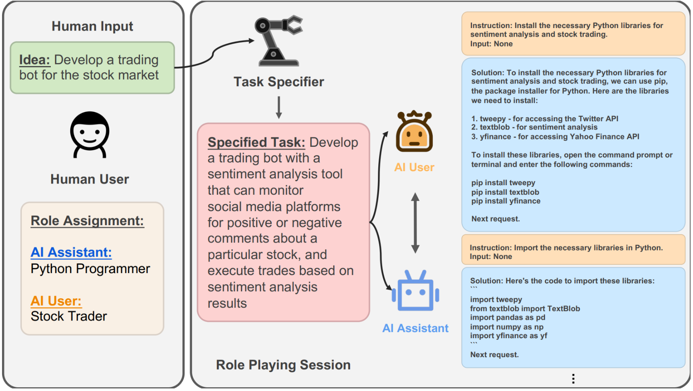

# 目标

核心目标：探索如何**在最少的人类干预下，让两个智能体通过“角色扮演”自主协作解决复杂任务**。

通过"以人为本"的角色扮演设计，将复杂的系统工程问题转化为直观的人际协作模式。

# 原理：自主协作

两大核心概念：**角色扮演 (Role-Playing) 和引导性提示 (Inception Prompting)**

## 角色扮演 (Role-Playing)

最初的设计中，一个任务通常**由两个智能体协作**完成，两个智能体被**赋予了互补的、明确定义的“角色”**。

- 一个扮演 **“AI 用户” (AI User)**：负责**提出需求、下达指令和构思任务步骤**；
- 另一个则扮演**“AI 助理” (AI Assistant)**：负责根据指令**执行具体操作和提供解决方案**。

通过这种设定，任务的解决过程就被自然地转化为一场两**位“跨领域专家”之间的对话**。两者**协作完成任何一方都无法独立完成的复杂任务**。

示例：在一个“开发股票交易策略分析工具”的任务中：

- AI 用户  的角色可能是一位“资深股票交易员”。它懂市场、懂策略，但不懂编程。
- AI 助理 的角色则是一位“优秀的 Python 程序员”。它精通编程，但对股票交易一无所知。
- 交易员提出专业需求，程序员将其转化为代码实现

## 引导性提示 (Inception Prompting)

作用：**确保两个 AI 在没有人类持续监督**的情况下，能**始终“待在自己的角色里”**，并且**高效地朝着共同目标前进**

“引导性提示”是**在对话开始前**，分别注入给两个智能体的一段**精心设计的、结构化的初始指令（System Prompt）**

**目的：为智能体植入的“行动纲领”**，这些约束条件**确保了对话不会偏离主题、不会陷入无效循环，而是以一种高度结构化、任务驱动的方式向前推进**，它通常包含以下几个关键部分：

- **明确自身角色** ：例如，“你是一位资深的股票交易员...”
- **告知协作者角色**：例如，“你正在与一位优秀的 Python 程序员合作...”
- **定义共同目标**：例如，“你们的共同目标是开发一个股票交易策略分析工具。”
- **设定行为约束和沟通协议：这是最关键的一环**。例如，指令会要求 AI 用户“一次只提出一个清晰、具体的步骤”，并要求 AI 助理“在完成上一步之前不要追问更多细节”，同时规定双方需在回复的末尾使用特定标志（如 `<SOLUTION>`）来标识任务的完成。

示例如下



# 实践：AI科普电子书

## 需求目标

案例：让一位 AI 心理学家与一位 AI 作者合作，共同创作一本关于"拖延症心理学"的短篇电子书。

CAMEL 的核心**优势，让两个智能体在各自专业领域发挥所长，协作完成单个智能体难以胜任的复杂创作任务**。

## 任务设定

场景设定：创作一本面向普通读者的拖延症心理学科普电子书，要求既有科学严谨性，又具备良好的可读性。

智能体角色：

- **心理学家（Psychologist）**：具备深厚的心理学理论基础，熟悉认知行为科学、神经科学等相关领域，能够提供专业的学术见解和实证研究支持
- **作家（Writer）**：拥有优秀的写作技巧和叙述能力，善于将复杂的学术概念转化为生动易懂的文字，注重读者体验和内容的可读性

## 定义协作任务

**明确两位 AI 专家的共同目标**

通过一个内容详实的字符串 `task_prompt` 来定义这个任务。

`task_prompt` 是整个协作的“任务说明书”。它不仅是我们要完成的目标，也将在幕后被 CAMEL 用来生成“引导性提示”，确保两位智能体的对话始终围绕这个核心目标展开。

```python

from colorama import Fore
from camel.societies import RolePlaying
from camel.utils import print_text_animated
from camel.models import ModelFactory
from camel.types import ModelPlatformType
from dotenv import load_dotenv
import os

load_dotenv()
LLM_API_KEY = os.getenv("LLM_API_KEY")
LLM_BASE_URL = os.getenv("LLM_BASE_URL")
LLM_MODEL = os.getenv("LLM_MODEL")

#创建模型,在这里以Qwen为例,调用的百炼大模型平台API
model = ModelFactory.create(
    model_platform=ModelPlatformType.QWEN,
    model_type=LLM_MODEL,
    url=LLM_BASE_URL,
    api_key=LLM_API_KEY
)

# 定义协作任务
task_prompt = """
创作一本关于"拖延症心理学"的短篇电子书，目标读者是对心理学感兴趣的普通大众。
要求：
1. 内容科学严谨，基于实证研究
2. 语言通俗易懂，避免过多专业术语
3. 包含实用的改善建议和案例分析
4. 篇幅控制在8000-10000字
5. 结构清晰，包含引言、核心章节和总结
"""

print(Fore.YELLOW + f"协作任务:\n{task_prompt}\n")

```

## 初始化角色扮演“社会”

CAMEL 的核心操作，它根**据我们提供的角色和任务，快速构建一个双智能体协作“社会”**。

**创建 `RolePlaying` 会话实例**。

- `RolePlaying` 是 CAMEL 提供的高级 API，**它封装了复杂的提示工程**。只需传入两个角色的名称和任务即可。
- 在 CAMEL 的设计中，`user` 角色是对话的“推动者”和“需求方”，而 `assistant` 角色是“执行者”和“方案提供方”
- 将负责规划结构的“作家”分配给 `user_role_name`，将负责提供专业知识的“心理学家”分配给 `assistant_role_name`。

```python

# 初始化角色扮演会话
# AI 作家作为 "user"，负责提出写作结构和要求
# AI 心理学家作为 "assistant"，负责提供专业知识和内容
role_play_session = RolePlaying(
    assistant_role_name="心理学家",
    user_role_name="作家",
    task_prompt=task_prompt,
    model=model,
    with_task_specify=False, # 在本例中，我们直接使用给定的task_prompt
)

print(Fore.CYAN + f"具体任务描述:\n{role_play_session.task_prompt}\n")

```

## 启动并运行自动化对话

编写一个循环来驱动整个对话过程，让两位 AI 专家开始它们的自动化协作。

- 对话由 `init_chat()` 方法基于任务和角色自动开启，无需人工编写开场白。
- 循环的每一步都通过调用 `step()` 来驱动一轮完整的交互（作家提需求、心理学家给内容），并将上一轮心理学家的输出作为下一轮的输入，形成环-环相扣的创作链。
- 整个过程将持续进行，直到达到预设的对话轮次上限，或任一智能体输出任务完成标志 `<CAMEL_TASK_DONE>` 后自动终止

```python
# 开始协作对话
chat_turn_limit, n = 30, 0
# 调用 init_chat() 来获得由 AI 生成的初始对话消息
input_msg = role_play_session.init_chat()

while n < chat_turn_limit:
    n += 1
    # step() 方法驱动一轮完整的对话，AI 用户和 AI 助理各发言一次
    assistant_response, user_response = role_play_session.step(input_msg)
  
    # 检查是否有消息返回，防止对话提前终止
    if assistant_response.msg is None or user_response.msg is None:
        break
  
    print_text_animated(Fore.BLUE + f"作家 (AI User):\n\n{user_response.msg.content}\n")
    print_text_animated(Fore.GREEN + f"心理学家 (AI Assistant):\n\n{assistant_response.msg.content}\n")
  
    # 检查任务完成标志
    if "<CAMEL_TASK_DONE>" in user_response.msg.content or "<CAMEL_TASK_DONE>" in assistant_response.msg.content:
        print(Fore.MAGENTA + "✅ 电子书创作完成！")
        break
  
    # 将助理的回复作为下一轮对话的输入
    input_msg = assistant_response.msg

print(Fore.YELLOW + f"总共进行了 {n} 轮协作对话")

```

# 优势

"轻架构、重提示"的设计哲学

CAMEL 通过精心设计的初始提示就能实现高质量的智能体协作。这种自然涌现的协作行为，往往比硬编码的工作流更加灵活和高效。

# 局限性

对**提示工程的高度依赖**

- 提示设计门槛：需要深入理解目标领域和 LLM 的行为特性
- 调试复杂性 ：当协作效果不佳时，很难定位是角色定义、任务描述还是交互规则的问题
- 一致性挑战 ：不同的 LLM 对相同提示的理解可能存在差异

**协作规模的限制：在处理大规模多智能体场景时面临挑战**：

- 对话管理 ：缺乏像 AutoGen 那样的复杂对话路由机制
- 状态同步：没有 AgentScope 那样的分布式状态管理能力
- 冲突解决 ：当多个智能体意见分歧时，缺乏有效的仲裁机制


**任务适用性的边界**：CAMEL 特别适合**需要深度协作和创造性思维的任务**，但在某些场景下可能**不是最优选择**：

- **严格流程控制**：对于需要精确步骤控制的任务，LangGraph 的图结构更合适
- **大规模并发**：AgentScope 的消息驱动架构在高并发场景下更有优势
- **复杂决策树**：AutoGen 的群聊模式在多方决策场景下更加灵活
