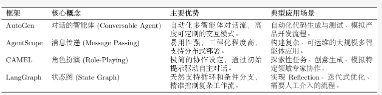
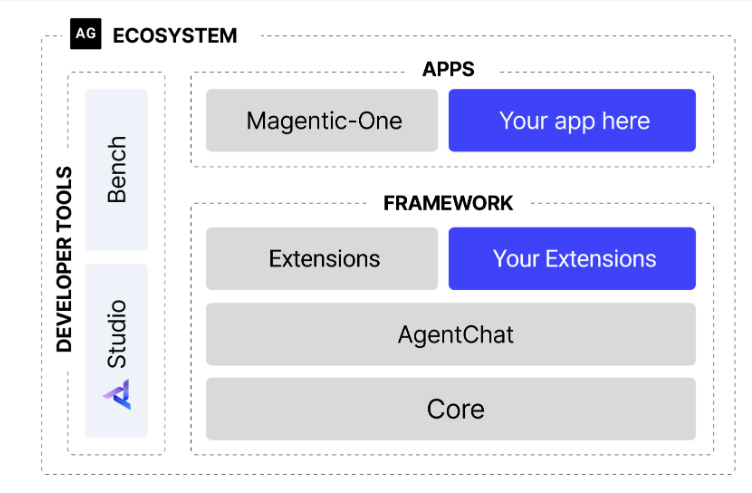

# 开发框架的意义

一个框架的本质，是提供一套经过验证的“规范”。

它将所有智能体共有的、重复性的工作（如主循环、状态管理、工具调用、日志记录等）进行抽象和封装，让我们在构建新的智能体时，能够专注于其独特的业务逻辑，而非通用的底层实现。

使用框架的价值主要体现在以下几个方面：

- **提升代码复用与开发效率**：无论是 ReAct 还是 Plan-and-Solve，都可以基于框架提供的标准组件快速搭建，从而避免重复劳动。
- 实现核**心组件的解耦与可扩展性**：框架的设计会强制我们分离不同的关注点：

  - **模型层 (Model Layer)**：负责与大语言模型交互，可以轻松替换不同的模型（OpenAI, Anthropic, 本地模型）
  - **工具层 (Tool Layer)**：提供标准化的工具定义、注册和执行接口，添加新工具不会影响其他代码。
  - **记忆层 (Memory Layer)**：处理短期和长期记忆，可以根据需求切换不同的记忆策略（如滑动窗口、摘要记忆）。
- **标准化复杂的状态管理**：在真实的、长时运行的智能体应用中，状态管理是一个巨大的挑战，它需要处理上下文窗口限制、历史信息持久化、多轮对话状态跟踪等问题。
- **简化可观测性与调试过程**：一个精心设计的框架可以内置强大的可观测性能力。

# 主流框架

它们的设计理念各不相同，分别代表了实现复杂智能体系统的不同技术路径

**AutoGen**：

- **核心思想：通过对话实现协作**
- 过程：**将多智能体系统抽象为一个由多个“可对话”智能体组成的群聊**。
  - 开发者可以定义不同角色（如 `Coder`, `ProductManager`, `Tester`），
  - 并设定它们之间的交互规则（例如，`Coder` 写完代码后由 `Tester` 自动接管）。
  - **任务的解决过程，就是这些智能体在群聊中通过自动化消息传递，不断对话、协作、迭代直至最终目标达成的过程**。

**AgentScope**：**专为多智能体应用设计**的、功能全面的开发平台

- **核心特点：易用性 和 工程化**
- **提供了一套非常友好的编程接口**，让开发者可以轻松定义智能体、构建通信网络，并管理整个应用的生命周期。
- 内置的 **消息传递机制和对分布式部署的支持**，使其非常适合构建和运维复杂、大规模的多智能体系统。

**CAMEL**：提供了一种新颖的、名为**角色扮演 (Role-Playing) 的协作方法**

- 核心理念：只需要**为两个智能体**（例如，`AI研究员` 和 `Python程序员`）**设定好各自的角色和共同的任务目标**，它们就能**在“初始提示 (Inception Prompting)”的引导下，自主地进行多轮对话**，相互启发、相互配合，共同完成任务。
- 它极大地降低了设计多智能体对话流程的复杂度。

**LangGraph**：将智能体的**执行流程建模为  图 (Graph)**

- 思想：LangGraph 将**每一步操作（如调用LLM、执行工具）定义为图中的一个节点 (Node)**，并用**边 (Edge)来定义节点之间的跳转逻辑**。
- 设计意义：天然**支持 循环 (Cycles)**，使得实现如 Reflection 这样的迭代、修正、自我反思的复杂工作流变得异常简单和直观。

# AutoGen

## 架构

**1、分层设计**：框架被拆分为两个核心模块：

- `b`：作为框架的**底层基础**，封装了**与语言模型交互、消息传递等核心功能**。它的存在保证了框架的稳定性和未来扩展性。
- `b`：构建于 **`core` 之上，提供了用于开发对话式智能体应用的高级接口**，简化了多智能体应用的开发流程。
-  这种分层策略使得各组件职责明确，**降低了系统的耦合度**。

**2、异步优先**：新架构全面转向异步编程，**异步模式允许系统在等待一个智能体响应时处理其他任务**，从而避免了线程阻塞，显著**提升了并发处理能力和系统资源的利用效率**。

## 核心智能体组件

智能体是执行任务的基本单元。

**AssistantAgent (助理智能体)**：任务的主要解决者，其**核心是封装了一个大型语言模型（LLM）**。

- **职责：根据对话历史生成富有逻辑和知识的回复**，例如提出计划、撰写文章或编写代码。
- **通过不同的系统消息（System Message），我们可以为其赋予不同的“专家”角色**。

**UserProxyAgent (用户代理智能体)**：扮演着双重角色：这种**设计清晰地区分了“思考”（由 `AssistantAgent` 完成）与“行动”**。

- 既是**人类用户的“代言人”，负责发起任务和传达意图**；
- 又是一个**可靠的“执行器”，可以配置为执行代码或调用工具，并将结果反馈给其他智能体**。

## Team

当任务需要多个智能体协作时，就需要一个机制来协调对话流程。引入了更灵活的 `Team` 或群聊概念，例如 `RoundRobinGroupChat`。

**轮询群聊 (RoundRobinGroupChat)**：一种**明确的、顺序化的对话协调机制**。

- 它会**让参与的智能体按照预定义的顺序依次发言**。
- 这种模式非常**适用于流程固定的任务**
- 例如一个典型的软件开发流程：产品经理先提出需求，然后工程师编写代码，最后由代码审查员进行检查。
- **工作流**：
  1. 首先，创建一个 `RoundRobinGroupChat` 实例，并**将所有参与协作的智能体（如产品经理、工程师等）加入其中**。
  1. 当**一个任务开始时，群聊会按照预设的顺序，依次激活相应的智能体**。
  1. 被**选中的智能体**根据当前的对话上下文进行**响应**。
  1. **群聊将新的回复加入对话历史，并激活下一个智能体**。
  1. 这个过程**会持续进行，直到达到最大对话轮次或满足预设的终止条件**。

通过这种方式，AutoGen 将复杂的协作关系，简化为一个流程清晰、易于管理的自动化“圆桌会议”。

**开发者只需定义好每个团队成员的角色和发言顺序，剩下的协作流程便可由群聊机制自主驱动**。

## 实践：软件开发团队

要求：将构建一个模拟的软件开发团队，该团队由多个具有不同专业技能的智能体组成，它们将协作完成一个真实的软件开发任务。

### 业务目标

开发一个功能明确的 Web 应用：实时显示比特币当前价格

### 智能体团队角色

模拟真实的软件开发流程，我们设计了四个职责分明的智能体角色：

- **ProductManager (产品经理)**：负责将用户的模糊需求转化为清晰、可执行的开发计划。
- **Engineer (工程师)：** 依据开发计划，负责编写具体的应用程序代码。
- **CodeReviewer (代码审查员)**：负责审查工程师提交的代码，确保其质量、可读性和健壮性。
- **UserProxy (用户代理)**：代表最终用户，发起初始任务，并负责执行和验证最终交付的代码。

### 核心代码实现
