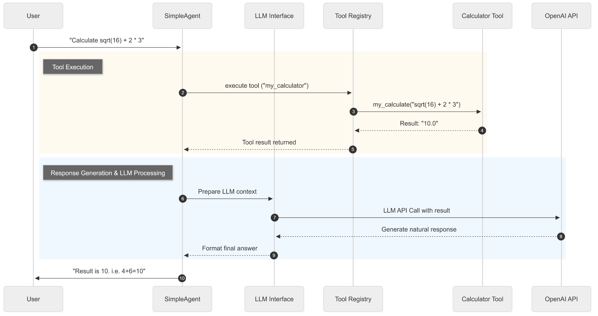

# 目标

在前面构建的Agent基础架构上，深入探讨工具系统的设计与实现。

三个核心方面展开：

1. **统一的工具抽象与管理**：建立标准化的Tool基类和ToolRegistry注册机制，为工具的开发、注册、发现和执行提供统一的基础设施。
2. **实战驱动的工具开发**：以数学计算工具为案例，展示如何设计和实现自定义工具，让读者掌握工具开发的完整流程。
3. **高级整合与优化策略**：通过多源搜索工具的设计，展示如何整合多个外部服务，实现智能后端选择、结果合并和容错处理，体现工具系统在复杂场景下的设计思维。

# 工具基类：Tool

Tool基类的抽象设计：Tool基类是整个工具系统的核心抽象，它定**义了所有工具必须遵循的接口规范**：

- 面向对象设计的核心思想：通过统一的 `run`方法接口，**所有工具都能以一致的方式执行**，接受字典参数并返回字符串结果，确保了框架的一致性。
- 同时，工具具备了自描述能力，通过 `get_parameters`方法能够清晰地告诉调用者自己需要什么参数，这种**内省机制为自动化文档生成和参数验证提供了基础**。
- 而**name和description等元数据的设计，则让工具系统具备了良好的可发现性和可理解性**

```python
class Tool(ABC):
    """工具基类"""

    def __init__(self, name: str, description: str):
        self.name = name
        self.description = description

    @abstractmethod
    def run(self, parameters: Dict[str, Any]) -> str:
        """执行工具"""
        pass

    @abstractmethod
    def get_parameters(self) -> List[ToolParameter]:
        """获取工具参数定义"""
        pass

```

# 参数定义系统：ToolParameter

为了支持复杂的**参数验证和文档生成**，我们设计了ToolParameter类：**让工具能够精确描述自己的参数需求，支持类型检查、默认值设置和文档自动生成**。

```python
class ToolParameter(BaseModel):
    """工具参数定义"""
    name: str
    type: str
    description: str
    required: bool = True
    default: Any = None

```

# 注册机制设计：ToolRegistry注册表

**ToolRegistry是工具系统的管理中枢**，它提供了**工具的注册、发现、执行等核心功能**，

ToolRegistry支持两种注册方式：

1. **Tool对象注册**：适合复杂工具，支持完整的参数定义和验证
2. **函数直接注册**：适合简单工具，快速集成现有函数

```python
class ToolRegistry:
    """HelloAgents工具注册表"""

    def __init__(self):
        self._tools: dict[str, Tool] = {}
        self._functions: dict[str, dict[str, Any]] = {}

    def register_tool(self, tool: Tool):
        """注册Tool对象"""
        if tool.name in self._tools:
            print(f"⚠️ 警告:工具 '{tool.name}' 已存在，将被覆盖。")
        self._tools[tool.name] = tool
        print(f"✅ 工具 '{tool.name}' 已注册。")
  
    def register_function(self, name: str, description: str, func: Callable[[str], str]):
        """
        直接注册函数作为工具（简便方式）

        Args:
            name: 工具名称
            description: 工具描述
            func: 工具函数，接受字符串参数，返回字符串结果
        """
        if name in self._functions:
            print(f"⚠️ 警告:工具 '{name}' 已存在，将被覆盖。")

        self._functions[name] = {
            "description": description,
            "func": func
        }
        print(f"✅ 工具 '{name}' 已注册。")

```

# 工具发现与管理机制

## 工具发现：构建Agent的提示词

在注册表提供了丰富的工具管理功能：这个方法生成的**描述字符串可以直接用于构建Agent的提示词，让Agent了解可用的工具**。

```python
def get_tools_description(self) -> str:
    """获取所有可用工具的格式化描述字符串"""
    descriptions = []

    # Tool对象描述
    for tool in self._tools.values():
        descriptions.append(f"- {tool.name}: {tool.description}")

    # 函数工具描述
    for name, info in self._functions.items():
        descriptions.append(f"- {name}: {info['description']}")

    return "\n".join(descriptions) if descriptions else "暂无可用工具"

```

## 工具使用：schema

生成的**schema可以直接用于原生的OpenAI SDK的工具调用**。

```python
def to_openai_schema(self) -> Dict[str, Any]:
        """转换为 OpenAI function calling schema 格式

        用于 FunctionCallAgent，使工具能够被 OpenAI 原生 function calling 使用

        Returns:
            符合 OpenAI function calling 标准的 schema
        """
        parameters = self.get_parameters()

        # 构建 properties
        properties = {}
        required = []

        for param in parameters:
            # 基础属性定义
            prop = {
                "type": param.type,
                "description": param.description
            }

            # 如果有默认值，添加到描述中（OpenAI schema 不支持 default 字段）
            if param.default is not None:
                prop["description"] = f"{param.description} (默认: {param.default})"

            # 如果是数组类型，添加 items 定义
            if param.type == "array":
                prop["items"] = {"type": "string"}  # 默认字符串数组

            properties[param.name] = prop

            # 收集必需参数
            if param.required:
                required.append(param.name)

        return {
            "type": "function",
            "function": {
                "name": self.name,
                "description": self.description,
                "parameters": {
                    "type": "object",
                    "properties": properties,
                    "required": required
                }
            }
        }

```

# 自定义工具开发

## Tool对象注册:数学计算工具

工具不仅支持基本的四则运算，还涵盖了常用的数学函数和常数，满足了大多数计算场景的需求。


```python
# my_calculator_tool.py
import ast
import operator
import math
from hello_agents import ToolRegistry

def my_calculate(expression: str) -> str:
    """简单的数学计算函数"""
    if not expression.strip():
        return "计算表达式不能为空"

    # 支持的基本运算
    operators = {
        ast.Add: operator.add,      # +
        ast.Sub: operator.sub,      # -
        ast.Mult: operator.mul,     # *
        ast.Div: operator.truediv,  # /
    }

    # 支持的基本函数
    functions = {
        'sqrt': math.sqrt,
        'pi': math.pi,
    }

    try:
        node = ast.parse(expression, mode='eval')
        result = _eval_node(node.body, operators, functions)
        return str(result)
    except:
        return "计算失败，请检查表达式格式"

def _eval_node(node, operators, functions):
    """简化的表达式求值"""
    if isinstance(node, ast.Constant):
        return node.value
    elif isinstance(node, ast.BinOp):
        left = _eval_node(node.left, operators, functions)
        right = _eval_node(node.right, operators, functions)
        op = operators.get(type(node.op))
        return op(left, right)
    elif isinstance(node, ast.Call):
        func_name = node.func.id
        if func_name in functions:
            args = [_eval_node(arg, operators, functions) for arg in node.args]
            return functions[func_name](*args)
    elif isinstance(node, ast.Name):
        if node.id in functions:
            return functions[node.id]

def create_calculator_registry():
    """创建包含计算器的工具注册表"""
    registry = ToolRegistry()

    # 注册计算器函数
    registry.register_function(
        name="my_calculator",
        description="简单的数学计算工具，支持基本运算(+,-,*,/)和sqrt函数",
        func=my_calculate
    )

    return registry

```

验证功能实现

```python
# test_my_calculator.py
from dotenv import load_dotenv
from my_calculator_tool import create_calculator_registry

# 加载环境变量
load_dotenv()

def test_calculator_tool():
    """测试自定义计算器工具"""

    # 创建包含计算器的注册表
    registry = create_calculator_registry()

    print("🧪 测试自定义计算器工具\n")

    # 简单测试用例
    test_cases = [
        "2 + 3",           # 基本加法
        "10 - 4",          # 基本减法
        "5 * 6",           # 基本乘法
        "15 / 3",          # 基本除法
        "sqrt(16)",        # 平方根
    ]

    for i, expression in enumerate(test_cases, 1):
        print(f"测试 {i}: {expression}")
        result = registry.execute_tool("my_calculator", expression)
        print(f"结果: {result}\n")

def test_with_simple_agent():
    """测试与SimpleAgent的集成"""
    from hello_agents import HelloAgentsLLM

    # 创建LLM客户端
    llm = HelloAgentsLLM()

    # 创建包含计算器的注册表
    registry = create_calculator_registry()

    print("🤖 与SimpleAgent集成测试:")

    # 模拟SimpleAgent使用工具的场景
    user_question = "请帮我计算 sqrt(16) + 2 * 3"

    print(f"用户问题: {user_question}")

    # 使用工具计算
    calc_result = registry.execute_tool("my_calculator", "sqrt(16) + 2 * 3")
    print(f"计算结果: {calc_result}")

    # 构建最终回答
    final_messages = [
        {"role": "user", "content": f"计算结果是 {calc_result}，请用自然语言回答用户的问题:{user_question}"}
    ]

    print("\n🎯 SimpleAgent的回答:")
    response = llm.think(final_messages)
    for chunk in response:
        print(chunk, end="", flush=True)
    print("\n")

if __name__ == "__main__":
    test_calculator_tool()
    test_with_simple_agent()

```

运行逻辑



## 函数直接注册：多源搜索工具

整合多个搜索引擎，能提供更加完备的真实信息。

- 使用过Tavily的搜索API
- 使用过SerpApi的搜索API

### 统一接口设计

HelloAgents框架内置的SearchTool展示了如何设计一个高级的多源搜索工具：

设计的核心思想是**根据可用的API密钥和依赖库，自动选择最佳的搜索后端**。

```python
class SearchTool(Tool):
    """
    智能混合搜索工具

    支持多种搜索引擎后端，智能选择最佳搜索源:
    1. 混合模式 (hybrid) - 智能选择TAVILY或SERPAPI
    2. Tavily API (tavily) - 专业AI搜索
    3. SerpApi (serpapi) - 传统Google搜索
    """

    def __init__(self, backend: str = "hybrid", tavily_key: Optional[str] = None, serpapi_key: Optional[str] = None):
        super().__init__(
            name="search",
            description="一个智能网页搜索引擎。支持混合搜索模式，自动选择最佳搜索源。"
        )
        self.backend = backend
        self.tavily_key = tavily_key or os.getenv("TAVILY_API_KEY")
        self.serpapi_key = serpapi_key or os.getenv("SERPAPI_API_KEY")
        self.available_backends = []
        self._setup_backends()

```

### 搜索源的整合策略

设计优势：体现了**高可用系统**的核心理念，通过降级机制，系统能够从最优的搜索源逐步降级到可用的备选方案。当所有搜索源都不可用时，明确提示用户配置正确的API密钥。

TAVILY与SERPAPI搜索源的整合策略，框架实现了智能的后端选择逻辑：

```python
def _search_hybrid(self, query: str) -> str:
    """混合搜索 - 智能选择最佳搜索源"""
    # 优先使用Tavily（AI优化的搜索）
    if "tavily" in self.available_backends:
        try:
            return self._search_tavily(query)
        except Exception as e:
            print(f"⚠️ Tavily搜索失败: {e}")
            # 如果Tavily失败，尝试SerpApi
            if "serpapi" in self.available_backends:
                print("🔄 切换到SerpApi搜索")
                return self._search_serpapi(query)

    # 如果Tavily不可用，使用SerpApi
    elif "serpapi" in self.available_backends:
        try:
            return self._search_serpapi(query)
        except Exception as e:
            print(f"⚠️ SerpApi搜索失败: {e}")

    # 如果都不可用，提示用户配置API
    return "❌ 没有可用的搜索源，请配置TAVILY_API_KEY或SERPAPI_API_KEY环境变量"

```

### 结构统一格式化

同搜索引擎返回的结果格式不同，框架通过统一的格式化方法来处理：

```python
def _search_tavily(self, query: str) -> str:
    """使用Tavily搜索"""
    response = self.tavily_client.search(
        query=query,
        search_depth="basic",
        include_answer=True,
        max_results=3
    )

    result = f"🎯 Tavily AI搜索结果:{response.get('answer', '未找到直接答案')}\n\n"

    for i, item in enumerate(response.get('results', [])[:3], 1):
        result += f"[{i}] {item.get('title', '')}\n"
        result += f"    {item.get('content', '')[:200]}...\n"
        result += f"    来源: {item.get('url', '')}\n\n"

    return result

```

### 完整实现

使用类的方式来展示不同的实现方法，创建 `my_advanced_search.py`：

```python
# my_advanced_search.py
import os
from typing import Optional, List, Dict, Any
from hello_agents import ToolRegistry

class MyAdvancedSearchTool:
    """
    自定义高级搜索工具类
    展示多源整合和智能选择的设计模式
    """

    def __init__(self):
        self.name = "my_advanced_search"
        self.description = "智能搜索工具，支持多个搜索源，自动选择最佳结果"
        self.search_sources = []
        self._setup_search_sources()

    def _setup_search_sources(self):
        """设置可用的搜索源"""
        # 检查Tavily可用性
        if os.getenv("TAVILY_API_KEY"):
            try:
                from tavily import TavilyClient
                self.tavily_client = TavilyClient(api_key=os.getenv("TAVILY_API_KEY"))
                self.search_sources.append("tavily")
                print("✅ Tavily搜索源已启用")
            except ImportError:
                print("⚠️ Tavily库未安装")

        # 检查SerpApi可用性
        if os.getenv("SERPAPI_API_KEY"):
            try:
                import serpapi
                self.search_sources.append("serpapi")
                print("✅ SerpApi搜索源已启用")
            except ImportError:
                print("⚠️ SerpApi库未安装")

        if self.search_sources:
            print(f"🔧 可用搜索源: {', '.join(self.search_sources)}")
        else:
            print("⚠️ 没有可用的搜索源，请配置API密钥")

    def search(self, query: str) -> str:
        """执行智能搜索"""
        if not query.strip():
            return "❌ 错误:搜索查询不能为空"

        # 检查是否有可用的搜索源
        if not self.search_sources:
            return """❌ 没有可用的搜索源，请配置以下API密钥之一:

1. Tavily API: 设置环境变量 TAVILY_API_KEY
   获取地址: https://tavily.com/

2. SerpAPI: 设置环境变量 SERPAPI_API_KEY
   获取地址: https://serpapi.com/

配置后重新运行程序。"""

        print(f"🔍 开始智能搜索: {query}")

        # 尝试多个搜索源，返回最佳结果
        for source in self.search_sources:
            try:
                if source == "tavily":
                    result = self._search_with_tavily(query)
                    if result and "未找到" not in result:
                        return f"📊 Tavily AI搜索结果:\n\n{result}"

                elif source == "serpapi":
                    result = self._search_with_serpapi(query)
                    if result and "未找到" not in result:
                        return f"🌐 SerpApi Google搜索结果:\n\n{result}"

            except Exception as e:
                print(f"⚠️ {source} 搜索失败: {e}")
                continue

        return "❌ 所有搜索源都失败了，请检查网络连接和API密钥配置"

    def _search_with_tavily(self, query: str) -> str:
        """使用Tavily搜索"""
        response = self.tavily_client.search(query=query, max_results=3)

        if response.get('answer'):
            result = f"💡 AI直接答案:{response['answer']}\n\n"
        else:
            result = ""

        result += "🔗 相关结果:\n"
        for i, item in enumerate(response.get('results', [])[:3], 1):
            result += f"[{i}] {item.get('title', '')}\n"
            result += f"    {item.get('content', '')[:150]}...\n\n"

        return result

    def _search_with_serpapi(self, query: str) -> str:
        """使用SerpApi搜索"""
        import serpapi

        search = serpapi.GoogleSearch({
            "q": query,
            "api_key": os.getenv("SERPAPI_API_KEY"),
            "num": 3
        })

        results = search.get_dict()

        result = "🔗 Google搜索结果:\n"
        if "organic_results" in results:
            for i, res in enumerate(results["organic_results"][:3], 1):
                result += f"[{i}] {res.get('title', '')}\n"
                result += f"    {res.get('snippet', '')}\n\n"

        return result

def create_advanced_search_registry():
    """创建包含高级搜索工具的注册表"""
    registry = ToolRegistry()

    # 创建搜索工具实例
    search_tool = MyAdvancedSearchTool()

    # 注册搜索工具的方法作为函数
    registry.register_function(
        name="advanced_search",
        description="高级搜索工具，整合Tavily和SerpAPI多个搜索源，提供更全面的搜索结果",
        func=search_tool.search
    )

    return registry

```


测试方法

```python
# test_advanced_search.py
from dotenv import load_dotenv
from my_advanced_search import create_advanced_search_registry, MyAdvancedSearchTool

# 加载环境变量
load_dotenv()

def test_advanced_search():
    """测试高级搜索工具"""

    # 创建包含高级搜索工具的注册表
    registry = create_advanced_search_registry()

    print("🔍 测试高级搜索工具\n")

    # 测试查询
    test_queries = [
        "Python编程语言的历史",
        "人工智能的最新发展",
        "2024年科技趋势"
    ]

    for i, query in enumerate(test_queries, 1):
        print(f"测试 {i}: {query}")
        result = registry.execute_tool("advanced_search", query)
        print(f"结果: {result}\n")
        print("-" * 60 + "\n")

def test_api_configuration():
    """测试API配置检查"""
    print("🔧 测试API配置检查:")

    # 直接创建搜索工具实例
    search_tool = MyAdvancedSearchTool()

    # 如果没有配置API，会显示配置提示
    result = search_tool.search("机器学习算法")
    print(f"搜索结果: {result}")

def test_with_agent():
    """测试与Agent的集成"""
    print("\n🤖 与Agent集成测试:")
    print("高级搜索工具已准备就绪，可以与Agent集成使用")

    # 显示工具描述
    registry = create_advanced_search_registry()
    tools_desc = registry.get_tools_description()
    print(f"工具描述:\n{tools_desc}")

if __name__ == "__main__":
    test_advanced_search()
    test_api_configuration()
    test_with_agent()

```

# 工具系统的高级特性

## 工具链式调用机制

在实际应用中，**Agent经常需要组合使用多个工具来完成复杂任务**。

我们可以设计一个工具链管理器来支持这种场景(结合LangGraph中图的概念)

```python
# tool_chain_manager.py
from typing import List, Dict, Any, Optional
from hello_agents import ToolRegistry

class ToolChain:
    """工具链 - 支持多个工具的顺序执行"""

    def __init__(self, name: str, description: str):
        self.name = name
        self.description = description
        self.steps: List[Dict[str, Any]] = []

    def add_step(self, tool_name: str, input_template: str, output_key: str = None):
        """
        添加工具执行步骤

        Args:
            tool_name: 工具名称
            input_template: 输入模板，支持变量替换
            output_key: 输出结果的键名，用于后续步骤引用
        """
        self.steps.append({
            "tool_name": tool_name,
            "input_template": input_template,
            "output_key": output_key or f"step_{len(self.steps)}_result"
        })

    def execute(self, registry: ToolRegistry, initial_input: str, context: Dict[str, Any] = None) -> str:
        """执行工具链"""
        context = context or {}
        context["input"] = initial_input

        print(f"🔗 开始执行工具链: {self.name}")

        for i, step in enumerate(self.steps, 1):
            tool_name = step["tool_name"]
            input_template = step["input_template"]
            output_key = step["output_key"]

            # 替换模板中的变量
            try:
                tool_input = input_template.format(**context)
            except KeyError as e:
                return f"❌ 工具链执行失败:模板变量 {e} 未找到"

            print(f"  步骤 {i}: 使用 {tool_name} 处理 '{tool_input[:50]}...'")

            # 执行工具
            result = registry.execute_tool(tool_name, tool_input)
            context[output_key] = result

            print(f"  ✅ 步骤 {i} 完成，结果长度: {len(result)} 字符")

        # 返回最后一步的结果
        final_result = context[self.steps[-1]["output_key"]]
        print(f"🎉 工具链 '{self.name}' 执行完成")
        return final_result

class ToolChainManager:
    """工具链管理器"""

    def __init__(self, registry: ToolRegistry):
        self.registry = registry
        self.chains: Dict[str, ToolChain] = {}

    def register_chain(self, chain: ToolChain):
        """注册工具链"""
        self.chains[chain.name] = chain
        print(f"✅ 工具链 '{chain.name}' 已注册")

    def execute_chain(self, chain_name: str, input_data: str, context: Dict[str, Any] = None) -> str:
        """执行指定的工具链"""
        if chain_name not in self.chains:
            return f"❌ 工具链 '{chain_name}' 不存在"

        chain = self.chains[chain_name]
        return chain.execute(self.registry, input_data, context)

    def list_chains(self) -> List[str]:
        """列出所有工具链"""
        return list(self.chains.keys())

# 使用示例
def create_research_chain() -> ToolChain:
    """创建一个研究工具链:搜索 -> 计算 -> 总结"""
    chain = ToolChain(
        name="research_and_calculate",
        description="搜索信息并进行相关计算"
    )

    # 步骤1:搜索信息
    chain.add_step(
        tool_name="search",
        input_template="{input}",
        output_key="search_result"
    )

    # 步骤2:基于搜索结果进行计算（如果需要）
    chain.add_step(
        tool_name="my_calculator",
        input_template="根据以下信息计算相关数值:{search_result}",
        output_key="calculation_result"
    )

    return chain

```


## 异步工具执行支持

对于耗时的工具操作，我们可以提供异步执行支持：

```python
# async_tool_executor.py
import asyncio
import concurrent.futures
from typing import Dict, Any, List, Callable
from hello_agents import ToolRegistry

class AsyncToolExecutor:
    """异步工具执行器"""

    def __init__(self, registry: ToolRegistry, max_workers: int = 4):
        self.registry = registry
        self.executor = concurrent.futures.ThreadPoolExecutor(max_workers=max_workers)

    async def execute_tool_async(self, tool_name: str, input_data: str) -> str:
        """异步执行单个工具"""
        loop = asyncio.get_event_loop()

        def _execute():
            return self.registry.execute_tool(tool_name, input_data)

        result = await loop.run_in_executor(self.executor, _execute)
        return result

    async def execute_tools_parallel(self, tasks: List[Dict[str, str]]) -> List[str]:
        """并行执行多个工具"""
        print(f"🚀 开始并行执行 {len(tasks)} 个工具任务")

        # 创建异步任务
        async_tasks = []
        for task in tasks:
            tool_name = task["tool_name"]
            input_data = task["input_data"]
            async_task = self.execute_tool_async(tool_name, input_data)
            async_tasks.append(async_task)

        # 等待所有任务完成
        results = await asyncio.gather(*async_tasks)

        print(f"✅ 所有工具任务执行完成")
        return results

    def __del__(self):
        """清理资源"""
        if hasattr(self, 'executor'):
            self.executor.shutdown(wait=True)

# 使用示例
async def test_parallel_execution():
    """测试并行工具执行"""
    from hello_agents import ToolRegistry

    registry = ToolRegistry()
    # 假设已经注册了搜索和计算工具

    executor = AsyncToolExecutor(registry)

    # 定义并行任务
    tasks = [
        {"tool_name": "search", "input_data": "Python编程"},
        {"tool_name": "search", "input_data": "机器学习"},
        {"tool_name": "my_calculator", "input_data": "2 + 2"},
        {"tool_name": "my_calculator", "input_data": "sqrt(16)"},
    ]

    # 并行执行
    results = await executor.execute_tools_parallel(tasks)

    for i, result in enumerate(results):
        print(f"任务 {i+1} 结果: {result[:100]}...")

```
