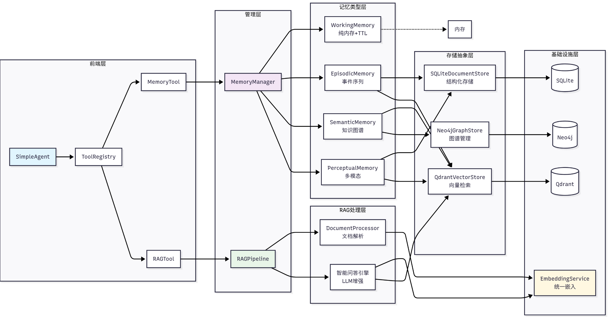
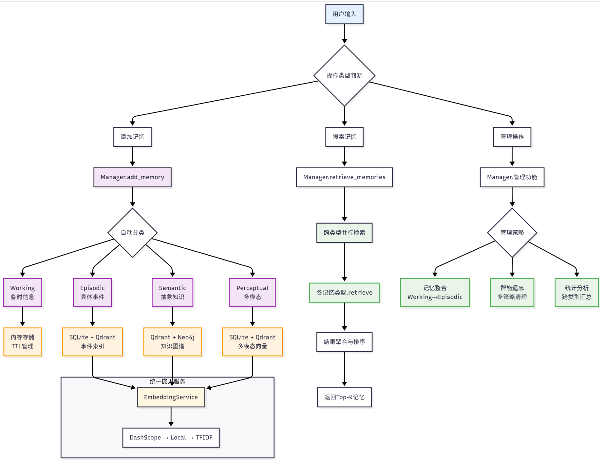
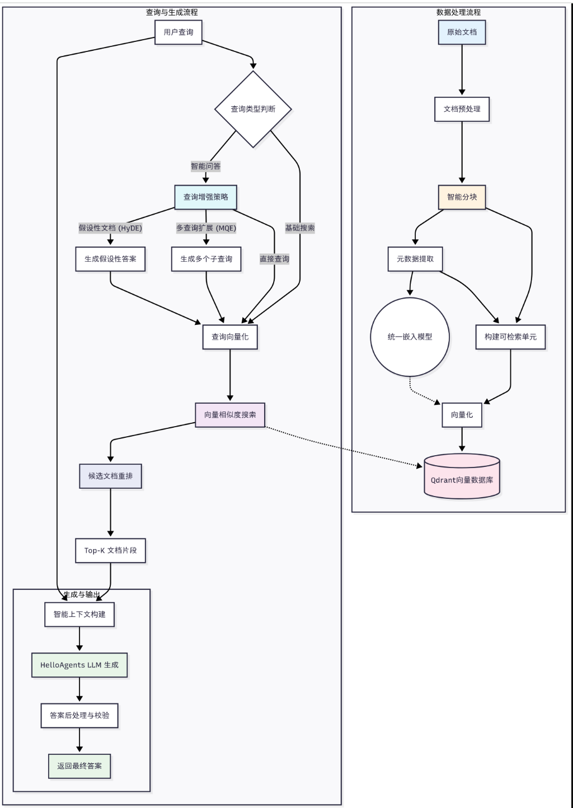

# 启发

人类记忆是一个多层级的认知系统，它不仅能存储信息，还能根据重要性、时间和上下文对信息进行分类和整理。

根据认知心理学的研究，人类记忆可以分为以下几个层次：

1. **感觉记忆（Sensory Memory）**：持续时间**极短**（0.5-3秒），**容量巨大**，负责**暂时保存感官接收到**的所有信息
2. **工作记忆（Working Memory）**：持续时间**短**（15-30秒），**容量有限**（7±2个项目），**负责当前任务的信息处理**
3. **长期记忆（Long-term Memory）**：持续**时间长**（可达终生），**容量几乎无限**，进一步分为：
   - **程序性记忆 ：技能和习惯**（如骑自行车）
   - **陈述性记忆**：可以用语言表达的知识，又分为：
     - **语义记忆 ：一般知识和概念**（如"巴黎是法国首都"）
     - **情景记忆 ：个人经历和事件**（如"昨天的会议内容"）

# 为什么需要记忆与RAG

对于基于LLM的智能体而言，通常面临两个**根本性局限：对话状态的遗忘 和内置知识的局限**

## 无状态导致的对话遗忘

**大语言模型设计上是 ：无状态**的

> 意味着：每一次用户请求（或API调用）都是一次独立的、无关联的计算。
>
> **模型本身不会自动“记住”上一次对话的内容**。

**无状态** 带来了几个**问题**：为了解决这个问题，需要引入**记忆系统**。

1. **上下文丢失**：在长对话中，早期的重要信息可能会因为上下文窗口限制而丢失
2. **个性化缺失**：Agent**无法记住用户的偏好、习惯或特定需求**
3. **学习能力受限** ：**无法从过往的成功或失败经验中学习改进**
4. **一致性问题：在多轮对话中可能出现前后矛盾**的回答

## 模型内置知识的局限性

LLM 的另一个核心局限在于其**知识是：静态的、有限**的

这些**知识完全来自于它的训练数据**

由于知识的局限性，带来一系列问题：使用**RAG技术**，解决这个问题

1. **知识时效性**：大模型的训练数据有时间截止点，无法获取最新信息
2. **专业领域知识** ：通用模型在特定领域的深度知识可能不足
3. **事实准确**性 ：**通过检索验证，减少模型的幻觉问题**
4. **可解释性 ：提供信息来源，增强回答的可信度**

**RAG核心思想是：在模型生成回答之前，先从一个外部知识库（如文档、数据库、API）中检索出最相关的信息，并将这些信息作为上下文一同提供给模型**。

# 记忆与RAG系统架构设计

## 架构图



## 实现

我们将记忆和RAG设计为两个独立的工具：

* MemoryTool：负责**存储和维护对话过程中的交互信息**，
* `rag_tool`：则**负责从用户提供的知识库中检索相关信息作为上下文**，并可将重要的检索结果自动存储到记忆系统中。

## 记忆系统

记忆系统采用了四层架构设计：

```python
MyAgents记忆系统
├── 基础设施层 (Infrastructure Layer)
│   ├── MemoryManager - 记忆管理器（统一调度和协调）
│   ├── MemoryItem - 记忆数据结构（标准化记忆项）
│   ├── MemoryConfig - 配置管理（系统参数设置）
│   └── BaseMemory - 记忆基类（通用接口定义）
├── 记忆类型层 (Memory Types Layer)
│   ├── WorkingMemory - 工作记忆（临时信息，TTL管理）
│   ├── EpisodicMemory - 情景记忆（具体事件，时间序列）
│   ├── SemanticMemory - 语义记忆（抽象知识，图谱关系）
│   └── PerceptualMemory - 感知记忆（多模态数据）
├── 存储后端层 (Storage Backend Layer)
│   ├── QdrantVectorStore - 向量存储（高性能语义检索）
│   ├── Neo4jGraphStore - 图存储（知识图谱管理）
│   └── SQLiteDocumentStore - 文档存储（结构化持久化）
└── 嵌入服务层 (Embedding Service Layer)
    ├── DashScopeEmbedding - 通义千问嵌入（云端API）
    ├── LocalTransformerEmbedding - 本地嵌入（离线部署）
    └── TFIDFEmbedding - TFIDF嵌入（轻量级兜底）

```

## RAG系统

RAG系统专注于外部知识的获取和利用

```python
MyAgents RAG系统
├── 文档处理层 (Document Processing Layer)
│   ├── DocumentProcessor - 文档处理器（多格式解析）
│   ├── Document - 文档对象（元数据管理）
│   └── Pipeline - RAG管道（端到端处理）
├── 嵌入表示层 (Embedding Layer)
│   └── 统一嵌入接口 - 复用记忆系统的嵌入服务
├── 向量存储层 (Vector Storage Layer)
│   └── QdrantVectorStore - 向量数据库（命名空间隔离）
└── 智能问答层 (Intelligent Q&A Layer)
    ├── 多策略检索 - 向量检索 + MQE + HyDE
    ├── 上下文构建 - 智能片段合并与截断
    └── LLM增强生成 - 基于上下文的准确问答

```

# 记忆系统：让智能体拥有记忆

## 工作流程

根据认知科学的研究，人类记忆的形成经历以下几个阶段：

1. **编码（Encoding）**：将感知到的**信息转换**为可存储的形式
2. **存储（Storage）**：将编码后的**信息保存**在记忆系统中
3. **检索（Retrieval）**：根据需要从**记忆中提取**相关信息
4. **整合（Consolidation）**：将**短期记忆转化为长期**记忆
5. **遗忘（Forgetting）**：**删除**不重要或过时的信息

核心思想是模仿人类大脑处理不同类型信息的方式，将记忆划分为多个专门的模块，并建立一套智能化的管理机制。



## 记忆模块构成

记忆系统由四种不同类型的记忆模块构成，每种模块都针对特定的应用场景和生命周期进行了优化：

- **工作记忆 (Working Memory)**：它扮演着**智能体“短期记忆”**的角色，主要用于**存储当前对话的上下文信息**。

  - 为确保高速访问和响应，其**容量被有意限制**（例如，默认50条），
  - 并且**生命周期与单个会话绑定**，会话结束后便会自动清理。
- **情景记忆 (Episodic Memory)**：它负责**长期存储具体的交互事件和智能体的学习经历**。

  - 与工作记忆不同，情景记忆**包含了丰富的上下文信息**，
  - 并支持**按时间序列或主题进行回顾式检索**，是智能体**“复盘”和学习过往经验**的基础。
- **语义记忆 (Semantic Memory)**：**与具体事件相对应**，它存储的是**更为抽象的知识、概念和规则**。

  - 例如，通过对话了解到的用户偏好、需要长期遵守的指令或领域知识点，都适合存放在这里。
  - 这部分记忆**具有高度的持久性和重要性**，是智能体**形成“知识体系”和进行关联推理**的核心。
- **感知记忆 (Perceptual Memory)**：为了与日益丰富的**多媒体交互**。

  - 该模块专门处理图像、音频等**多模态信息**，并支持**跨模态检索**。
  - 其生命周期会**根据信息的重要性和可用存储空间进行动态管理**。

## MemoryTool接口实现

### 统一接口

MemoryTool作为记忆系统的统一接口，其设计遵循了"统一入口，分发处理"的架构模式：这种统一的 `execute`接口设计简化了Agent的调用方式，通过 `action`参数指定具体操作，使用 `**kwargs`允许每个操作有不同的参数需求。

```python
def execute(self, action: str, **kwargs) -> str:
    """执行记忆操作

    支持的操作：
    - add: 添加记忆（支持4种类型: working/episodic/semantic/perceptual）
    - search: 搜索记忆
    - summary: 获取记忆摘要
    - stats: 获取统计信息
    - update: 更新记忆
    - remove: 删除记忆
    - forget: 遗忘记忆（多种策略）
    - consolidate: 整合记忆（短期→长期）
    - clear_all: 清空所有记忆
    """

    if action == "add":
        return self._add_memory(**kwargs)
    elif action == "search":
        return self._search_memory(**kwargs)
    elif action == "summary":
        return self._get_summary(**kwargs)
    # ... 其他操作

```

从记忆的创建、检索、摘要到遗忘、整合和管理，形成了一个闭环的智能记忆管理系统，让Agent真正具备了类人的记忆能力。

### add操作

`add`操作是记忆系统的基础，它**模拟了人类大脑将感知信息编码为记忆的过程**。

在实现中，我们**不仅要存储记忆内容，还要为每个记忆添加丰富的上下文信息**，这些信息将在后续的检索和管理中发挥重要作用。

主要实现了**三个关键任务：**

- **会话ID的自动管理**（确保每个**记忆都有明确的会话归属**）、
- **多模态数据的智能处理**（自动**推断文件类型并保存相关元数据**）、
- **上下文信息的自动补充**（为每个记忆**添加时间戳和会话信息**）。

其中，**`importance`参数（默认0.5）用于标记记忆的重要程度，取值范围0.0-1.0**，这个机制模拟了人类大脑对不同信息重要性的评估。

这种设计让Agent能够自动区分不同时间段的对话，并为后续的检索和管理提供丰富的上下文信息。

```python
def _add_memory(
    self,
    content: str = "",
    memory_type: str = "working",
    importance: float = 0.5,
    file_path: str = None,
    modality: str = None,
    **metadata
) -> str:
    """添加记忆"""
    try:
        # 确保会话ID存在
        if self.current_session_id is None:
            self.current_session_id = f"session_{datetime.now().strftime('%Y%m%d_%H%M%S')}"

        # 感知记忆文件支持
        if memory_type == "perceptual" and file_path:
            inferred = modality or self._infer_modality(file_path)
            metadata.setdefault("modality", inferred)
            metadata.setdefault("raw_data", file_path)

        # 添加会话信息到元数据
        metadata.update({
            "session_id": self.current_session_id,
            "timestamp": datetime.now().isoformat()
        })

        memory_id = self.memory_manager.add_memory(
            content=content,
            memory_type=memory_type,
            importance=importance,
            metadata=metadata,
            auto_classify=False
        )

        return f"✅ 记忆已添加 (ID: {memory_id[:8]}...)"

    except Exception as e:
        return f"❌ 添加记忆失败: {str(e)}"

```

提供了不同的使用示例：

```python
# 1. 工作记忆 - 临时信息，容量有限
memory_tool.execute("add",
    content="用户刚才问了关于Python函数的问题",
    memory_type="working",
    importance=0.6
)

# 2. 情景记忆 - 具体事件和经历
memory_tool.execute("add",
    content="2024年3月15日，用户张三完成了第一个Python项目",
    memory_type="episodic",
    importance=0.8,
    event_type="milestone",
    location="在线学习平台"
)

# 3. 语义记忆 - 抽象知识和概念
memory_tool.execute("add",
    content="Python是一种解释型、面向对象的编程语言",
    memory_type="semantic",
    importance=0.9,
    knowledge_type="factual"
)

# 4. 感知记忆 - 多模态信息
memory_tool.execute("add",
    content="用户上传了一张Python代码截图，包含函数定义",
    memory_type="perceptual",
    importance=0.7,
    modality="image",
    file_path="./uploads/code_screenshot.png"
)

```

### search操作

`search`操作是记忆系统的核心功能，它需要**在大量记忆中快速找到与查询最相关的内容**。

它涉及语义理解、相关性计算和结果排序等多个环节

**搜索操作**在设计上**支持单数和复数两种参数形式（`memory_type`和 `memory_types`），让用户以最自然的方式表达需求**。

其中，`b`**参数（默认0.1）用于过滤低质量记忆**。

```python
def _search_memory(
    self,
    query: str,
    limit: int = 5,
    memory_types: List[str] = None,
    memory_type: str = None,
    min_importance: float = 0.1
) -> str:
    """搜索记忆"""
    try:
        # 参数标准化处理
        if memory_type and not memory_types:
            memory_types = [memory_type]

        results = self.memory_manager.retrieve_memories(
            query=query,
            limit=limit,
            memory_types=memory_types,
            min_importance=min_importance
        )

        if not results:
            return f"🔍 未找到与 '{query}' 相关的记忆"

        # 格式化结果
        formatted_results = []
        formatted_results.append(f"🔍 找到 {len(results)} 条相关记忆:")

        for i, memory in enumerate(results, 1):
            memory_type_label = {
                "working": "工作记忆",
                "episodic": "情景记忆", 
                "semantic": "语义记忆",
                "perceptual": "感知记忆"
            }.get(memory.memory_type, memory.memory_type)

            content_preview = memory.content[:80] + "..." if len(memory.content) > 80 else memory.content
            formatted_results.append(
                f"{i}. [{memory_type_label}] {content_preview} (重要性: {memory.importance:.2f})"
            )

        return "\n".join(formatted_results)

    except Exception as e:
        return f"❌ 搜索记忆失败: {str(e)}"

```

对于搜索功能的使用，可以参考这个示例。

```
# 基础搜索
result = memory_tool.execute("search", query="Python编程", limit=5)

# 指定记忆类型搜索
result = memory_tool.execute("search",
    query="学习进度",
    memory_type="episodic",
    limit=3
)

# 多类型搜索
result = memory_tool.execute("search",
    query="函数定义",
    memory_types=["semantic", "episodic"],
    min_importance=0.5
)

```

### forget操作

遗忘机制是最具认知科学色彩的功能，它模拟人类大脑的选择性遗忘过程，支持三种策略：

- 基于**重要性（删除不重要**的记忆）、
- 基于**时间（删除过时**的记忆）
- 基于**容量（当存储接近上限时**删除最不重要的记忆）

```python
def _forget(self, strategy: str = "importance_based", threshold: float = 0.1, max_age_days: int = 30) -> str:
    """遗忘记忆（支持多种策略）"""
    try:
        count = self.memory_manager.forget_memories(
            strategy=strategy,
            threshold=threshold,
            max_age_days=max_age_days
        )
        return f"🧹 已遗忘 {count} 条记忆（策略: {strategy}）"
    except Exception as e:
        return f"❌ 遗忘记忆失败: {str(e)}"

```

三种遗忘策略的使用：

```python
# 1. 基于重要性的遗忘 - 删除重要性低于阈值的记忆
memory_tool.execute("forget",
    strategy="importance_based",
    threshold=0.2
)

# 2. 基于时间的遗忘 - 删除超过指定天数的记忆
memory_tool.execute("forget",
    strategy="time_based",
    max_age_days=30
)

# 3. 基于容量的遗忘 - 当记忆数量超限时删除最不重要的
memory_tool.execute("forget",
    strategy="capacity_based",
    threshold=0.3
)

```

### consolidate操作

consolidate操作借鉴了神经科学中的记忆固化概念，模拟**人类大脑将短期记忆转化为长期记忆**的过程。

默认设置是将**重要性超过0.7的工作记忆转换为情景记忆**，这个阈值确保只有真正重要的信息才会被长期保存。

整个过程是自动化的，用户无需手动选择具体的记忆，系统会智能地识别符合条件的记忆并执行类型转换。

```python
def _consolidate(self, from_type: str = "working", to_type: str = "episodic", importance_threshold: float = 0.7) -> str:
    """整合记忆（将重要的短期记忆提升为长期记忆）"""
    try:
        count = self.memory_manager.consolidate_memories(
            from_type=from_type,
            to_type=to_type,
            importance_threshold=importance_threshold,
        )
        return f"🔄 已整合 {count} 条记忆为长期记忆（{from_type} → {to_type}，阈值={importance_threshold}）"
    except Exception as e:
        return f"❌ 整合记忆失败: {str(e)}"

```

记忆整合的使用示例：

```python
# 将重要的工作记忆转为情景记忆
memory_tool.execute("consolidate",
    from_type="working",
    to_type="episodic",
    importance_threshold=0.7
)

# 将重要的情景记忆转为语义记忆
memory_tool.execute("consolidate",
    from_type="episodic",
    to_type="semantic",
    importance_threshold=0.8
)

```

## MemoryManager

分层设计体现了软件工程中的关注点分离原则，

**MemoryTool专注于用户接口和参数处理**，

而**MemoryManager则负责核心的记忆管理逻辑**。

### MemoryTool

MemoryTool**在初始化时会创建一个MemoryManager实例**，并根据配置启用不同类型的记忆模块。

> 这种设计让用户可以根据具体需求选择启用哪些记忆类型，既保证了功能的完整性，又避免了不必要的资源消耗。

```python
class MemoryTool(Tool):
    """记忆工具 - 为Agent提供记忆功能"""
  
    def __init__(
        self,
        user_id: str = "default_user",
        memory_config: MemoryConfig = None,
        memory_types: List[str] = None
    ):
        super().__init__(
            name="memory",
            description="记忆工具 - 可以存储和检索对话历史、知识和经验"
        )
  
        # 初始化记忆管理器
        self.memory_config = memory_config or MemoryConfig()
        self.memory_types = memory_types or ["working", "episodic", "semantic"]
  
        self.memory_manager = MemoryManager(
            config=self.memory_config,
            user_id=user_id,
            enable_working="working" in self.memory_types,
            enable_episodic="episodic" in self.memory_types,
            enable_semantic="semantic" in self.memory_types,
            enable_perceptual="perceptual" in self.memory_types
        )

```

### MemoryManager

MemoryManager作为记忆系统的核心协调者，负责管理不同类型的记忆模块，并提供统一的操作接口。

```python
class MemoryManager:
    """记忆管理器 - 统一的记忆操作接口"""

    def __init__(
        self,
        config: Optional[MemoryConfig] = None,
        user_id: str = "default_user",
        enable_working: bool = True,
        enable_episodic: bool = True,
        enable_semantic: bool = True,
        enable_perceptual: bool = False
    ):
        self.config = config or MemoryConfig()
        self.user_id = user_id

        # 初始化存储和检索组件
        self.store = MemoryStore(self.config)
        self.retriever = MemoryRetriever(self.store, self.config)

        # 初始化各类型记忆
        self.memory_types = {}

        if enable_working:
            self.memory_types['working'] = WorkingMemory(self.config, self.store)

        if enable_episodic:
            self.memory_types['episodic'] = EpisodicMemory(self.config, self.store)

        if enable_semantic:
            self.memory_types['semantic'] = SemanticMemory(self.config, self.store)

        if enable_perceptual:
            self.memory_types['perceptual'] = PerceptualMemory(self.config, self.store)

```

#### 工作记忆（WorkingMemory）

工作记忆是记忆系统中最活跃的部分，它**负责存储当前对话会话中的临时信息**。

工作记忆的**设计重点在于快速访问和自动清理**，这种设计确保了系统的响应速度和资源效率。

工作记忆采用了**纯内存存储方案，配合TTL（Time To Live）机制进行自动清理**。

- 这种设计的优势在于访问速度极快，但也意味着工作记忆的内容在系统重启后会丢失。
- 这种特性正好符合工作记忆的定位，存储临时的、易变的信息。

**工作记忆的检索采用了混合检索策略**，

- 首先尝试使用**TF-IDF向量化进行语义检索**，如果**失败则回退到关键词匹配**。
- 这种设计确保了在各种环境下都能提供可靠的检索服务。
- **评分算法结合了语义相似度、时间衰减和重要性权重**，最终得分公式为：`b`。

```python
class WorkingMemory:
    """工作记忆实现
    特点：
    - 容量有限（默认50条）+ TTL自动清理
    - 纯内存存储，访问速度极快
    - 混合检索：TF-IDF向量化 + 关键词匹配
    """
  
    def __init__(self, config: MemoryConfig):
        self.max_capacity = config.working_memory_capacity or 50
        self.max_age_minutes = config.working_memory_ttl or 60
        self.memories = []
  
    def add(self, memory_item: MemoryItem) -> str:
        """添加工作记忆"""
        self._expire_old_memories()  # 过期清理
  
        if len(self.memories) >= self.max_capacity:
            self._remove_lowest_priority_memory()  # 容量管理
  
        self.memories.append(memory_item)
        return memory_item.id
  
    def retrieve(self, query: str, limit: int = 5, **kwargs) -> List[MemoryItem]:
        """混合检索：TF-IDF向量化 + 关键词匹配"""
        self._expire_old_memories()
  
        # 尝试TF-IDF向量检索
        vector_scores = self._try_tfidf_search(query)
  
        # 计算综合分数
        scored_memories = []
        for memory in self.memories:
            vector_score = vector_scores.get(memory.id, 0.0)
            keyword_score = self._calculate_keyword_score(query, memory.content)
    
            # 混合评分
            base_relevance = vector_score * 0.7 + keyword_score * 0.3 if vector_score > 0 else keyword_score
            time_decay = self._calculate_time_decay(memory.timestamp)
            importance_weight = 0.8 + (memory.importance * 0.4)
    
            final_score = base_relevance * time_decay * importance_weight
            if final_score > 0:
                scored_memories.append((final_score, memory))
  
        scored_memories.sort(key=lambda x: x[0], reverse=True)
        return [memory for _, memory in scored_memories[:limit]]

```

#### 情景记忆（EpisodicMemory）

情景记忆负责**存储具体的事件和经历**，它的设计**重点在于保持事件的完整性和时间序列关系**。

情景记忆采用了**SQLite+Qdrant的混合存储方案**，

- **SQLite负责结构化数据的存储和复杂查询**，
- **Qdrant负责高效的向量检索**。

情景记忆的检索实现展现了复杂的多因素评分机制。它**不仅考虑了语义相似度，还加入了时间近因性的考量，最终通过重要性权重进行调节**。

评分公式为：`b`，**确保检索结果既语义相关又时间相关**。

```python
class EpisodicMemory:
    """情景记忆实现
    特点：
    - SQLite+Qdrant混合存储架构
    - 支持时间序列和会话级检索
    - 结构化过滤 + 语义向量检索
    """
  
    def __init__(self, config: MemoryConfig):
        self.doc_store = SQLiteDocumentStore(config.database_path)
        self.vector_store = QdrantVectorStore(config.qdrant_url, config.qdrant_api_key)
        self.embedder = create_embedding_model_with_fallback()
        self.sessions = {}  # 会话索引
  
    def add(self, memory_item: MemoryItem) -> str:
        """添加情景记忆"""
        # 创建情景对象
        episode = Episode(
            episode_id=memory_item.id,
            session_id=memory_item.metadata.get("session_id", "default"),
            timestamp=memory_item.timestamp,
            content=memory_item.content,
            context=memory_item.metadata
        )
  
        # 更新会话索引
        session_id = episode.session_id
        if session_id not in self.sessions:
            self.sessions[session_id] = []
        self.sessions[session_id].append(episode.episode_id)
  
        # 持久化存储（SQLite + Qdrant）
        self._persist_episode(episode)
        return memory_item.id
  
    def retrieve(self, query: str, limit: int = 5, **kwargs) -> List[MemoryItem]:
        """混合检索：结构化过滤 + 语义向量检索"""
        # 1. 结构化预过滤（时间范围、重要性等）
        candidate_ids = self._structured_filter(**kwargs)
  
        # 2. 向量语义检索
        hits = self._vector_search(query, limit * 5, kwargs.get("user_id"))
  
        # 3. 综合评分与排序
        results = []
        for hit in hits:
            if self._should_include(hit, candidate_ids, kwargs):
                score = self._calculate_episode_score(hit)
                memory_item = self._create_memory_item(hit)
                results.append((score, memory_item))
  
        results.sort(key=lambda x: x[0], reverse=True)
        return [item for _, item in results[:limit]]
  
    def _calculate_episode_score(self, hit) -> float:
        """情景记忆评分算法"""
        vec_score = float(hit.get("score", 0.0))
        recency_score = self._calculate_recency(hit["metadata"]["timestamp"])
        importance = hit["metadata"].get("importance", 0.5)
  
        # 评分公式：(向量相似度 × 0.8 + 时间近因性 × 0.2) × 重要性权重
        base_relevance = vec_score * 0.8 + recency_score * 0.2
        importance_weight = 0.8 + (importance * 0.4)
  
        return base_relevance * importance_weight

```

#### 语义记忆（SemanticMemory）

语义记忆是记忆系统中最复杂的部分，它**负责存储抽象的概念、规则和知识**。

语义记忆的设计**重点在于知识的结构化表示和智能推理能力**。

语义记忆采用了**Neo4j图数据库和Qdrant向量数据库**的混合架构，

- 这种设计**让系统既能进行快速的语义检索**，
- 又能**利用知识图谱进行复杂的关系推理**。

##### 结构

```python
class SemanticMemory(BaseMemory):
    """语义记忆实现
  
    特点：
    - 使用HuggingFace中文预训练模型进行文本嵌入
    - 向量检索进行快速相似度匹配
    - 知识图谱存储实体和关系
    - 混合检索策略：向量+图+语义推理
    """
  
    def __init__(self, config: MemoryConfig, storage_backend=None):
        super().__init__(config, storage_backend)
  
        # 嵌入模型（统一提供）
        self.embedding_model = get_text_embedder()
  
        # 专业数据库存储
        self.vector_store = QdrantConnectionManager.get_instance(**qdrant_config)
        self.graph_store = Neo4jGraphStore(**neo4j_config)
  
        # 实体和关系缓存
        self.entities: Dict[str, Entity] = {}
        self.relations: List[Relation] = []
  
        # NLP处理器（支持中英文）
        self.nlp = self._init_nlp()

```

##### 记忆添加过程

语义记忆的添加过程体现了知识图谱构建的完整流程。

系统不仅存储记忆内容，还会自动提取实体和关系，构建结构化的知识表示：

```python
def add(self, memory_item: MemoryItem) -> str:
    """添加语义记忆"""
    # 1. 生成文本嵌入
    embedding = self.embedding_model.encode(memory_item.content)
  
    # 2. 提取实体和关系
    entities = self._extract_entities(memory_item.content)
    relations = self._extract_relations(memory_item.content, entities)
  
    # 3. 存储到Neo4j图数据库
    for entity in entities:
        self._add_entity_to_graph(entity, memory_item)
  
    for relation in relations:
        self._add_relation_to_graph(relation, memory_item)
  
    # 4. 存储到Qdrant向量数据库
    metadata = {
        "memory_id": memory_item.id,
        "entities": [e.entity_id for e in entities],
        "entity_count": len(entities),
        "relation_count": len(relations)
    }
  
    self.vector_store.add_vectors(
        vectors=[embedding.tolist()],
        metadata=[metadata],
        ids=[memory_item.id]
    )

```

##### 记忆检索

语义记忆的检索实现了混合搜索策略，结合了向量检索的语义理解能力和图检索的关系推理能力：

```python
def retrieve(self, query: str, limit: int = 5, **kwargs) -> List[MemoryItem]:
    """检索语义记忆"""
    # 1. 向量检索
    vector_results = self._vector_search(query, limit * 2, user_id)
  
    # 2. 图检索
    graph_results = self._graph_search(query, limit * 2, user_id)
  
    # 3. 混合排序
    combined_results = self._combine_and_rank_results(
        vector_results, graph_results, query, limit
    )
  
    return combined_results[:limit]

```

##### 混合排序算法

语义记忆的评分公式为：`b`。这种设计的核心思想是：

- **向量检索权重（0.7）：语义相似度是主要因素**，确保检索结果与查询语义相关
- **图检索权重（0.3）：关系推理作为补充**，发现概念间的隐含关联
- **重要性权重范围[0.8, 1.2]：避免重要性过度影响相似度排序**，保持检索的准确性

```python
def _combine_and_rank_results(self, vector_results, graph_results, query, limit):
    """混合排序结果"""
    combined = {}
  
    # 合并向量和图检索结果
    for result in vector_results:
        combined[result["memory_id"]] = {
            **result,
            "vector_score": result.get("score", 0.0),
            "graph_score": 0.0
        }
  
    for result in graph_results:
        memory_id = result["memory_id"]
        if memory_id in combined:
            combined[memory_id]["graph_score"] = result.get("similarity", 0.0)
        else:
            combined[memory_id] = {
                **result,
                "vector_score": 0.0,
                "graph_score": result.get("similarity", 0.0)
            }
  
    # 计算混合分数
    for memory_id, result in combined.items():
        vector_score = result["vector_score"]
        graph_score = result["graph_score"]
        importance = result.get("importance", 0.5)
  
        # 基础相似度得分
        base_relevance = vector_score * 0.7 + graph_score * 0.3
  
        # 重要性权重 [0.8, 1.2]
        importance_weight = 0.8 + (importance * 0.4)
  
        # 最终得分：相似度 * 重要性权重
        combined_score = base_relevance * importance_weight
        result["combined_score"] = combined_score
  
    # 排序并返回
    sorted_results = sorted(
        combined.values(),
        key=lambda x: x["combined_score"],
        reverse=True
    )
  
    return sorted_results[:limit]

```

#### 感知记忆（PerceptualMemory）

感知记忆支持文本、图像、音频等**多种模态的数据存储和检索**。

它采用了**模态分离的存储策略**，为**不同模态的数据创建独立的向量集合**，这种设计避免了维度不匹配的问题，同时保证了检索的准确性：

##### 初始化结构

```python
class PerceptualMemory(BaseMemory):
    """感知记忆实现
  
    特点：
    - 支持多模态数据（文本、图像、音频等）
    - 跨模态相似性搜索
    - 感知数据的语义理解
    - 支持内容生成和检索
    """
  
    def __init__(self, config: MemoryConfig, storage_backend=None):
        super().__init__(config, storage_backend)
  
        # 多模态编码器
        self.text_embedder = get_text_embedder()
        self._clip_model = self._init_clip_model()  # 图像编码
        self._clap_model = self._init_clap_model()  # 音频编码
  
        # 按模态分离的向量存储
        self.vector_stores = {
            "text": QdrantConnectionManager.get_instance(
                collection_name="perceptual_text",
                vector_size=self.vector_dim
            ),
            "image": QdrantConnectionManager.get_instance(
                collection_name="perceptual_image", 
                vector_size=self._image_dim
            ),
            "audio": QdrantConnectionManager.get_instance(
                collection_name="perceptual_audio",
                vector_size=self._audio_dim
            )
        }

```

##### 记忆检索

感知记忆的检索支持同模态和跨模态两种模式。

- 同模态检索利用专业的编码器进行精确匹配，
- 而跨模态检索则需要更复杂的语义对齐机制：

```python
def retrieve(self, query: str, limit: int = 5, **kwargs) -> List[MemoryItem]:
    """检索感知记忆（可筛模态；同模态向量检索+时间/重要性融合）"""
    user_id = kwargs.get("user_id")
    target_modality = kwargs.get("target_modality")
    query_modality = kwargs.get("query_modality", target_modality or "text")
  
    # 同模态向量检索
    try:
        query_vector = self._encode_data(query, query_modality)
        store = self._get_vector_store_for_modality(target_modality or query_modality)
  
        where = {"memory_type": "perceptual"}
        if user_id:
            where["user_id"] = user_id
        if target_modality:
            where["modality"] = target_modality
  
        hits = store.search_similar(
            query_vector=query_vector,
            limit=max(limit * 5, 20),
            where=where
        )
    except Exception:
        hits = []
  
    # 融合排序（向量相似度 + 时间近因性 + 重要性权重）
    results = []
    for hit in hits:
        vector_score = float(hit.get("score", 0.0))
        recency_score = self._calculate_recency_score(hit["metadata"]["timestamp"])
        importance = hit["metadata"].get("importance", 0.5)
  
        # 评分算法
        base_relevance = vector_score * 0.8 + recency_score * 0.2
        importance_weight = 0.8 + (importance * 0.4)
        combined_score = base_relevance * importance_weight
  
        results.append((combined_score, self._create_memory_item(hit)))
  
    results.sort(key=lambda x: x[0], reverse=True)
    return [item for _, item in results[:limit]]

```

##### 评分

**感知记忆的评分公式为：`(向量相似度 × 0.8 + 时间近因性 × 0.2) × (0.8 + 重要性 × 0.4)`**。

感知记忆的评分机制还支持跨模态检索，通过统一的向量空间实现文本、图像、音频等不同模态数据的语义对齐。

**当进行跨模态检索时，系统会自动调整评分权重，确保检索结果的多样性和准确性**。

此外，感知记忆中的时间近因性计算**采用了指数衰减模型：这种时间衰减模型模拟了人类记忆中的遗忘曲线**，**确保了感知记忆系统能够优先检索到时间上更相关的记忆内容**。

```python
def _calculate_recency_score(self, timestamp: str) -> float:
    """计算时间近因性得分"""
    try:
        memory_time = datetime.fromisoformat(timestamp)
        current_time = datetime.now()
        age_hours = (current_time - memory_time).total_seconds() / 3600
  
        # 指数衰减：24小时内保持高分，之后逐渐衰减
        decay_factor = 0.1  # 衰减系数
        recency_score = math.exp(-decay_factor * age_hours / 24)
  
        return max(0.1, recency_score)  # 最低保持0.1的基础分数
    except Exception:
        return 0.5  # 默认中等分数

```

# RAG系统：知识检索增强

## RAG基础

### 什么是RAG

RAG：检索增强生成（Retrieval-Augmented Generation，RAG）是一种结合了信息检索和文本生成的技术。

**核心思想：在生成回答之前，先从外部知识库中检索相关信息，然后将检索到的信息作为上下文提供给大语言模型**，从而生成更准确、更可靠的回答。

**检索增强生成**可以拆分为三个词汇。

- **检索 ：是指从知识库中查询相关内容；**
- **增强 ：是将检索结果融入提示词，辅助模型生成；**
- **生成：则输出兼具准确性与透明度的答案**

### 基本工作流程

一个完整的RAG应用流程主要分为两大核心环节。

- 在 **数据准备阶段** ，系统通过**数据提取、文本分割和向量化**，将**外部知识构建成一个可检索的数据库**。
- 随后在 **应用阶段**，系统会**响应用户的提问** ，从数据库中**检索**相关信息，将其**注入Prompt**，并**最终驱动大语言模型生成答案**。

### 发展历程

**第一阶段：朴素RAG（Naive RAG, 2020-2021）**。这是RAG技术的萌芽阶段，其流程直接而简单，通常被称为**“检索-读取”（Retrieve-Read）模式**。

- **检索方式** ：主要**依赖传统的关键词匹配算法**，如 `TF-IDF`或 `BM25`。这些方法计算词频和文档频率来评估相关性，对字面匹配效果好，但**难以理解语义上的相似性**。
- **生成模式** ：将**检索到的文档内容不加处理地直接拼接**到提示词的上下文中，然后送给生成模型。

**第二阶段：高级RAG（Advanced RAG, 2022-2023）**。随着向量数据库和文本嵌入技术的成熟，RAG进入了快速发展阶段。研究者和开发者们**在“检索”和“生成”的各个环节引入了大量优化技术**。

- **检索方式 ：转向基于 稠密嵌入（Dense Embedding）的语义检索**。通过**将文本转换为高维向量，模型能够理解和匹配语义上的相似性**，而不仅仅是关键词。
- **生成模式：引入了很多优化技术**，例如**查询重写，文档分块，重排序**等。

**第三阶段：模块化RAG（Modular RAG, 2023-至今）**。在高级RAG的基础上，现代RAG系统**进一步向着模块化、自动化和智能化**的方向发展。系统的**各个部分被设计成可插拔、可组合的独立模块**，以适应更多样化和复杂的应用场景。

- **检索方式**：如混合检索，多查询扩展，假设性文档嵌入等。
- **生成模式** ：思维链推理，自我反思与修正等。

## 工作原理

RAG系统的**两个主要工作模式**：

1. **数据处理流程**：**处理和存储知识文档**，在这里我们采取工具 `Markitdown`，设计思路是将传入的一切外部知识源统一转化为Markdown格式进行处理。
2. **查询与生成流程** ：**根据查询检索相关信息并生成回答**。

流程图来梳理Helloagents的RAG系统完整工作流程：



## RAG系统架构设计

`Memory_tool`是系统性的实现，而**RAG在我们的设计中被定义为一种工具，可以梳理为一条pipeline**

RAG系统的核心架构可以概括为"五层七步"的设计模式：

```python
用户层：RAGTool统一接口
  ↓
应用层：智能问答、搜索、管理
  ↓  
处理层：文档解析、分块、向量化
  ↓
存储层：向量数据库、文档存储
  ↓
基础层：嵌入模型、LLM、数据库

```

分层设计的优势在于**每一层都可以独立优化和替换**，同时**保持整体系统的稳定性**。

> 例如，可以轻松地将嵌入模型从sentence-transformers切换到百炼API，而不影响上层的业务逻辑。
>
> 同样的，这些处理的流程代码是完全可复用的，也可以选取自己需要的部分放进自己的项目中。

## RAGTool

### init

RAGTool作为RAG系统的统一入口，提供了简洁的API接口。

整个处理流程如下所示：

```
任意格式文档 → MarkItDown转换 → Markdown文本 → 智能分块 → 向量化 → 存储检索
```

```python
class RAGTool(Tool):
    """RAG工具
  
    提供完整的 RAG 能力：
    - 添加多格式文档（PDF、Office、图片、音频等）
    - 智能检索与召回
    - LLM 增强问答
    - 知识库管理
    """
  
    def __init__(
        self,
        knowledge_base_path: str = "./knowledge_base",
        qdrant_url: str = None,
        qdrant_api_key: str = None,
        collection_name: str = "rag_knowledge_base",
        rag_namespace: str = "default"
    ):
        # 初始化RAG管道
        self._pipelines: Dict[str, Dict[str, Any]] = {}
        self.llm = HelloAgentsLLM()
  
        # 创建默认管道
        default_pipeline = create_rag_pipeline(
            qdrant_url=self.qdrant_url,
            qdrant_api_key=self.qdrant_api_key,
            collection_name=self.collection_name,
            rag_namespace=self.rag_namespace
        )
        self._pipelines[self.rag_namespace] = default_pipeline

```

### 多模态文档载入

RAG系统的核心优势之一是其强大的多模态文档处理能力。

**系统使用MarkItDown作为统一的文档转换引擎，支持几乎所有常见的文档格式**。

- MarkItDown是微软开源的通用文档转换工具，它是HelloAgents RAG系统的核心组件，负责将任意格式的文档统一转换为结构化的Markdown文本。
- 无论输入是PDF、Word、Excel、图片还是音频，最终都会转换为标准的Markdown格式，然后进入统一的分块、向量化和存储流程。

```python
def _convert_to_markdown(path: str) -> str:
    """
    Universal document reader using MarkItDown with enhanced PDF processing.
    核心功能：将任意格式文档转换为Markdown文本
  
    支持格式：
    - 文档：PDF、Word、Excel、PowerPoint
    - 图像：JPG、PNG、GIF（通过OCR）
    - 音频：MP3、WAV、M4A（通过转录）
    - 文本：TXT、CSV、JSON、XML、HTML
    - 代码：Python、JavaScript、Java等
    """
    if not os.path.exists(path):
        return ""
  
    # 对PDF文件使用增强处理
    ext = (os.path.splitext(path)[1] or '').lower()
    if ext == '.pdf':
        return _enhanced_pdf_processing(path)
  
    # 其他格式使用MarkItDown统一转换
    md_instance = _get_markitdown_instance()
    if md_instance is None:
        return _fallback_text_reader(path)
  
    try:
        result = md_instance.convert(path)
        markdown_text = getattr(result, "text_content", None)
        if isinstance(markdown_text, str) and markdown_text.strip():
            print(f"[RAG] MarkItDown转换成功: {path} -> {len(markdown_text)} chars Markdown")
            return markdown_text
        return ""
    except Exception as e:
        print(f"[WARNING] MarkItDown转换失败 {path}: {e}")
        return _fallback_text_reader(path)

```

### 智能分块策略

经过**MarkItDown转换后，所有文档都统一为标准的Markdown格式**。这为后续的**智能分块提供了结构化的基础**。

HelloAgents实现了专门针对Markdown格式的智能分块策略，充分**利用Markdown的结构化特性进行精确分割**。

Markdown结构感知的分块流程：

```
标准Markdown文本 → 标题层次解析 → 段落语义分割 → Token计算分块 → 重叠策略优化 → 向量化准备
       ↓                ↓              ↓            ↓           ↓            ↓
   统一格式          #/##/###        语义边界      大小控制     信息连续性    嵌入向量
   结构清晰          层次识别        完整性保证    检索优化     上下文保持    相似度匹配
```

#### 语义切割

由于所有文档都已转换为Markdown格式，系统可以**利用Markdown的标题结构（#、##、###等）进行精确的语义分割**：

```python
def _split_paragraphs_with_headings(text: str) -> List[Dict]:
    """根据标题层次分割段落，保持语义完整性"""
    lines = text.splitlines()
    heading_stack: List[str] = []
    paragraphs: List[Dict] = []
    buf: List[str] = []
    char_pos = 0
  
    def flush_buf(end_pos: int):
        if not buf:
            return
        content = "\n".join(buf).strip()
        if not content:
            return
        paragraphs.append({
            "content": content,
            "heading_path": " > ".join(heading_stack) if heading_stack else None,
            "start": max(0, end_pos - len(content)),
            "end": end_pos,
        })
  
    for ln in lines:
        raw = ln
        if raw.strip().startswith("#"):
            # 处理标题行
            flush_buf(char_pos)
            level = len(raw) - len(raw.lstrip('#'))
            title = raw.lstrip('#').strip()
      
            if level <= 0:
                level = 1
            if level <= len(heading_stack):
                heading_stack = heading_stack[:level-1]
            heading_stack.append(title)
      
            char_pos += len(raw) + 1
            continue
  
        # 段落内容累积
        if raw.strip() == "":
            flush_buf(char_pos)
            buf = []
        else:
            buf.append(raw)
        char_pos += len(raw) + 1
  
    flush_buf(char_pos)
  
    if not paragraphs:
        paragraphs = [{"content": text, "heading_path": None, "start": 0, "end": len(text)}]
  
    return paragraphs

```

#### 分块

在Markdown段落分割的基础上，系统进一步**根据Token数量进行智能分块**。

由于输入已经是结构化的Markdown文本，系统可以更精确地控制分块边界，**确保每个分块既适合向量化处理，又保持Markdown结构的完整性**：

```python
def _chunk_paragraphs(paragraphs: List[Dict], chunk_tokens: int, overlap_tokens: int) -> List[Dict]:
    """基于Token数量的智能分块"""
    chunks: List[Dict] = []
    cur: List[Dict] = []
    cur_tokens = 0
    i = 0
  
    while i < len(paragraphs):
        p = paragraphs[i]
        p_tokens = _approx_token_len(p["content"]) or 1
  
        if cur_tokens + p_tokens <= chunk_tokens or not cur:
            cur.append(p)
            cur_tokens += p_tokens
            i += 1
        else:
            # 生成当前分块
            content = "\n\n".join(x["content"] for x in cur)
            start = cur[0]["start"]
            end = cur[-1]["end"]
            heading_path = next((x["heading_path"] for x in reversed(cur) if x.get("heading_path")), None)
      
            chunks.append({
                "content": content,
                "start": start,
                "end": end,
                "heading_path": heading_path,
            })
      
            # 构建重叠部分
            if overlap_tokens > 0 and cur:
                kept: List[Dict] = []
                kept_tokens = 0
                for x in reversed(cur):
                    t = _approx_token_len(x["content"]) or 1
                    if kept_tokens + t > overlap_tokens:
                        break
                    kept.append(x)
                    kept_tokens += t
                cur = list(reversed(kept))
                cur_tokens = kept_tokens
            else:
                cur = []
                cur_tokens = 0
  
    # 处理最后一个分块
    if cur:
        content = "\n\n".join(x["content"] for x in cur)
        start = cur[0]["start"]
        end = cur[-1]["end"]
        heading_path = next((x["heading_path"] for x in reversed(cur) if x.get("heading_path")), None)
  
        chunks.append({
            "content": content,
            "start": start,
            "end": end,
            "heading_path": heading_path,
        })
  
    return chunks

```

同时为了兼容不同语言，**系统实现了针对中英文混合文本的Token估算算法，这对于准确控制分块大小至关重要**：

```python
def _approx_token_len(text: str) -> int:
    """近似估计Token长度，支持中英文混合"""
    # CJK字符按1 token计算
    cjk = sum(1 for ch in text if _is_cjk(ch))
    # 其他字符按空白分词计算
    non_cjk_tokens = len([t for t in text.split() if t])
    return cjk + non_cjk_tokens

def _is_cjk(ch: str) -> bool:
    """判断是否为CJK字符"""
    code = ord(ch)
    return (
        0x4E00 <= code <= 0x9FFF or  # CJK统一汉字
        0x3400 <= code <= 0x4DBF or  # CJK扩展A
        0x20000 <= code <= 0x2A6DF or # CJK扩展B
        0x2A700 <= code <= 0x2B73F or # CJK扩展C
        0x2B740 <= code <= 0x2B81F or # CJK扩展D
        0x2B820 <= code <= 0x2CEAF or # CJK扩展E
        0xF900 <= code <= 0xFAFF      # CJK兼容汉字
    )

```

### 统一嵌入与向量存储

嵌入模型是RAG系统的核心，**它负责将文本转换为高维向量**，使得计算机能够理解和比较文本的语义相似性。

AG系统的检索能力很大程度上取决于嵌入模型的质量和向量存储的效率。

```python
def index_chunks(
    store = None, 
    chunks: List[Dict] = None, 
    cache_db: Optional[str] = None, 
    batch_size: int = 64,
    rag_namespace: str = "default"
) -> None:
    """
    Index markdown chunks with unified embedding and Qdrant storage.
    Uses百炼 API with fallback to sentence-transformers.
    """
    if not chunks:
        print("[RAG] No chunks to index")
        return
  
    # 使用统一嵌入模型
    embedder = get_text_embedder()
    dimension = get_dimension(384)
  
    # 创建默认Qdrant存储
    if store is None:
        store = _create_default_vector_store(dimension)
        print(f"[RAG] Created default Qdrant store with dimension {dimension}")
  
    # 预处理Markdown文本以获得更好的嵌入质量
    processed_texts = []
    for c in chunks:
        raw_content = c["content"]
        processed_content = _preprocess_markdown_for_embedding(raw_content)
        processed_texts.append(processed_content)
  
    print(f"[RAG] Embedding start: total_texts={len(processed_texts)} batch_size={batch_size}")
  
    # 批量编码
    vecs: List[List[float]] = []
    for i in range(0, len(processed_texts), batch_size):
        part = processed_texts[i:i+batch_size]
        try:
            # 使用统一嵌入器（内部处理缓存）
            part_vecs = embedder.encode(part)
      
            # 标准化为List[List[float]]格式
            if not isinstance(part_vecs, list):
                if hasattr(part_vecs, "tolist"):
                    part_vecs = [part_vecs.tolist()]
                else:
                    part_vecs = [list(part_vecs)]
      
            # 处理向量格式和维度
            for v in part_vecs:
                try:
                    if hasattr(v, "tolist"):
                        v = v.tolist()
                    v_norm = [float(x) for x in v]
              
                    # 维度检查和调整
                    if len(v_norm) != dimension:
                        print(f"[WARNING] 向量维度异常: 期望{dimension}, 实际{len(v_norm)}")
                        if len(v_norm) < dimension:
                            v_norm.extend([0.0] * (dimension - len(v_norm)))
                        else:
                            v_norm = v_norm[:dimension]
              
                    vecs.append(v_norm)
                except Exception as e:
                    print(f"[WARNING] 向量转换失败: {e}, 使用零向量")
                    vecs.append([0.0] * dimension)
              
        except Exception as e:
            print(f"[WARNING] Batch {i} encoding failed: {e}")
            # 实现重试机制
            # ... 重试逻辑 ...
  
        print(f"[RAG] Embedding progress: {min(i+batch_size, len(processed_texts))}/{len(processed_texts)}")

```

## 高级检索策略

RAG系统的检索能力是其核心竞争力。

实际应用中，**用户的查询表述与文档中的实际内容可能存在用词差异，导致相关文档无法被检索到**。

为了解决这个问题，HelloAgents实现了三种互补的高级检索策略：**多查询扩展（MQE）、假设文档嵌入（HyDE）和统一的扩展检索框架**。

### 多查询扩展（MQE）

**多查询扩展（Multi-Query Expansion）**是一种**通过生成语义等价的多样化查询**来提高检索召回率的技术。

**核心洞察是：同一个问题可以有多种不同的表述方式**，而不同的表述可能匹配到不同的相关文档。**通过并行执行这些扩展查询并合并结果，系统能够覆盖更广泛的相关文档，避免因用词差异而遗漏重要信息**。

> 例如，"如何学习Python"可以扩展为"Python入门教程"、"Python学习方法"、"Python编程指南"等多个查询。

MQE的优势在于它**能够自动理解用户查询的多种可能含义，特别是对于模糊查询或专业术语查询效果显著**。

系统使用LLM生成扩展查询，确保扩展的多样性和语义相关性：

```python
def _prompt_mqe(query: str, n: int) -> List[str]:
    """使用LLM生成多样化的查询扩展"""
    try:
        from ...core.llm import HelloAgentsLLM
        llm = HelloAgentsLLM()
        prompt = [
            {"role": "system", "content": "你是检索查询扩展助手。生成语义等价或互补的多样化查询。使用中文，简短，避免标点。"},
            {"role": "user", "content": f"原始查询：{query}\n请给出{n}个不同表述的查询，每行一个。"}
        ]
        text = llm.invoke(prompt)
        lines = [ln.strip("- \t") for ln in (text or "").splitlines()]
        outs = [ln for ln in lines if ln]
        return outs[:n] or [query]
    except Exception:
        return [query]

```

### 假设文档嵌入（HyDE）

假设文档嵌入（Hypothetical Document Embeddings，HyDE）是一种创新的检索技术，它的**核心思想是"用答案找答案"**。

**传统的检索方法是用问题去匹配文档**，但问题和答案在语义空间中的分布往往存在差异——**问题通常是疑问句，而文档内容是陈述句**。

**HyDE通过让LLM先生成一个假设性的答案段落，然后用这个答案段落去检索真实文档，从而缩小了查询和文档之间的语义鸿沟**。

这种方法的**优势在于，假设答案与真实答案在语义空间中更加接近，因此能够更准确地匹配到相关文档**。**即使假设答案的内容不完全正确，它所包含的关键术语、概念和表述风格也能有效引导检索系统找到正确的文档**。特别是**对于专业领域的查询，HyDE能够生成包含领域术语的假设文档，显著提升检索精度**：

```python
def _prompt_hyde(query: str) -> Optional[str]:
    """生成假设性文档用于改善检索"""
    try:
        from ...core.llm import HelloAgentsLLM
        llm = HelloAgentsLLM()
        prompt = [
            {"role": "system", "content": "根据用户问题，先写一段可能的答案性段落，用于向量检索的查询文档（不要分析过程）。"},
            {"role": "user", "content": f"问题：{query}\n请直接写一段中等长度、客观、包含关键术语的段落。"}
        ]
        return llm.invoke(prompt)
    except Exception:
        return None

```

### 扩展检索框架

HelloAgents将MQE和HyDE两种策略整合到统一的扩展检索框架中。

系统通过 `enable_mqe`和 `enable_hyde`参数让用户可以根据具体场景选择启用哪些策略：

- 对于需要**高召回率的场景可以同时启用两种策略**，
- 对于**性能敏感的场景可以只使用基础检索**。

扩展检索的**核心机制是"扩展-检索-合并"**三步流程。

1. 首先，**系统根据原始查询生成多个扩展查询**（包括MQE生成的多样化查询和HyDE生成的假设文档）；
2. 然后，**对每个扩展查询并行执行向量检索，获取候选文档池**；
3. 最后，**通过去重和分数排序合并所有结果，返回最相关的top-k文档**。

这种设计的巧妙之处在于，它通过 `candidate_pool_multiplier`参数（默认为4）**扩大候选池**，确保有足够的候选文档进行筛选，同时通过**智能去重避免返回重复内容**。
