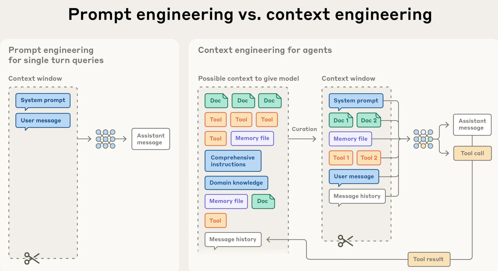
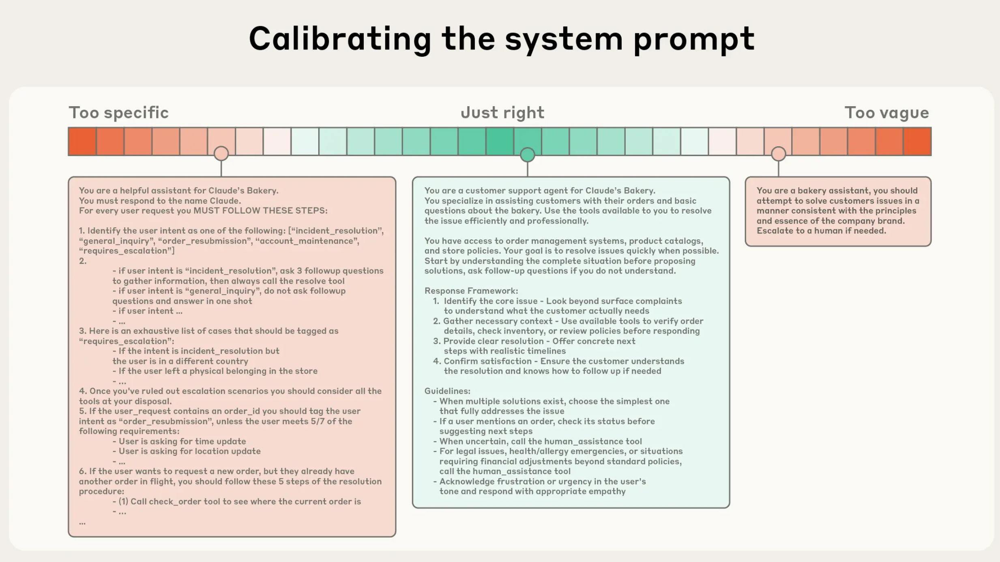

# 背景

要让智能体在真实复杂场景中稳定地“思考”与“行动”，仅有记忆与检索还不够——我们**需要一套工程化方法，持续、系统地为模型构造恰当的“上下文”**。

**上下文工程（Context Engineering）**：**关注的是“在每一次模型调用前，如何以可复用、可度量、可演进的方式，拼装并优化输入上下文”，从而提升正确性、鲁棒性与效率**

在HelloAgents框架中**新增了上下文构建器和两个配套工具**：

- **ContextBuilder** (`hello_agents/context/builder.py`)：**上下文构建器**，**实现 GSSC (Gather-Select-Structure-Compress) 流水线，提供统一的上下文管理接口**
- **NoteTool** (`hello_agents/tools/builtin/note_tool.py`)：结构化笔记工具，**支持智能体进行持久化记忆管理**
- **TerminalTool** (`hello_agents/tools/builtin/terminal_tool.py`)：终端工具，**支持智能体进行文件系统操作和即时上下文检索**

**这些组件共同构成了完整的上下文工程解决方案，是实现长时程任务管理和智能体式搜索的关键**，将在后续章节中详细介绍。

# 什么是上下文工程

上下文工程（Context Engineering）

- 所谓“**上下文”，是指在对大语言模型（LLM）进行采样时所包含的那组 tokens**。
- 手头的**工程问题**，是在 LLM 的固有约束之下，**优化这些 tokens 的效用** ，以便稳定地得到预期结果。

**在任何一次调用时，都要审视 LLM 可见的整体状态，并预判这种状态可能诱发的行为**。

本节将探讨正在兴起的上下文工程，并给出一个**用于构建可调控、有效 智能体的精炼心智模型**。

# 上下文工程 vs. 提示工程

在现在前沿模型厂商的视角中，上下文工程是提示工程的自然演进。

**提示工程关注如何编写与组织 LLM 的指令以获得更优结果**（例如系统提示的写法与结构化策略）

而**上下文工程则是 在推理阶段，如何策划与维护“最优的信息集合（tokens）”**，其中**不仅包含提示本身，还包含其他会进入上下文窗口的一切信息**。

**提示工程的核心是“如何写出有效提示”，尤其是系统提示**。

然而，随着我们开始工程化地构建更强的智能体，它们**在更长的时间范围内、跨多次推理轮次地工作**，我们就**需要能管理 整个上下文状态**的策略——其中**包括系统指令、工具、MCP（Model Context Protocol）、外部数据、消息历史**等。

一个**循环运行的智能体，会不断产生下一轮推理可能相关的数据**，这些信息必须被 **周期性地提炼**。

因此，上下文工程的“艺与术”，在于从持续扩张的“候选信息宇宙”中，**甄别哪些内容应当进入有限的上下文窗口**。



# 上下文工程重要性

LLM 和人类一样，在一定点上会“走神”或“混乱”。

**针堆找针（needle-in-a-haystack）** 类基准揭示了一个现象：**上下文腐蚀（context rot）**

> **随着上下文窗口中的 tokens 增加，模型从上下文中准确回忆信息的能力反而下降**。

因此：**上下文必须被视作一种有限资源，且具有边际收益递减**。

> 就像人类有有限的工作记忆容量一样，LLM 也有一笔“注意力预算”。
>
> 每新增一个 token，都会消耗这笔预算的一部分，因此我们更需要谨慎地筛选哪些 tokens 应该被提供给 LLM。

**本质原因：LLM 的架构约束**

- **Transformer 让每个 token 能够与上下文中的 所有 token 建立关联**，理论上形成 \(n^2\) 级别的**两两注意力关系**。
- 随着**上下文长度增长，模型对这些两两关系的建模能力会被“拉薄”**，从而自然地**产生“上下文规模”与“注意力集中度”的张力**。
- 此外，**模型的注意力模式来源于训练数据分布**
  - 短序列通常比长序列更常见，因此模型对“全上下文依赖”的经验更少、专门参数也更少。
  - 诸如**位置编码插值（position encoding interpolation）**等技术可以**让模型在推理时“适配”比训练期更长的序列，但会牺牲部分对 token 位置的精确理解**。
- 总体上，这些因素共同形成的是一个 **性能梯度：模型在长上下文下依旧强大，但相较短上下文，在信息检索与长程推理上的精度会有所下降。**

所以 **有意识的上下文工程** 就成为构建强健智能体的必需品。

# 上下文工程思路

## 1、组件开展工程化建设

在“有限注意力预算”的约束下，优秀的上下文工程目标是：**用尽可能少、但高信号密度的 tokens，最大化获得期望结果的概率**。

落实到实践中，我们建议围绕以下组件开展工程化建设：

- **系统提示（System Prompt）**：语言清晰、直白，信息层级**把握在“刚刚好”的高度**。常见**两极误区**：

  - **过度硬编码**：在提示中写入**复杂、脆弱的 if-else 逻辑**，长期维护成本高、易碎。
  - **过于空泛**：只给出宏观目标与泛化指引，**缺少对期望输出的 具体信号 或假定了错误的“共享上下文”**。
    - 建议将**提示分区组织**（如 <background_information>、`<instructions>`、工具指引、输出描述等），用 XML/Markdown 分隔。
    - 无论格式如何，追求的是能完整勾勒期望行为的 **“最小必要信息集”(“最小”并不等于“最短”）** 。
    - 先用最好的模型**在最小提示上试跑**，再依据失败模式增补清晰的指令与示例。
- **工具（Tools）**：工具定义了智能体与信息/行动空间的契约，必须促进效率：既要返回 **token 友好**的信息，又要鼓励高效的智能体行为。

  - **工具应当**：
    - **职责单一**、相互低重叠，接口语义清晰；
    - **对错误鲁棒**；
    - **入参描述明确、无歧义**，充分发挥模型擅长的表达与推理能力。
  - 常见失败模式是“臃肿工具集”：功能边界模糊，导致“选哪个工具”这一决策本身就含混不清。
    - 如果人类工程师都说不准用哪个工具，别指望智能体做得更好。
  - **精心甄别一个“最小可行工具集（MVTS）”** 往往能显著提升长期交互中的稳定性与可维护性。
- **示例（Few-shot）**：始终**推荐提供示例，但不建议把“所有边界条件”的罗列一股脑塞进提示**。请精挑细选一组**多样且典型** 的示例，直接画像“期望行为”。对 LLM 而言，**好的示例胜过千言万语**。

**总的指导思想是：信息充分但紧致** 。


如图所示，是进入运行时的动态检索。



## 2、上下文检索与智能体式搜索

**智能体 = 在循环中自主调用工具的 LLM**

### 存储效率

随着**底层模型能力增强，智能体的自治水平便可提升**：更能**独立探索复杂问题空间，并从错误中恢复**。

工程实践正在从“**推理前一次性检索（embedding 检索）”逐步过渡到“及时（Just-in-time, JIT）上下文**

**JIT不再预先加载所有相关数据**，而是维护 **轻量化引用** （文件路径、存储查询、URL 等），**在运行时通过工具动态加载所需数据**。

> 可**让模型撰写针对性查询、缓存必要结果**，并用诸如**head、tail  之类的命令分析大体量数据**——无需把整块数据一次性塞入上下文。

### 数据本身

**引用的元数据** 本身也能**帮助精化行为**：目录层级、命名约定、时间戳等都在隐含地传达“目的与时效”。

> 例如，tests/test_utils.py 与 src/core/test_utils.py 的语义暗示就不同

### 渐进式披露

**允许智能体自主导航与检索**还能**实现 渐进式披露（progressive disclosure）：**每**一步交互都会产生新的上下文，反过来指导下一步决策**

- 文件大小暗示复杂度
- 命名暗示用途
- 时间戳暗示相关性。

**智能体得以按层构建理解**，只在工作记忆中**保留“当前必要子集”**，并用“记笔记”的方式做**补充持久化，从而维持聚焦而非“被大而全拖垮”**。

### 不合理导致问题

**运行时探索往往比预计算检索更慢**，并且**需要有“主见”的工程设计来确保**模型**拥有正确的工具与启发式**。

**如果缺少引导，智能体可能会误用工具、追逐死胡同或错过关键信息，造成上下文浪费**。

### 推荐策略

在不少场景中，**混合策略** 更有效**：前置加载少量“高价值”上下文以保证速度，然后允许智能体按需继续自主探索**。

**边界的选择取决于任务动态性与时效要求**。

在**工程上**，可以**预先放入类似“项目约定说明（如 README/指南）”的文件，同时提供glob 、grep  等原语**，让**智能体即时检索具体文件**，从而绕开过时索引与复杂语法树的沉没成本。

## 3、面向长时程任务的上下文工程

**长时程任务：** 要求**智能体在超出上下文窗口的长序列行动中**，仍能保**持连贯性、上下文一致与目标导向**。

> 例如大型代码库迁移、跨数小时的系统性研究。


**无限增大上下文窗口并不能根治“上下文污染”与相关性退化的问题**，因此需要直接面向这些约束的工程手段：

- 压缩整合（Compaction）
- 结构化笔记（Structured note-taking）
- 子代理架构（Sub-agent architectures）


即便模型能力持续提升，**“在长交互中维持连贯性与聚焦”仍是构建强健智能体的核心挑战**。

谨慎而系统的上下文工程将长期保持其关键价值。

### 压缩整合（Compaction）


定义：当**对话接近上下文上限时，对其进行高保真总结**，并**用该摘要重启一个新的上下文窗口，以维持长程连贯性**。

实践：

- **让模型压缩并保留**架构性决策、未解决缺陷、实现细节，丢弃重复的工具输出与噪声；
- **新窗口携带**压缩摘要 + 最近少量高相关工件（如“最近访问的若干文件”）。

调参建议：

1. **先优化召回 （确保不遗漏关键信息），**
2. **再优化精确度（剔除冗余内容）**；

一种安全的“轻触式”压缩是**对“深历史中的工具调用与结果”进行清理**

### 结构化笔记（Structured note-taking）


**定义：也称“智能体记忆”**。智能体**以固定频率将关键信息写入上下文外的持久化存储** ，在**后续阶段按需拉回**。

**价值：以极低的上下文开销维持持久状态与依赖关系**。

- 例如维护 TODO 列表、项目 NOTES.md、关键结论/依赖/阻塞项的索引，
- 跨数十次工具调用与多轮上下文重置仍能保持进度与一致性。

**说明：在非编码场景中同样有效**（如长期策略性任务、游戏/仿真中的目标管理与统计计数）。

结合后之前说的**MemoryTool，可轻松实现文件式/向量式的外部记忆并在运行时检索**。


### 子代理架构（Sub-agent architectures）


思想：由**主代理负责高层规划与综合，多个专长子代理在“干净的上下文窗口”中各自深挖、调用工具并探索**，最后仅**回传凝练摘要** （常见 1,000–2,000 tokens）。

**好处：实现关注点分离**。

- **庞杂的搜索上下文留在子代理内部**，
- **主代理专注于整合与推理**；
- 适合**需要并行探索的复杂研究/分析任务**。

经验：公开的多智能体研究系统显示，**该模式在复杂研究任务上相较单代理基线具有显著优势**。

### 选择建议

方法取舍可以遵循以下经验法则：

- **压缩整合** ：适合需要**长对话连续性**的任务，**强调上下文的“接力”**。
- **结构化笔记** ：适合有里程碑/阶段性成果的**迭代式开发与研究**。
- **子代理架构** ：适合**复杂研究与分析，能从并行探索中获益**。

# 上下文实践：ContextBuilder

ContextBuilder 的**设计理念是"简单高效"**，去除不必要的复杂性，**统一以"相关性+新近性"的分数进行选择**，符合 Agent 模块化与可维护性的工程取向。

## 设计目标

在构建 ContextBuilder 之前，我们首先需要**明确其设计目标和核心价值**


一个优秀的上下文管理系统应该**解决以下几个关键问题**：

1. **统一入口**：

   * 将"**获取(Gather)- 选择(Select)- 结构化(Structure)- 压缩(Compress)**"**抽象为可复用流水线**，减少在 Agent 实现中的重复模板代码。
   * 这种统一的接口设计**让开发者无需在每个 Agent 中重复编写上下文管理逻辑**。
2. **稳定形态** ：**输出固定骨架的上下文模板，便于调试、A/B 测试与评估**。我们采用了分区组织的模板结构：

   - `[Role & Policies]`：明确 Agent 的角色定位和行为准则
   - `[Task]`：当前需要完成的具体任务
   - `[State]`：Agent 的当前状态和上下文信息
   - `[Evidence]`：从外部知识库检索的证据信息
   - `[Context]`：历史对话和相关记忆
   - `[Output]`：期望的输出格式和要求
3. **预算守护** ：**在 token 预算内尽量保留高价值信息**，对**超限上下文提供兜底压缩策略**。

   * 这确保了即使在信息量巨大的场景下，系统也能稳定运行。
4. **最小规则**：**不引入来源/优先级等分类维度，避免复杂度增长**。

   * 实践表明，**基于相关性和新近性的简单评分机制，在大多数场景下已经足够有效**。

## 核心数据结构

ContextBuilder 的实现依赖两个核心数据结构，它们定义了系统的配置和信息单元。

- **ContextPacket：候选信息包**
- **ContextConfig：配置管理**


### ContextPacket

**`ContextPacket` 是系统中信息的基本单元**。

每个候选信息都会被封装为一个 ContextPacket，**包含内容、时间戳、token 数量和相关性分数等核心属性**。

这种统一的数据结构简化了后续的选择和排序逻辑。

```python
from dataclasses import dataclass
from typing import Optional, Dict, Any
from datetime import datetime

@dataclass
class ContextPacket:
    """候选信息包

    Attributes:
        content: 信息内容
        timestamp: 时间戳
        token_count: Token 数量
        relevance_score: 相关性分数(0.0-1.0)
        metadata: 可选的元数据
    """
    content: str
    timestamp: datetime
    token_count: int
    relevance_score: float = 0.5
    metadata: Optional[Dict[str, Any]] = None

    def __post_init__(self):
        """初始化后处理"""
        if self.metadata is None:
            self.metadata = {}
        # 确保相关性分数在有效范围内
        self.relevance_score = max(0.0, min(1.0, self.relevance_score))

```

### ContextConfig

**`ContextConfig` 封装了所有可配置的参数**，使得系统行为可以灵活调整。

特别值得注意的是 **`reserve_ratio` 参数，它确保系统指令等关键信息始终有足够的空间，不会被其他信息挤占**。

```python
@dataclass
class ContextConfig:
    """上下文构建配置

    Attributes:
        max_tokens: 最大 token 数量
        reserve_ratio: 为系统指令预留的比例(0.0-1.0)
        min_relevance: 最低相关性阈值
        enable_compression: 是否启用压缩
        recency_weight: 新近性权重(0.0-1.0)
        relevance_weight: 相关性权重(0.0-1.0)
    """
    max_tokens: int = 3000
    reserve_ratio: float = 0.2
    min_relevance: float = 0.1
    enable_compression: bool = True
    recency_weight: float = 0.3
    relevance_weight: float = 0.7

    def __post_init__(self):
        """验证配置参数"""
        assert 0.0 <= self.reserve_ratio <= 1.0, "reserve_ratio 必须在 [0, 1] 范围内"
        assert 0.0 <= self.min_relevance <= 1.0, "min_relevance 必须在 [0, 1] 范围内"
        assert abs(self.recency_weight + self.relevance_weight - 1.0) < 1e-6, \
            "recency_weight + relevance_weight 必须等于 1.0"

```

## GSSC 流水线

ContextBuilder 的核心是 **GSSC(Gather-Select-Structure-Compress)流水线，它将上下文构建过程分解为四个清晰的阶段**。

让我们深入了解每个阶段的实现细节。

- Gather：多源信息汇集
- Select：智能信息选择
- Structure：结构化输出
- Compress：兜底压缩


### Gather：多源信息汇集

**第一阶段是从多个来源汇集候选信息**。

这个阶段的**关键在于容错性和灵活性**。

几个重要的设计考虑：

- **容错机制**：每个外部数据源的调用都被 **try-except 包裹，确保单个源的失败不会影响整体流程**
- **优先级处理** ：**系统指令被标记为高优先级**，确保始终被保留
- **历史限制** ：**对话历史只保留最近的几条**，避免上下文窗口被历史信息占据

```python
def _gather(
    self,
    user_query: str,
    conversation_history: Optional[List[Message]] = None,
    system_instructions: Optional[str] = None,
    custom_packets: Optional[List[ContextPacket]] = None
) -> List[ContextPacket]:
    """汇集所有候选信息

    Args:
        user_query: 用户查询
        conversation_history: 对话历史
        system_instructions: 系统指令
        custom_packets: 自定义信息包

    Returns:
        List[ContextPacket]: 候选信息列表
    """
    packets = []

    # 1. 添加系统指令(最高优先级,不参与评分)
    if system_instructions:
        packets.append(ContextPacket(
            content=system_instructions,
            timestamp=datetime.now(),
            token_count=self._count_tokens(system_instructions),
            relevance_score=1.0,  # 系统指令始终保留
            metadata={"type": "system_instruction", "priority": "high"}
        ))

    # 2. 从记忆系统检索相关记忆
    if self.memory_tool:
        try:
            memory_results = self.memory_tool.run({
                "action": "search",
                "query": user_query,
                "limit": 10,
                "min_importance": 0.3
            })
            # 解析记忆结果并转换为 ContextPacket
            memory_packets = self._parse_memory_results(memory_results, user_query)
            packets.extend(memory_packets)
        except Exception as e:
            print(f"[WARNING] 记忆检索失败: {e}")

    # 3. 从 RAG 系统检索相关知识
    if self.rag_tool:
        try:
            rag_results = self.rag_tool.run({
                "action": "search",
                "query": user_query,
                "limit": 5,
                "min_score": 0.3
            })
            # 解析 RAG 结果并转换为 ContextPacket
            rag_packets = self._parse_rag_results(rag_results, user_query)
            packets.extend(rag_packets)
        except Exception as e:
            print(f"[WARNING] RAG 检索失败: {e}")

    # 4. 添加对话历史(仅保留最近的 N 条)
    if conversation_history:
        recent_history = conversation_history[-5:]  # 默认保留最近 5 条
        for msg in recent_history:
            packets.append(ContextPacket(
                content=f"{msg.role}: {msg.content}",
                timestamp=msg.timestamp if hasattr(msg, 'timestamp') else datetime.now(),
                token_count=self._count_tokens(msg.content),
                relevance_score=0.6,  # 历史消息的基础相关性
                metadata={"type": "conversation_history", "role": msg.role}
            ))

    # 5. 添加自定义信息包
    if custom_packets:
        packets.extend(custom_packets)

    print(f"[ContextBuilder] 汇集了 {len(packets)} 个候选信息包")
    return packets

```


### Select：智能信息选择

第二阶段是根**据相关性和新近性对候选信息进行评分和选择**。

这是整个流水线的**核心，直接决定了最终上下文的质量**。


体现了几个重要的工程考量：

- **评分机制** ：采用**相关性和新近性的加权组合**，权重可配置
- **贪心算法** ：按**分数从高到低填充**，确保在**有限预算内选择最有价值**的信息
- **过滤机制**：通过 `min_relevance` 参数**过滤低质量信息**

```python
def _select(
    self,
    packets: List[ContextPacket],
    user_query: str,
    available_tokens: int
) -> List[ContextPacket]:
    """选择最相关的信息包

    Args:
        packets: 候选信息包列表
        user_query: 用户查询(用于计算相关性)
        available_tokens: 可用的 token 数量

    Returns:
        List[ContextPacket]: 选中的信息包列表
    """
    # 1. 分离系统指令和其他信息
    system_packets = [p for p in packets if p.metadata.get("type") == "system_instruction"]
    other_packets = [p for p in packets if p.metadata.get("type") != "system_instruction"]

    # 2. 计算系统指令占用的 token
    system_tokens = sum(p.token_count for p in system_packets)
    remaining_tokens = available_tokens - system_tokens

    if remaining_tokens <= 0:
        print("[WARNING] 系统指令已占满所有 token 预算")
        return system_packets

    # 3. 为其他信息计算综合分数
    scored_packets = []
    for packet in other_packets:
        # 计算相关性分数(如果尚未计算)
        if packet.relevance_score == 0.5:  # 默认值,需要重新计算
            relevance = self._calculate_relevance(packet.content, user_query)
            packet.relevance_score = relevance

        # 计算新近性分数
        recency = self._calculate_recency(packet.timestamp)

        # 综合分数 = 相关性权重 × 相关性 + 新近性权重 × 新近性
        combined_score = (
            self.config.relevance_weight * packet.relevance_score +
            self.config.recency_weight * recency
        )

        # 过滤低于最小相关性阈值的信息
        if packet.relevance_score >= self.config.min_relevance:
            scored_packets.append((combined_score, packet))

    # 4. 按分数降序排序
    scored_packets.sort(key=lambda x: x[0], reverse=True)

    # 5. 贪心选择:按分数从高到低填充,直到达到 token 上限
    selected = system_packets.copy()
    current_tokens = system_tokens

    for score, packet in scored_packets:
        if current_tokens + packet.token_count <= available_tokens:
            selected.append(packet)
            current_tokens += packet.token_count
        else:
            # Token 预算已满,停止选择
            break

    print(f"[ContextBuilder] 选择了 {len(selected)} 个信息包,共 {current_tokens} tokens")
    return selected

def _calculate_relevance(self, content: str, query: str) -> float:
    """计算内容与查询的相关性

    使用简单的关键词重叠算法。在生产环境中,可以替换为向量相似度计算。

    Args:
        content: 内容文本
        query: 查询文本

    Returns:
        float: 相关性分数(0.0-1.0)
    """
    # 分词(简单实现,可以使用更复杂的分词器)
    content_words = set(content.lower().split())
    query_words = set(query.lower().split())

    if not query_words:
        return 0.0

    # Jaccard 相似度
    intersection = content_words & query_words
    union = content_words | query_words

    return len(intersection) / len(union) if union else 0.0

def _calculate_recency(self, timestamp: datetime) -> float:
    """计算时间近因性分数

    使用指数衰减模型,24小时内保持高分,之后逐渐衰减。

    Args:
        timestamp: 信息的时间戳

    Returns:
        float: 新近性分数(0.0-1.0)
    """
    import math

    age_hours = (datetime.now() - timestamp).total_seconds() / 3600

    # 指数衰减:24小时内保持高分,之后逐渐衰减
    decay_factor = 0.1  # 衰减系数
    recency_score = math.exp(-decay_factor * age_hours / 24)

    return max(0.1, min(1.0, recency_score))  # 限制在 [0.1, 1.0] 范围内

```

### Structure：结构化输出

第三阶段是**将选中的信息组织成结构化的上下文模板**。


结构化阶段将散乱的信息包组织成清晰的分区，这种设计有几个优势：

- **可读性**：清晰的分区让人类和模型都更容易理解上下文结构
- **可调试性**：问题定位更容易，可以快速识别哪个区域的信息有问题
- **可扩展性**：添加新的信息源只需要创建新的分区

```python
def _structure(self, selected_packets: List[ContextPacket], user_query: str) -> str:
    """将选中的信息包组织成结构化的上下文模板

    Args:
        selected_packets: 选中的信息包列表
        user_query: 用户查询

    Returns:
        str: 结构化的上下文字符串
    """
    # 按类型分组
    system_instructions = []
    evidence = []
    context = []

    for packet in selected_packets:
        packet_type = packet.metadata.get("type", "general")

        if packet_type == "system_instruction":
            system_instructions.append(packet.content)
        elif packet_type in ["rag_result", "knowledge"]:
            evidence.append(packet.content)
        else:
            context.append(packet.content)

    # 构建结构化模板
    sections = []

    # [Role & Policies]
    if system_instructions:
        sections.append("[Role & Policies]\n" + "\n".join(system_instructions))

    # [Task]
    sections.append(f"[Task]\n{user_query}")

    # [Evidence]
    if evidence:
        sections.append("[Evidence]\n" + "\n---\n".join(evidence))

    # [Context]
    if context:
        sections.append("[Context]\n" + "\n".join(context))

    # [Output]
    sections.append("[Output]\n请基于以上信息,提供准确、有据的回答。")

    return "\n\n".join(sections)

```


### Compress：兜底压缩

第四阶段是对**超限上下文进行压缩处理**

压缩阶段的设计体现了"**保持结构完整性**"的原则，**即使在 token 预算紧张的情况下，也要尽量保留每个分区的关键信息**。

```python
def _compress(self, context: str, max_tokens: int) -> str:
    """压缩超限的上下文

    Args:
        context: 原始上下文
        max_tokens: 最大 token 限制

    Returns:
        str: 压缩后的上下文
    """
    current_tokens = self._count_tokens(context)

    if current_tokens <= max_tokens:
        return context  # 无需压缩

    print(f"[ContextBuilder] 上下文超限({current_tokens} > {max_tokens}),执行压缩")

    # 分区压缩:保持结构完整性
    sections = context.split("\n\n")
    compressed_sections = []
    current_total = 0

    for section in sections:
        section_tokens = self._count_tokens(section)

        if current_total + section_tokens <= max_tokens:
            # 完整保留
            compressed_sections.append(section)
            current_total += section_tokens
        else:
            # 部分保留
            remaining_tokens = max_tokens - current_total
            if remaining_tokens > 50:  # 至少保留 50 tokens
                # 简单截断(生产环境中可以使用 LLM 摘要)
                truncated = self._truncate_text(section, remaining_tokens)
                compressed_sections.append(truncated + "\n[... 内容已压缩 ...]")
            break

    compressed_context = "\n\n".join(compressed_sections)
    final_tokens = self._count_tokens(compressed_context)
    print(f"[ContextBuilder] 压缩完成: {current_tokens} -> {final_tokens} tokens")

    return compressed_context

def _truncate_text(self, text: str, max_tokens: int) -> str:
    """截断文本到指定 token 数量

    Args:
        text: 原始文本
        max_tokens: 最大 token 数量

    Returns:
        str: 截断后的文本
    """
    # 简单实现:按字符比例估算
    # 生产环境中应该使用精确的 tokenizer
    char_per_token = len(text) / self._count_tokens(text) if self._count_tokens(text) > 0 else 4
    max_chars = int(max_tokens * char_per_token)

    return text[:max_chars]

def _count_tokens(self, text: str) -> int:
    """估算文本的 token 数量

    Args:
        text: 文本内容

    Returns:
        int: token 数量
    """
    # 简单估算:中文 1 字符 ≈ 1 token,英文 1 单词 ≈ 1.3 tokens
    # 生产环境中应该使用实际的 tokenizer
    chinese_chars = sum(1 for ch in text if '\u4e00' <= ch <= '\u9fff')
    english_words = len([w for w in text.split() if w])

    return int(chinese_chars + english_words * 1.3)

```


## 使用示例

通过一个完整的示例，展示如何在实际项目中使用 ContextBuilder。

### 基础使用


这个结构化的上下文包含了所有必要的信息：

- [Role & Policies]：明确了 AI 的角色和回答要求
- [Task]：清晰地表达了用户的问题
- [Evidence]：从 RAG 系统检索的相关知识
- [Context]：对话历史和相关记忆，提供了充分的背景信息
- [Output]：指导 LLM 如何组织回

```python
from hello_agents.context import ContextBuilder, ContextConfig
from hello_agents.tools import MemoryTool, RAGTool
from hello_agents.core.message import Message
from datetime import datetime

# 1. 初始化工具
memory_tool = MemoryTool(user_id="user123")
rag_tool = RAGTool(knowledge_base_path="./knowledge_base")

# 2. 创建 ContextBuilder
config = ContextConfig(
    max_tokens=3000,
    reserve_ratio=0.2,
    min_relevance=0.2,
    enable_compression=True
)

builder = ContextBuilder(
    memory_tool=memory_tool,
    rag_tool=rag_tool,
    config=config
)

# 3. 准备对话历史
conversation_history = [
    Message(content="我正在开发一个数据分析工具", role="user", timestamp=datetime.now()),
    Message(content="很好!数据分析工具通常需要处理大量数据。您计划使用什么技术栈?", role="assistant", timestamp=datetime.now()),
    Message(content="我打算使用Python和Pandas,已经完成了CSV读取模块", role="user", timestamp=datetime.now()),
    Message(content="不错的选择!Pandas在数据处理方面非常强大。接下来您可能需要考虑数据清洗和转换。", role="assistant", timestamp=datetime.now()),
]

# 4. 添加一些记忆
memory_tool.run({
    "action": "add",
    "content": "用户正在开发数据分析工具,使用Python和Pandas",
    "memory_type": "semantic",
    "importance": 0.8
})

memory_tool.run({
    "action": "add",
    "content": "已完成CSV读取模块的开发",
    "memory_type": "episodic",
    "importance": 0.7
})

# 5. 构建上下文
context = builder.build(
    user_query="如何优化Pandas的内存占用?",
    conversation_history=conversation_history,
    system_instructions="你是一位资深的Python数据工程顾问。你的回答需要:1) 提供具体可行的建议 2) 解释技术原理 3) 给出代码示例"
)

print("=" * 80)
print("构建的上下文:")
print("=" * 80)
print(context)
print("=" * 80)

```


### 与 Agent 集成

将 ContextBuilder 集成到 Agent 中：

通过这种方式，**ContextBuilder 成为了 Agent 的"上下文管理大脑"，自动处理信息的收集、筛选和组织，让 Agent 始终能够在最优的上下文下进行推理和生成**。

```python
from hello_agents import SimpleAgent, HelloAgentsLLM, ToolRegistry
from hello_agents.context import ContextBuilder, ContextConfig
from hello_agents.tools import MemoryTool, RAGTool

class ContextAwareAgent(SimpleAgent):
    """具有上下文感知能力的 Agent"""

    def __init__(self, name: str, llm: HelloAgentsLLM, **kwargs):
        super().__init__(name=name, llm=llm, system_prompt=kwargs.get("system_prompt", ""))

        # 初始化上下文构建器
        self.memory_tool = MemoryTool(user_id=kwargs.get("user_id", "default"))
        self.rag_tool = RAGTool(knowledge_base_path=kwargs.get("knowledge_base_path", "./kb"))

        self.context_builder = ContextBuilder(
            memory_tool=self.memory_tool,
            rag_tool=self.rag_tool,
            config=ContextConfig(max_tokens=4000)
        )

        self.conversation_history = []

    def run(self, user_input: str) -> str:
        """运行 Agent,自动构建优化的上下文"""

        # 1. 使用 ContextBuilder 构建优化的上下文
        optimized_context = self.context_builder.build(
            user_query=user_input,
            conversation_history=self.conversation_history,
            system_instructions=self.system_prompt
        )

        # 2. 使用优化后的上下文调用 LLM
        messages = [
            {"role": "system", "content": optimized_context},
            {"role": "user", "content": user_input}
        ]
        response = self.llm.invoke(messages)

        # 3. 更新对话历史
        from hello_agents.core.message import Message
        from datetime import datetime

        self.conversation_history.append(
            Message(content=user_input, role="user", timestamp=datetime.now())
        )
        self.conversation_history.append(
            Message(content=response, role="assistant", timestamp=datetime.now())
        )

        # 4. 将重要交互记录到记忆系统
        self.memory_tool.run({
            "action": "add",
            "content": f"Q: {user_input}\nA: {response[:200]}...",  # 摘要
            "memory_type": "episodic",
            "importance": 0.6
        })

        return response

# 使用示例
agent = ContextAwareAgent(
    name="数据分析顾问",
    llm=HelloAgentsLLM(),
    system_prompt="你是一位资深的Python数据工程顾问。",
    user_id="user123",
    knowledge_base_path="./data_science_kb"
)

response = agent.run("如何优化Pandas的内存占用?")
print(response)

```

## 最佳实践与优化建议


下几点最佳实践值得注意：

1. **动态调整 token 预算** ：根据任务复杂度动态调整 `max_tokens`，简单任务使用较小预算，复杂任务增加预算。
2. **相关性计算优化**：在生产环境中，将简单的关键词重叠替换为向量相似度计算，提升检索质量。
3. **缓存机制**：对于不变的系统指令和知识库内容，可以实现缓存机制，避免重复计算。
4. **监控与日志**：记录每次上下文构建的统计信息(选中信息数量、token 使用率等)，便于后续优化。
5. **A/B 测试**：对于关键参数(如相关性权重、新近性权重)，**通过 A/B 测试找到最优配置。**
