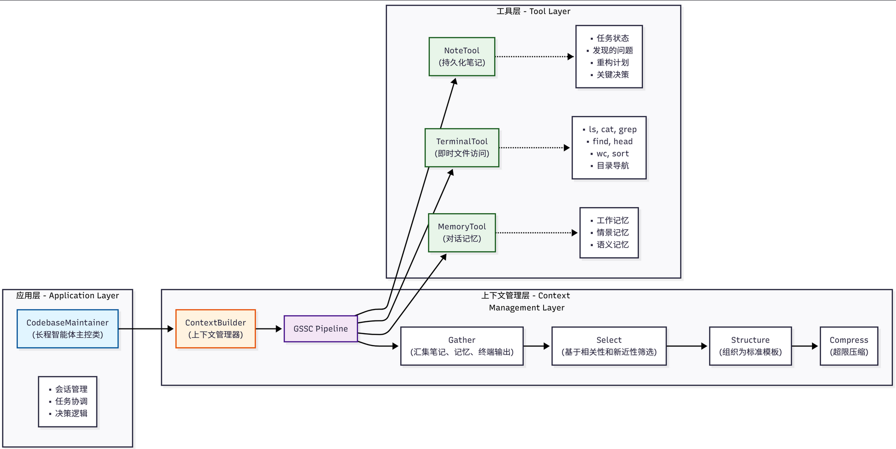

# 目标

**将 ContextBuilder、NoteTool 和 TerminalTool 整合**起来，构建一个完整的长程智能体——代码库维护助手

这个助手能够：

1. 探索和理解代码库结构
2. 记录发现的问题和改进点
3. 追踪长期的重构任务
4. 在上下文窗口限制下保持连贯性

# 业务场景

假设我们正在维护一个中型 Python Web 应用，这个代码库包含约 50 个 Python 文件，使用 Flask 框架构建，涵盖数据模型、业务逻辑、API 接口等多个模块，同时存在一些技术债务需要逐步清理。

在这样的场景下，我们需要一个**智能助手来帮助我们探索代码库**，

- **理解项目结构、依赖关系和代码风格**；
- **识别代码中的问题**，比如代码重复、复杂度过高、缺少测试等；
- 追踪任务进度，记录待办事项、已完成工作和遇到的阻塞；
- 并基于历史上下文提供连贯的重构建议。

# 挑战与解决方案

这个场景面临几个典型的长程任务挑战。

- 首先是**信息量超出上下文窗口**的问题，整个代码库可能包含数万行代码，无法一次性放入上下文窗口，我们通过**使用 TerminalTool 进行即时、按需的代码探索来解决**这个问题，只在需要时查看具体文件。
- 其次是**跨会话的状态管理挑战**，重构任务可能持续数天，需要跨多个会话保持进度，我们**使用 NoteTool 记录阶段性进展、待办事项和关键决策来应对**。
- 最后是**上下文质量与相关性**的问题，每次对话需要回顾相关的历史信息，但不能被无关信息淹没，我们**通过 ContextBuilder 智能筛选和组织上下文，确保高信号密度**。

# 系统架构设计

代码库维护助手采用三层架构

# 核心实现
