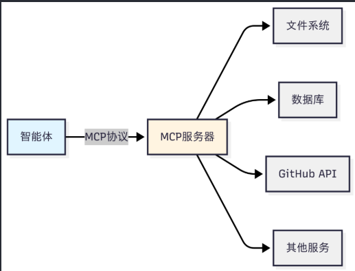
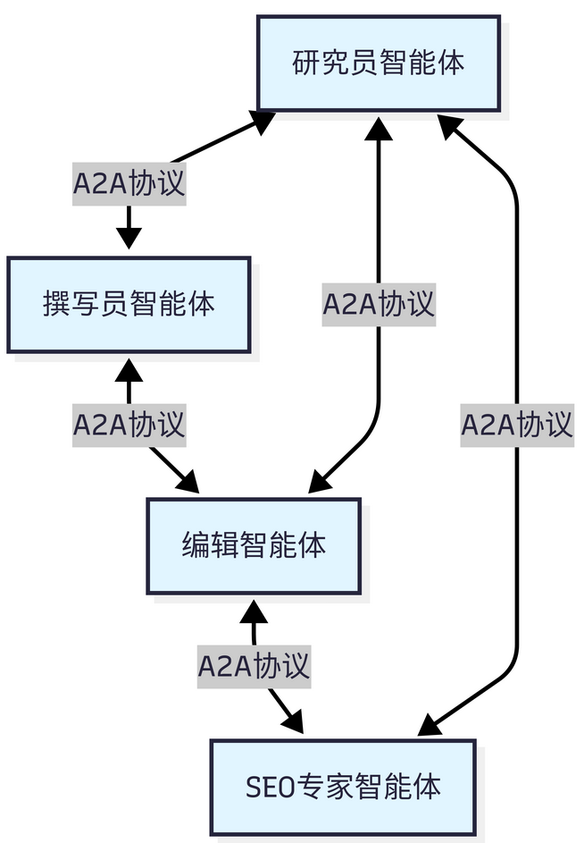
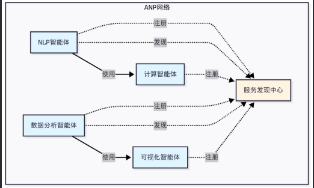
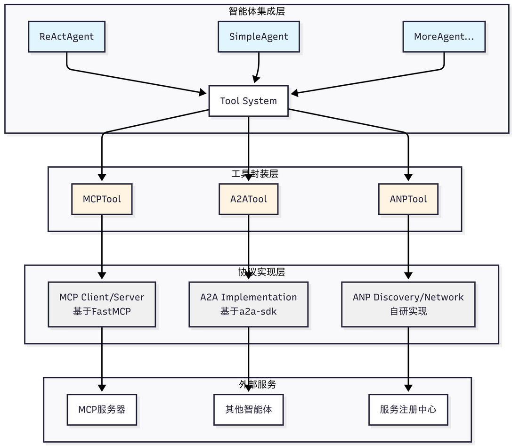

# 目的

如何让智能体与外部世界高效交互？

如何让多个智能体相互协作？

为 HelloAgents 框架引入三种通信协议，共同构成了智能体通信的基础设施层。

- **MCP（Model Context Protocol）**：用于**智能体与工具**的标准化通信，
- **A2A（Agent-to-Agent Protocol）**：用于**智能体间**的点对点协作，
- **ANP（Agent Network Protocol）**：用于构建**大规模智能体网络**。

目标是能拥有在自己项目中应用协议的能力。

# 为何需要通信协议

**工具集成的困境**：每当需要**访问新的外部服务**（如 GitHub API、数据库、文件系统），我们都**必须编写专门的 Tool 类**。这不仅工作量大，而且不同开发者编写的工具无法互相兼容。

**能力扩展的瓶颈** ：智能体的能力被限制在预先定义的工具集内，**无法动态发现和使用新的服务**。

**协作的缺失** ：当任务复杂到需要**多个专业智能体协作时**（如研究员+撰写员+编辑），我们**只能通过手动编排**来协调它们的工作。

假设你要构建一个智能研究助手，它需要：

```python
# 传统方式：手动集成每个服务
class GitHubTool(BaseTool):
    """需要手写GitHub API适配器"""
    def run(self, repo_url):
        # 大量的API调用代码...
        pass

class DatabaseTool(BaseTool):
    """需要手写数据库适配器"""
    def run(self, query):
        # 数据库连接和查询代码...
        pass

class WeatherTool(BaseTool):
    """需要手写天气API适配器"""
    def run(self, location):
        # 天气API调用代码...
        pass

# 每个新服务都需要重复这个过程
agent.add_tool(GitHubTool())
agent.add_tool(DatabaseTool())
agent.add_tool(WeatherTool())
```

这种方式存在明显的问题：

- 代码重复（每个工具都要处理 HTTP 请求、错误处理、认证等），
- 难以维护（API 变更需要修改所有相关工具），
- 无法复用（其他开发者的工具无法直接使用），
- 扩展性差（添加新服务需要大量编码工作）。

**通信协议的核心价值正是解决这些问题**。它提**供了一套标准化的接口规范，让智能体能够以统一的方式访问各种外部服务**，而无需为每个服务编写专门的适配器。

> 这就像互联网的 TCP/IP 协议，它**让不同的设备能够相互通信**，而不需要为每种设备编写专门的通信代码。

# 协议设计理念

以目前业界主流的三种协议 MCP、A2A 和 ANP 为例

## MCP：智能体与工具的桥梁

MCP（Model Context Protocol）

核心设计理念是：**标准化智能体与外部工具/资源的通信方式**

意义：MCP 通过**定义统一的协议规范，让所有服务都能以相同的方式被访问**。

MCP 的设计哲学是"**上下文共享**"。

- 不仅仅是一个 RPC（远程过程调用）协议，
- 更重要的是**它允许智能体和工具之间共享丰富的上下文信息**。

示例如下：当智能体访问一个代码仓库时，MCP 服务器**不仅能提供文件内容**，还能提供代码结构、依赖关系、提交历史等**上下文信息**，让智能体能够做出更智能的决策。



## A2A：智能体间的对话

A2A（Agent-to-Agent Protocol）

核心设计理念是 ：**实现智能体之间的点对点通信**

MCP 关注智能体与工具的通信不同，**A2A 关注的是智能体之间如何相互协作**

意义：让智能体能够**像人类团队一样进行对话、协商和协作**。

A2A 的设计哲学是"**对等通信**"：

- 在 A2A 网络中，**每个智能体既是服务提供者，也是服务消费者**。
- 智能体可以**主动发起请求，也可以响应其他智能体**的请求。
- 设计作用：避免了中心化协调器的瓶颈，让智能体网络更加灵活和可扩展



## ANP：智能体网络的基础设施

ANP（Agent Network Protocol）是一个概念性的协议框架

核心设计理念是：**构建大规模智能体网络的基础设施**

区别：

- MCP 解决的是"**如何访问工具**"，
- A2A 解决的是"**如何与其他智能体对话**"，
- 那么 **ANP 解决的是"如何在大规模网络中发现和连接智能体"**

设计哲学是"**去中心化服务发现**"

- ANP 提供了**服务注册、发现和路由机制**，
- 让智能体能够**动态地发现**网络中的其他服务，而**不需要预先配置所有的连接关系**



## 对比

| 维度     | MCP                           | A2A                    | ANP                        |
| -------- | ----------------------------- | ---------------------- | -------------------------- |
| 设计目标 | 智能体与工具/资源的标准化通信 | 智能体间的点对点通信   | 大规模智能体网络的服务发现 |
| 通信模式 | 客户端-服务器（C/S）          | 对等网络（P2P）        | 对等网络（P2P）            |
| 核心理念 | 上下文共享                    | 对等协作               | 去中心化发现               |
| 适用场景 | 访问外部工具和数据源          | 智能体协作和任务委托   | 大规模智能体生态系统       |
| 扩展性   | 通过添加MCP服务器扩展         | 通过添加智能体节点扩展 | 支持动态扩展               |
| 实现状态 | 已有成熟实现（FastMCP）       | 官方SDK可用            | 概念性框架                 |

## 选择

选择协议的关键在于理解你的需求：

- 如果你的智能体需要**访问外部服务（文件、数据库、API），选择 MCP**
  - MCP 的生态相对成熟，不过各种工具的时效性取决于维护者，更推荐选择大公司背书的 MCP 工具。
- 如果你需要多个**智能体相互协作完成任务，选择 A2A**
- 如果你要构建**大规模的智能体生态系统，考虑 ANP**

# 通信协议架构设计

HelloAgents 的通信协议架构采用三层设计，从底层到上层分别是：协议实现层、工具封装层和智能体集成层。

- **协议实现层：包含了三种协议的具体实现**。
  - MCP 基于 FastMCP 库实现，提供客户端和服务器功能；
  - A2A 基于 Google 官方的 a2a-sdk 实现；
  - ANP 是我们自研的轻量级实现，提供服务发现和网络管理功能，当然目前也有官方的[实现](https://github.com/agent-network-protocol/AgentConnect)，考虑到后期的迭代，因此这里只做概念的模拟。
- **工具封装层：将协议实现封装成统一的 Tool 接口**。
  - MCPTool、A2ATool 和 ANPTool 都继承自 BaseTool，提供一致的 `run()`方法。
  - 让智能体能够以相同的方式使用不同的协议。
- **智能体集成层：是智能体与协议的集成点**。
  - 所有的智能体（ReActAgent、SimpleAgent 等）都通过 Tool System 来使用协议工具，无需关心底层的协议细节。


