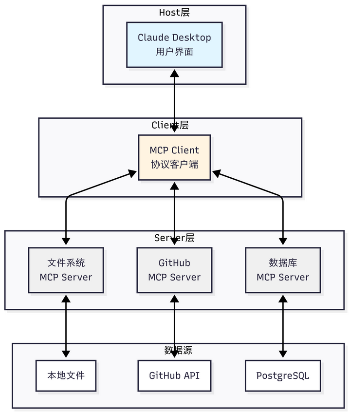
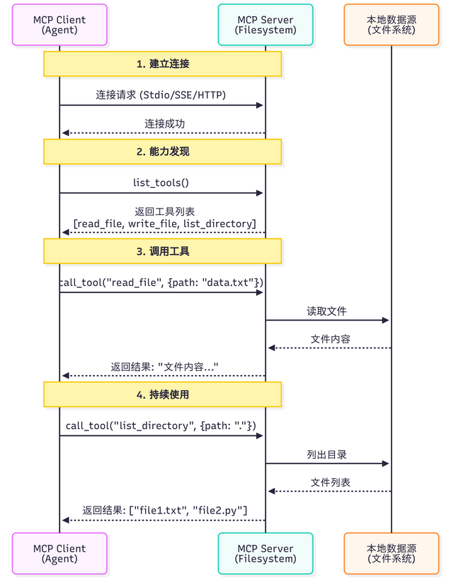

# MCP协议概念介绍

## 智能体的"USB-C"

**MCP 统一了智能体与外部工具的交互方式**。

无论你使用 Claude、GPT 还是其他模型，只要它们支持 MCP 协议，就能无缝访问相同的工具和资源。

## MCP 架构

MCP 协议采用 Host、Client、Servers 三层架构设计，三层架构的职责：

1. **Host（宿主层）**：Claude Desktop 作为 Host，负责**接收用户提问并与 Claude 模型交互**。Host 是**用户直接交互的界面，它管理整个对话流程**。
2. **Client（客户端层）**：当 Claude 模型决定需要访问文件系统时，Host 中内置的 MCP Client 被激活。**Client 负责与适当的 MCP Server 建立连接，发送请求并接收响应**。
3. **Server（服务器层）**：文件系统 MCP Server 被调用，执行实际的文件扫描操作，访问桌面目录，并返回找到的文档列表。

优势：**关注点分离**，开发者只需专注于开发对应的 MCP Server，无需关心 Host 和 Client 的实现细节。

- Host 专注于用户体验
- Client 专注于协议通信
- Server 专注于具体功能实现

完整的交互流程：用户问题 → Claude Desktop(Host) → **Claude 模型分析** → 需要文件信息 → **MCP Client 连接** → **文件系统 MCP Server** → 执行操作 → 返回结果 → Claude 生成回答 → 显示在 Claude Desktop 上



## MCP 的核心能力

MCP 协议提供了三大核心能力，构成完整的工具访问框架：

三种能力的区别在于：

- **Tools 是主动**的（执行操作），
- **Resources 是被动**的 （提供数据），
- **Prompts 是指导性**的（提供模板）

| 能力              | 说明                       | 使用场景             | 示例                          |
| ----------------- | -------------------------- | -------------------- | ----------------------------- |
| Tools (工具）     | 可执行的功能，类似函数调用 | 执行操作、处理数据   | readflesearchcodeendal        |
| Resources（资源） | 可访间的数据，类似文件系统 | 读取数据、订阅变化   | 文件内容、数据库记录、API响应 |
| Prompts（提示）   | 预定义的提示模板           | 标准化任务、最佳实践 | 代码审查提示、文档生成提示    |

## MCP 的工作流程

一个关键问题是：**Claude（或其他 LLM）是如何决定使用哪些工具的**？

当用户提出问题时，完整的工具选择流程如下：

1. **工具发现**阶段：MCP Client 连接到 Server 后，首先调用 `list_tools()`获取所有可用工具的描述信息（包括工具名称、功能说明、参数定义）
2. **上下文构建** ：Client **将工具列表转换为 LLM 能理解的格式，添加到系统提示词中**。例如：

   ```
   你可以使用以下工具：
   - read_file(path: str): 读取指定路径的文件内容
   - search_code(query: str, language: str): 在代码库中搜索
   ```
3. **模型推理**：LLM 分析用户问题和可用工具，决定是否需要调用工具以及调用哪个工具。这个决策基于工具的描述和当前对话上下文
4. **工具执行**：如果 LLM 决定使用工具，Client 通过 MCP Server 执行所选工具，获取结果
5. **结果整合**：工具执行结果被送回给 LLM，LLM 结合结果生成最终回答



这个过程是完全自动化的，LLM 会根据工具描述的质量来决定是否使用以及如何使用工具。

因此，编写清晰、准确的工具描述至关重要。

## MCP 与 Function Calling 的差异

### 区别和联系

Function Calling 与 MCP 并非竞争关系，而是相辅相成的

- **Function Calling 是大语言模型的一项核心能力**，它体现了**模型内在的智能**，使模型能够理解**何时需要调用函数，并精准生成相应的调用参数**。
  - Function Calling 相当于你学会了“如何打电话”这项技能，包括何时拨号、如何与对方沟通、何时挂断。
- **MCP 则扮演着基础设施协议的角色**，它在工程层面**解决了工具与模型如何连接的问**题，通过**标准化的方式来描述和调用工具**。
  - 而 MCP 则是那个全球统一的“电话通信标准”，确保了任何一部电话都能顺利地拨通另一部。

|          |                           |                          |
| -------- | ------------------------- | ------------------------ |
| 维度     | Function Calling          | MCP                      |
| 本质     | LLM的一种能力             | 标准化的通信协议         |
| 作用层级 | 模型层                    | 基础设施层               |
| 解决问题 | 让LLM知道“如何调用函数” | 让工具和模型“如何连接” |
| 标准化   | 每个模型提供商实现不同    | 统一的协议规范           |
| 工具复用 | 需要为每个应用重写        | 社区工具可直接使用       |

### 示例

以智能体需要访问 GitHub 仓库和本地文件系统为例

#### 使用 Function Calling

```python
# 步骤1：为每个LLM提供商定义函数
# OpenAI格式
openai_tools = [
    {
        "type": "function",
        "function": {
            "name": "search_github",
            "description": "搜索GitHub仓库",
            "parameters": {
                "type": "object",
                "properties": {
                    "query": {"type": "string", "description": "搜索关键词"}
                },
                "required": ["query"]
            }
        }
    }
]

# Claude格式
claude_tools = [
    {
        "name": "search_github",
        "description": "搜索GitHub仓库",
        "input_schema": {  # 注意：不是parameters
            "type": "object",
            "properties": {
                "query": {"type": "string", "description": "搜索关键词"}
            },
            "required": ["query"]
        }
    }
]

# 步骤2：自己实现工具函数
def search_github(query):
    import requests
    response = requests.get(
        "https://api.github.com/search/repositories",
        params={"q": query}
    )
    return response.json()

# 步骤3：处理不同模型的响应格式
# OpenAI的响应
if response.choices[0].message.tool_calls:
    tool_call = response.choices[0].message.tool_calls[0]
    result = search_github(**json.loads(tool_call.function.arguments))

# Claude的响应
if response.content[0].type == "tool_use":
    tool_use = response.content[0]
    result = search_github(**tool_use.input)
```

#### 使用 MCP

```python
from hello_agents.protocols import MCPClient

# 步骤1：连接到社区提供的MCP服务器（无需自己实现）
github_client = MCPClient([
    "npx", "-y", "@modelcontextprotocol/server-github"
])

fs_client = MCPClient([
    "npx", "-y", "@modelcontextprotocol/server-filesystem", "."
])

# 步骤2：统一的调用方式（与模型无关）
async with github_client:
    # 自动发现工具
    tools = await github_client.list_tools()

    # 调用工具（标准化接口）
    result = await github_client.call_tool(
        "search_repositories",
        {"query": "AI agents"}
    )

# 步骤3：任何支持MCP的模型都能使用
# OpenAI、Claude、Llama等都使用相同的MCP客户端
```

# 使用 MCP 客户端

基于 FastMCP 2.0 实现了完整的 MCP 客户端功能

提供了异步和同步两种 API，以适应不同的使用场景。

## 连接到 MCP 服务器

MCP 客户端支持多种连接方式，最常用的是 Stdio 模式（通过标准输入输出与本地进程通信）：

```python
import asyncio
from hello_agents.protocols import MCPClient

async def connect_to_server():
    # 方式1：连接到社区提供的文件系统服务器
    # npx会自动下载并运行@modelcontextprotocol/server-filesystem包
    client = MCPClient([
        "npx", "-y",
        "@modelcontextprotocol/server-filesystem",
        "."  # 指定根目录
    ])

    # 使用async with确保连接正确关闭
    async with client:
        # 在这里使用client
        tools = await client.list_tools()
        print(f"可用工具: {[t['name'] for t in tools]}")

    # 方式2：连接到自定义的Python MCP服务器
    client = MCPClient(["python", "my_mcp_server.py"])
    async with client:
        # 使用client...
        pass

# 运行异步函数
asyncio.run(connect_to_server())
```

## 发现可用工具

连接成功后，第一步通常是查询服务器提供了哪些工具：

```python
async def discover_tools():
    client = MCPClient(["npx", "-y", "@modelcontextprotocol/server-filesystem", "."])

    async with client:
        # 获取所有可用工具
        tools = await client.list_tools()

        print(f"服务器提供了 {len(tools)} 个工具：")
        for tool in tools:
            print(f"\n工具名称: {tool['name']}")
            print(f"描述: {tool.get('description', '无描述')}")

            # 打印参数信息
            if 'inputSchema' in tool:
                schema = tool['inputSchema']
                if 'properties' in schema:
                    print("参数:")
                    for param_name, param_info in schema['properties'].items():
                        param_type = param_info.get('type', 'any')
                        param_desc = param_info.get('description', '')
                        print(f"  - {param_name} ({param_type}): {param_desc}")

asyncio.run(discover_tools())

# 输出示例：
# 服务器提供了 5 个工具：
#
# 工具名称: read_file
# 描述: 读取文件内容
# 参数:
#   - path (string): 文件路径
#
# 工具名称: write_file
# 描述: 写入文件内容
# 参数:
#   - path (string): 文件路径
#   - content (string): 文件内容
```

## 调用工具

调用工具时，只需提供工具名称和符合 JSON Schema 的参数：

```python
async def use_tools():
    client = MCPClient(["npx", "-y", "@modelcontextprotocol/server-filesystem", "."])

    async with client:
        # 读取文件
        result = await client.call_tool("read_file", {"path": "my_README.md"})
        print(f"文件内容：\n{result}")

        # 列出目录
        result = await client.call_tool("list_directory", {"path": "."})
        print(f"当前目录文件：{result}")

        # 写入文件
        result = await client.call_tool("write_file", {
            "path": "output.txt",
            "content": "Hello from MCP!"
        })
        print(f"写入结果：{result}")

asyncio.run(use_tools())
```

在这里提供一种更为安全的方式来调用 MCP 服务，可供参考：

```python
async def safe_tool_call():
    client = MCPClient(["npx", "-y", "@modelcontextprotocol/server-filesystem", "."])

    async with client:
        try:
            # 尝试读取可能不存在的文件
            result = await client.call_tool("read_file", {"path": "nonexistent.txt"})
            print(result)
        except Exception as e:
            print(f"工具调用失败: {e}")
            # 可以选择重试、使用默认值或向用户报告错误

asyncio.run(safe_tool_call())
```

## 访问资源

除了工具，MCP 服务器还可以提供资源（Resources）：

```python
# 列出可用资源
resources = client.list_resources()
print(f"可用资源：{[r['uri'] for r in resources]}")

# 读取资源
resource_content = client.read_resource("file:///path/to/resource")
print(f"资源内容：{resource_content}")
```

## 使用提示模板

MCP 服务器可以提供预定义的提示模板（Prompts）：

```python
# 列出可用提示
prompts = client.list_prompts()
print(f"可用提示：{[p['name'] for p in prompts]}")

# 获取提示内容
prompt = client.get_prompt("code_review", {"language": "python"})
print(f"提示内容：{prompt}")
```

## 示例：使用 GitHub MCP 服务

使用社区提供的 GitHub MCP 服务，我们将采用封装好的 MCP Tools 来：

```python
"""
GitHub MCP 服务示例

注意：需要设置环境变量
    Windows: $env:GITHUB_PERSONAL_ACCESS_TOKEN="your_token_here"
    Linux/macOS: export GITHUB_PERSONAL_ACCESS_TOKEN="your_token_here"
"""

from hello_agents.tools import MCPTool

# 创建 GitHub MCP 工具
github_tool = MCPTool(
    server_command=["npx", "-y", "@modelcontextprotocol/server-github"]
)

# 1. 列出可用工具
print("📋 可用工具：")
result = github_tool.run({"action": "list_tools"})
print(result)

# 2. 搜索仓库
print("\n🔍 搜索仓库：")
result = github_tool.run({
    "action": "call_tool",
    "tool_name": "search_repositories",
    "arguments": {
        "query": "AI agents language:python",
        "page": 1,
        "perPage": 3
    }
})
print(result)

```

# MCP 传输方式详解

MCP 协议的一个重要**特性：传输层无关性（Transport Agnostic）**

> MCP 协议本身不依赖于特定的传输方式，可以在不同的通信通道上运行。

### 传输方式概览

HelloAgents 的 `MCPClient`支持五种传输方式，每种都有不同的使用场景

| 传输方式       | 适用场景            | 优点                | 缺点                       |
| -------------- | ------------------- | ------------------- | -------------------------- |
| Memory         | 单元测试、 快速原型 | 最快、 无网络开销   | 仅限同进程                 |
| Stdio          | 本地开发 命令行工具 | 简单 无需网络配置   | 仅限本地、可能有兼容性问题 |
| HTTP           | 生产环境 远程服务   | 通用 防火墙友好     | 无流式支持、延迟较高       |
| SSE            | 实时通信 流式响应   | 支持服务器推送      | 羊向通信 需要HTTP服务器    |
| StreamableHTTP | 流式HTTP通信        | 双向流式、 HTTP兼容 | 需要特定服务器支持         |

## 使用示例

```python
from hello_agents.tools import MCPTool

# 1. Memory Transport - 内存传输（用于测试）
# 不指定任何参数，使用内置演示服务器
mcp_tool = MCPTool()

# 2. Stdio Transport - 标准输入输出传输（本地开发）
# 使用命令列表启动本地服务器
mcp_tool = MCPTool(server_command=["python", "examples/mcp_example_server.py"])

# 3. Stdio Transport with Args - 带参数的命令传输
# 可以传递额外参数
mcp_tool = MCPTool(server_command=["python", "examples/mcp_example_server.py", "--debug"])

# 4. Stdio Transport - 社区服务器（npx方式）
# 使用npx启动社区MCP服务器
mcp_tool = MCPTool(server_command=["npx", "-y", "@modelcontextprotocol/server-filesystem", "."])

# 5. HTTP/SSE/StreamableHTTP Transport
# 注意：MCPTool主要用于Stdio和Memory传输
# 对于HTTP/SSE等远程传输，建议直接使用MCPClient
```

## Memory Transport - 内存传输

适用场景：单元测试、快速原型开发

```python
from hello_agents.tools import MCPTool

# 使用内置演示服务器（Memory传输）
mcp_tool = MCPTool()

# 列出可用工具
result = mcp_tool.run({"action": "list_tools"})
print(result)

# 调用工具
result = mcp_tool.run({
    "action": "call_tool",
    "tool_name": "add",
    "arguments": {"a": 10, "b": 20}
})
print(result)
```

## Stdio Transport - 标准输入输出传输

适用场景：本地开发、调试、Python 脚本服务器

```python
from hello_agents.tools import MCPTool

# 方式1：使用自定义Python服务器
mcp_tool = MCPTool(server_command=["python", "my_mcp_server.py"])

# 方式2：使用社区服务器（文件系统）
mcp_tool = MCPTool(server_command=["npx", "-y", "@modelcontextprotocol/server-filesystem", "."])

# 列出工具
result = mcp_tool.run({"action": "list_tools"})
print(result)

# 调用工具
result = mcp_tool.run({
    "action": "call_tool",
    "tool_name": "read_file",
    "arguments": {"path": "README.md"}
})
print(result)
```

## HTTP Transport - HTTP 传输

适用场景：生产环境、远程服务、微服务架构

```python
# 注意：MCPTool 主要用于 Stdio 和 Memory 传输
# 对于 HTTP/SSE 等远程传输，建议使用底层的 MCPClient

import asyncio
from hello_agents.protocols import MCPClient

async def test_http_transport():
    # 连接到远程 HTTP MCP 服务器
    client = MCPClient("http://api.example.com/mcp")

    async with client:
        # 获取服务器信息
        tools = await client.list_tools()
        print(f"远程服务器工具: {len(tools)} 个")

        # 调用远程工具
        result = await client.call_tool("process_data", {
            "data": "Hello, World!",
            "operation": "uppercase"
        })
        print(f"远程处理结果: {result}")

# 注意：需要实际的 HTTP MCP 服务器
# asyncio.run(test_http_transport())
```

## SSE Transport - Server-Sent Events 传输

适用场景：实时通信、流式处理、长连接

```python
# 注意：MCPTool 主要用于 Stdio 和 Memory 传输
# 对于 SSE 传输，建议使用底层的 MCPClient

import asyncio
from hello_agents.protocols import MCPClient

async def test_sse_transport():
    # 连接到 SSE MCP 服务器
    client = MCPClient(
        "http://localhost:8080/sse",
        transport_type="sse"
    )

    async with client:
        # SSE 特别适合流式处理
        result = await client.call_tool("stream_process", {
            "input": "大量数据处理请求",
            "stream": True
        })
        print(f"流式处理结果: {result}")

# 注意：需要支持 SSE 的 MCP 服务器
# asyncio.run(test_sse_transport())
```

## StreamableHTTP Transport - 流式 HTTP 传输

适用场景：需要双向流式通信的 HTTP 场景

```python
# 注意：MCPTool 主要用于 Stdio 和 Memory 传输
# 对于 StreamableHTTP 传输，建议使用底层的 MCPClient

import asyncio
from hello_agents.protocols import MCPClient

async def test_streamable_http_transport():
    # 连接到 StreamableHTTP MCP 服务器
    client = MCPClient(
        "http://localhost:8080/mcp",
        transport_type="streamable_http"
    )

    async with client:
        # 支持双向流式通信
        tools = await client.list_tools()
        print(f"StreamableHTTP 服务器工具: {len(tools)} 个")

# 注意：需要支持 StreamableHTTP 的 MCP 服务器
# asyncio.run(test_streamable_http_transport())
```

# 在智能体中使用 MCP 工具

HelloAgents 提供了 `MCPTool`包装器，让 MCP 服务器无缝集成到智能体的工具链中。

## MCP 工具的自动展开机制

HelloAgents 的 **`MCPTool`有一个特性：自动展开**

> 你添加一个 MCP 工具到 Agent 时，它会自动**将 MCP 服务器提供的所有工具展开为独立的工具，让 Agent 可以像调用普通工具一样调用它们**。

## 方式 1：使用内置演示服务器

将之前的计算器的工具函数，转化为MCP服务

```python
from hello_agents import SimpleAgent, HelloAgentsLLM
from hello_agents.tools import MCPTool

agent = SimpleAgent(name="助手", llm=HelloAgentsLLM())

# 无需任何配置，自动使用内置演示服务器
mcp_tool = MCPTool(name="calculator")
agent.add_tool(mcp_tool)
# ✅ MCP工具 'calculator' 已展开为 6 个独立工具

# 智能体可以直接使用展开后的工具
response = agent.run("计算 25 乘以 16")
print(response)  # 输出：25 乘以 16 的结果是 400
```

自动展开后的工具：

- `calculator_add` - 加法计算器
- `calculator_subtract` - 减法计算器
- `calculator_multiply` - 乘法计算器
- `calculator_divide` - 除法计算器
- `calculator_greet` - 友好问候
- `calculator_get_system_info` - 获取系统信息

Agent 调用时只需提供参数，例如：`[TOOL_CALL:calculator_multiply:a=25,b=16]`，系统会自动处理类型转换和 MCP 调用。

## 方式 2：连接外部 MCP 服务器

要连接到功能更强大的 MCP 服务器。这些服务器可以是：

- 社区提供的官方服务器（如文件系统、GitHub、数据库等）
- 你自己编写的自定义服务器 （封装业务逻辑）

当使用多个 MCP 服务器时，务必为每个 MCPTool 指定不同的 name，这个 name 会作为前缀添加到展开的工具名前，避免冲突。

> 例如：`name="fs"` 会展开为 `fs_read_file`、`fs_write_file` 等。

```python
from hello_agents import SimpleAgent, HelloAgentsLLM
from hello_agents.tools import MCPTool

agent = SimpleAgent(name="文件助手", llm=HelloAgentsLLM())

# 示例1：连接到社区提供的文件系统服务器
fs_tool = MCPTool(
    name="filesystem",  # 指定唯一名称
    description="访问本地文件系统",
    server_command=["npx", "-y", "@modelcontextprotocol/server-filesystem", "."]
)
agent.add_tool(fs_tool)

# 示例2：连接到自定义的 Python MCP 服务器
# 关于如何编写自定义MCP服务器，请参考10.5章节
custom_tool = MCPTool(
    name="custom_server",  # 使用不同的名称
    description="自定义业务逻辑服务器",
    server_command=["python", "my_mcp_server.py"]
)
agent.add_tool(custom_tool)

# Agent现在可以自动使用这些工具！
response = agent.run("请读取my_README.md文件，并总结其中的主要内容")
print(response)
```

## 自动展开的工作原理

深入了解它是如何工作的：

深入了解它是如何工作的：

```python
# 用户代码
fs_tool = MCPTool(name="fs", server_command=[...])
agent.add_tool(fs_tool)

# 内部发生的事情：
# 1. MCPTool连接到服务器，发现14个工具
# 2. 为每个工具创建包装器：
#    - fs_read_text_file (参数: path, tail, head)
#    - fs_write_file (参数: path, content)
#    - ...
# 3. 注册到Agent的工具注册表

# Agent调用
response = agent.run("读取README.md")

# Agent内部：
# 1. 识别需要调用 fs_read_text_file
# 2. 生成参数：path=README.md
# 3. 包装器转换为MCP格式：
#    {"action": "call_tool", "tool_name": "read_text_file", "arguments": {"path": "README.md"}}
# 4. 调用MCP服务器
# 5. 返回文件内容
```

系统会根据工具的参数定义自动转换类型：

```python
# Agent调用计算器
agent.run("计算 25 乘以 16")

# Agent生成：a=25,b=16 (字符串)
# 系统自动转换为：{"a": 25.0, "b": 16.0} (数字)
# MCP服务器接收到正确的数字类型
```

## 实战案例：智能文档助手

构建一个完整的智能文档助手，

`github_searcher`会在这个过程中调用 `gh_search_repositories`搜索 GitHub 项目。

得到的结果会返回给 `document_writer`当做输入，进一步指导报告的生成，最后保存报告到 report.md。

```python
"""
多Agent协作的智能文档助手

使用两个SimpleAgent分工协作：
- Agent1：GitHub搜索专家
- Agent2：文档生成专家
"""
from hello_agents import SimpleAgent, HelloAgentsLLM
from hello_agents.tools import MCPTool
from dotenv import load_dotenv

# 加载.env文件中的环境变量
load_dotenv(dotenv_path="../HelloAgents/.env")

print("="*70)
print("多Agent协作的智能文档助手")
print("="*70)

# ============================================================
# Agent 1: GitHub搜索专家
# ============================================================
print("\n【步骤1】创建GitHub搜索专家...")

github_searcher = SimpleAgent(
    name="GitHub搜索专家",
    llm=HelloAgentsLLM(),
    system_prompt="""你是一个GitHub搜索专家。
你的任务是搜索GitHub仓库并返回结果。
请返回清晰、结构化的搜索结果，包括：
- 仓库名称
- 简短描述

保持简洁，不要添加额外的解释。"""
)

# 添加GitHub工具
github_tool = MCPTool(
    name="gh",
    server_command=["npx", "-y", "@modelcontextprotocol/server-github"]
)
github_searcher.add_tool(github_tool)

# ============================================================
# Agent 2: 文档生成专家
# ============================================================
print("\n【步骤2】创建文档生成专家...")

document_writer = SimpleAgent(
    name="文档生成专家",
    llm=HelloAgentsLLM(),
    system_prompt="""你是一个文档生成专家。
你的任务是根据提供的信息生成结构化的Markdown报告。

报告应该包括：
- 标题
- 简介
- 主要内容（分点列出，包括项目名称、描述等）
- 总结

请直接输出完整的Markdown格式报告内容，不要使用工具保存。"""
)

# 添加文件系统工具
fs_tool = MCPTool(
    name="fs",
    server_command=["npx", "-y", "@modelcontextprotocol/server-filesystem", "."]
)
document_writer.add_tool(fs_tool)

# ============================================================
# 执行任务
# ============================================================
print("\n" + "="*70)
print("开始执行任务...")
print("="*70)

try:
    # 步骤1：GitHub搜索
    print("\n【步骤3】Agent1 搜索GitHub...")
    search_task = "搜索关于'AI agent'的GitHub仓库，返回前5个最相关的结果"
  
    search_results = github_searcher.run(search_task)
  
    print("\n搜索结果:")
    print("-" * 70)
    print(search_results)
    print("-" * 70)
  
    # 步骤2：生成报告
    print("\n【步骤4】Agent2 生成报告...")
    report_task = f"""
根据以下GitHub搜索结果，生成一份Markdown格式的研究报告：

{search_results}

报告要求：
1. 标题：# AI Agent框架研究报告
2. 简介：说明这是关于AI Agent的GitHub项目调研
3. 主要发现：列出找到的项目及其特点（包括名称、描述等）
4. 总结：总结这些项目的共同特点

请直接输出完整的Markdown格式报告。
"""

    report_content = document_writer.run(report_task)

    print("\n报告内容:")
    print("=" * 70)
    print(report_content)
    print("=" * 70)

    # 步骤3：保存报告
    print("\n【步骤5】保存报告到文件...")
    import os
    try:
        with open("report.md", "w", encoding="utf-8") as f:
            f.write(report_content)
        print("✅ 报告已保存到 report.md")

        # 验证文件
        file_size = os.path.getsize("report.md")
        print(f"✅ 文件大小: {file_size} 字节")
    except Exception as e:
        print(f"❌ 保存失败: {e}")
  
    print("\n" + "="*70)
    print("任务完成！")
    print("="*70)
  
except Exception as e:
    print(f"\n❌ 错误: {e}")
    import traceback
    traceback.print_exc()

```

# MCP 社区生态

MCP 社区的三个资源库：

* **Awesome MCP Servers**(https://github.com/punkpeye/awesome-mcp-servers)
  - 社区维护的 MCP 服务器精选列表
  - 包含各种第三方服务器
  - 按功能分类，易于查找
* **MCP Servers Website**(https://mcpservers.org/)
  - 官方 MCP 服务器目录网站
  - 提供搜索和筛选功能
  - 包含使用说明和示例
* **Official MCP Servers** (https://github.com/modelcontextprotocol/servers)
  - Anthropic 官方维护的服务器
  - 质量最高、文档最完善
  - 包含常用服务的实现

| 服务器名称   | 功能             | NPH包名                                   | 使用场景               |
| ------------ | ---------------- | ----------------------------------------- | ---------------------- |
| flesystem    | 文件系统访问     | Qmodelcontextprotocol/server-filesystem   | 读写本地文件、目录操作 |
| githuh       | GitHub API       | Qmodelcontextprotocol/server-github       | 搜索仓库、读取代码     |
| postgres     | PuetgreSQL数据库 | Qmodelcontextprotocol/server-postgres     | 数据率查询、数据分析   |
| sqlite       | SQlite微基库     | modelcontextprotocol/eerver-sqlite        | 轻量级数据库操作       |
| slack        | Slack消息        | Qmodelcontextprotocol/server-slack        | 发送消息、读取频道     |
| google-drive | Google Drive     | modelcontextprotocol/server-google-drive  | 访问云嘴文件           |
| brave-search | Brawe技索        | Qmodelcontextprotocol/server-brave-search | 网页搜索、实时信息获取 |
| fetch        | 网页抓取         | Gmodelcontextprotocol/server-fetch        | 获取网页内容、提取数据 |

| 服务器名称    | 功能         | 包名/仓库                | 炫酷特性                                 |
| ------------- | ------------ | ------------------------ | ---------------------------------------- |
| Playwright    | 浏览器自动化 | @playwright/mcp          | 自动化网页交互、截图、填表单             |
| Puppeteer     | 浏览器控制   | mcp-server-puppeteer     | 网页爬取、PDF生成                        |
| Sereenpipe    | 屏幕录制     | mediar-ai/screenpipe     | 本地屏幕/音频捕获、时间截索 引、语义搜索 |
| Obsidian      | 笔记管理     | calclavia/mcp-obsidian   | 读取和搜索Markdown笔记、知 识库管理      |
| Notion        | 协作文档     | Badhansen/notion-mcp     | 管理待办事项、数据库操作                 |
| Jira          | 项目管理     | nguyenvanduocit/jira-mcp | Issue管理、Sprint规划、工作流            |
| Tavily        | AI搜索       | kshern/mcp-tavily        | 专为AI优化的搜索API                      |
| YouTube       | 视频处理     | anaisbetts/mcp-youtube   | 获取字幕、视频信息、转录内容             |
| Spotify       | 音乐控制     | marcelmarais/Spotify     | 播放控制、播放列表管理                   |
| Wolfram Alpha | 计算知识     | ricocf/mcp-wolframalpha  | 数学计算、科学数据、实时知识             |
| Sentry        | 错误追踪     | getsentry/sentry-mcp     | 错误监控、性能分析                       |
| Grafana       | 可视化监控   | grafana/mcp-grafana      | 查询仪表板、数据源查询                   |

# 案例 TODO

自动化网页测试（Playwright）

```python
# Agent可以自动：
# - 打开浏览器访问网站
# - 填写表单并提交
# - 截图验证结果
# - 生成测试报告
playwright_tool = MCPTool(
    name="playwright",
    server_command=["npx", "-y", "@playwright/mcp"]
)
```

智能笔记助手（Obsidian + Perplexity）

```python
# Agent可以：
# - 搜索最新技术资讯（Perplexity）
# - 整理成结构化笔记
# - 保存到Obsidian知识库
# - 自动建立笔记间的链接
```

项目管理自动化（Jira + GitHub）

```python
# Agent可以：
# - 从GitHub Issue创建Jira任务
# - 同步代码提交到Jira
# - 自动更新Sprint进度
# - 生成项目报告
```

内容创作工作流（YouTube + Notion + Spotify）

```python
# Agent可以：
# - 获取YouTube视频字幕
# - 生成内容摘要
# - 保存到Notion数据库
# - 播放背景音乐（Spotify）
```
