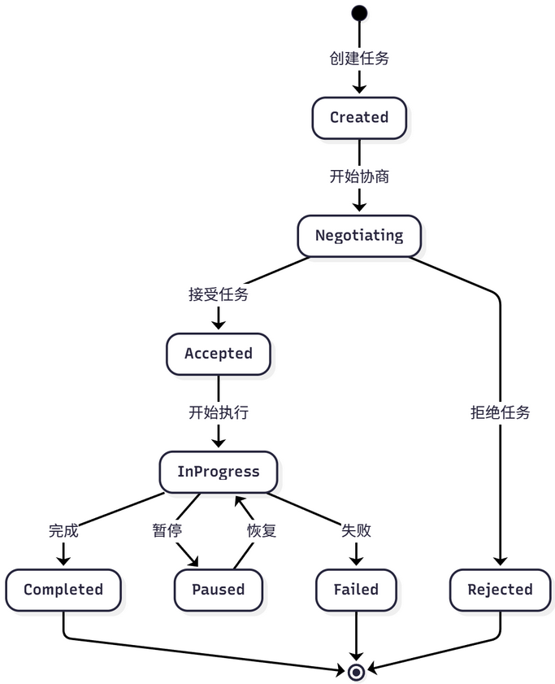
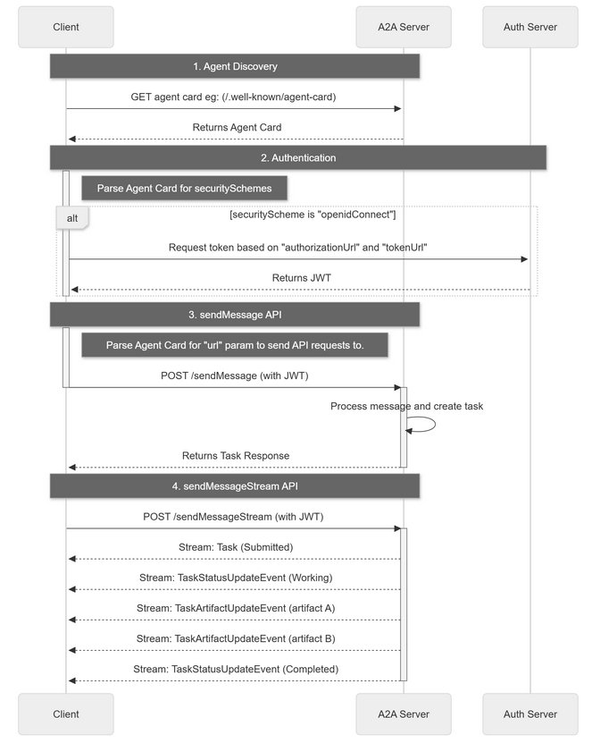

# 背景

A2A（Agent-to-Agent）是一种支持**智能体之间直接通信与协作**的协议

MCP 协议解决了智能体与工具的交互，而 A2A 协议则解决智能体之间的协作问题。

# 原因

在一个需要多智能体（如研究员、撰写员、编辑）协作的任务中，它们需要通信、委托任务、协商能力和同步状态。

传统的**中央协调器（星型拓扑）方案**存在三个主要问题：

- **单点故障** ：协调器失效导致系统整体瘫痪。
- **性能瓶颈** ：所有通信都经过中心节点，限制了并发。
- **扩展困难**：增加或修改智能体需要改动中心逻辑。

**A2A 协议采用点对点（P2P）架构（网状拓扑）**，允许**智能体直接通信，从根本上解决了上述问题**

# 核心内容

**核心是：任务（Task）和工件（Artifact）** 这两个抽象概念，这是它与 MCP 最大的区别

| 概念              | 说明                 | 与MCP的区别          | 示例                   |
| ----------------- | -------------------- | -------------------- | ---------------------- |
| Task（任务）      | 智能体之间委托的单元 | 比Tool更高层次的抽象 | "撰写一篇关于AI的文章" |
| Artifact （工件） | 任务执行产生的结果   | 比Resource更结构化   | 文章文本、分析报告     |
| Message(消息）    | 智能体间的通信载体   | 包含任务状态信息     | “任务已完成50%”      |
| Part （部分）     | 消息的组成部分       | 支持多模态内容       | 文本、图片、文件       |
| Agent Card        | 智能体描述文档       | 类似MCP的工具描述    | JSON格式的能力声明     |

# 生命周期

为**实现对协作过程的管理，A2A 为任务定义了标准化的生命周期**，包括创建、协商、代理、执行中、完成、失败等状态




# 请求生命周期

**A2A 请求生命周期是一个序列，详细说明了请求遵循的四个主要步骤**：代理发现、身份验证、发送消息 API 和发送消息流 API。

借鉴了官网的流程图，用来展示了操作流程，说明了客户端、A2A 服务器和身份验证服务器之间的交互



# 使用 A2A 协议

采用模拟协议思想的方式，通过 A2A-SDK 来继承部分功能实现。

## 创建简单的 A2A 智能体


创建一个 A2A 的智能体，同样是计算器案例作为演示：

```python
from hello_agents.protocols.a2a.implementation import A2AServer, A2A_AVAILABLE

def create_calculator_agent():
    """创建一个计算器智能体"""
    if not A2A_AVAILABLE:
        print("❌ A2A SDK 未安装，请运行: pip install a2a-sdk")
        return None

    print("🧮 创建计算器智能体")

    # 创建 A2A 服务器
    calculator = A2AServer(
        name="calculator-agent",
        description="专业的数学计算智能体",
        version="1.0.0",
        capabilities={
            "math": ["addition", "subtraction", "multiplication", "division"],
            "advanced": ["power", "sqrt", "factorial"]
        }
    )

    # 添加基础计算技能
    @calculator.skill("add")
    def add_numbers(query: str) -> str:
        """加法计算"""
        try:
            # 简单解析 "计算 5 + 3" 格式
            parts = query.replace("计算", "").replace("加", "+").replace("加上", "+")
            if "+" in parts:
                numbers = [float(x.strip()) for x in parts.split("+")]
                result = sum(numbers)
                return f"计算结果: {' + '.join(map(str, numbers))} = {result}"
            else:
                return "请使用格式: 计算 5 + 3"
        except Exception as e:
            return f"计算错误: {e}"

    @calculator.skill("multiply")
    def multiply_numbers(query: str) -> str:
        """乘法计算"""
        try:
            parts = query.replace("计算", "").replace("乘以", "*").replace("×", "*")
            if "*" in parts:
                numbers = [float(x.strip()) for x in parts.split("*")]
                result = 1
                for num in numbers:
                    result *= num
                return f"计算结果: {' × '.join(map(str, numbers))} = {result}"
            else:
                return "请使用格式: 计算 5 * 3"
        except Exception as e:
            return f"计算错误: {e}"

    @calculator.skill("info")
    def get_info(query: str) -> str:
        """获取智能体信息"""
        return f"我是 {calculator.name}，可以进行基础数学计算。支持的技能: {list(calculator.skills.keys())}"

    print(f"✅ 计算器智能体创建成功，支持技能: {list(calculator.skills.keys())}")
    return calculator

# 创建智能体
calc_agent = create_calculator_agent()
if calc_agent:
    # 测试技能
    print("\n🧪 测试智能体技能:")
    test_queries = [
        "获取信息",
        "计算 10 + 5",
        "计算 6 * 7"
    ]

    for query in test_queries:
        if "信息" in query:
            result = calc_agent.skills["info"](query)
        elif "+" in query:
            result = calc_agent.skills["add"](query)
        elif "*" in query or "×" in query:
            result = calc_agent.skills["multiply"](query)
        else:
            result = "未知查询类型"

        print(f"  📝 查询: {query}")
        print(f"  🤖 回复: {result}")
        print()
```

## 自定义 A2A 智能体

你也可以创建自己的 A2A 智能体，这里只是进行简单演示：

```python
from hello_agents.protocols.a2a.implementation import A2AServer, A2A_AVAILABLE

def create_custom_agent():
    """创建自定义智能体"""
    if not A2A_AVAILABLE:
        print("请先安装 A2A SDK: pip install a2a-sdk")
        return None

    # 创建智能体
    agent = A2AServer(
        name="my-custom-agent",
        description="我的自定义智能体",
        capabilities={"custom": ["skill1", "skill2"]}
    )

    # 添加技能
    @agent.skill("greet")
    def greet_user(name: str) -> str:
        """问候用户"""
        return f"你好，{name}！我是自定义智能体。"

    @agent.skill("calculate")
    def simple_calculate(expression: str) -> str:
        """简单计算"""
        try:
            # 安全的计算（仅支持基本运算）
            allowed_chars = set('0123456789+-*/(). ')
            if all(c in allowed_chars for c in expression):
                result = eval(expression)
                return f"计算结果: {expression} = {result}"
            else:
                return "错误: 只支持基本数学运算"
        except Exception as e:
            return f"计算错误: {e}"

    return agent

# 创建并测试自定义智能体
custom_agent = create_custom_agent()
if custom_agent:
    # 测试技能
    print("测试问候技能:")
    result1 = custom_agent.skills["greet"]("张三")
    print(result1)

    print("\n测试计算技能:")
    result2 = custom_agent.skills["calculate"]("10 + 5 * 2")
    print(result2)
```


# 使用 HelloAgents A2A 工具

HelloAgents 提供了统一的 A2A 工具接口

## 创建 A2A Agent 服务端


首先，让我们创建一个 Agent 服务端：

```python
from hello_agents.protocols import A2AServer
import threading
import time

# 创建研究员Agent服务
researcher = A2AServer(
    name="researcher",
    description="负责搜索和分析资料的Agent",
    version="1.0.0"
)

# 定义技能
@researcher.skill("research")
def handle_research(text: str) -> str:
    """处理研究请求"""
    import re
    match = re.search(r'research\s+(.+)', text, re.IGNORECASE)
    topic = match.group(1).strip() if match else text
  
    # 实际的研究逻辑（这里简化）
    result = {
        "topic": topic,
        "findings": f"关于{topic}的研究结果...",
        "sources": ["来源1", "来源2", "来源3"]
    }
    return str(result)

# 在后台启动服务
def start_server():
    researcher.run(host="localhost", port=5000)

if __name__ == "__main__":
    server_thread = threading.Thread(target=start_server, daemon=True)
    server_thread.start()
  
    print("✅ 研究员Agent服务已启动在 http://localhost:5000")
  
    # 保持程序运行
    try:
        while True:
            time.sleep(1)
    except KeyboardInterrupt:
        print("\n服务已停止")
```

## 创建 A2A Agent 客户端

现在，让我们创建一个客户端来与服务端通信：

```python
from hello_agents.protocols import A2AClient

# 创建客户端连接到研究员Agent
client = A2AClient("http://localhost:5000")

# 发送研究请求
response = client.execute_skill("research", "research AI在医疗领域的应用")
print(f"收到响应：{response.get('result')}")

# 输出：
# 收到响应：{'topic': 'AI在医疗领域的应用', 'findings': '关于AI在医疗领域的应用的研究结果...', 'sources': ['来源1', '来源2', '来源3']}
```

## 创建 Agent 网络

对于多个 Agent 的协作，我们可以让多个 Agent 相互连接：

```python
from hello_agents.protocols import A2AServer, A2AClient
import threading
import time

# 1. 创建多个Agent服务
researcher = A2AServer(
    name="researcher",
    description="研究员"
)

@researcher.skill("research")
def do_research(text: str) -> str:
    import re
    match = re.search(r'research\s+(.+)', text, re.IGNORECASE)
    topic = match.group(1).strip() if match else text
    return str({"topic": topic, "findings": f"{topic}的研究结果"})

writer = A2AServer(
    name="writer",
    description="撰写员"
)

@writer.skill("write")
def write_article(text: str) -> str:
    import re
    match = re.search(r'write\s+(.+)', text, re.IGNORECASE)
    content = match.group(1).strip() if match else text
  
    # 尝试解析研究数据
    try:
        data = eval(content)
        topic = data.get("topic", "未知主题")
        findings = data.get("findings", "无研究结果")
    except:
        topic = "未知主题"
        findings = content
  
    return f"# {topic}\n\n基于研究：{findings}\n\n文章内容..."

editor = A2AServer(
    name="editor",
    description="编辑"
)

@editor.skill("edit")
def edit_article(text: str) -> str:
    import re
    match = re.search(r'edit\s+(.+)', text, re.IGNORECASE)
    article = match.group(1).strip() if match else text
  
    result = {
        "article": article + "\n\n[已编辑优化]",
        "feedback": "文章质量良好",
        "approved": True
    }
    return str(result)

# 2. 启动所有服务
threading.Thread(target=lambda: researcher.run(port=5000), daemon=True).start()
threading.Thread(target=lambda: writer.run(port=5001), daemon=True).start()
threading.Thread(target=lambda: editor.run(port=5002), daemon=True).start()
time.sleep(2)  # 等待服务启动

# 3. 创建客户端连接到各个Agent
researcher_client = A2AClient("http://localhost:5000")
writer_client = A2AClient("http://localhost:5001")
editor_client = A2AClient("http://localhost:5002")

# 4. 协作流程
def create_content(topic):
    # 步骤1：研究
    research = researcher_client.execute_skill("research", f"research {topic}")
    research_data = research.get('result', '')
  
    # 步骤2：撰写
    article = writer_client.execute_skill("write", f"write {research_data}")
    article_content = article.get('result', '')
  
    # 步骤3：编辑
    final = editor_client.execute_skill("edit", f"edit {article_content}")
    return final.get('result', '')

# 使用
result = create_content("AI在医疗领域的应用")
print(f"\n最终结果：\n{result}")
```

# 智能体中使用 A2A 工具

将 A2A 集成到 HelloAgents 的智能体中。

## （1）使用 A2ATool 包装器

```python
from hello_agents import SimpleAgent, HelloAgentsLLM
from hello_agents.tools import A2ATool
from dotenv import load_dotenv

load_dotenv()
llm = HelloAgentsLLM()

# 假设已经有一个研究员Agent服务运行在 http://localhost:5000

# 创建协调者Agent
coordinator = SimpleAgent(name="协调者", llm=llm)

# 添加A2A工具，连接到研究员Agent
researcher_tool = A2ATool(
    name="researcher",
    description="研究员Agent，可以搜索和分析资料",
    agent_url="http://localhost:5000"
)
coordinator.add_tool(researcher_tool)

# 协调者可以调用研究员Agent
response = coordinator.run("请让研究员帮我研究AI在教育领域的应用")
print(response)
```

## （2）实战案例：智能客服系统

让我们构建一个完整的智能客服系统，包含三个 Agent：

- **接待员** ：分析客户问题类型
- **技术专家** ：回答技术问题
- 销**售顾问** ：回答销售问题

```python
from hello_agents import SimpleAgent, HelloAgentsLLM
from hello_agents.tools import A2ATool
from hello_agents.protocols import A2AServer
import threading
import time
from dotenv import load_dotenv

load_dotenv()
llm = HelloAgentsLLM()

# 1. 创建技术专家Agent服务
tech_expert = A2AServer(
    name="tech_expert",
    description="技术专家，回答技术问题"
)

@tech_expert.skill("answer")
def answer_tech_question(text: str) -> str:
    import re
    match = re.search(r'answer\s+(.+)', text, re.IGNORECASE)
    question = match.group(1).strip() if match else text
    # 实际应用中，这里会调用LLM或知识库
    return f"技术回答：关于'{question}'，我建议您查看我们的技术文档..."

# 2. 创建销售顾问Agent服务
sales_advisor = A2AServer(
    name="sales_advisor",
    description="销售顾问，回答销售问题"
)

@sales_advisor.skill("answer")
def answer_sales_question(text: str) -> str:
    import re
    match = re.search(r'answer\s+(.+)', text, re.IGNORECASE)
    question = match.group(1).strip() if match else text
    return f"销售回答：关于'{question}'，我们有特别优惠..."

# 3. 启动服务
threading.Thread(target=lambda: tech_expert.run(port=6000), daemon=True).start()
threading.Thread(target=lambda: sales_advisor.run(port=6001), daemon=True).start()
time.sleep(2)

# 4. 创建接待员Agent（使用HelloAgents的SimpleAgent）
receptionist = SimpleAgent(
    name="接待员",
    llm=llm,
    system_prompt="""你是客服接待员，负责：
1. 分析客户问题类型（技术问题 or 销售问题）
2. 将问题转发给相应的专家
3. 整理专家的回答并返回给客户

请保持礼貌和专业。"""
)

# 添加技术专家工具
tech_tool = A2ATool(
    agent_url="http://localhost:6000",
    name="tech_expert",
    description="技术专家，回答技术相关问题"
)
receptionist.add_tool(tech_tool)

# 添加销售顾问工具
sales_tool = A2ATool(
    agent_url="http://localhost:6001",
    name="sales_advisor",
    description="销售顾问，回答价格、购买相关问题"
)
receptionist.add_tool(sales_tool)

# 5. 处理客户咨询
def handle_customer_query(query):
    print(f"\n客户咨询：{query}")
    print("=" * 50)
    response = receptionist.run(query)
    print(f"\n客服回复：{response}")
    print("=" * 50)

# 测试不同类型的问题
if __name__ == "__main__":
    handle_customer_query("你们的API如何调用？")
    handle_customer_query("企业版的价格是多少？")
    handle_customer_query("如何集成到我的Python项目中？")
```

## （3）高级用法：Agent 间协商 

A2A 协议还支持 Agent 间的协商机制：

```python
from hello_agents.protocols import A2AServer, A2AClient
import threading
import time

# 创建两个需要协商的Agent
agent1 = A2AServer(
    name="agent1",
    description="Agent 1"
)

@agent1.skill("propose")
def handle_proposal(text: str) -> str:
    """处理协商提案"""
    import re
  
    # 解析提案
    match = re.search(r'propose\s+(.+)', text, re.IGNORECASE)
    proposal_str = match.group(1).strip() if match else text
  
    try:
        proposal = eval(proposal_str)
        task = proposal.get("task")
        deadline = proposal.get("deadline")
  
        # 评估提案
        if deadline >= 7:  # 至少需要7天
            result = {"accepted": True, "message": "接受提案"}
        else:
            result = {
                "accepted": False,
                "message": "时间太紧",
                "counter_proposal": {"deadline": 7}
            }
        return str(result)
    except:
        return str({"accepted": False, "message": "无效的提案格式"})

agent2 = A2AServer(
    name="agent2",
    description="Agent 2"
)

@agent2.skill("negotiate")
def negotiate_task(text: str) -> str:
    """发起协商"""
    import re
  
    # 解析任务和截止日期
    match = re.search(r'negotiate\s+task:(.+?)\s+deadline:(\d+)', text, re.IGNORECASE)
    if match:
        task = match.group(1).strip()
        deadline = int(match.group(2))
  
        # 向agent1发送提案
        proposal = {"task": task, "deadline": deadline}
        return str({"status": "negotiating", "proposal": proposal})
    else:
        return str({"status": "error", "message": "无效的协商请求"})

# 启动服务
threading.Thread(target=lambda: agent1.run(port=7000), daemon=True).start()
threading.Thread(target=lambda: agent2.run(port=7001), daemon=True).start()
```
