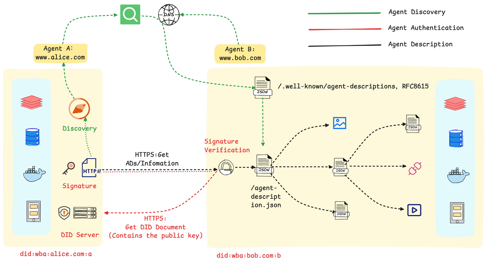

# 背景

在 MCP 协议解决了工具调用、A2A 协议解决点对点智能体协作之后，ANP 协议则专注于解决大规模、开放网络环境下的智能体管理问题。

# 目标

当一个网络中存在大量功能各异的智能体（例如，自然语言处理、图像识别、数据分析等）时，系统会面临一系列挑战：

- **服务发现**：当**新任务到达时，如何快速找到**能够处理该任务的智能体？
- **智能路由**：如果**多个智能体都能处理同一任务，如何选择最合适**的一个（如根据负载、成本等）并向其分派任务？
- **动态扩展**：如何让**新加入网络的智能体被其他成员发现和调用**？

ANP 的设计目标就是提供一套标准化的机制，来解决上述的服务发现、路由选择和网络扩展性问题。

# 核心概念


| 概念          | 说明                                             | 示例                                |
| ------------- | ------------------------------------------------ | ----------------------------------- |
| ANP Discovery | 服务发现中心，用于注册和查询网络中的智能体服务。 | 一个中央服务器或一个P2P的DHT网络。  |
| Service Info  | 描述智能体服务的信息，包括其能力、地址和元数据。 | {"agent_id":"nlp-agent-01"，...}    |
| ANPNetwork    | 对智能体网络的抽象，管理节点间的连接与通信。     | 整个智能体集群的拓扑视图。          |
| Capability    | 描述智能体功能的能力标签，用于服务发现时的匹配。 | "text_analysis", "image-processing" |
| Metadata      | 服务的动态或静态元数据，用于路由决策。           | 负载情况、服务价格、软件版本等。    |

# ANP 的架构设计

官方的[入门指南](https://github.com/agent-network-protocol/AgentNetworkProtocol/blob/main/docs/chinese/ANP入门指南.md)来介绍 ANP 的架构设计

主要包括以下几个步骤：

1. **服务的发现与匹配**：

   * 首先，智能体 A 通过一个公开的发现服务，基于语义或功能描述进行查询，以定位到符合其任务需求的智能体 B。
   * 该**发现服务通过预先爬取各智能体对外暴露的标准端点**（`.well-known/agent-descriptions`）来**建立索引，从而实现服务需求方与提供方的动态匹配**。
2. **基于 DID 的身份验证**：

   1. 在交互开始时，智能体 A 使用其私钥对包含自身 DID 的请求进行签名。
   2. 智能体 B 收到后，通过解析该 DID 获取对应的公钥，并以此验证签名的真实性与请求的完整性，从而建立起双方的可信通信。
3. **标准化的服务执行**：

   1. 身份验证通过后，智能体 B 响应请求，双方依据预定义的标准接口和数据格式进行数据交换或服务调用（如预订、查询等）。
   2. 标准化的交互流程是实现跨平台、跨系统互操作性的基础。




该机制的核心是**利用 DID 构建了一个去中心化的信任根基，并借助标准化的描述协议实现了服务的动态发现**。

这套方法使得智能体能够在无需中央协调的前提下，安全、高效地在互联网上形成协作网络。

# 使用 ANP 服务发现


## （1）创建服务发现中心

```python
from hello_agents.protocols import ANPDiscovery, register_service

# 创建服务发现中心
discovery = ANPDiscovery()

# 注册Agent服务
register_service(
    discovery=discovery,
    service_id="nlp_agent_1",
    service_name="NLP处理专家A",
    service_type="nlp",
    capabilities=["text_analysis", "sentiment_analysis", "ner"],
    endpoint="http://localhost:8001",
    metadata={"load": 0.3, "price": 0.01, "version": "1.0.0"}
)

register_service(
    discovery=discovery,
    service_id="nlp_agent_2",
    service_name="NLP处理专家B",
    service_type="nlp",
    capabilities=["text_analysis", "translation"],
    endpoint="http://localhost:8002",
    metadata={"load": 0.7, "price": 0.02, "version": "1.1.0"}
)

print("✅ 服务注册完成")
```

## （2）发现服务

```python
from hello_agents.protocols import discover_service

# 按类型查找
nlp_services = discover_service(discovery, service_type="nlp")
print(f"找到 {len(nlp_services)} 个NLP服务")

# 选择负载最低的服务
best_service = min(nlp_services, key=lambda s: s.metadata.get("load", 1.0))
print(f"最佳服务：{best_service.service_name} (负载: {best_service.metadata['load']})")
```

## （3）构建 Agent 网络 

```python
from hello_agents.protocols import ANPNetwork

# 创建网络
network = ANPNetwork(network_id="ai_cluster")

# 添加节点
for service in discovery.list_all_services():
    network.add_node(service.service_id, service.endpoint)

# 建立连接（根据能力匹配）
network.connect_nodes("nlp_agent_1", "nlp_agent_2")

stats = network.get_network_stats()
print(f"✅ 网络构建完成，共 {stats['total_nodes']} 个节点")
```

# 实战案例


让我们构建一个完整的分布式任务调度系统：

```python
from hello_agents.protocols import ANPDiscovery, register_service
from hello_agents import SimpleAgent, HelloAgentsLLM
from hello_agents.tools.builtin import ANPTool
import random
from dotenv import load_dotenv

load_dotenv()
llm = HelloAgentsLLM()

# 1. 创建服务发现中心
discovery = ANPDiscovery()

# 2. 注册多个计算节点
for i in range(10):
    register_service(
        discovery=discovery,
        service_id=f"compute_node_{i}",
        service_name=f"计算节点{i}",
        service_type="compute",
        capabilities=["data_processing", "ml_training"],
        endpoint=f"http://node{i}:8000",
        metadata={
            "load": random.uniform(0.1, 0.9),
            "cpu_cores": random.choice([4, 8, 16]),
            "memory_gb": random.choice([16, 32, 64]),
            "gpu": random.choice([True, False])
        }
    )

print(f"✅ 注册了 {len(discovery.list_all_services())} 个计算节点")

# 3. 创建任务调度Agent
scheduler = SimpleAgent(
    name="任务调度器",
    llm=llm,
    system_prompt="""你是一个智能任务调度器，负责：
1. 分析任务需求
2. 选择最合适的计算节点
3. 分配任务

选择节点时考虑：负载、CPU核心数、内存、GPU等因素。"""
)

# 添加ANP工具
anp_tool = ANPTool(
    name="service_discovery",
    description="服务发现工具，可以查找和选择计算节点",
    discovery=discovery
)
scheduler.add_tool(anp_tool)

# 4. 智能任务分配
def assign_task(task_description):
    print(f"\n任务：{task_description}")
    print("=" * 50)

    # 让Agent智能选择节点
    response = scheduler.run(f"""
    请为以下任务选择最合适的计算节点：
    {task_description}

    要求：
    1. 列出所有可用节点
    2. 分析每个节点的特点
    3. 选择最合适的节点
    4. 说明选择理由
    """)

    print(response)
    print("=" * 50)

# 测试不同类型的任务
assign_task("训练一个大型深度学习模型，需要GPU支持")
assign_task("处理大量文本数据，需要高内存")
assign_task("运行轻量级数据分析任务")
```

这是一个负载均衡示例

```python
from hello_agents.protocols import ANPDiscovery, register_service
import random

# 创建服务发现中心
discovery = ANPDiscovery()

# 注册多个相同类型的服务
for i in range(5):
    register_service(
        discovery=discovery,
        service_id=f"api_server_{i}",
        service_name=f"API服务器{i}",
        service_type="api",
        capabilities=["rest_api"],
        endpoint=f"http://api{i}:8000",
        metadata={"load": random.uniform(0.1, 0.9)}
    )

# 负载均衡函数
def get_best_server():
    """选择负载最低的服务器"""
    servers = discovery.discover_services(service_type="api")
    if not servers:
        return None

    best = min(servers, key=lambda s: s.metadata.get("load", 1.0))
    return best

# 模拟请求分配
for i in range(10):
    server = get_best_server()
    print(f"请求 {i+1} -> {server.service_name} (负载: {server.metadata['load']:.2f})")

    # 更新负载（模拟）
    server.metadata["load"] += 0.1
```
