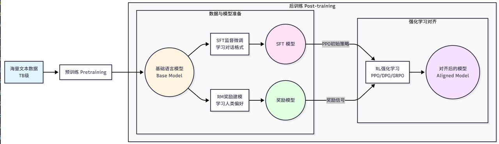
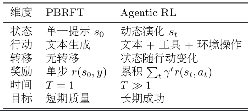
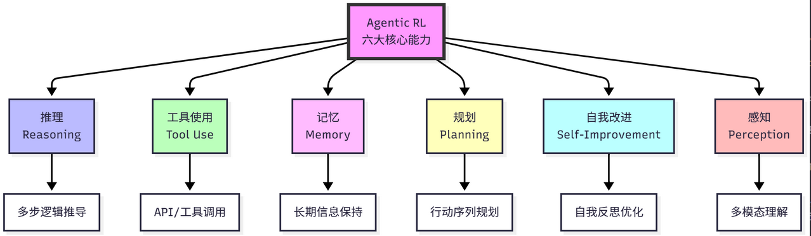

# 从 LLM 训练到 Agentic RL

问题：

- 何让智能体具备**更强的推理能力**?
- 如何让智能体学会**更好地使用工具**?
- 如何让智能体能够**自我改进**?

这些便是 **Agentic RL(基于强化学习的智能体训练)要解决的核心问题**

当前章节内容

- 从 **LLM 训练的基础**知识开始，
- 逐步深入到**监督微调(Supervised Fine-Tuning，SFT)**、
- **群组相对策略优化(Group Relative Policy Optimization， GRPO)**等实用技术，
- 最终构建一个完整的**智能体训练 pipeline**。

# 从强化学习到 Agentic RL

**强化学习(Reinforcement Learning， RL)** 是一种专注于解决序贯决策问题的学习范式，它通过智能体与环境的直接交互，在"试错"中学习如何最大化长期收益。

传统的监督学习方法存在三个核心局限:

- 一是**数据质量完全决定训练质量**，模型只能**模仿训练数据，难以超越**;
- 二是**缺乏探索能力**，只能**被动学习人类提供的路径**;
- 三是**难以优化长期目标**，**无法精确优化多步推理的中间过程**。

通过**让智能体自主生成多个候选答案并根据正确性获得奖励**，它可以**学习哪些推理路径更优、哪些步骤是关键**，甚至发现比人类标注更好的解题方法

Agentic RL 的**核心思想：将 LLM 作为可学习策略，嵌入智能体的感知-决策-执行循环，通过强化学习优化多步任务表现**。

# LLM 训练全景图

## 完整流程

LLM 训练的完整流程

一个强大的 LLM(如 GPT、Claude、Qwen)的诞生，通常要经历两个主要阶段：**预训练(Pretraining)和后训练(Post-training)**

> 这两个阶段构成了 LLM 从"语言模型"到"对话助手"的完整演化路径。

## 预训练阶段

预训练阶段是 LLM 训练的**第一阶段，目标是让模型学习语言的基本规律和世界知识**。

这个阶段使用**海量的文本数据**(通常是数 TB 级别)，通过**自监督学习**的方式**训练**模型。

最常见的预训练任务是**因果语言建模(Causal Language Modeling)**，也称为下一个**词预测(Next Token Prediction)**。

给定一个文本序列 $x_1, x_2, ..., x_t$，模型需要预测下一个词 $x_{t+1}$:

- 其中 $\theta$ 是模型参数，
- $P(x_t | x_1, ..., x_{t-1}; \theta)$ 是模型预测的下一个词的概率分布，
- 目标是最小化负对数似然，即最大化预测正确词的概率。

$$
\mathcal{L}_{\text{pretrain}} = -\sum_{t=1}^{T} \log P(x_t | x_1, x_2, ..., x_{t-1}; \theta)
$$

例如，给定文本"The cat sat on the"，模型需要预测下一个词最可能是"mat"。

通过在海量文本上进行这样的训练，**模型逐渐学会**

* **语法规则**(什么样的**词序是合法**的)、
* **语义知识**(**词与词之间的关系**)、
* **世界知识**(关于**世界的事实性信息**)
* 基础的**推理能力**。

特点是：

- 数据量巨大、计算成本高、
- 学到的是**通用的语言理解和生成能力**、
- 采用**无监督学习**。

## 后训练阶段

后训练阶段则是要**解决预训练模型的不足**。

预训练模型缺点：

- 预训练后的模型虽然具备了强大的语言能力，但**它只是一个"预测下一个词"的模型**，
- 并**不知道如何遵循人类的指令、生成有帮助无害诚实的回答、拒绝不当的请求，以及以对话的方式与人交互**。

**后训练阶段**就是要解决这些问题：**让模型对齐人类的偏好和价值观**。

后训练通常包含三个步骤。

1. 监督微调(SFT)
2. 奖励建模(RM)
3. 强化学习微调

### 1、监督微调(SFT)

监督微调(SFT)：让模型**学会遵循指令和对话格式**。

SFT 的特点是：**数据量较小、需要人工标注、快速见效**、主要**学习任务格式和基本能力**。

训练数据是(prompt， completion)对，训练目标与预训练类似，仍然是最大化正确输出的概率:

- 其中 $x_i$ 是输入提示(prompt)，
- $y_i$ 是期望的输出，
- $N$ 是训练样本数量。

$$
\mathcal{L}_{\text{SFT}} = -\sum_{i=1}^{N} \log P(y_i | x_i; \theta)
$$

### 2、奖励建模(RM)

奖励建模(RM)：评估回答的质量

SFT 后的**模型虽然能遵循指令**，但**生成的回答质量参差不齐**，需要奖励模型评估回答的质量

**奖励模型的训练数据是偏好对比数据**,包含同一个问题的**两个回答,一个更好(chosen),一个更差(rejected)**。

奖励模型的训练目标是学习人类的偏好:

- 其中 $r_\phi(x, y)$ 是奖励模型，输入是(提示，回答)对，输出是质量分数;
- $y_w$ 是更好的回答(chosen)，
- $y_l$ 是更差的回答(rejected)，
- $\sigma$ 是 sigmoid 函数，
- 目标是让奖励模型给更好的回答更高的分数。

$$
\mathcal{L}_{\text{RM}} = -\mathbb{E}_{(x, y_w, y_l)} [\log \sigma(r_\phi(x, y_w) - r_\phi(x, y_l))]
$$

### 3、强化学习微调

强化学习微调：有了奖励模型后，我们就可以用强化学习来优化语言模型，让它生成更高质量的回答。

最经典的算法是 PPO(Proximal Policy Optimization)``[1]``，训练目标是:

- 其中 $\pi_\theta$ 是当前策略，即语言模型，
- $\pi_{\text{ref}}$ 是参考策略，这个场景下可以是 SFT 模型，
- $r_\phi(x, y)$ 是奖励模型的评分，
- $D_{KL}$ 是 KL 散度，目的是为了防止模型偏离太远，
- $\beta$ 是平衡系数。

$$
J_{\text{PPO}} = \mathbb{E}_{x, y \sim \pi_\theta} [r_\phi(x, y)] - \beta \cdot D_{KL}(\pi_\theta || \pi_{\text{ref}})
$$

这个目标函数的含义是：**最大化奖励**，同时不要偏离原始模型太远。

传统的 RLHF(Reinforcement Learning from Human Feedback)需要大量人工标注偏好数据，成本高昂。

为了降低成本，研究者提出了 RLAIF(Reinforcement Learning from AI Feedback)，用强大的 AI 模型(如 GPT-4)来替代人类标注员。

RLAIF 的工作流程是:

- 用 SFT 模型生成多个候选回答，用强大的 AI 模型对回答进行评分和排序，
- 用 AI 的评分训练奖励模型，用奖励模型进行强化学习。

实验表明，RLAIF 的效果接近甚至超过 RLHF，同时成本大幅降低

# Agentic RL 的核心理念

## Agentic RL 与传统训练方法的区别

### 分别分析

传统的后训练(我们称之为 **PBRFT：Preference-Based Reinforcement Fine-Tuning**)，

- 主要关注**单轮对话的质量优化**：**给定一个用户问题，模型生成一个回答，然后根据回答的质量获得奖励**。
- **适合优化对话助手**，**不适合 多步推理、工具使用、长期规划的智能体任务**

**Agentic RL：它将 LLM 视为一个可学习的策略**，嵌入在一个顺序决策循环中。在这个框架下，

- 智能体需要**在动态环境中与外部世界交互，执行多步行动来完成复杂任务**，
- 获得**中间反馈来指导后续决策**，
- **优化长期累积奖励而非单步奖励**。

举例说明：

- 在 PBRFT 场景中，用户问"请解释什么是强化学习"，**模型生成完整回答，然后根据回答质量直接给分**。
- 在 Agentic RL 场景中，用户请求"帮我分析这个 GitHub 仓库的代码质量"，**智能体需要经历多个步骤**:
  - 首先调用 GitHub API 获取仓库信息，成功获得仓库结构和文件列表，得到+0.1 的奖;
  - 然后读取主要代码文件，成功获得代码内容，得到+0.1 的奖励;
  - 接着分析代码质量合理，得到+0.2 的奖励;
  - 最后生成分析报告质量高，得到+0.6 的奖励。
  - 总奖励是所有步骤的累积:1.0。

Agentic RL 的关键特征是：**多步交互、每一步的行动都会改变环境状态、每一步都可以获得反馈、优化整个任务的完成质量**。

### MDP 角度分析

强化学习是基于**马尔可夫决策过程(Markov Decision Process， MDP)**框架进行形式化的。

MDP 由五元组 $(S, A, P, R, \gamma)$ 定义:

- **状态空间$S$**：

  - 在状态方面，PBRFT 的状态 $s_0$ 仅由用户提示构成，时间跨度 $T=1$(单步)，状态不变化，可以**表示为 $s_0 = \text{prompt}$**。
  - **Agentic RL 的状态 $s_t$ 包含历史观察和上下文，时间跨度 $T \gg 1$(多步)**，状态随行动演化，可以**表示为 $s_t = (\text{prompt}, o_1, o_2, ..., o_t)$**，其**中 $o_t$ 是第 $t$ 步的观察**(如工具返回结果、环境反馈等)。
- **行动空间$A$、**

  - 在行动方面，PBRFT 的行动空间只有文本生成，**单一行动类型，表示为 $a = y \sim \pi_\theta(y|s_0)$**。
  - 而 Agentic RL 的行动空间包含文本生成、工具调用、环境操作等**多种类型，表示为 $a_t \in \{a_t^{\text{text}}, a_t^{\text{tool}}\}$**，例如 $a_t^{\text{text}}$ 是生成思考过程或回答，$a_t^{\text{tool}}$ 是调用计算器、搜索引擎等工具。
- **状态转移函数$P(s'|s,a)$、**

  - 在转移函数方面，**PBRFT 无状态转移**，表示为 $P(s'|s,a) = \delta(s' - s_{\text{terminal}})$。
  - 而 **Agentic RL 的状态根据行动和环境动态变化**，表示为 $s_{t+1} \sim P(s_{t+1}|s_t, a_t)$，例如调用搜索工具后，状态会包含搜索结果。
- **奖励函数$R(s,a)$、**

  - 在奖励方面，PBRFT 只有**单步奖励 $r(s_0, a)$，仅在任务结束时给予**，表示为 $R_{\text{PBRFT}} = r(s_0, y)$，通常由奖励模型给出: $r(s_0, y) = r_\phi(s_0, y)$。
  - Agentic RL 有**多步奖励 $r(s_t, a_t)$**，可以在中间步骤给予部分奖励，表示为:
    - 其中 $\gamma \in [0,1]$ 是折扣因子，
    - $r(s_t, a_t)$ 可以是稀疏奖励(只在任务完成时给予,如答案正确 +1)、
    - 密集奖励(每步都给予，如工具调用成功 +0.1)或结合两者的混合奖励。

  $$
  R_{\text{Agentic}} = \sum_{t=0}^{T} \gamma^t r(s_t, a_t)
  $$
- 折扣因子$\gamma$。

## Agentic RL 目标

### 概述

在目标函数方面，其中 $\tau = (s_0, a_0, s_1, a_1, ..., s_T)$ 是完整的轨迹(trajectory)。

PBRFT 最大化单步期望奖励:

$$
J_{\text{PBRFT}}(\theta) = \mathbb{E}_{s_0, y \sim \pi_\theta} [r(s_0, y)]
$$

而 Agentic RL 最大化累积折扣奖励：

$$
J_{\text{Agentic}}(\theta) = \mathbb{E}_{\tau \sim \pi_\theta} \left[\sum_{t=0}^{T} \gamma^t r(s_t, a_t)\right]
$$

**PBRFT 思维关注"如何让模型生成更好的单个回答"**，优化**回答质量**，关注**语言表达**，进行**单步决策**。

而 **Agentic RL 思维关注"如何让智能体完成复杂任务"**，优化任务完成度，关注行动策略，进行**多步规划**。

这种转变使得 **LLM 从"对话助手"进化为"自主智能体"**，能够**主动寻找信息、知道何时、如何使用外部工具、为了最终目标，愿意执行看似"绕路"的中间步骤、从错误学习**。

### 赋予 LLM 智能体六大核心能力

#### 推理(Reasoning)

**推理(Reasoning)**：是指**从给定信息中逻辑地得出结论的过程**，是智能体的核心能力。

- 传统的 CoT （思维链）提示方法依**赖少样本示例，泛化能力有限**;
- **SFT** 只能**模仿训练数据**中的推理模式，**难以创新**。

强化学习的优势在于：**通过试错学习有效的推理策略，发现训练数据中没有的推理路径，学会何时需要深度思考、何时可以快速回答**。

过程如下：

1. 推理任务可以建模为序列决策问题，给定问题 $q$，
2. 智能体需要生成推理链 $c = (c_1, c_2, ..., c_n)$ 和最终答案 $a$。
3. 奖励函数通常设计为 $r(q, c, a) = 1$ if $a = a^*$ else $0$，训练目标是 $\max_\theta \mathbb{E}_{q, (c,a) \sim \pi_\theta} [r(q, c, a)]$。
4. 通过这种方式，**模型学会生成高质量的推理链，而不仅仅是记忆答案**。

#### 工具使用(Tool Use)

**工具使用(Tool Use)**：是指**智能体调用外部工来完成任务的能力**。

在工具使用任务中，行动空间扩展为 $a_t \in \{a_t^{\text{think}}, a_t^{\text{tool}}\}$,其中 $a_t^{\text{think}}$ 是生成思考过程,$a_t^{\text{tool}} = (\text{tool\_name}， \text{arguments})$ 是调用工具。强化学习让智能体学会何时需要使用工具、选择哪个工具、如何组合多个工具。例如，在解决数学问题时，智能体需要学会何时使用计算器、何时使用代码解释器、何时直接推理。

`<strong>`记忆(Memory)`</strong>`是指智能体保持和重用过去信息的能力，对于长期任务至关重要。LLM 的上下文窗口有限，静态检索策略(如 RAG)无法针对任务优化。强化学习让智能体学会记忆管理策略:决定哪些信息值得记住、何时更新记忆、何时删除过时信息。这类似于人类的工作记忆，我们会主动管理大脑中的信息，保留重要的、遗忘无关的。

`<strong>`规划(Planning)`</strong>`是指制定行动序列以达成目标的能力。传统的 CoT 是线性思考，无法回溯;提示工程使用静态规划模板，难以适应新情况。强化学习让智能体学会动态规划:通过试错发现有效的行动序列，学会权衡短期和长期收益。例如，在多步任务中，智能体可能需要先执行一些看似"绕路"的步骤，例如收集信息，才能最终完成任务。

`<strong>`自我改进(Self-Improvement)`</strong>`是指智能体回顾自身输出、纠正错误并优化策略的能力。强化学习让智能体学会自我反思:识别自己的错误、分析失败原因、调整策略。这种能力使得智能体能够在没有人工干预的情况下持续改进，类似于人类的"从错误中学习"。

`<strong>`感知(Perception)`</strong>`是指理解多模态信息的能力。例如，强化学习可以提升视觉推理能力，让模型学会使用视觉工具，学会视觉规划。这使得智能体不仅能理解文本，还能理解和操作视觉世界。
