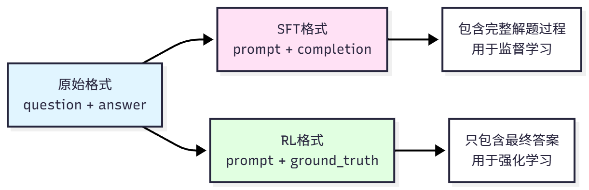
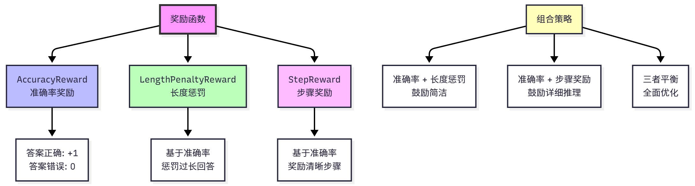

# 背景

数据集和奖励函数是强化学习训练的两大基石。

- **数据集定义了智能体要学习的任务**，
- **奖励函数定义了什么是好的行为**。

# GSM8K 数学推理数据集

数学推理是评估 LLM 推理能力的理想任务。

## 为什么使用数学推理

首先，**数学问题有明确的正确答案**，**可以自动评估**，不需要人工标注或复杂的奖励模型。

其次，**解决数学问题需要分解问题、逐步推导**，这正是**多步推理的典型场景**。

最后，**学到的推理能力可以迁移到其他领域**，具有很强的**泛化性**。

相比之下，开放式问答任务(如"如何学习编程?")的答案质量难以客观评估，需要大量人工标注。

## GSM8K 是什么

GSM8K(Grade School Math 8K)是一个高质量的小学数学应用题数据集。

- 数据集包含 7，473 个训练样本和 1，319 个测试样本，
- 难度为小学数学水平(2-8 年级)，
- 题型为应用题，
- 需要 2-8 步推理才能得出答案。

典型的 GSM8K 问题：这个问题需要两步推理:首先计算 5 月份卖出的数量(48 的一半)，然后计算总数(4 月+5 月)。

- 答案中的 `<<48/2=24>>`是中间计算步骤的标记，
- `#### 72`标记最终答案

```
问题: Natalia sold clips to 48 of her friends in April, and then she sold half 
      as many clips in May. How many clips did Natalia sell altogether in April 
      and May?

答案: Natalia sold 48/2 = <<48/2=24>>24 clips in May.
      Natalia sold 48+24 = <<48+24=72>>72 clips altogether in April and May.
      #### 72

最终答案: 72

```

## 格式转换

GSM8K 数据集需要转换为不同的格式，以适应不同的训练方法，



### 原始格式

原始格式直接来自数据集，包含问题(question)和答案(answer，含解题步骤)，适合人类阅读。SFT 格式用于监督微调，将问题转换为对话格式的 prompt，将完整解答作为 completion。

例如:

```python
{
    "prompt": "<|im_start|>user\nNatalia sold clips to 48 of her friends...<|im_end|>\n<|im_start|>assistant\n",
    "completion": "Let me solve this step by step.\n\nStep 1: ...\n\nFinal Answer: 72<|im_end|>"
}
```

关键点如下，这样模型可以学习如何格式化输出、如何分步推理。

- 使用模型的对话模板(如 Qwen 的 `<|im_start|>`标记)，
- prompt 包含用户问题，
- completion 包含完整的解题过程和答案。

### RL 格式

RL 格式用于强化学习，只提供问题和正确答案，不提供解题过程。

prompt 与 SFT 相同，但 ground_truth 只包含最终答案(用于计算奖励)，模型需要自己生成完整的推理过程。

这种设计迫使模型学会自主推理，而不是简单地记忆答案。

RL 格式：用于强化学习，需要包含以下字段:

- `question`: 原始问题
- `prompt`: 输入提示(包含 system 和 user 消息)
- `ground_truth`: 正确答案
- `full_answer`: 完整答案(包含推理过程)

例如:

```python
{
    "prompt": "<|im_start|>user\nNatalia sold clips to 48 of her friends...<|im_end|>\n<|im_start|>assistant\n",
    "ground_truth": "72"
}
```

### SFT 格式

SFT 格式：用于监督微调，需要包含以下字段:

- `prompt`: 输入提示(包含 system 和 user 消息)
- `completion`: 期望的输出
- `text`: 完整的对话文本(可选)

### 格式选择

| 格式 | 用途     | 标签内容       | 特点     |
| ---- | -------- | -------------- | -------- |
| 原始 | 数据存储 | answcr(含步骤) | 人类可读 |
| SFT  | 监督学习 | 完整解答       | 学习格式 |
| RL   | 强化学习 | 仅答案         | 自主推理 |

### 示例

通过代码来加载和查看数据集:

- SFT 格式包含完整的解题过程，用于监督学习;
- RL 格式只包含最终答案，模型需要自己生成推理过程。
- `max_samples`参数控制加载的样本数量，方便快速测试。

```python
from hello_agents.tools import RLTrainingTool
import json

# 创建工具
rl_tool = RLTrainingTool()

# 1. 加载SFT格式数据集
sft_result = rl_tool.run({
    "action": "load_dataset",
    "format": "sft",
    "max_samples": 5  # 只加载5个样本查看
})
sft_data = json.loads(sft_result)

print(f"数据集大小: {sft_data['dataset_size']}")
print(f"数据格式: {sft_data['format']}")
print(f"样本字段: {sft_data['sample_keys']}")

# 2. 加载RL格式数据集
rl_result = rl_tool.run({
    "action": "load_dataset",
    "format": "rl",
    "max_samples": 5
})
rl_data = json.loads(rl_result)

print(f"数据集大小: {rl_data['dataset_size']}")
print(f"数据格式: {rl_data['format']}")
print(f"样本字段: {rl_data['sample_keys']}")

```

# 奖励函数设计

## 概念

奖励函数是强化学习的核心，它**定义了什么是"好的行为"**。奖励函数的设计**直接影响训练效果**。

- 好的奖励函数应该能清楚地定义什么是成功、能够提供梯度信号、不会产生过大的方差、容易调整和组合。
- 糟糕的奖励函数可能只在任务结束时给奖励，中间步骤无反馈、存在奖励欺骗，使得智能体找到"作弊"方式获得高奖励、多个目标相互矛盾、方差过大，训练不收敛。

## 公式

在强化学习中，奖励函数 $r(s, a)$ 或 $r(s, a, s')$ 为智能体的每个行动分配一个数值奖励。

**智能体的目标是最大化累积奖励**:

$$
J(\theta) = \mathbb{E}_{\tau \sim \pi_\theta} \left[\sum_{t=0}^{T} \gamma^t r(s_t, a_t)\right]
$$

对于数学推理任务，我们可以简化为:

- 其中 $q$ 是问题，
- $a$ 是模型生成的答案，
- $a^*$ 是正确答案，
- $f$ 是评估函数。

$$
r(q, a) = f(a, a^*)
$$

## 奖励函数

HelloAgents 提供了三种内置奖励函数，可以单独使用或组合使用



| 奖励函数 | 优点       | 缺点         | 适用场景 |
| -------- | ---------- | ------------ | -------- |
| 准确率   | 简单直接   | 奖励稀疏     | 基础训练 |
| 长度惩罚 | 鼓励简洁   | 可能抑制推理 | 对话系统 |
| 步骤奖励 | 可解释性强 | 可能冗余     | 教育应用 |
| 组合奖励 | 全面优化   | 调参复杂     | 生产环境 |

### 准确率奖励

#### 原理

**准确率奖励(AccuracyReward)**是最基础的奖励函数，它只关心**答案是否正确**。

**数学定义为：这是一个二值奖励函数，答案正确得 1 分，错误得 0 分**。

- 其中 $a$ 是模型生成的答案，
- $a^*$ 是正确答案。

$$
r_{\text{acc}}(a, a^*) = \begin{cases}
1 & \text{if } a = a^* \\
0 & \text{otherwise}
\end{cases}
$$

实现时需要处理答案提取和比较。

模型的输出可能包含大量文本，我们**需要提取最终答案**。

常见的提取方法包括:

- 查找"Final Answer:"后的数字、
- 查找"####"标记后的数字、
- 使用正则表达式提取最后一个数字。
- 答案比较时需要处理数值精度(如 72.0 和 72 应该视为相同)、
- 单位转换(如 1000 和 1k)、
- 格式差异(如"72"和"seventy-two")。

#### 示例

使用示例:

```python
from hello_agents.tools import RLTrainingTool
import json
rl_tool = RLTrainingTool()

# 创建准确率奖励函数
reward_result = rl_tool.run({
    "action": "create_reward",
    "reward_type": "accuracy"
})
reward_data = json.loads(reward_result)

print(f"奖励类型: {reward_data['reward_type']}")
print(f"描述: {reward_data['description']}")

# 注意: RLTrainingTool的create_reward操作返回的是配置信息,
# 实际的奖励函数会在训练时自动创建和使用
```

输出:

```json
预测: 72, 真实: 72, 奖励: 1.0
预测: 72.0, 真实: 72, 奖励: 1.0
预测: 73, 真实: 72, 奖励: 0.0
```

#### 优缺点

准确率奖励的优点是**简单直接，容易理解和实现，适合有明确正确答案的任务**。

缺点是**奖励稀疏，只有答案完全正确才有奖励**，**无法区分"接近正确"和"完全错误"**，可能导致训练初期缺乏有效反馈。

### 长度惩罚

#### 原理

长度惩罚(LengthPenaltyReward)鼓励模型**生成简洁的回答，避免冗长啰嗦**。

**只有在答案正确的情况下才应用长度惩罚**，避免模型为了减少惩罚而生成错误的短答案。

设计思路是:

- **如果答案错误，奖励为 0(无论长度);**
- **如果答案正确且长度合理，奖励为 1;**
- **如果答案正确但过长，奖励为 $1 - \alpha \cdot (l - l_{\text{target}})$。**

数学定义为：例如，目标长度 200 字符，实际长度 500 字符，惩罚系数 0.001，则奖励为 $1 - 0.001 \times (500 - 200) = 0.7$。

- 其中 $l$ 是生成文本的长度(字符数或 token 数)，
- $l_{\text{target}}$ 是目标长度，
- **$\alpha$ 是惩罚系数(默认 0.001)。**

$$
r_{\text{length}}(a, a^*, l) = r_{\text{acc}}(a, a^*) - \alpha \cdot \max(0, l - l_{\text{target}})
$$

#### 示例

使用示例:

```python
# 创建长度惩罚奖励函数
reward_result = rl_tool.run({
    "action": "create_reward",
    "reward_type": "length_penalty",
    "max_length": 1024,      # 最大长度
    "penalty_weight": 0.001  # 惩罚权重
})
reward_data = json.loads(reward_result)

print(f"奖励类型: {reward_data['reward_type']}")
print(f"描述: {reward_data['description']}")
print(f"最大长度: {reward_data['max_length']}")
print(f"惩罚权重: {reward_data['penalty_weight']}")
```

输出:

```
预测: 72, 真实: 72, 长度: 50, 奖励: 1.000
预测: 72, 真实: 72, 长度: 200, 奖励: 1.000
预测: 72, 真实: 72, 长度: 500, 奖励: 0.700
预测: 73, 真实: 72, 长度: 50, 奖励: 0.000
```

#### 优缺点

长度惩罚的优点是**鼓励简洁表达，避免模型生成冗余内容，可以控制推理成本(更短的输出意味着更少的 token 消耗)**。

缺点是**可能抑制详细推理**，需要仔细调整惩罚系数，不同任务的最优长度差异很大。

### 步骤奖励

#### 原理

步**骤奖励(StepReward)：鼓励模型生成清晰的推理步骤，提高可解释性**。

同样，**只有在答案正确的情况下才给予步骤奖励**。

步骤检测方法包括:

- 查找"Step 1:"， "Step 2:"等标记、查找换行符数量、使用正则表达式匹配推理模式。
- 例如，一个包含 3 个清晰步骤的正确答案，奖励为 $1 + 0.1 \times 3 = 1.3$。

数学定义为：

- 其中 $s$ 是检测到的推理步骤数量，
- $\beta$ 是步骤奖励系数(默认 0.1)。

$$
r_{\text{step}}(a, a^*, s) = r_{\text{acc}}(a, a^*) + \beta \cdot s
$$

#### 示例

使用示例:

```python
# 创建步骤奖励函数
reward_result = rl_tool.run({
    "action": "create_reward",
    "reward_type": "step",
    "step_bonus": 0.1  # 每个步骤奖励0.1
})
reward_data = json.loads(reward_result)

print(f"奖励类型: {reward_data['reward_type']}")
print(f"描述: {reward_data['description']}")
print(f"步骤奖励: {reward_data['step_bonus']}")
```

输出:

```
预测: 72, 真实: 72, 步骤: 0, 奖励: 1.00
预测: 72, 真实: 72, 步骤: 2, 奖励: 1.20
预测: 72, 真实: 72, 步骤: 5, 奖励: 1.50
预测: 73, 真实: 72, 步骤: 5, 奖励: 0.00
```

#### 优缺点

步骤奖励的优点是**鼓励可解释的推理**，生成的答案更容易验证和调试，**有助于模型学习系统化的思考方式**。

缺点是可能**导致模型为了获得更多奖励生成冗余步骤**，需要平衡步骤数量和答案质量，步骤检测可能不准确。

## 组合策略

### 策略组合

在实际应用中，我们通常会组合多个奖励函数，以平衡不同的目标。常见的组合策略包括:

**准确率 + 长度惩罚：鼓励简洁正确的答案，适合对话系统、问答系统**。公式为:

$$
r = r_{\text{acc}} - \alpha \cdot \max(0, l - l_{\text{target}})
$$

**准确率 + 步骤奖励：鼓励详细的推理过程，适合教育场景、可解释 AI**。公式为:

$$
r = r_{\text{acc}} + \beta \cdot s
$$

**三者平衡：全面优化答案质量、简洁性和可解释性**。公式为:

$$
r = r_{\text{acc}} - \alpha \cdot \max(0, l - l_{\text{target}}) + \beta \cdot s
$$

需要仔细调整权重 $\alpha$ 和 $\beta$，避免某个目标过度主导。

### 示例

使用示例:

```python
# 组合奖励函数:准确率 + 长度惩罚 + 步骤奖励
# 注意: RLTrainingTool目前支持单一奖励类型
# 组合奖励需要在训练配置中通过reward_fn参数指定
# 这里展示如何配置不同类型的奖励函数

# 准确率奖励
accuracy_result = rl_tool.run({
    "action": "create_reward",
    "reward_type": "accuracy"
})
print("准确率奖励:", json.loads(accuracy_result)['description'])

# 长度惩罚奖励
length_result = rl_tool.run({
    "action": "create_reward",
    "reward_type": "length_penalty",
    "max_length": 1024,
    "penalty_weight": 0.001
})
print("长度惩罚奖励:", json.loads(length_result)['description'])

# 步骤奖励
step_result = rl_tool.run({
    "action": "create_reward",
    "reward_type": "step",
    "step_bonus": 0.1
})
print("步骤奖励:", json.loads(step_result)['description'])
```

输出:

```
组合奖励: 1.200
  - 准确率: 1.0
  - 长度惩罚: -0.100
  - 步骤奖励: +0.3
```

如表 11.4 所示，不同奖励函数适合不同的应用场景。

# 自定义数据集和奖励函数

在实际应用中，你可能需要使用自己的数据集或设计特定的奖励函数。

## 注册自定义数据集

### format_math_dataset 转换

最简单的方法是准备包含 `question`和 `answer`字段的原始数据，然后使用 `format_math_dataset()`函数自动转换:

```python
from datasets import Dataset
from hello_agents.rl import format_math_dataset

# 1. 准备原始数据
custom_data = [
    {
        "question": "What is 2+2?",
        "answer": "2+2=4. #### 4"
    },
    {
        "question": "What is 5*3?",
        "answer": "5*3=15. #### 15"
    },
    {
        "question": "What is 10+7?",
        "answer": "10+7=17. #### 17"
    }
]

# 2. 转换为Dataset对象
raw_dataset = Dataset.from_list(custom_data)

# 3. 转换为SFT格式
sft_dataset = format_math_dataset(
    dataset=raw_dataset,
    format_type="sft",
    model_name="Qwen/Qwen3-0.6B"
)
print(f"SFT数据集: {len(sft_dataset)}个样本")
print(f"字段: {sft_dataset.column_names}")

# 4. 转换为RL格式
rl_dataset = format_math_dataset(
    dataset=raw_dataset,
    format_type="rl",
    model_name="Qwen/Qwen3-0.6B"
)
print(f"RL数据集: {len(rl_dataset)}个样本")
print(f"字段: {rl_dataset.column_names}")
```

### 传入自定义数据集

使用 RLTrainingTool 时，可以通过 `custom_dataset`参数直接传入自定义数据集:

```python
from hello_agents.tools import RLTrainingTool

rl_tool = RLTrainingTool()

# SFT训练
result = rl_tool.run({
    "action": "train",
    "algorithm": "sft",
    "model_name": "Qwen/Qwen3-0.6B",
    "output_dir": "./models/custom_sft",
    "num_epochs": 3,
    "batch_size": 4,
    "use_lora": True,
    "custom_dataset": sft_dataset  # 直接传入自定义数据集
})

# GRPO训练
result = rl_tool.run({
    "action": "train",
    "algorithm": "grpo",
    "model_name": "Qwen/Qwen3-0.6B",
    "output_dir": "./models/custom_grpo",
    "num_epochs": 2,
    "batch_size": 2,
    "use_lora": True,
    "custom_dataset": rl_dataset  # 直接传入自定义数据集
})
```

### 注册自定义数据集(推荐)


对于需要多次使用的数据集，推荐使用注册方式:

```python
# 1. 注册数据集
rl_tool.register_dataset("my_math_dataset", rl_dataset)

# 2. 使用注册的数据集
result = rl_tool.run({
    "action": "train",
    "algorithm": "grpo",
    "dataset": "my_math_dataset",  # 使用注册的数据集名称
    "output_dir": "./models/custom_grpo",
    "num_epochs": 2,
    "use_lora": True
})
```

## 奖励函数

奖励函数用于评估模型生成的答案质量。

自定义奖励函数需要遵循以下签名:


```python
from typing import List
import re

def custom_reward_function(
    completions: List[str],
    **kwargs
) -> List[float]:
    """
    自定义奖励函数

    Args:
        completions: 模型生成的完成文本列表
        **kwargs: 其他参数,通常包含:
            - ground_truth: 正确答案列表
            - 其他数据集字段

    Returns:
        奖励值列表(每个值在0.0-1.0之间)
    """
    ground_truths = kwargs.get("ground_truth", [])
    rewards = []

    for completion, truth in zip(completions, ground_truths):
        reward = 0.0

        # 提取答案
        numbers = re.findall(r'-?\d+\.?\d*', completion)
        if numbers:
            try:
                pred = float(numbers[-1])
                truth_num = float(truth)
                error = abs(pred - truth_num)

                # 根据误差给予不同奖励
                if error < 0.01:
                    reward = 1.0  # 完全正确
                elif error < 1.0:
                    reward = 0.8  # 非常接近
                elif error < 5.0:
                    reward = 0.5  # 接近

                # 额外奖励:鼓励展示推理步骤
                if "step" in completion.lower() or "=" in completion:
                    reward += 0.1

            except ValueError:
                reward = 0.0

        rewards.append(min(reward, 1.0))  # 限制最大值为1.0

    return rewards
```

## 自定义奖励函数

### 直接传入


```python
result = rl_tool.run({
    "action": "train",
    "algorithm": "grpo",
    "model_name": "Qwen/Qwen3-0.6B",
    "output_dir": "./models/custom_grpo",
    "custom_dataset": rl_dataset,
    "custom_reward": custom_reward_function  # 直接传入奖励函数
})
```

### 注册使用(推荐)

```python
# 1. 注册奖励函数
rl_tool.register_reward_function("my_reward", custom_reward_function)

# 2. 使用注册的奖励函数
result = rl_tool.run({
    "action": "train",
    "algorithm": "grpo",
    "dataset": "my_math_dataset",
    "output_dir": "./models/custom_grpo"
    # 奖励函数会自动使用与dataset同名的注册函数
})
```

## 完整示例


完整的自定义数据集和奖励函数示例:

```python
from datasets import Dataset
from hello_agents.tools import RLTrainingTool
from hello_agents.rl import format_math_dataset
import re
from typing import List

# 1. 准备自定义数据
custom_data = [
    {"question": "What is 2+2?", "answer": "2+2=4. #### 4"},
    {"question": "What is 5+3?", "answer": "5+3=8. #### 8"},
    {"question": "What is 10+7?", "answer": "10+7=17. #### 17"}
]

# 2. 转换为训练格式
raw_dataset = Dataset.from_list(custom_data)
rl_dataset = format_math_dataset(raw_dataset, format_type="rl")

# 3. 定义自定义奖励函数
def tolerant_reward(completions: List[str], **kwargs) -> List[float]:
    """带容差的奖励函数"""
    ground_truths = kwargs.get("ground_truth", [])
    rewards = []

    for completion, truth in zip(completions, ground_truths):
        numbers = re.findall(r'-?\d+\.?\d*', completion)
        if numbers:
            try:
                pred = float(numbers[-1])
                truth_num = float(truth)
                error = abs(pred - truth_num)

                if error < 0.01:
                    reward = 1.0
                elif error < 5.0:
                    reward = 0.5
                else:
                    reward = 0.0
            except ValueError:
                reward = 0.0
        else:
            reward = 0.0

        rewards.append(reward)

    return rewards

# 4. 创建工具并注册
rl_tool = RLTrainingTool()
rl_tool.register_dataset("my_dataset", rl_dataset)
rl_tool.register_reward_function("my_dataset", tolerant_reward)

# 5. 训练
result = rl_tool.run({
    "action": "train",
    "algorithm": "grpo",
    "model_name": "Qwen/Qwen3-0.6B",
    "dataset": "my_dataset",
    "output_dir": "./models/custom_grpo",
    "num_epochs": 2,
    "batch_size": 2,
    "use_lora": True
})
```
