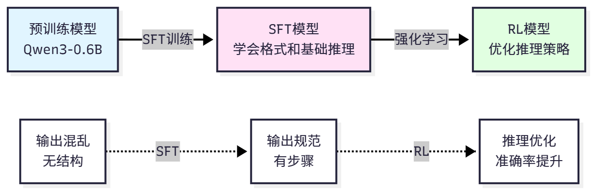

# 背景

**监督微调(Supervised Fine-Tuning， SFT)**是强化学习训练的第一步，也是最重要的基础。

**SFT 让模型学习任务的基本格式、对话模式和初步的推理能力**。

**没有 SFT 的基础，直接进行强化学习往往会失败，因为模型连基本的输出格式都不会**。

# 为什么需要SFT

## 概念

在开始强化学习之前，我们需要先进行 SFT 训练。

因为预训练模型虽然具备强大的语言能力，但它并**不知道如何完成特定任务**。

- **预训练模型的训练目标是预测下一个词**，而**不是解决数学问题或使用工具**。
- **预训练模型的输出格式是自由文本**，而我们**需要结构化的输出**(如"Step 1: ...， Step 2: ...， Final Answer: ...")。
- **预训练模型没有见过任务相关的数据**，不知道**什么是"好的"推理过程**。

**SFT 的作用是：教会模型任务的基本规则**。

- **首先，学习输出格式**，让模型知道如何组织答案(如使用"Step 1"， "Final Answer"等标记)。
- **其次，学习推理模式**，通过示例学习如何分解问题、逐步推导。
- **再次，建立基线能力**，为后续的强化学习提供一个合理的起点。
- **最后，减少探索空间**，强化学习不需要从零开始，可以在 SFT 的基础上优化。

## SFT在训练过程中的作用




# LoRA:参数高效微调

LoRA(Low-Rank Adaptation)只训练少量的额外参数，而保持原模型参数冻结。


LoRA 的核心思想是：模型微调时的参数变化可以用低秩矩阵表示。

## 原理

查看另外一个文档，比这个更详细


假设原模型的权重矩阵为 $W \in \mathbb{R}^{d \times k}$，微调后的权重为 $W' = W + \Delta W$。LoRA 假设 $\Delta W$ 可以分解为两个低秩矩阵的乘积:

$$
\Delta W = BA
$$

其中 $B \in \mathbb{R}^{d \times r}$, $A \in \mathbb{R}^{r \times k}$, $r \ll \min(d, k)$ 是秩(rank)。

前向传播时，输出为:

$$
h = Wx + \Delta Wx = Wx + BAx
$$

原模型参数 $W$ 保持冻结，只训练 $B$ 和 $A$。

参数量对比:原模型参数量为 $d \times k$，LoRA 参数量为 $d \times r + r \times k = r(d + k)$。当 $r \ll \min(d, k)$ 时，LoRA 参数量远小于原模型。例如，对于 $d=4096, k=4096, r=8$ 的情况，原模型参数量为 $4096 \times 4096 = 16,777,216$，LoRA 参数量为 $8 \times (4096 + 4096) = 65,536$，参数量减少了 256 倍!


LoRA 的关键超参数包括:秩(rank，r)，控制 LoRA 矩阵的秩，越大表达能力越强，但参数量也越多，典型值为 4-64，默认 8;Alpha($\alpha$)，LoRA 的缩放因子，实际更新为 $\Delta W = \frac{\alpha}{r} BA$，控制 LoRA 的影响强度，典型值等于 rank;目标模块(target_modules)，指定哪些层应用 LoRA，通常选择注意力层(q_proj， k_proj， v_proj， o_proj)，也可以包括 MLP 层(gate_proj， up_proj， down_proj)。

## SFT 训练实战


完整的训练流程包括:准备数据集、配置 LoRA、设置训练参数、开始训练、保存模型。

基础训练示例:

```python
from hello_agents.tools import RLTrainingTool

# 创建训练工具
rl_tool = RLTrainingTool()

# SFT训练
result = rl_tool.run({
    # 训练配置
    "action": "train",
    "algorithm": "sft",
  
    # 模型配置
    "model_name": "Qwen/Qwen3-0.6B",
    "output_dir": "./models/sft_model",
  
    # 数据配置
    "max_samples": 100,     # 使用100个样本快速测试
  
    # 训练参数
    "num_epochs": 3,        # 训练3轮
    "batch_size": 4,        # 批次大小
    "learning_rate": 5e-5,  # 学习率
  
    # LoRA配置
    "use_lora": True,       # 使用LoRA
    "lora_rank": 8,         # LoRA秩
    "lora_alpha": 16,       # LoRA alpha
})

print(f"\n✓ 训练完成!")
print(f"  - 模型保存路径: {result['model_path']}")
print(f"  - 训练样本数: {result['num_samples']}")
print(f"  - 训练轮数: {result['num_epochs']}")
print(f"  - 最终损失: {result['final_loss']:.4f}")
```

如果训练过程中损失逐渐下降，说明模型正在学习。

## 训练参数详解

### 数据参数


`max_samples`: 使用的训练样本数量。

- 快速测试时可以用 100-1000 个样本，完整训练建议使用全部数据(7473 个样本)。
- 更多数据通常带来更好的效果，但训练时间也更长。

`split`: 数据集划分，默认"train"。

- 可以设置为"train[:1000]"只使用前 1000 个样本。

### 训练参数

`num_epochs`: 训练轮数。

- 1 轮表示遍历整个数据集一次。
- 太少(1-2 轮)可能欠拟合，太多(>10 轮)可能过拟合。
- 建议从 3 轮开始，观察损失曲线调整。

`batch_size`: 每次更新使用的样本数。

- 越大训练越稳定，但显存占用越高。
- 建议根据显存调整:4GB 显存用 batch_size=1-2，8GB 显存用 batch_size=4-8，16GB 显存用 batch_size=8-16。

`learning_rate`: 学习率，控制参数更新的步长。

- 太小(1e-6)收敛慢，太大(1e-3)可能不收敛。
- SFT 推荐 5e-5，LoRA 可以稍大(1e-4)。

### LoRA 参数


`use_lora`: 是否使用 LoRA。建议始终开启，除非有充足的显存。

`lora_rank`: LoRA 秩，控制表达能力。

- 4-8 适合小任务，
- 16-32 适合复杂任务，
- 64 适合大规模微调。

`lora_alpha`: LoRA 缩放因子，通常设置为 rank 的 2 倍。

- rank=8 时，alpha=16;
- rank=16 时，alpha=32。

### 优化器参数


`optimizer`: 优化器类型，默认"adamw"。AdamW 是最常用的选择，也可以尝试"sgd"或"adafactor"等。

`weight_decay`: 权重衰减，防止过拟合。默认 0.01，可以尝试 0.001-0.1。

`warmup_ratio`: 学习率预热比例。

- 前 warmup_ratio 的步数学习率线性增加，然后线性衰减。
- 默认 0.1(前 10%步数预热)。

## 训练监控和调试

需要监控三个关键指标。

- 损失(Loss)应该逐渐下降，如果不下降可能是学习率太小或数据有问题，如果下降后又上升则可能是学习率太大或出现过拟合。
- 梯度范数(Gradient Norm)应该在 0.1-10 的合理范围内，过大(>100)说明出现梯度爆炸需要降低学习率，过小(<0.01)说明梯度消失需要检查模型配置。
- 学习率(Learning Rate)应该按照 warmup 策略变化，前 10%步数线性增加，然后线性衰减到 0。

## 问题及解决方案

显存不足时可以减小 batch_size 或 max_length，使用梯度累积或更小的模型;

训练速度慢时可以增大 batch_size，减少 logging 频率，或使用混合精度训练;

损失不下降时可以增大学习率，检查数据格式，或增加训练轮数;

过拟合时可以增大 weight_decay，减少训练轮数，或使用更多数据。

# 模型评估


训练完成后，我们需要评估模型的效果。

## 评估指标

准确率(Accuracy):答案完全正确的比例，最直接的指标，范围 0-1，越高越好。

平均奖励(Average Reward):所有样本的平均奖励，综合考虑准确率、长度、步骤等因素，范围取决于奖励函数设计。

推理质量(Reasoning Quality):推理过程的清晰度和逻辑性，需要人工评估或使用专门的评估模型。

## HelloAgents 评估模型

使用 HelloAgents 评估模型:


```python
from hello_agents.tools import RLTrainingTool

rl_tool = RLTrainingTool()

# 评估SFT模型
eval_result = rl_tool.run({
    "action": "evaluate",
    "model_path": "./models/sft_full",
    "max_samples": 100,     # 在100个测试样本上评估
    "use_lora": True,
})

eval_data = json.loads(eval_result)
print(f"\n评估结果:")
print(f"  - 准确率: {eval_data['accuracy']}")
print(f"  - 平均奖励: {eval_data['average_reward']}")
print(f"  - 测试样本数: {eval_data['num_samples']}")
```

对于 Qwen3-0.6B 这样的小模型，SFT 后在 GSM8K 上达到 40-50%的准确率是正常的。通过强化学习，我们可以进一步提升到 60-70%。

为了更好地理解 SFT 的效果，我们可以对比不同阶段的模型:

```python
# 评估预训练模型(未经SFT)
base_result = rl_tool.run({
    "action": "evaluate",
    "model_path": "Qwen/Qwen3-0.6B",
    "max_samples": 100,
    "use_lora": False,
})
base_data = json.loads(base_result)

# 评估SFT模型
sft_result = rl_tool.run({
    "action": "evaluate",
    "model_path": "./models/sft_full",
    "max_samples": 100,
    "use_lora": True,
})
sft_data = json.loads(sft_result)

# 对比结果
print("模型对比:")
print(f"预训练模型准确率: {base_data['accuracy']}")
print(f"SFT模型准确率: {sft_data['accuracy']}"
```
