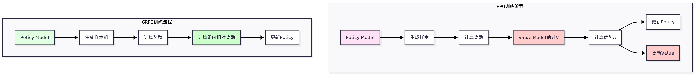

# 背景

在完成 SFT 训练后，我们已经得到了一个能够生成结构化答案的模型。

SFT 模型只是学会了"模仿"训练数据中的推理过程，并没有真正学会"思考"。

强化学习可以让模型通过试错来优化推理策略，从而超越训练数据的质量。

# 从 PPO 到 GRPO

## PPO

在强化学习领域，**PPO(Proximal Policy Optimization)**是最经典的算法之一。

**PPO 通过限制策略更新的幅度，保证训练的稳定性**。

但是，**PPO 在 LLM 训练中存在一些问题**：

- **需要训练 Value Model(价值模型)**，增加了训练复杂度和显存占用;

  - **类比：** 你想学做菜（训练策略），但PPO要求你还得请一个美食评委（Value Model）随时给你打分，告诉你"这道菜大概值几分"。
    - 这个评委本身也得训练，等于**你要同时教两个人**
    - 评委占了一张桌子（显存），做菜的地方就变小了
- 需要**同时维护四个模型**(Policy Model、Reference Model、Value Model、Reward Model)，工程实现复杂;

  - **类比：** 本来你自己学就行，现在得同时供着四个人吃饭（四个模型都要占显存），**厨房根本挤不下！**
  - **代价：** 工程实现超级复杂，显存压力大

| 角色            | 干什么                         | 类比                  |
| --------------- | ------------------------------ | --------------------- |
| Policy Model    | 正在学的学生                   | 🧑‍🍳 正在学做菜的你 |
| Reference Model | 学之前的你（用来对比改了多少） | 📸 你做菜前的照片     |
| Value Model     | 给你预估分数的评委             | 🧑‍⚖️ 美食评委     |
| Reward Model    | 给你实际打分的评委             | 🏆 最终评分员         |

- **训练不稳定，容易出现奖励崩塌或策略退化**。
  - **类比：**
    - 你学了新做法，菜反而变难吃了（策略退化）
    - 评委的分数突然全变成0或全变成满分，你不知道该怎么改进了（奖励崩塌）
  - 为什么会这样？因为四个模型互相影响：
    - 评委水平不行 → 你学的方向就偏了
    - 你进步太快 → 评委跟不上 → 分数乱给 → 你更乱学
    - **一个环节出问题，连锁反应全崩**
  - **代价：** 调参极难，训练经常"跑飞"

PPO 的核心思想是：**在策略梯度更新时，通过限制新策略与旧策略之间的KL散度（或使用截断机制），确保每次更新步幅不会过大，从而在"利用新信息改进策略"和"保持策略稳定性"之间取得平衡。**

简单来说： **别走太远，慢慢来** ——每次策略更新都要和旧策略"贴近"，防止一步更新过大导致性能崩塌，同时又比TRPO实现更简单、训练更高效。

打个比方：

* 你考试考了60分，下次目标是70分
* 如果你一下跳到90分的学习方法，很可能是碰巧了，下次又掉回去
* PPO 就是说： **每次只改一点点，确认有效再继续** ，这样进步虽然慢一点，但稳得住、不会崩

PPO 就像一个 **需要4个老师同时在场、还容易互相打架的补习班** ——太重、太复杂、太难稳住。

## GRPO

**GRPO(Group Relative Policy Optimization)一种简化的 PPO 变体**，专门为 LLM 设计。

为什么后来出现了 **GRPO** 等新算法，核心思路就是：**能不能把评委（Value Model）砍掉，让事情变简单？**

GRPO 的核心思想是:

- 不需要 Value Model，使用组内相对奖励代替绝对奖励;
- 简化训练流程，只需要 Policy Model 和 Reference Model;
- 提高训练稳定性，减少奖励崩塌的风险。

# PPO和FGRPO原理

## PPO 的目标函数

PPO 的目标函数为:

$$
J_{\text{PPO}}(\theta) = \mathbb{E}_{s,a \sim \pi_\theta} \left[ \min\left( \frac{\pi_\theta(a|s)}{\pi_{\text{old}}(a|s)} A(s,a), \text{clip}\left(\frac{\pi_\theta(a|s)}{\pi_{\text{old}}(a|s)}, 1-\epsilon, 1+\epsilon\right) A(s,a) \right) \right]
$$

其中 $A(s,a)$ 是优势函数(Advantage)，需要 Value Model 来估计:

$$
A(s,a) = Q(s,a) - V(s) = r(s,a) + \gamma V(s') - V(s)
$$

## GRPO 的目标函数

GRPO 的目标函数简化为:

$$
J_{\text{GRPO}}(\theta) = \mathbb{E}_{s,a \sim \pi_\theta} \left[ \frac{\pi_\theta(a|s)}{\pi_{\text{ref}}(a|s)} \cdot (r(s,a) - \bar{r}_{\text{group}}) \right] - \beta \cdot D_{KL}(\pi_\theta || \pi_{\text{ref}})
$$

其中 $\bar{r}_{\text{group}}$ 是组内平均奖励，$\beta$ 是 KL 散度惩罚系数。

关键区别在于:

- GRPO 使用 $r(s,a) - \bar{r}_{\text{group}}$ 代替优势函数 $A(s,a)$，不需要 Value Model;
- GRPO 使用组内相对奖励，减少奖励方差;
- GRPO 添加 KL 散度惩罚，防止策略偏离太远。

# 训练流程对比

## PPO

6步，需要分支

步骤③和④：必须请Value Model来预估"这个状态大概值多少分"，才能算出优势A

步骤⑤和⑥： **两个模型都要更新** ，Policy更新策略，Value Model更新估值

Value Model和Policy Model **互相依赖** ：Value不准→A算错→Policy学歪→Value跟着偏→恶性循环

```
Policy Model
    ↓
① 生成样本
    ↓
② 计算奖励（Reward Model打分）
    ↓
③ Value Model 估计 V(s)        ← 🔴 需要额外模型！
    ↓
④ 计算优势 A = r + γV(s') - V(s)   ← 🔴 依赖Value Model！
    ↓          ↓
⑤ 更新Policy   ⑥ 更新Value Model    ← 🔴 两个模型要同时更新！
```

## GRPO

5步，一条直线

步骤①：同一道题生成**一组**回答（比如8个），而不是只生成1个

步骤③：用**组内平均分**当基线，不需要Value Model预测

步骤④：只更新Policy，没有Value Model要更新

```
Policy Model
    ↓
① 生成样本组（同一道题生成多个回答）   ← 🟢 关键区别！
    ↓
② 计算奖励（Reward Model打分）
    ↓
③ 计算组内相对奖励 = r - r̄_group    ← 🟢 替代了Value Model的功能！
    ↓
④ 更新Policy                         ← 🟢 只更新一个模型！
```


## 区别

GRPO 省去了 Value Model 的训练，大大简化了流程。

- **PPO：** 生成一个回答 → 请评委打预估分 → 算差值 → 同时更新两个人 → 容易互相打架
- **GRPO：** 生成一组回答 → 组内比谁好 → 只更新自己 → 简单纯粹不出岔子



对于 LLM 训练，GRPO 是更好的选择，因为它更简单、更稳定、显存占用更低。

| 对比项           | PPO                              | GRPO                           |
| ---------------- | -------------------------------- | ------------------------------ |
| 采样方式         | 每道题生成**1个**回答      | 每道题生成**一组**回答   |
| 怎么判断"好不好" | Value Model预测 → 算优势A       | 组内互相比较 → r - r̄*group  |
| 需要几个模型     | 4个（Policy+Ref+Value+Reward）   | **2个** （Policy+Ref）   |
| 更新几个模型     | **2个** （Policy + Value） | **1个** （只更新Policy） |
| 流程结构         | 有分支（两条更新路径）           | **一条直线** （无分支）  |
| 稳定性           | 四模型互相影响，容易崩           | 只有Policy在变，更稳           |

# GRPO 训练实战

使用 HelloAgents 进行 GRPO 训练。

**GRPO 训练的前提是已经完成 SFT 训练，因为 GRPO 需要一个合理的初始策略**。

基础 GRPO 训练示例：如果 GRPO 训练过程中平均奖励逐渐提升，KL 散度保持在合理范围内，说明训练正常进行。

```python
from hello_agents.tools import RLTrainingTool

# 创建训练工具
rl_tool = RLTrainingTool()

# GRPO训练
result = rl_tool.run({
    # 训练配置
    "action": "train",
    "algorithm": "grpo",
  
    # 模型配置
    "model_name": "./models/sft_full",  # 从SFT模型开始
    "output_dir": "./models/grpo_model",
  
    # 数据配置
    "max_samples": 100,     # 使用100个样本快速测试
  
    # 训练参数
    "num_epochs": 3,
    "batch_size": 4,
    "learning_rate": 1e-5,  # GRPO学习率通常比SFT小
  
    # GRPO特定参数
    "num_generations": 4,   # 每个问题生成4个答案
    "kl_coef": 0.05,        # KL散度惩罚系数
  
    # LoRA配置
    "use_lora": True,
    "lora_rank": 16,
    "lora_alpha": 32,
  
    # 奖励函数配置
    "reward_type": "accuracy",  # 使用准确率奖励
})

print(f"\n✓ 训练完成!")
print(f"  - 模型保存路径: {result['model_path']}")
print(f"  - 训练样本数: {result['num_samples']}")
print(f"  - 训练轮数: {result['num_epochs']}")
print(f"  - 平均奖励: {result['average_reward']:.4f}")
```


# 参数理解和调优

## 生成参数


`num_generations`: 每个问题生成多少个答案。

- 越多越好，但计算成本也越高。
- 典型值为 4-8。
- 生成多个答案的目的是计算组内相对奖励，增加训练信号的多样性。

`max_new_tokens`: 每个答案最多生成多少个 token。

- 太少可能截断答案，太多浪费计算。
- 建议 256-512。

`temperature`: 生成温度，控制随机性。

- 0 表示贪婪解码，1 表示标准采样。
- GRPO 建议 0.7-1.0，保持一定的探索性。

## 优化参数


`learning_rate`: GRPO 的学习率通常比 SFT 小，因为我们不想偏离 SFT 模型太远。

- 建议 1e-5 到 5e-5。

`kl_coef`: KL 散度惩罚系数，控制策略更新的幅度。

- 太小(0.01)可能导致策略偏离太远，太大(0.5)可能限制学习。
- 建议 0.05-0.1。

`clip_range`: 策略比率裁剪范围，类似 PPO 的 epsilon。

- 建议 0.2。

## 奖励参数


`reward_type`: 奖励函数类型，可以是"accuracy"、"length_penalty"、"step"或"combined"。

`reward_config`: 奖励函数的额外配置，如长度惩罚的目标长度、步骤奖励的系数等。

# 最佳实践


进行一次完整的 GRPO 训练，使用全部数据和最佳实践:

```python
from hello_agents.tools import RLTrainingTool

rl_tool = RLTrainingTool()

# 完整GRPO训练
result = rl_tool.run({
    "action": "train",
    "algorithm": "grpo",

    # 模型配置
    "model_name": "./models/sft_full",
    "output_dir": "./models/grpo_full",
  
    # 数据配置
    "max_samples": None,    # 使用全部数据
  
    # 训练参数
    "num_epochs": 3,
    "batch_size": 4,
    "learning_rate": 1e-5,
    "warmup_ratio": 0.1,
  
    # GRPO特定参数
    "num_generations": 4,
    "max_new_tokens": 512,
    "temperature": 0.8,
    "kl_coef": 0.05,
    "clip_range": 0.2,
  
    # LoRA配置
    "use_lora": True,
    "lora_rank": 16,
    "lora_alpha": 32,
  
    # 奖励函数配置
    "reward_type": "combined",
    "reward_config": {
        "components": [
            {"type": "accuracy", "weight": 1.0},
            {"type": "length_penalty", "weight": 0.5, "target_length": 200},
            {"type": "step", "weight": 0.3, "step_bonus": 0.1}
        ]
    },
  
    # 其他配置
    "save_steps": 500,
    "logging_steps": 100,
})

print(f"训练完成! 模型保存在: {result['model_path']}")
```

# GRPO 训练过程解析

## （1）训练循环

### 训练步骤


GRPO 的训练循环包括以下步骤:

1. **采样阶段** ：对于**每个问题，使用当前策略生成多个答案**(`num_generations`个)。这些**答案构成一个"组"**，用于计算相对奖励。
2. **奖励计算**：对**每个生成的答案计算奖励 $r_i$**。奖励可以是准确率、长度惩罚、步骤奖励或它们的组合。
3. **相对奖励**：计算组内**平均奖励** $\bar{r} = \frac{1}{N}\sum_{i=1}^{N} r_i$，然后**计算相对奖励** $\hat{r}_i = r_i - \bar{r}$。这样做的好处是减少奖励方差，使训练更稳定。
4. **策略更新**：使用**相对奖励更新策略，同时添加 KL 散度惩罚**，防止策略偏离参考模型太远。
5. **重复**：重复上述步骤，直到完成所有训练轮次。

### 示例


通过一个具体例子来理解：可以看到，**相对奖励机制鼓励模型生成"比平均水平更好"的答案**，而不是简单地追求高奖励。这样可以**减少奖励方差，提高训练稳定性**。

```python
# 假设我们有一个问题
question = "What is 48 + 24?"

# 生成4个答案
answers = [
    "48 + 24 = 72. Final Answer: 72",      # 正确
    "48 + 24 = 72. Final Answer: 72",      # 正确
    "48 + 24 = 70. Final Answer: 70",      # 错误
    "Let me think... 72. Final Answer: 72" # 正确但冗长
]

# 计算奖励(假设使用准确率 + 长度惩罚)
rewards = [1.0, 1.0, 0.0, 0.8]  # 第4个答案因为冗长被惩罚

# 计算组内平均奖励
avg_reward = (1.0 + 1.0 + 0.0 + 0.8) / 4 = 0.7

# 计算相对奖励
relative_rewards = [
    1.0 - 0.7 = 0.3,   # 正确且简洁,相对奖励为正
    1.0 - 0.7 = 0.3,   # 正确且简洁,相对奖励为正
    0.0 - 0.7 = -0.7,  # 错误,相对奖励为负
    0.8 - 0.7 = 0.1    # 正确但冗长,相对奖励较小
]

# 策略更新:增加前两个答案的概率,减少第三个答案的概率
```

## （2）KL 散度惩罚


KL 散度惩罚是 GRPO 的关键组成部分，它防止策略偏离参考模型太远。

KL 散度定义为:

$$
D_{KL}(\pi_\theta || \pi_{\text{ref}}) = \mathbb{E}_{s,a \sim \pi_\theta} \left[ \log \frac{\pi_\theta(a|s)}{\pi_{\text{ref}}(a|s)} \right]
$$

在实践中，我们**计算每个 token 的 KL 散度，然后求和:**

$$
D_{KL} = \sum_{t=1}^{T} \log \frac{\pi_\theta(a_t|s, a_{<t})}{\pi_{\text{ref}}(a_t|s, a_{<t})}
$$

KL 散度越大，说明当前策略与参考模型差异越大。


通过添加 KL 散度惩罚项 $-\beta \cdot D_{KL}$，我们限制策略更新的幅度，避免"遗忘"SFT 阶段学到的知识。

`kl_coef` ($\beta$) 的选择很重要:

- 太小(0.01)：策略可能偏离太远，导致输出格式混乱或质量下降
- 太大(0.5)：策略更新受限，学习缓慢，难以超越 SFT 模型
- 建议(0.05-0.1)：平衡探索和稳定性

## （3）训练监控

### 监控指标

在 GRPO 训练过程中，我们需要监控以下指标:

**平均奖励(Average Reward)**：**应该逐渐上**升。

- 如果**奖励不上升**，可能是学习率太小、KL 惩罚太大、奖励函数设计不合理。
- 如果**奖励先升后降**，可能是**过拟合或奖励崩塌**。

**KL 散度(KL Divergence)**：应该保持在合理范围内(0.01-0.1)。

- 如果 KL 散度过大(>0.5)，说明策略偏离太远，需要增大 kl_coef 或降低学习率。
- 如果 KL 散度过小(<0.001)，说明策略几乎没有更新，需要减小 kl_coef 或增大学习率。

**准确率(Accuracy)**：应该逐渐提升。这是最直观的指标，反映模型的实际能力。

**生成质量(Generation Quality)**：需要人工检查生成的答案，确保格式正确、推理清晰。

# 训练监控工具

## Weights & Biases(推荐)


Weights & Biases 是目前最流行的机器学习实验跟踪平台，提供了强大的可视化和实验管理功能。


wandb 会自动记录以下指标:

- `train/reward`: 平均奖励
- `train/kl`: KL 散度
- `train/loss`: 训练损失
- `train/learning_rate`: 学习率
- `train/epoch`: 训练轮数


```python
import os

# 1. 设置wandb(需要先注册账号: https://wandb.ai)
os.environ["WANDB_PROJECT"] = "hello-agents-grpo"  # 项目名称
os.environ["WANDB_LOG_MODEL"] = "false"            # 不上传模型文件

# 2. 在训练配置中启用wandb
result = rl_tool.run({
    "action": "train",
    "algorithm": "grpo",
    "model_name": "Qwen/Qwen3-0.6B",
    "output_dir": "./models/grpo_monitored",
    "num_epochs": 2,
    "batch_size": 2,
    "use_lora": True,
    # wandb会自动记录所有训练指标
})

# 训练完成后,访问 https://wandb.ai 查看训练曲线
```

## TensorBoard


TensorBoard 是 TensorFlow 提供的可视化工具，也支持 PyTorch 训练。

```python
# 1. 训练时会自动在output_dir下创建tensorboard日志
result = rl_tool.run({
    "action": "train",
    "algorithm": "grpo",
    "model_name": "Qwen/Qwen3-0.6B",
    "output_dir": "./models/grpo_tb",
    "num_epochs": 2,
    "batch_size": 2,
    "use_lora": True,
})

# 2. 启动TensorBoard查看训练曲线
# 在命令行运行:
# tensorboard --logdir=./models/grpo_tb
# 然后访问 http://localhost:6006
```

## 离线监控(无需外部工具)


如果不想使用 wandb 或 TensorBoard，也可以通过训练日志进行监控:

```python
# 训练过程会打印详细日志
result = rl_tool.run({
    "action": "train",
    "algorithm": "grpo",
    "model_name": "Qwen/Qwen3-0.6B",
    "output_dir": "./models/grpo_simple",
    "num_epochs": 2,
    "batch_size": 2,
    "use_lora": True,
})

# 日志示例:
# Epoch 1/2 | Step 100/500 | Reward: 0.45 | KL: 0.023 | Loss: 1.234
# Epoch 1/2 | Step 200/500 | Reward: 0.52 | KL: 0.031 | Loss: 1.156
# ...
```

# 调试建议


在 GRPO 训练中，可能会遇到一些问题。

**当奖励不上升**时：

- 可能是学习率太小或 KL 惩罚太大限制了策略更新，
- 也可能是奖励函数设计不合理或 SFT 模型质量太差，此时可以增大学习率(从 1e-5 到 5e-5)、减小 kl_coef(从 0.1 到 0.05)、检查奖励函数或重新训练 SFT 模型。

**当 KL 散度爆炸(超过 0.5 甚至 1.0)导致生成答案格式混乱时**，

- 通常是学习率太大或 KL 惩罚太小，或者奖励函数过于激进，可以降低学习率(从 5e-5 到 1e-5)、增大 kl_coef(从 0.05 到 0.1)、调整奖励函数或使用梯度裁剪。

当生成质量下降(准确率提升但格式混乱、推理不清晰)时，

- 可能是奖励函数只关注准确率忽略了其他质量指标，
- 或 KL 惩罚太小导致模型偏离 SFT 太远，
- 或出现过拟合，
- **此时应使用组合奖励函数同时优化多个指标、增大 kl_coef 保持一致性、减少训练轮数或增加训练数据**。

**GRPO 训练的显存占用比 SFT 高**，因为**需要同时生成多个答案并存储参考模型输出**，容易出现 OOM。

- 可以通过**减小 num_generations(从 8 到 4)、batch_size(从 4 到 2)或 max_new_tokens(从 512 到 256)**，
- 或使用梯度检查点和混合精度训练来缓解。
