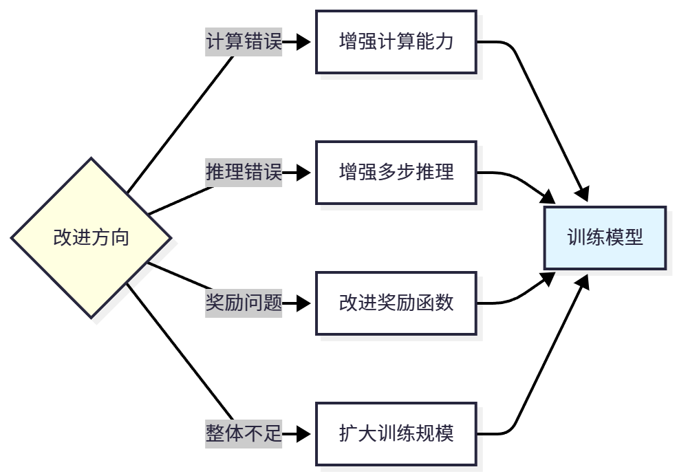

# 背景

训练完成后，我们需要全面评估模型的性能，不仅要看准确率这一个指标，还要深入分析模型的推理质量、错误模式、泛化能力等。

# 评估指标体系

我们将评估指标分为三类:准确性指标、效率指标、质量指标。

## 准确性指标

准确性指标**衡量模型是否能够得出正确答案**。

### 准确率(Accuracy)

**准确率(Accuracy)**：最基本的指标，答案完全正确的比例。

计算公式为:

$$
\text{Accuracy} = \frac{\text{正确答案数}}{\text{总问题数}}
$$

优点是简单直观，易于理解和比较。

缺点是无法区分"接近正确"和"完全错误",对于复杂任务可能过于粗糙。

### Top-K

**Top-K 准确率：生成 K 个答案，只要有一个正确就算对**。

计算公式为:

$$
\text{Accuracy@K} = \frac{\text{至少有一个正确答案的问题数}}{\text{总问题数}}
$$

这个**指标反映了模型的"潜力"**，即通过多次采样能否找到正确答案。

### 数值误差

**数值误差(Numerical Error)：对于数学问题，可以计算预测值与真实值的误差**。

计算公式为:

$$
\text{Error} = \frac{1}{N} \sum_{i=1}^{N} |y_i - \hat{y}_i|
$$

这个指标可以**区分"接近正确"(如预测 72.5，真实 72)和"完全错误"(如预测 100，真实 72)**。

## 效率指标

效率指标**衡量模型生成答案的成本**。

### 平均长度


平均长度(Average Length)：生成答案的平均 token 数。

计算公式为:

$$
\text{Avg Length} = \frac{1}{N} \sum_{i=1}^{N} |y_i|
$$

更**短的答案意味着更低的推理成本和更快的响应速度**。

### 推理步骤数

推理步骤数(Reasoning Steps)：答案中包含的推理步骤数量。

计算公式为:

$$
\text{Avg Steps} = \frac{1}{N} \sum_{i=1}^{N} s_i
$$

适当的步骤数(2-5 步)说明模型能够系统地分解问题，

过多的步骤可能说明推理冗余。

### 推理时间

推理时间(Inference Time)：生成一个答案所需的时间。

这个指标在实际部署中很重要，影响用户体验。

## 质量指标


质量指标**衡量答案的可读性和可解释性**。

### 格式正确率

格式正确率(Format Correctness)：答案是否符合预期格式(如包含"Step 1"， "Final Answer"等标记)。

计算公式为:

$$
\text{Format Correctness} = \frac{\text{格式正确的答案数}}{\text{总答案数}}
$$

格式正确是基本要求，格式混乱的答案即使结果正确也难以使用。

### 推理连贯性

推理连贯性(Reasoning Coherence)：推理步骤之间是否逻辑连贯。

这个指标通常需要人工评估或使用专门的评估模型。

### 可解释性

可解释性(Explainability)：答案是否容易理解和验证。

包含清晰步骤的答案比直接给出结果的答案更具可解释性。

## 指标对比


| 类别   | 指标                | 优点         | 缺点           |
| ------ | ------------------- | ------------ | -------------- |
| 准确性 | Accuracy            | 简单直观     | 过于粗糙       |
| 准确性 | Accuracy@K          | 反映潜力     | 需要多次采样   |
| 准确性 | Numerical Error     | 细粒度       | 仅适用数值任务 |
| 效率   | Avg Length          | 反映成本     | 不考虑质量     |
| 效率   | Avg Steps           | 反映推理风格 | 难以量化       |
| 质量   | Forimat Correctness | 易于检测     | 不保证正确性   |
| 质量   | Coherence           | 全面评估     | 需要人工       |

# 评估实战


HelloAgents 提供了全面的评估功能，可以一次性计算多个指标。

```python
from hello_agents.tools import RLTrainingTool

rl_tool = RLTrainingTool()

# 全面评估
print("=" * 50)
print("全面评估GRPO模型")
print("=" * 50)

result = rl_tool.run({
    "action": "evaluate",
    "model_path": "./models/grpo_full",
    "max_samples": 200,
    "use_lora": True,
  
    # 评估配置
    "metrics": [
        "accuracy",           # 准确率
        "accuracy_at_k",      # Top-K准确率
        "average_length",     # 平均长度
        "average_steps",      # 平均步骤数
        "format_correctness", # 格式正确率
    ],
    "k": 3,  # Top-3准确率
})

# 解析结果
eval_data = json.loads(result)

# 打印结果
print(f"\n评估结果:")
print(f"  准确率: {eval_data['accuracy']}")
print(f"  平均奖励: {eval_data['average_reward']}")
print(f"  测试样本数: {eval_data['num_samples']}")
```

我们可以对比预训练模型、SFT 模型、GRPO 模型的性能:

```python
# 评估三个模型
models = [
    ("预训练模型", "Qwen/Qwen3-0.6B", False),
    ("SFT模型", "./models/sft_full", True),
    ("GRPO模型", "./models/grpo_full", True),
]

results = []
for name, path, use_lora in models:
    print(f"\n评估{name}...")
    result = rl_tool.run({
        "action": "evaluate",
        "model_path": path,
        "max_samples": 200,
        "use_lora": use_lora,
        "metrics": ["accuracy", "average_length", "format_correctness"],
    })
    results.append((name, result))

# 打印对比表格
print("\n" + "=" * 70)
print(f"{'模型':<15} {'准确率':<12} {'平均长度':<15} {'格式正确率':<12}")
print("=" * 70)
for name, result in results:
    print(f"{name:<15} {result['accuracy']:<12.2%} {result['average_length']:<15.1f} {result['format_correctness']:<12.2%}")
print("=" * 70)
```

# 错误分析

## 背景及分类

深入分析模型在哪些类型的问题上容易出错，从而指导后续改进。

模型的错误可以分为四类:

- **计算错误**(推理步骤正确但计算出错，如"48/2=25"，说明数值计算能力不足)、
- **推理错误**(推理逻辑错误导致解题思路不对，如先加后除而非先除后加，说明逻辑推理能力不足)、
- **理解错误**(没有正确理解问题，如问题问"总共"但只计算了一部分，说明语言理解能力不足)、
- **格式错误**(答案正确但格式不符合要求，如缺少"Final Answer:"标记，说明格式学习不足)。

## 示例

### 相同难度问题

错误分析示例:

```python
from hello_agents.tools import RLTrainingTool

rl_tool = RLTrainingTool()

# 评估并收集错误样本
result = rl_tool.run({
    "action": "evaluate",
    "model_path": "./models/grpo_full",
    "max_samples": 200,
    "use_lora": True,
    "return_details": True,  # 返回详细结果
})

# 分析错误样本
errors = result['errors']  # 错误样本列表
print(f"总错误数: {len(errors)}")

# 按错误类型分类
error_types = {
    "计算错误": 0,
    "推理错误": 0,
    "理解错误": 0,
    "格式错误": 0,
}

for error in errors:
    question = error['question']
    prediction = error['prediction']
    ground_truth = error['ground_truth']
  
    # 简单的错误分类逻辑(实际应用中可能需要更复杂的分析)
    if "Final Answer:" not in prediction:
        error_types["格式错误"] += 1
    elif "Step" in prediction:
        # 有推理步骤,可能是计算或推理错误
        # 这里需要更细致的分析
        error_types["计算错误"] += 1
    else:
        error_types["理解错误"] += 1

# 打印错误分布
print("\n错误类型分布:")
for error_type, count in error_types.items():
    percentage = count / len(errors) * 100
    print(f"  {error_type}: {count} ({percentage:.1f}%)")
```

输出示例:

```bash
总错误数: 76

错误类型分布:
  计算错误: 32 (42.1%)
  推理错误: 18 (23.7%)
  理解错误: 22 (28.9%)
  格式错误: 4 (5.3%)
```

可以看到，计算错误是最主要的错误类型(42.1%)，说明模型的数值计算能力需要加强。格式错误很少(5.3%)，说明 SFT 训练效果良好。

### 不同难度问题

还可以分析模型在不同难度的问题上的表现:

```python
# 按推理步骤数分组
step_groups = {
    "简单(1-2步)": [],
    "中等(3-4步)": [],
    "困难(5+步)": [],
}

for sample in result['details']:
    steps = sample['ground_truth_steps']  # 真实答案的步骤数
    correct = sample['correct']
  
    if steps <= 2:
        step_groups["简单(1-2步)"].append(correct)
    elif steps <= 4:
        step_groups["中等(3-4步)"].append(correct)
    else:
        step_groups["困难(5+步)"].append(correct)

# 计算每组的准确率
print("\n不同难度的准确率:")
for group_name, results in step_groups.items():
    if len(results) > 0:
        accuracy = sum(results) / len(results)
        print(f"  {group_name}: {accuracy:.2%} ({len(results)}个样本)")
```

输出示例:

```bash
不同难度的准确率:
  简单(1-2步): 78.50% (85个样本)
  中等(3-4步): 58.30% (96个样本)
  困难(5+步): 31.60% (19个样本)
```

可以看到，模型在简单问题上表现良好(78.5%)，但在困难问题上表现较差(31.6%)。这说明模型的多步推理能力还有待提升

# 改进方向

是一个持续迭代的过程：**训练模型 → 评估性能 → 分析错误 → 确定问题 → 选择改进方向 → 重新训练**。

通过多次迭代，模型性能会不断提升。


