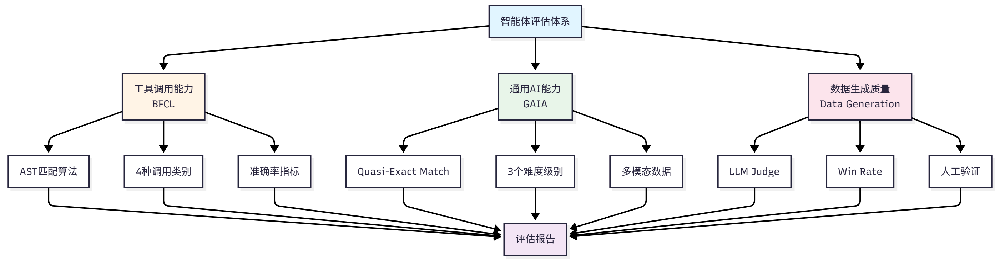

# 背景

在构建智能体系统时，我们还需要解决一个核心问题：如何客观地评估智能体的性能？

主要是要回答以下问题：

1. 智能体是否具备预期的能力？
2. 在不同任务上的表现如何？
3. 与其他智能体相比处于什么水平？

# 为何需要智能体评估

智能体能正常工作，但我们面临一个核心问题：这些问题都需要通过系统化的评估来解决。

- 如何客观地评估它的性能？
- 当我们优化提示词或更换 LLM 模型后，如何知道是否真的有改进？
- 在部署到生产环境前，如何保证智能体的可靠性？

智能体评估的**核心价值：提供标准化的方法来衡量智能体的能力，** 通过评估，我们可以用具体的数字指标量化智能体的表现，

* **客观比较**不同设计**方案的优劣**，
* **及时发现**智能体在特定场景下的弱点，
* 并向用户**证明智能体的可靠性**。

智能体评估**面临的挑战**

- 首先是**输出的不确定性**，同一问题可能有多个正确答案，**很难用简单的对错来判断**。
- 其次是**评估标准的多样性**，不同任务需要**不同的评估方法**，
  - **工具调用需要检查函数签名**，
  - **问答任务需要评估语义相似度**。
- 最后是**评估成本的高昂**，每次评估都需要大量的 API 调用，成本可能达到数百元甚至更多。

# 主流评估基准概览

## （1）工具调用能力评估

工具调用是智能体的核心能力之一。

**智能体需要理解用户意图，选择合适的工具，并正确构造函数调用**。

相关的评估基准包括：

- **BFCL (Berkeley Function Calling Leaderboard)**：UC Berkeley 推出，包含 1120+测试样本，涵盖 simple、multiple、parallel、irrelevance 四个类别，使用 AST 匹配算法评估，数据集规模适中，社区活跃。
- **ToolBench** ：清华大学推出，包含 16000+真实 API 调用场景，覆盖真实世界的复杂工具使用场景。
- **API-Bank**：Microsoft Research 推出，包含 53 个常用 API 工具，专注于评估**智能体对 API 文档的理解和调用能力**。

## （2）通用能力评估

**评估智能体在真实世界任务中的综合表现**，

包括多步推理、知识运用、多模态理解等能力：

- **GAIA (General AI Assistants)**：Meta AI 和 Hugging Face 联合推出，包含 466 个真实世界问题，
  - 分为 Level 1/2/3 三个难度级别，评估多步推理、工具使用、文件处理、网页浏览等能力
  - 使用**准精确匹配（Quasi Exact Match）算法，任务真实且综合性强**。
- **AgentBench**：清华大学推出，包含 8 个不同领域的任务，全面评估智能体的通用能力。
- **WebArena**：CMU 推出，评估智能体在**真实网页环境中的任务完成能力和网页交互能力**。

## （3）多智能体协作评估

**评估多个智能体协同工作的能力**：

- **ChatEval** ：评估多智能体**对话系统**的质量。
- **SOTOPIA** ：评估智能体在**社交场景中的互动能力**。
- **自定义协作场景**：根据**具体应用场景设计的评估任务**。

## （4）常用评估指标

**不同基准使用不同的评估指标**，

常见的包括：

- **准确性指标** ：用于衡量答案的正确性。
  - Accuracy（准确率）、
  - Exact Match（精确匹配）、
  - F1 Score（F1 分数），
- **效率指标**：用于衡量执行效率。
  - Response Time（响应时间）、
  - Token Usage（Token 使用量），
- **鲁棒性指标**：用于衡量容错能力。
  - Error Rate（错误率）、
  - Failure Recovery（故障恢复），
- **协作指标**：用于衡量协作效果。
  - Communication Efficiency（通信效率）、
  - Task Completion（任务完成度），

# 评估体系设计

重点介绍以下评估场景：

**BFCL：评估工具调用能力**

- 选择理由：数据集规模适中，评估指标清晰，社区活跃
- 适用场景：评估智能体的函数调用准确性

**GAIA ：评估通用 AI 助手能力**

- 选择理由：任务真实，难度分级，综合性强
- 适用场景：评估智能体的综合问题解决能力

**数据生成质量评估：评估 LLM 生成数据质量**

- 选择理由：通过这个案例可以完整体验如何使用 Agent 创造数据，评估数据的完整演示。
- 适用场景：评估生成的训练数据、测试数据的质量
- **评估方法：LLM Judge、Win Rate、人工验证**

评估系统构建思路：

