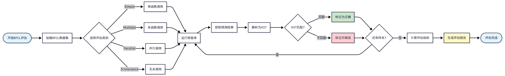
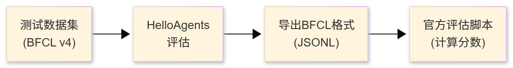

# BFCL 基准介绍

在智能体系统中，工具调用（Tool Calling）是核心能力之一。

BFCL：工具调用能力评估

智能体需要完成以下任务：

1. **理解任务需求**：从用户的自然语言描述中**提取关键信息**
2. **选择合适工具**：从可用工具集中**选择最适合的工具**
3. **构造函数调用**：正确填**写函数名和参数**
4. **处理复杂场景**：支持**多函数调用、并行调用等高级场景**

# 四个评估类别

BFCL 基准包含四个评估类别

- 从最基础的**单函数调用（Simple）**开始，
- 逐步增加到需要**调用多个函数的场景（Multiple）**，
- 再到需要**并行调用多个函数的复杂场景（Parallel）**，
- 最后是需要**判断是否需要调用函数的场景（Irrelevance）**。


| 类别        | 描述                     | 示例                                                   |
| ----------- | ------------------------ | ------------------------------------------------------ |
| Simple      | 简单的单函数调用         | "查询今天北京的天气”→get_weather(city="北京")        |
| Multiple    | 需要调用多个不同函数     | “查询天气并设置提醒”→getweather（）+setreminder（） |
| Parallel    | 需要并行调用多个函数     | “同时查询北京和上海的天气”→并行调用getweather（）   |
| Irrelevance | 识别不需要调用函数的情况 | ”你好”→不调用任何函数                               |

# 评估流程

BFCL 的评估流程遵循标准的基准测试流程：

- 首先**加载数据集并选择评估类别**，
- 然后**运行智能体获取预测结果**，
- 接着将**预测结果解析为抽象语法树（AST）**，
- 最后**通过 AST 匹配算法判断预测是否正确**。

整个流程会遍历所有测试样本，最终计算出准确率等评估指标并生成评估报告。



# BFCL 数据集结构

BFCL 数据集采用 JSON 格式，每个测试样本包含以下字段：关键字段说明：

- `question`: 用户的自然语言请求
- `function`: 可用的函数列表（包含函数签名和描述）
- `ground_truth`: 标准答案（期望的函数调用）

```json
{
  "id": "simple_001",
  "question": "What's the weather like in Beijing today?",
  "function": [
    {
      "name": "get_weather",
      "description": "Get the current weather for a location",
      "parameters": {
        "type": "object",
        "properties": {
          "location": {
            "type": "string",
            "description": "The city name"
          }
        },
        "required": ["location"]
      }
    }
  ],
  "ground_truth": [
    {
      "name": "get_weather",
      "arguments": {
        "location": "Beijing"
      }
    }
  ]
}
```

# AST 匹配说明

BFCL 使用 **AST 匹配（Abstract Syntax Tree Matching）**作为核心评估算法

BFCL 使用抽象语法树（AST）进行**智能匹配，而不是简单的字符串匹配**。

AST 匹配的**核心思想是：将函数调用解析为语法树，然后比较树的结构和节点值**


给定预测的函数调用 $P$ 和标准答案 $G$，AST 匹配函数定义为：

- 其中 $\text{AST}(x)$ 表示将函数调用解析为抽象语法树，
- $\equiv$ 表示语法树等价。

$$
\text{AST\_Match}(P, G) = \begin{cases}
1 & \text{if } \text{AST}(P) \equiv \text{AST}(G) \\
0 & \text{otherwise}
\end{cases}
$$

**两个语法树等价**需要满足三个核心条件：

- **函数名必须完全一致（精确匹配）**，
- **参数键值对集合相等（忽略顺序）**，
- 以及**每个参数的值在语义上等价（例如 `2+3` 等价于 `5`）**。


在**具体的匹配过程中**，

- **函数名匹配要求字符串精确匹配**，例如 `get_weather` 和 `get_temperature` 被视为不同的函数。
- **参数匹配则使用 AST 进行智能比较**，
  - 允许参数顺序不同（`f(a=1, b=2)` 等价于 `f(b=2, a=1)`），
  - 允许等价表达式（`f(x=2+3)` 等价于 `f(x=5)`），
  - 也允许不同的字符串表示（`f(s="hello")` 等价于 `f(s='hello')`）。
- 对于**多函数调用的场景**，匹配算法要求调用**相同数量的函数**，每个函数调用**都必须匹配**，但调用**顺序可以不同**（使用集合匹配）。
  - **数量必须一样** —— 标准答案调用了 3 个函数，你也必须调用 3 个函数
  - **每个函数调用都要对得上** —— 函数名、参数都得匹配
  - **顺序无所谓** —— 你先调用哪个、后调用哪个，不影响判断结果


AST 匹配示例

```python
# 示例1：参数顺序不同（匹配成功）
预测: get_weather(city="Beijing", unit="celsius")
标准: get_weather(unit="celsius", city="Beijing")
结果: ✅ 匹配成功

# 示例2：等价表达式（匹配成功）
预测: calculate(x=2+3)
标准: calculate(x=5)
结果: ✅ 匹配成功

# 示例3：函数名错误（匹配失败）
预测: get_temperature(city="Beijing")
标准: get_weather(city="Beijing")
结果: ❌ 匹配失败

# 示例4：参数值错误（匹配失败）
预测: get_weather(city="Shanghai")
标准: get_weather(city="Beijing")
结果: ❌ 匹配失败
```

# BFCL 评估指标

FCL 使用以下指标评估智能体性能：

## 准确率 (Accuracy)

准确率是最核心的指标，定义为 AST 匹配成功的样本比例：

$$
\text{Accuracy} = \frac{1}{N} \sum_{i=1}^{N} \text{AST\_Match}(P_i, G_i)
$$

其中：

- $N$ 是总样本数
- $P_i$ 是第 $i$ 个样本的预测结果
- $G_i$ 是第 $i$ 个样本的标准答案
- $\text{AST\_Match}(P_i, G_i) \in \{0, 1\}$ 是 AST 匹配函数

## AST 匹配率 (AST Match Rate)

与准确率相同，强调使用 AST 匹配算法：

$$
\text{AST Match Rate} = \text{Accuracy}
$$


## 分类准确率 (Category-wise Accuracy)

对于每个类别 $c \in \{\text{simple}, \text{multiple}, \text{parallel}, \ldots\}$，计算该类别的准确率：

$$
\text{Accuracy}_c = \frac{1}{|D_c|} \sum_{i \in D_c} \text{AST\_Match}(P_i, G_i)
$$

其中 $D_c$ 是类别 $c$ 的样本集合，$|D_c|$ 是该类别的样本数。


分类准确率示例：

```python
# 假设评估结果
simple_accuracy = 0.95      # Simple类别：95%正确
multiple_accuracy = 0.82    # Multiple类别：82%正确
parallel_accuracy = 0.68    # Parallel类别：68%正确

# 加权准确率（假设权重相等）
weighted_accuracy = (0.95 + 0.82 + 0.68) / 3 = 0.817
```


## 加权准确率 (Weighted Accuracy)

考虑不同类别的难度权重：

$$
\text{Weighted Accuracy} = \sum_{c} w_c \cdot \text{Accuracy}_c
$$

其中 $w_c$ 是类别 $c$ 的权重，满足 $\sum_c w_c = 1$。

## 错误率 (Error Rate)

未能正确调用函数的样本比例：

$$
\text{Error Rate} = 1 - \text{Accuracy} = \frac{1}{N} \sum_{i=1}^{N} (1 - \text{AST\_Match}(P_i, G_i))
$$

指标解释：

- Accuracy = 1.0：所有样本都完全正确
- Accuracy = 0.8：80%的样本正确，20%的样本错误
- Accuracy = 0.0：所有样本都错误

# BFCL 官方评估工具

使用官方评估工具的优势在于：它使用官方的 AST 匹配算法，**评估结果与排行榜完全一致，支持所有 BFCL v4 类别，并且能够自动生成详细的评估报告**。

BFCL 提供官方 CLI 工具进行评估：

```bash
# 安装BFCL评估工具
pip install bfcl

# 运行官方评估
bfcl evaluate \
    --model-result-path ./results.json \
    --test-category simple_python
```

# 获取 BFCL 数据集

BFCL 数据集可以通过以下方式获取：

## GitHub（推荐）

方法 1：从官方 GitHub 仓库克隆（推荐）

推荐这种方式的**原因**是：它包含完整的 ground truth（标准答案），数据格式与官方评估工具完全一致，可以直接使用官方评估脚本，并且支持 BFCL v4 最新版本。

这是最可靠的方式，可以获取完整的数据集和 ground truth：

```bash
# 克隆BFCL仓库
git clone https://github.com/ShishirPatil/gorilla.git temp_gorilla
cd temp_gorilla/berkeley-function-call-leaderboard

# 查看BFCL v4数据集
ls bfcl_eval/data/
# 输出: BFCL_v4_simple_python.json  BFCL_v4_multiple.json  BFCL_v4_parallel.json  ...

# 查看ground truth
ls bfcl_eval/data/possible_answer/
# 输出: BFCL_v4_simple_python.json  BFCL_v4_multiple.json  ...
```


## HelloAgents 加载

方法 2：使用 HelloAgents 加载官方数据 

这个加载器的工作原理是：

- 首先从 `bfcl_eval/data/`加载测试数据，
- 然后从 `bfcl_eval/data/possible_answer/`加载 ground truth，
- 接着自动合并测试数据和 ground truth，
- 最后保留原始 BFCL 数据格式。

克隆仓库后，使用 HelloAgents 加载数据：

```python
from hello_agents.evaluation import BFCLDataset

# 加载BFCL官方数据
dataset = BFCLDataset(
    bfcl_data_dir="./temp_gorilla/berkeley-function-call-leaderboard/bfcl_eval/data",
    category="simple_python"  # BFCL v4类别
)

# 加载数据（包括测试数据和ground truth）
data = dataset.load()

print(f"✅ 加载了 {len(data)} 个测试样本")
print(f"✅ 加载了 {len(dataset.ground_truth)} 个ground truth")
# 输出:
# ✅ 加载了 400 个测试样本
# ✅ 加载了 400 个ground truth
```

## BFCL v4 数据集类别

其中 BFCL v4 数据集类别

| 类别              | 文件名                         | 描述                   | 样本数 |
| ----------------- | ------------------------------ | ---------------------- | ------ |
| simple-python     | BFCL_v4_simple-python. json    | 简单Python函数调用     | 400    |
| simple-java       | BFCL-v4_simple-java.json       | 简单Java函数调用       | 400    |
| simple-javascript | BFCL_v4_simple-javascript.json | 简单JavaScript函数调用 | 400    |
| multiple          | BFCL-v4_multiple.json          | 多函数调用             | 240    |
| parallel          | BFCL_v4-parallel.json          | 并行函数调用           | 280    |
| parallelmultiple  | BFCL-v4-parallel multiple.json | 并行多函数调用         | 200    |
| irrelevance       | BFCL_v4-irrelevance.json       | 无关检测               | 200    |
| live_simple       | BFCL_v4_live_simple.json       | 用户贡献的简单调用     | 150    |
| multi_turn_base   | BFCL_v4_multi_turn_base.json   | 多轮对话基础           | 100    |

当然也可以通过代码查看可用类别：

```python
# 获取所有支持的类别
categories = dataset.get_available_categories()
print(f"支持的类别: {categories}")
# 输出: ['simple_python', 'simple_java', 'simple_javascript', 'multiple', ...]
```

# HelloAgents 中实现 BFCL 评估

可以根据不同的需求选择合适的评估方法。

- 如果只是想快速了解智能体的表现，使用 BFCLEvaluationTool 的一键评估最为便捷；
- 如果需要批量评估或集成到 CI/CD 流程，使用命令行脚本更加合适；
- 如果需要深度定制评估流程或集成到自己的系统中，直接使用 Dataset 和 Evaluator 提供了最大的灵活性。

## BFCLEvaluationTool（推荐）


方式 1：使用 BFCLEvaluationTool（推荐）

这是最简单的方式，一行代码完成评估、报告生成和官方评估：

```python
from hello_agents import SimpleAgent, HelloAgentsLLM
from hello_agents.tools import BFCLEvaluationTool

# 1. 创建要评估的智能体
llm = HelloAgentsLLM()
agent = SimpleAgent(name="TestAgent", llm=llm)

# 2. 创建BFCL评估工具
bfcl_tool = BFCLEvaluationTool()

# 3. 运行评估（自动完成所有步骤）
results = bfcl_tool.run(
    agent=agent,
    category="simple_python",  # 评估类别
    max_samples=5              # 评估样本数（0表示全部）
)

# 4. 查看结果
print(f"准确率: {results['overall_accuracy']:.2%}")
print(f"正确数: {results['correct_samples']}/{results['total_samples']}")
```

## 一键评估脚本

方式 2：使用一键评估脚本

适合命令行快速评估，在这一章配套的代码案例里，我们提供了 `04_run_bfcl_evaluation.py`，支持直接命令行调用测评：

```bash
# 运行评估脚本
python chapter12/04_run_bfcl_evaluation.py --category simple_python --samples 10

# 指定模型名称（用于BFCL官方评估）
python examples/04_run_bfcl_evaluation.py \
    --category simple_python \
    --samples 10 \
    --model-name "Qwen/Qwen3-8B"
```

脚本支持三个参数：

- `--category`指定评估类别（默认 simple_python），
- `--samples`指定评估样本数（默认 5，0 表示全部），
- `--model-name`指定模型名称用于 BFCL 官方评估（默认 Qwen/Qwen3-8B）。

## Dataset 和 Evaluator

方式 3：直接使用 Dataset 和 Evaluator

适合需要自定义评估流程的场景：

```python
from hello_agents import SimpleAgent, HelloAgentsLLM
from hello_agents.evaluation import BFCLDataset, BFCLEvaluator

# 1. 创建智能体
llm = HelloAgentsLLM()
agent = SimpleAgent(name="TestAgent", llm=llm)

# 2. 加载数据集
dataset = BFCLDataset(
    bfcl_data_dir="./temp_gorilla/berkeley-function-call-leaderboard/bfcl_eval/data",
    category="simple_python"
)
data = dataset.load()

# 3. 创建评估器
evaluator = BFCLEvaluator(
    dataset=dataset,
    category="simple_python",
    evaluation_mode="ast"  # 使用AST匹配模式
)

# 4. 运行评估
results = evaluator.evaluate(agent, max_samples=10)

# 5. 查看结果
print(f"准确率: {results['overall_accuracy']:.2%}")
print(f"正确数: {results['correct_samples']}/{results['total_samples']}")

# 6. 导出BFCL格式结果（可选）
evaluator.export_to_bfcl_format(
    results,
    output_path="./evaluation_results/my_results.json"
)
```

# BFCL 官方评估工具集成

实际上，`BFCLEvaluationTool`已经 自动集成了 BFCL 官方评估工具

整个评估流程包括四个步骤：

- 首先从 BFCL v4 数据集**加载测试数据**，
- 然后使用 HelloAgents **运行评估**获取智能体的预测结果，
- 接着将结果**导出**为 BFCL 官方格式（JSONL），
- 最后使用官方**评估脚本计算**最终分数。



使用 `BFCLEvaluationTool`时，官方评估会自动运行（默认启用）：

工具会自动执行完整的评估流程：

- 首先运行 HelloAgents **评估获取预测结果**，
- 然后将**结果导出**为 BFCL 格式并**保存**到 `evaluation_results/bfcl_official/`目录，
- 接着复制结果文件到 `result/{model_name}/`目录以符合官方评估工具的要求，
- 随后**运行 BFCL 官方评估命令**计算分数，
- 最后显示官方评估结果并生成 Markdown 格式的评估报告。


如果你想手动控制评估流程，可以禁用自动官方评估：

```python
# 禁用官方评估
results = bfcl_tool.run(
    agent=agent,
    category="simple_python",
    max_samples=5,
    run_official_eval=False  # 禁用官方评估
)

# 然后手动运行官方评估
import subprocess
subprocess.run([
    "bfcl", "evaluate",
    "--model", "Qwen/Qwen3-8B",
    "--test-category", "simple_python",
    "--partial-eval"
])
```

你也可以手动生成报告：

```python
# 运行评估
results = bfcl_tool.run(agent, category="simple_python", max_samples=5)

# 手动生成报告
report = bfcl_tool.generate_report(
    results,
    output_file="./my_reports/custom_report.md"
)

# 打印报告内容
print(report)
```

# 核心组件实现

## （1）BFCLDataset：数据集加载器


BFCLDataset 负责加载和管理 BFCL 数据集：

````python
class BFCLDataset:
    """BFCL数据集加载器"""

    def __init__(self, category: str = "simple", local_data_path: Optional[str] = None):
        self.category = category
        self.local_data_path = local_data_path
        self.data = []

    def load(self) -> List[Dict[str, Any]]:
        """加载数据集"""
        # 优先从本地加载
        if self.local_data_path:
            return self._load_from_local()
        # 否则从Hugging Face加载
        return self._load_from_huggingface()
````

因为 BFCL 的数据集就在官方的仓库内，所以这里建议的方式是直接在本地 clone 一份进行测评。当找不到时才到 huggingface 进行加载。

## （2）BFCLEvaluator：评估执行器


BFCLEvaluator 负责执行评估流程。

这个评估器的设计包含三个核心要点：

- 首先是**提示词构造**，需要将数据集中的问题和函数定义转换为智能体可理解的提示词；
- 其次是**函数调用提取**，需要从智能体的响应中提取函数调用，并支持多种格式（JSON、代码块等）；
- 最后是 **AST 匹配**，使用抽象语法树进行函数调用对比，这比简单的字符串匹配更准确。

它的核心是 `evaluate()`方法，该方法协调整个评估过程：


````python
class BFCLEvaluator:
    """BFCL评估器"""

    def evaluate(self, agent: Any, max_samples: Optional[int] = None) -> Dict[str, Any]:
        """执行评估"""
        results = []

        for item in self.dataset[:max_samples]:
            # 1. 构造提示词
            prompt = self._build_prompt(item)

            # 2. 调用智能体
            response = agent.run(prompt)

            # 3. 提取函数调用
            predicted_calls = self._extract_function_calls(response)

            # 4. 与标准答案对比
            is_correct = self._compare_calls(predicted_calls, item["ground_truth"])

            results.append({
                "id": item["id"],
                "prediction": predicted_calls,
                "ground_truth": item["ground_truth"],
                "is_correct": is_correct
            })

        return {"results": results, "total_samples": len(results)}
````


让我们看看函数调用提取的实现：

```python
def _extract_function_calls(self, response: str) -> List[Dict[str, Any]]:
    """从响应中提取函数调用

    支持多种格式：
    1. JSON格式：{"name": "func", "arguments": {...}}
    2. 代码块格式：```python\nfunc(arg1=val1)\n```
    3. 纯文本格式：func(arg1=val1)
    """
    calls = []

    # 尝试JSON解析
    try:
        json_match = re.search(r'\{.*\}', response, re.DOTALL)
        if json_match:
            data = json.loads(json_match.group())
            if isinstance(data, dict) and "name" in data:
                calls.append(data)
            elif isinstance(data, list):
                calls.extend(data)
    except json.JSONDecodeError:
        pass

    # 尝试代码块提取
    code_blocks = re.findall(r'```(?:python)?\n(.*?)\n```', response, re.DOTALL)
    for code in code_blocks:
        # 解析Python函数调用
        parsed_calls = self._parse_python_calls(code)
        calls.extend(parsed_calls)

    return calls
```

## （3）BFCLMetrics：指标计算器


BFCLMetrics 负责计算各种评估指标：

````python
class BFCLMetrics:
    """BFCL指标计算器"""

    def compute_metrics(self, results: List[Dict[str, Any]]) -> Dict[str, Any]:
        """计算所有指标"""
        return {
            "accuracy": self._compute_accuracy(results),
            "ast_match_rate": self._compute_ast_match_rate(results),
            "parameter_accuracy": self._compute_parameter_accuracy(results),
            "f1_score": self._compute_f1_score(results),
            "category_statistics": self._compute_category_stats(results)
        }
````


## AST 匹配的实现


AST 匹配是 BFCL 评估的核心技术。它比简单的字符串匹配更智能，能够识别语义等价的函数调用：

```python
def _ast_match(self, pred_call: Dict, true_call: Dict) -> bool:
    """使用AST匹配函数调用

    AST匹配的优势：
    1. 忽略参数顺序：func(a=1, b=2) 等价于 func(b=2, a=1)
    2. 识别等价表达式：2+3 等价于 5
    3. 忽略空格和格式差异
    """
    # 1. 函数名必须完全匹配
    if pred_call.get("name") != true_call.get("name"):
        return False

    # 2. 将参数转换为AST节点
    pred_args = self._args_to_ast(pred_call.get("arguments", {}))
    true_args = self._args_to_ast(true_call.get("arguments", {}))

    # 3. 比较AST节点
    return ast.dump(pred_args) == ast.dump(true_args)

def _args_to_ast(self, args: Dict[str, Any]) -> ast.AST:
    """将参数字典转换为AST节点"""
    # 构造一个虚拟的函数调用
    code = f"func({', '.join(f'{k}={repr(v)}' for k, v in args.items())})"
    tree = ast.parse(code)
    return tree.body[0].value  # 返回Call节点
```

## （4）工具化封装：BFCLEvaluationTool

这个工具的设计遵循三个核心原则：

- 首先继承 Tool 基类以遵循 HelloAgents 的工具规范，确保与框架的无缝集成；
- 其次进行严格的参数验证，检查必需参数并提供友好的错误提示，提升用户体验；
- 最后对结果进行格式化，返回 JSON 字符串以便于解析和展示。


将这些组件封装成一个 Tool，让它可以被智能体直接调用：

````python
class BFCLEvaluationTool(Tool):
    """BFCL评估工具"""

    def __init__(self, local_data_path: Optional[str] = None):
        super().__init__(
            name="bfcl_evaluation",
            description="评估智能体的工具调用能力"
        )
        self.dataset = None
        self.evaluator = None
        self.metrics_calculator = BFCLMetrics()

    def run(self, parameters: Dict[str, Any]) -> str:
        """执行评估"""
        # 1. 加载数据集
        self.dataset = BFCLDataset(...)

        # 2. 创建评估器
        self.evaluator = BFCLEvaluator(...)

        # 3. 运行评估
        results = self.evaluator.evaluate(...)

        # 4. 计算指标
        metrics = self.metrics_calculator.compute_metrics(...)

        # 5. 返回JSON结果
        return json.dumps(results, ensure_ascii=False)
````

# 扩展

在实际应用中，BFCL 基准包含多个难度级别和场景，要在排行榜上获得更高的分数，还需要进一步的优化和扩展。

1）**当前实现的局限性**

- **当前的 SimpleAgent 实现主要聚焦于评估流程的搭建，在工具调用能力上还有提升空间**。
- SimpleAgent 使用自定义的工具调用格式 `[TOOL_CALL:tool_name:parameters]`，这种格式需要 LLM 主动学习和使用，在复杂场景下的表现可能不如使用原生函数调用（Function Calling）的智能体。
- 此外，我们目前只测试了 simple_python 等基础类别，对于 multiple、parallel、irrelevance 等更复杂的场景，还需要针对性的优化。

2）**提升 BFCL 分数的方向**：要进一步**提升 BFCL 评估分数**，可以从以下几个方向入手。

- 首先是**优化智能体的工具调用能力**，可以考虑使用**支持原生函数调用的 LLM**（如 GPT-4、Claude 等），或者**改进提示词**让 LLM 更好地理解工具调用格式。
- 其次是**扩展工具库**，BFCL 测试中涉及各种类型的函数，可以根据测试数据集的特点，预先实现常用的工具类型，提高智能体的工具覆盖率。
- 第三是**针对不同难度级别设计不同的策略**，
  - 例如在 multiple 场景下需要智能体能够规划多步骤的工具调用序列，
  - 在 parallel 场景下需要识别可以并行执行的工具调用，
  - 在 irrelevance 场景下需要判断是否真的需要调用工具。

3）**实践建议**：要在 BFCL 上取得更好成绩的开发者，建议采用以下实践策略。

- 首先，从 simple 类别开始，确保基础的单函数调用能够稳定工作，这是后续优化的基础。
- 然后，逐步测试 multiple、parallel 等更复杂的类别，分析失败案例，找出智能体的薄弱环节。
- 在优化过程中，可以参考 BFCL 排行榜上的高分模型，学习它们的设计思路和优化技巧。
- 同时，建议使用官方评估工具进行验证，确保优化后的结果与排行榜标准一致。

# 优化建议

## 1、渐进式评估


从小样本开始，逐步增加样本数：

```python
# 第一步：快速测试（5个样本）
results_quick = bfcl_tool.run(agent, category="simple_python", max_samples=5)

# 第二步：中等规模测试（50个样本）
if results_quick['overall_accuracy'] > 0.8:
    results_medium = bfcl_tool.run(agent, category="simple_python", max_samples=50)

# 第三步：完整评估（全部样本）
if results_medium['overall_accuracy'] > 0.8:
    results_full = bfcl_tool.run(agent, category="simple_python", max_samples=0)
```


## 2、多类别评估

评估不同难度的任务：

```python
categories = ["simple_python", "multiple", "parallel", "irrelevance"]

for category in categories:
    print(f"\n评估类别: {category}")
    results = bfcl_tool.run(agent, category=category, max_samples=10)
    print(f"准确率: {results['overall_accuracy']:.2%}")
```

## 3、对比评估


对比不同配置的智能体：

```python
# 配置1：默认提示词
agent1 = SimpleAgent(name="Agent-Default", llm=llm)
results1 = bfcl_tool.run(agent1, category="simple_python", max_samples=10)

# 配置2：优化提示词
agent2 = SimpleAgent(name="Agent-Optimized", llm=llm)
# ... 设置优化的系统提示词 ...
results2 = bfcl_tool.run(agent2, category="simple_python", max_samples=10)

# 对比结果
print(f"默认配置准确率: {results1['overall_accuracy']:.2%}")
print(f"优化配置准确率: {results2['overall_accuracy']:.2%}")
```


## 提交到 BFCL 官方排行榜


步骤 1：准备提交材料

1. 模型描述文档
2. 评估结果文件（所有类别）
3. 模型访问方式（API 或开源链接）

步骤 2：提交到 GitHub

访问 BFCL 官方仓库，按照说明提交 Pull Request：

- 仓库地址：https://github.com/ShishirPatil/gorilla
- 提交指南：参考 `CONTRIBUTING.md`

步骤 3：等待审核

BFCL 团队会审核你的提交，验证结果的准确性。审核通过后，你的模型将出现在官方排行榜上！
