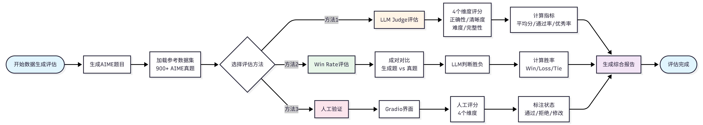
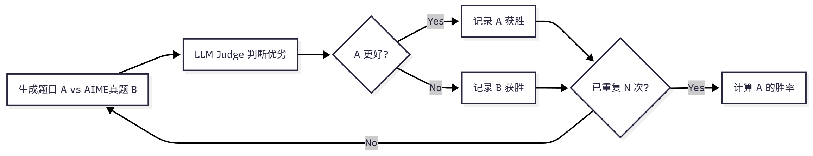

# 背景

在 AI 系统开发中，高质量的训练数据是系统性能的基础。

介绍如何使用 HelloAgents 框架评估生成数据的质量，以 AIME（美国数学邀请赛）风格的数学题目生成为例。

# AIME

AIME 是美国数学协会（MAA）主办的中等难度数学竞赛，介于 AMC 10/12 和美国数学奥林匹克（USAMO）之间。

AIME 题目具有鲜明的特点：

- 每道题的答案都是 0 到 999 之间的整数，题目涵盖代数、几何、数论、组合、概率等多个数学领域，
- 需要多步推理但不涉及高深理论，难度适中（相当于 AIME 第 6-9 题的水平）。

这些特点使得 AIME 题目成为评估数学题目生成质量的**理想基准：答案格式统一便于自动化评估，题目难度适中适合大规模生成**。

我们使用 HuggingFace 上的 `TianHongZXY/aime-1983-2025`数据集作为参考，该数据集包含从 1983 年到 2025 年的 900 多道 AIME 真题，为我们的生成和评估提供了丰富的参考样本。

# 评估方法概述

在数据生成质量评估中，我们采用**三种互补的评估方法：LLM Judge、Win Rate 和人工打分**。

择这三种方法有两个重要原因：

- 首先，从**方法论**角度来看，这些是当前智能体领域常用的自动化测评方案，也是许多学术论文中的主流做法，具有广泛的认可度和实践基础。
- 其次，从**适用性**角度来看，这三种方法天然适合我们的评估场景：
  - LLM Judge 和 Win Rate 用于评估题目生成质量（从正确性、清晰度、难度匹配等维度进行多维度评估），
  - 而人工打分用于评估答案生成质量（通过人类专家验证答案的准确性），
  - 这种分工非常合理且易于理解。

## 实现流程

整个案例的实现流程



# LLM Judge 评估

## 设计原因

设计动机：在数据生成质量评估中，我们需要对大量生成的题目进行快速、一致的质量评估。

- 传统的**人工评估**虽然准确，但**成本高、效率低**，难以应对大规模数据生成的需求。
- **LLM Judge 通过使用大语言模型作为评委**，可以自动化地从多个维度评估生成数据的质量，不仅大幅提升评估效率，还能保持评估标准的一致性。
- 更重要的是，**LLM Judge 可以提供详细的评分理由和改进建议**，帮助我们理解生成数据的优缺点，为后续优化提供方向。

## 评估维度

LLM Judge 从四个关键维度评估 AIME 题目的质量：


| 维度                        | 说明                                 | 评分范围 |
| --------------------------- | ------------------------------------ | -------- |
| 正确性（Correctness）       | 数学逻辑是否正确，答案是否准确       | 1-5分    |
| 清晰度（Clarity）           | 问题表述是否清晰，解答是否易懂       | 1-5分    |
| 难度匹配（Diffculty Match） | 难度是否符合AIME标准                 | 1-5分    |
| 完整性（Completeness）      | 解答步骤是否完整，是否包含必要的推理 | 1-5分    |

## 评估指标

有了四个维度的评分后，我们需要将这些评分汇总成整体的评估指标。

我们定义了三个关键指标来衡量生成题目的质量水平：


**平均分（Average Score）**：计算所有题目在四个维度上的平均得分，反映生成题目的整体质量水平。

$$
\text{Average Score} = \frac{1}{N} \sum_{i=1}^{N} \frac{\sum_{d=1}^{4} S_{i,d}}{4}
$$

**及格率（Pass Rate）**：统计**平均分达到 3.5 分及以上的题目**比例，反映生成题目的基本质量保障。

$$
\text{Pass Rate} = \frac{|\{i : \text{Score}_i \geq 3.5\}|}{N}
$$

**优秀率（Excellent Rate）**：统计平均分达到 4.5 分及以上的题目比例，反映生成题目的高质量占比。

$$
\text{Excellent Rate} = \frac{|\{i : \text{Score}_i \geq 4.5\}|}{N}
$$

其中：

- $N$ 是评估的题目总数
- $S_{i,d}$ 是第 $i$ 个题目在第 $d$ 个维度的得分（1-5 分）
- $\text{Score}_i$ 是第 $i$ 个题目的平均分（四个维度得分的平均值）

这三个指标从不同角度反映生成质量：**平均分给出整体水平，及格率保证基本质量，优秀率衡量高质量产出能力**。

# Win Rate 评估

## 设计原因

设计动机：虽然 LLM Judge 可以提供多维度的绝对评分，但我们还需要一个相对评估指标来**衡量生成题目与真题的质量差距**。

W**in Rate 评估通过成对对比的方式**，让 LLM 直接判断生成题目和真题哪个更好，这种相对比较比绝对评分更符合人类的判断习惯，也更容易发现生成题目的相对优势和劣势。

理想情况下，如果生成题目的质量接近真题，Win Rate 应该在 50%左右（即生成题目和真题各有 50%的胜率）。

这个指标简单直观，可以快速判断生成系统的整体质量水平。

## 流程



## 评估维度

在成对对比评估中，每次比较会产生三种可能的结果：

- 生成题目获胜（Win）、
- 真题获胜（Loss）
- 平局（Tie）。

## 评估指标

通过统计这三种结果的比例来评估生成题目的质量：


**胜率（Win Rate）**：生成题目被判定为更好的比例，反映**生成题目相对于真题的优势**。

$$
\text{Win Rate} = \frac{\text{Wins}}{\text{Total Comparisons}}
$$


**败率（Loss Rate）**：真题被判定为更好的比例，反映**生成题目相对于真题的劣势**。

$$
\text{Loss Rate} = \frac{\text{Losses}}{\text{Total Comparisons}}
$$

**平局率（Tie Rate）**：两者被判定为质量相当的比例，反映**生成题目与真题的相似程度**。

$$
\text{Tie Rate} = \frac{\text{Ties}}{\text{Total Comparisons}}
$$

其中，

- Total Comparisons 是总的对比次数，
- Wins、Losses 和 Ties 分别是生成题目获胜、失败和平局的次数。
- 这三个指标满足：Win Rate + Loss Rate + Tie Rate = 100%。


理想结果：Win Rate ≈ 50%（说明生成质量接近真题）。

- 如果 **Win Rate 显著低于 50%**，说明生成题目质量不如真题，需要**优化生成策略**；
- 如果 **Win Rate 显著高于 50%**，可能说明生成题目在某些方面**超越了真题，或者评估标准存在偏差**。

# 人工验证


设计动机：尽管 LLM Judge 和 Win Rate 可以自动化评估题目质量，但**对于数学题目这种需要严格逻辑推理的内容，人工验证仍然是不可或缺的**。

- 特别是在**评估答案生成质量**时，需要人类专家验证答案的准确性、解答步骤的完整性和数学推理的严密性。
- 此外，人工验证还**可以发现自动化评估可能遗漏的问题**，如题目的创新性、趣味性等主观因素。

为了提高人工验证的效率和体验，我们开发了基于 Gradio 的 Web 界面，让验证者可以方便地浏览题目、评分、标注状态和添加评论，大大降低了人工验证的门槛。

在我们的实现中，人工验证通过以下步骤进行：

1. 阅读题目、答案、解答
2. 评分（1-5 分）：正确性、清晰度、难度匹配、完整性
3. 标注状态：
   - ✅ approved（通过）
   - ❌ rejected（拒绝）
   - 🔄 needs_revision（需修改）
4. 添加评论


# 系统架构

数据生成与评估系统采用模块化设计：

```
data_generation/
├── aime_generator.py              # AIME题目生成器
├── human_verification_ui.py       # 人工验证界面
├── run_complete_evaluation.py     # 完整评估流程
│
├── generated_data/                # 生成的数据
│   ├── aime_generated_XXXXXX.json
│   └── generation_report_XXXXXX.md
│
└── evaluation_results/            # 评估结果
    └── XXXXXX/
        ├── llm_judge/
        ├── win_rate/
        └── comprehensive_report.md
```

系统包含四个核心组件：

- 首先是 **AIMEGenerator（题目生成器）**，使用 HelloAgents 框架生成 AIME 风格题目，支持批量生成和进度保存，并能自动处理 API 速率限制；
- 其次是 **LLMJudgeTool（LLM Judge 评估工具）**，提供 4 维度质量评估，自动生成 JSON 结果和 Markdown 报告；
- 第三是 **WinRateTool（Win Rate 评估工具）**，通过成对对比评估计算胜率、败率和平局率；
- 最后是 **HumanVerificationUI（人工验证界面）**，基于 Gradio Web 界面，支持评分和状态标注。

# AIME 题目生成器实现

## 数据集加载

我们的目标是生成类似风格的数据集，所以从 900+道 AIME 真题（1983-2025）中随机选择参考样例

```python
class AIMEGenerator:
    """AIME Problem Generator"""

    def __init__(
        self,
        llm: HelloAgentsLLM = None,
        delay_seconds: float = 1.0,
        use_reference_examples: bool = True,
        reference_dataset: str = "TianHongZXY/aime-1983-2025"
    ):
        self.llm = llm or HelloAgentsLLM()
        self.agent = SimpleAgent(
            name="AIME Generator",
            llm=self.llm,
            system_prompt="You are a professional mathematics competition problem designer."
        )
        self.delay_seconds = delay_seconds
        self.use_reference_examples = use_reference_examples

        # Load reference examples from 900+ AIME problems (1983-2025)
        if use_reference_examples:
            dataset = load_dataset(reference_dataset, split="test")
            self.reference_examples = list(dataset)
```


## 提示词设计

生成提示词设计（英文）：

我们选择使用英文生成题目有四个重要原因：

- 首先是与 AIME 真题保持一致（AIME 是英文竞赛，生成英文题目更合理），
- 其次是确保评估的公平性（LLM Judge 评估时英文 vs 英文更公平），
- 第三是便于国际化（英文题目可以被更广泛使用），
- 最后是避免翻译问题（不需要担心中英文翻译的准确性）。

```python
GENERATION_PROMPT = """You are a professional mathematics competition problem designer, skilled in creating AIME (American Invitational Mathematics Examination) style problems.

【Reference Example】(For style reference only, please generate a completely different problem)
Problem: {example_problem}
Answer: {example_answer}

AIME Problem Characteristics:
1. Answer: An integer between 0 and 999
2. Topics: Algebra, Geometry, Number Theory, Combinatorics, Probability, etc.
3. Style: Requires multi-step reasoning, but no advanced theory
4. Difficulty: Medium to hard (similar to AIME problems 6-9)

Please generate a **completely different** AIME-style mathematics problem, including:
1. Problem statement (clear and complete, different from the reference)
2. Answer (an integer between 0 and 999, different from the reference)
3. Detailed solution (including all reasoning steps)
4. Topic classification (Algebra/Geometry/Number Theory/Combinatorics/Probability)

Please output in the following JSON format:
{
    "problem": "Problem statement in English",
    "answer": 123,
    "solution": "Detailed solution steps in English",
    "topic": "Algebra"
}
"""
```

## 批量生成

批量生成实现：

```python
def generate_and_save(self, num_problems: int = 30, output_dir: str = "data_generation/generated_data"):
    """Generate and save problems with intelligent delay"""
    # Clean old checkpoints
    for file in os.listdir(output_dir):
        if file.startswith("checkpoint_") and file.endswith(".json"):
            os.remove(os.path.join(output_dir, file))

    # Generate with tqdm progress bar
    with tqdm(total=num_problems, desc="Generating AIME problems", unit="problem") as pbar:
        last_call_time = 0

        for i in range(num_problems):
            # Ensure minimum delay between API calls
            if last_call_time > 0:
                elapsed = time.time() - last_call_time
                if elapsed < self.delay_seconds:
                    wait_time = self.delay_seconds - elapsed
                    time.sleep(wait_time)

            # Generate problem (randomly select reference example)
            start_time = time.time()
            problem = self.generate_single()
            last_call_time = time.time()
            generation_time = last_call_time - start_time

            # Update progress bar
            pbar.set_postfix({
                "topic": problem.get('topic', 'N/A'),
                "answer": problem.get('answer', 'N/A'),
                "time": f"{generation_time:.1f}s"
            })
            pbar.update(1)

    return generated_data_path
```

## LaTeX 数学公式

LaTeX 数学公式支持：

生成的 AIME 题目包含 LaTeX 数学公式（如 `$\frac{a}{b}$`、`$\sqrt{x}$`），需要特殊处理 JSON 解析：

LaTeX 公式中的反斜杠（如 `\frac`、`\sqrt`）在 JSON 中是非法的转义字符，会导致解析失败：

```
Invalid \escape: line 4 column 185 (char 375)
```

通过正则表达式将未转义的反斜杠替换为双反斜杠，使其在 JSON 中合法。


```python
def _parse_response(self, response: str) -> Dict[str, Any]:
    """解析LLM响应（支持LaTeX数学公式）"""
    import re

    # 提取JSON部分
    if "```json" in response:
        json_str = response.split("```json")[1].split("```")[0].strip()
    else:
        json_str = response.strip()

    try:
        problem_data = json.loads(json_str)
    except json.JSONDecodeError:
        # 修复LaTeX转义问题：将 \frac 转为 \\frac
        # 正则表达式：找到未转义的反斜杠
        fixed_json_str = re.sub(r'(?<!\\)\\(?!["\\/bfnrtu])', r'\\\\', json_str)
        problem_data = json.loads(fixed_json_str)

    return problem_data
```

# LLM Judge 评估工具


LLM Judge 工具使用 LLM 作为评委，对生成的题目进行多维度评估。

## LLMJudgeTool

```python
class LLMJudgeTool(Tool):
    """LLM Judge评估工具"""

    def run(self, params: Dict[str, Any]) -> str:
        """运行LLM Judge评估"""
        # 1. 加载生成数据
        gen_dataset = AIDataset(dataset_type="generated", data_path=params["generated_data_path"])
        gen_problems = gen_dataset.load()

        # 2. 加载参考数据（AIME 2025）
        ref_dataset = AIDataset(dataset_type="real", year=2025)
        ref_problems = ref_dataset.load()

        # 3. 创建评估器
        evaluator = LLMJudgeEvaluator(llm=self.llm, judge_model=params.get("judge_model", "gpt-4o"))

        # 4. 运行评估
        results = evaluator.evaluate_batch(gen_problems, max_samples=params.get("max_samples"))

        # 5. 保存结果
        evaluator.export_results(results, result_file)

        # 6. 生成报告
        self._generate_report(results, report_file)

        return json.dumps({"status": "success", "metrics": results["metrics"]})
```

## 提示词

**评估提示词**：

```python
EVALUATION_PROMPT = """请评估以下AIME数学题目的质量。

题目：
{problem}

答案：{answer}

解答：
{solution}

请从以下4个维度评分（1-5分）：

1. <strong>正确性 (Correctness)</strong>：数学逻辑是否正确，答案是否准确
2. <strong>清晰度 (Clarity)</strong>：问题表述是否清晰，解答是否易懂
3. <strong>难度匹配 (Difficulty Match)</strong>：难度是否符合AIME标准（中等偏难）
4. <strong>完整性 (Completeness)</strong>：解答步骤是否完整，是否包含必要的推理

请按以下JSON格式输出：
{
    "correctness": 5,
    "clarity": 4,
    "difficulty_match": 4,
    "completeness": 5,
    "comments": "评价理由"
}
"""
```

## 报告示例

**评估报告示例**：

```markdown
# LLM Judge评估报告

## 总体评分

- <strong>平均总分</strong>: 4.2/5.0
- <strong>通过率</strong>: 85.0% (≥3.5分)
- <strong>优秀率</strong>: 40.0% (≥4.5分)

## 各维度评分

| 维度 | 平均分 | 评级 |
|------|--------|------|
| 正确性 | 4.3/5.0 | 良好 ⭐⭐⭐⭐ |
| 清晰度 | 4.1/5.0 | 良好 ⭐⭐⭐⭐ |
| 难度匹配 | 4.0/5.0 | 良好 ⭐⭐⭐⭐ |
| 完整性 | 4.4/5.0 | 良好 ⭐⭐⭐⭐ |
```


# Win Rate 评估工具

Win Rate 工具通过成对对比评估生成数据相对于真题的质量。

## WinRateTool

```python
class WinRateTool(Tool):
    """Win Rate评估工具"""

    def run(self, params: Dict[str, Any]) -> str:
        """运行Win Rate评估"""
        # 1. 加载生成数据
        gen_dataset = AIDataset(dataset_type="generated", data_path=params["generated_data_path"])
        gen_problems = gen_dataset.load()

        # 2. 加载参考数据（AIME 2025）
        ref_dataset = AIDataset(dataset_type="real", year=2025)
        ref_problems = ref_dataset.load()

        # 3. 创建评估器
        evaluator = WinRateEvaluator(llm=self.llm, judge_model=params.get("judge_model", "gpt-4o"))

        # 4. 运行评估
        results = evaluator.evaluate_win_rate(gen_problems, ref_problems, num_comparisons=params.get("num_comparisons"))

        # 5. 保存结果和报告
        evaluator.export_results(results, result_file)
        self._generate_report(results, report_file)

        return json.dumps({"status": "success", "metrics": results["metrics"]})
```

## AIDataset

我们选择只使用 AIME 2025 数据集有四个原因：

- 首先是数据的时效性（2025 年是最新的 AIME 竞赛数据），
- 其次是简化维护（只维护一个数据集，代码更简洁），
- 第三是格式统一（JSONL 格式，字段名统一为小写），
- 最后是代表性充分（30 道题目足以评估生成质量）。

AIDataset 负责加载生成数据和 AIME 真题数据，支持两种数据类型：

```python
class AIDataset:
    """AI数据集加载器

    支持两种数据类型：
    1. generated: 生成的数据（JSON格式）
    2. real: AIME真题（从HuggingFace加载）
    """

    def __init__(
        self,
        dataset_type: str = "generated",
        data_path: Optional[str] = None,
        year: Optional[int] = None
    ):
        self.dataset_type = dataset_type
        self.data_path = data_path
        self.year = year  # 仅用于real类型，默认2025

    def load(self) -> List[Dict[str, Any]]:
        """加载数据集"""
        if self.dataset_type == "generated":
            return self._load_generated_data()
        elif self.dataset_type == "real":
            return self._load_real_data()

    def _load_real_data(self) -> List[Dict[str, Any]]:
        """从HuggingFace加载AIME 2025真题"""
        from huggingface_hub import snapshot_download

        # 使用AIME 2025数据集
        repo_id = "math-ai/aime25"

        # 下载数据集
        local_dir = snapshot_download(
            repo_id=repo_id,
            repo_type="dataset"
        )

        # 读取JSONL文件
        data_file = list(Path(local_dir).glob("*.jsonl"))[0]
        data = []
        with open(data_file, 'r', encoding='utf-8') as f:
            for line in f:
                if line.strip():
                    data.append(json.loads(line))

        # 统一数据格式（AIME 2025使用小写字段名）
        problems = []
        for idx, item in enumerate(data):
            problem = {
                "problem_id": item.get("id", f"aime_2025_{idx}"),
                "problem": item.get("problem", ""),
                "answer": item.get("answer", ""),
                "solution": item.get("solution", ""),  # AIME 2025没有solution字段
            }
            problems.append(problem)

        return problems
```


## 对比提示词

**对比提示词**：

```python
COMPARISON_PROMPT = """请比较以下两个AIME数学题目的质量，判断哪个更好。

【题目A - 生成题目】
问题：{problem_a}
答案：{answer_a}
解答：{solution_a}

【题目B - AIME真题】
问题：{problem_b}
答案：{answer_b}
解答：{solution_b}

请从以下方面比较：
1. 数学逻辑的严谨性
2. 问题表述的清晰度
3. 难度的合理性
4. 解答的完整性

请按以下JSON格式输出：
{
    "winner": "A" 或 "B" 或 "Tie",
    "reason": "判断理由"
}
"""
```

## 示例

**评估报告示例**：

```markdown
# Win Rate评估报告

## 胜率统计

| 指标 | 数值 | 百分比 |
|------|------|--------|
| 生成数据胜出 | 9次 | 45.0% |
| AIME真题胜出 | 8次 | 40.0% |
| 平局 | 3次 | 15.0% |

<strong>Win Rate</strong>: 45.0%

✅ <strong>良好</strong>: 生成数据质量接近参考数据（差距<10%）。
```

# 人工验证界面


使用 Gradio 创建 Web 界面，支持人工验证生成的题目。

```python
class HumanVerificationUI:
    """人工验证界面"""

    def launch(self, share: bool = False):
        """启动Gradio界面"""
        with gr.Blocks(title="AIME题目人工验证") as demo:
            gr.Markdown("# 🎯 AIME题目人工验证系统")

            with gr.Row():
                with gr.Column(scale=2):
                    # 题目显示区域
                    problem_text = gr.Textbox(label="问题描述", lines=5, interactive=False)
                    answer_text = gr.Textbox(label="答案", interactive=False)
                    solution_text = gr.Textbox(label="解答过程", lines=10, interactive=False)

                with gr.Column(scale=1):
                    # 评分区域
                    correctness_slider = gr.Slider(1, 5, value=3, step=1, label="正确性")
                    clarity_slider = gr.Slider(1, 5, value=3, step=1, label="清晰度")
                    difficulty_slider = gr.Slider(1, 5, value=3, step=1, label="难度匹配")
                    completeness_slider = gr.Slider(1, 5, value=3, step=1, label="完整性")

                    # 状态选择
                    status_radio = gr.Radio(
                        choices=["approved", "rejected", "needs_revision"],
                        value="approved",
                        label="状态"
                    )

                    # 验证按钮
                    verify_btn = gr.Button("✅ 提交验证", variant="primary")

            demo.launch(share=share, server_name="127.0.0.1", server_port=7860)
```

**使用方法**：

```bash
# 启动人工验证界面
python data_generation/human_verification_ui.py data_generation/generated_data/aime_generated_XXXXXX.json

# 打开浏览器访问
http://127.0.0.1:7860
```

最终效果可以参考图 12.7 所示，对于题目的正确性，最好人工打标 Review

# 完整评估流程


将所有评估方法整合到一个完整的流程中。

```python
def run_complete_evaluation(
    num_problems: int = 30,
    delay_seconds: float = 3.0
):
    """
    运行完整评估流程

    Args:
        num_problems: 生成题目数量
        delay_seconds: 每次生成之间的延迟（秒），避免API速率限制
    """
    # 步骤1: 生成AIME题目
    generator = AIMEGenerator(delay_seconds=delay_seconds)
    generated_data_path = generator.generate_and_save(
        num_problems=num_problems,
        output_dir="data_generation/generated_data"
    )

    # 步骤2: 评估
    # 创建评估结果目录
    timestamp = datetime.now().strftime("%Y%m%d_%H%M%S")
    evaluation_dir = f"data_generation/evaluation_results/{timestamp}"
    os.makedirs(evaluation_dir, exist_ok=True)
    os.makedirs(os.path.join(evaluation_dir, "llm_judge"), exist_ok=True)
    os.makedirs(os.path.join(evaluation_dir, "win_rate"), exist_ok=True)

    # 创建LLM
    llm = HelloAgentsLLM()

    # 步骤2.1: LLM Judge评估
    llm_judge_result = None
    try:
        llm_judge_tool = LLMJudgeTool(llm=llm)
        llm_judge_result_json = llm_judge_tool.run({
            "generated_data_path": generated_data_path,
            "reference_year": 2025,
            "max_samples": num_problems,
            "output_dir": os.path.join(evaluation_dir, "llm_judge"),
            "judge_model": "gpt-4o"
        })
        llm_judge_result = json.loads(llm_judge_result_json)
    except Exception as e:
        print(f"❌ LLM Judge评估失败: {e}")

    # 步骤2.2: Win Rate评估
    win_rate_result = None
    try:
        win_rate_tool = WinRateTool(llm=llm)
        win_rate_result_json = win_rate_tool.run({
            "generated_data_path": generated_data_path,
            "reference_year": 2025,
            "num_comparisons": min(num_problems, 20),
            "output_dir": os.path.join(evaluation_dir, "win_rate"),
            "judge_model": "gpt-4o"
        })
        win_rate_result = json.loads(win_rate_result_json)
    except Exception as e:
        print(f"❌ Win Rate评估失败: {e}")

    # 步骤3: 生成综合报告
    comprehensive_report_path = None
    if llm_judge_result or win_rate_result:
        comprehensive_report_path = os.path.join(evaluation_dir, "comprehensive_report.md")
        report = generate_comprehensive_report(
            generated_data_path,
            llm_judge_result,
            win_rate_result
        )
        with open(comprehensive_report_path, 'w', encoding='utf-8') as f:
            f.write(report)

    return {
        "generated_data_path": generated_data_path,
        "llm_judge_result": llm_judge_result,
        "win_rate_result": win_rate_result,
        "comprehensive_report_path": comprehensive_report_path
    }
```

**运行方法**：

```bash
# 基本用法（默认3秒延迟）
python data_generation/run_complete_evaluation.py 30

# 自定义延迟（推荐3-5秒，避免API速率限制）
python data_generation/run_complete_evaluation.py 30 3.0

# 参数说明：
# - 30: 生成题目数量
# - 3.0: 每次生成之间的延迟（秒）

# 说明：
# - 生成阶段：从900+道AIME真题（1983-2025）中随机选择参考样例
# - 评估阶段：与AIME 2025年真题进行质量对比
# - 数据集来源：math-ai/aime25（JSONL格式）
```
