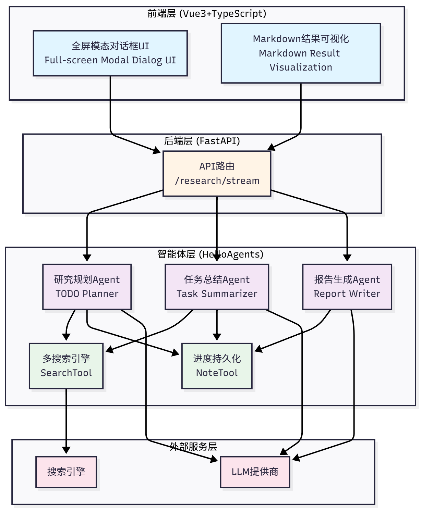
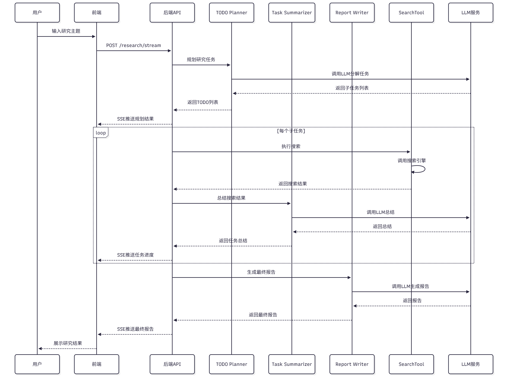
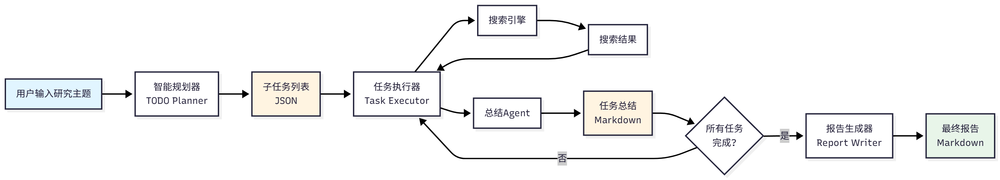
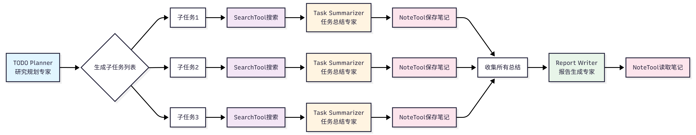
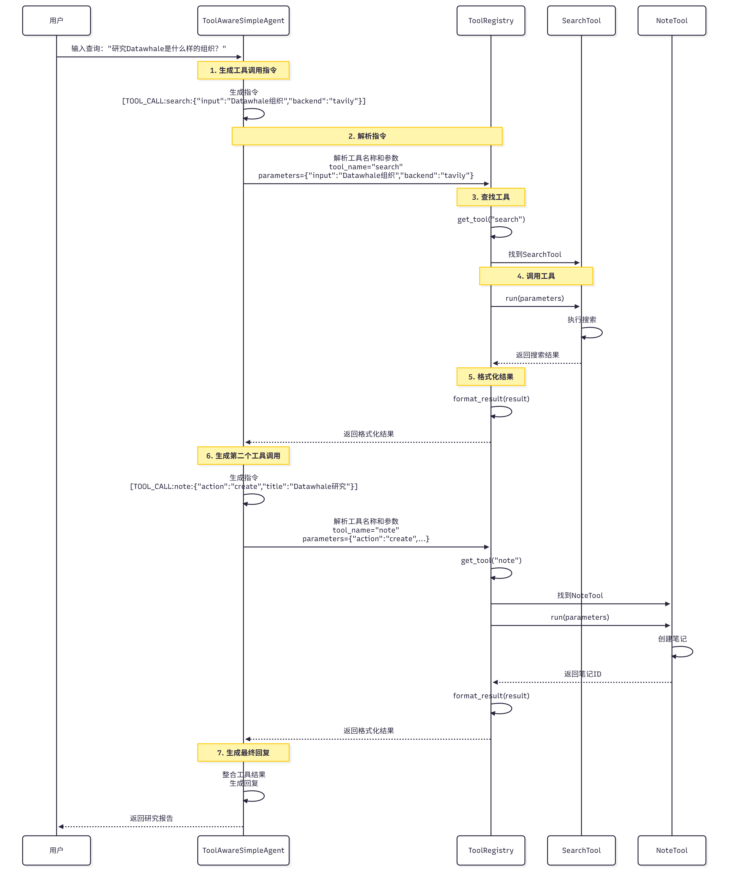
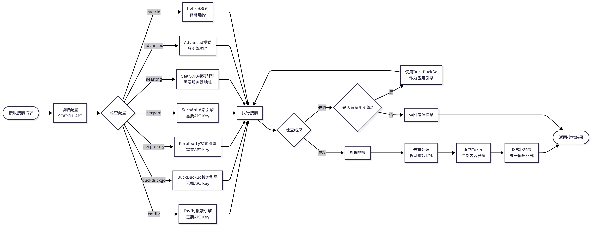
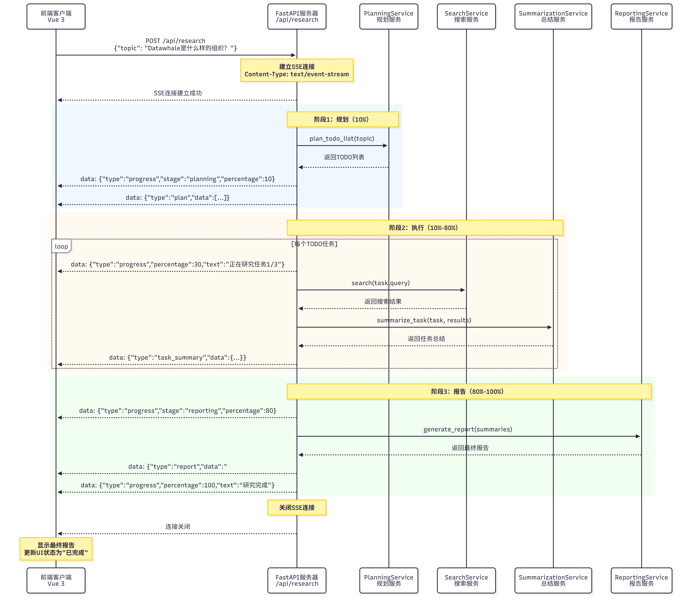

# 项目说明

构建一个能**够自动化执行深度研究任务的智能体助手**。

深度研究的**难点在于信息的不断发散、事实的快速更新以及用户对引用来源的高要求**。

为了交付可信的研究报告，我们需要让**智能体具备三个核心能力**：

（1）**问题剖析**：将用户的开放主题拆解为可检索的查询语句。

（2）**多轮信息采集** ：结合不同搜索 API 持续挖掘资料，并去重整合。

（3）**反思与总结**：依据阶段结果识别知识空白，决定是否继续检索，并生成结构化总结。

# 为什么需要深度研究助手

传统的研究方式有几个痛点

- **信息过载**：搜索引擎返回成千上万的结果，你**需要逐个点开链接，阅读**大量内容，才能找到有用的信息。
- **缺少结构**：即使找到了相关信息，这些**信息往往是碎片化的，缺少系统性**的组织。
- **重复劳动** ：每次研究新主题时，都需要重**复"搜索→阅读→总结→整理"的过程**。

深度研究助手的核心价值：

1. **节省时间** ：将 1-2 小时的研究工作压缩到 5-10 分钟
2. **提高质量**：系统化的研究流程，避免遗漏重要信息
3. **可追溯** ：记录所有搜索结果和来源，方便验证和引用
4. **可扩展**：可以轻松添加新的搜索引擎、数据源和分析工具

# 技术架构

## 系统结构

系统分为四层架构设计：

- **前端层 (Vue3+TypeScript)**：全屏模态对话框 UI、Markdown 结果可视化
- **后端层 (FastAPI)**：API 路由（`/research/stream`）
- **智能体层 (HelloAgents)**：三个专门 Agent（TODO Planner、Task Summarizer、Report Writer）+ 两个核心工具（SearchTool、NoteTool）
- **外部服务层**：搜索引擎+ LLM 提供商



## 请求流转

一个完整的研究请求是如何在系统中流转的

1. 用户输入：用户在前端输入研究主题
2. 前端发送 ：前端通过 SSE 连接到 `/research/stream`
3. 后端接收 ：FastAPI 接收请求，创建研究状态
4. **规划阶段：调用研究规划 Agent，分解为 3 个子任务**
5. **执行阶段 ：逐个执行每个子任务**
   - **使用 SearchTool 搜索**
   - **调用任务总结 Agent 总结**
   - **使用 NoteTool 记录结果**
6. **报告阶段 ：调用报告生成 Agent，整合所有总结**
7. **流式返回 ：通过 SSE 推送进度和结果到前端**
8. 前端展示：前端实时更新任务状态、进度条、日志、报告



# TODO 驱动的研究范式

## TODO 驱动的研究?

TODO 驱动的研究范式将复杂的研究主题分解为多个子任务（TODO），逐个执行并整合结果。

范式的**核心思想是：将"研究"这个复杂任务转化为"规划→执行→整合"的流程**

示例如下：

假设你想研究"Datawhale 是一个什么样的组织？"，

传统的搜索方式是：这种方式的问题在于每个链接只涵盖主题的一个方面、缺少系统性结构，需要手动整理和总结。

```
用户输入：Datawhale是一个什么样的组织？
搜索引擎：返回10-20个链接
用户：逐个点开链接，阅读内容，记录笔记
结果：碎片化的信息，缺少系统性
```

**TODO 驱动方式：系统化研究**

- 优势在于将**复杂主题分解为清晰的子问题**，每个子任务的搜索结果和总结都被记录下来，方便追溯。
- 同时，系统化的研究流程避免了遗漏重要信息，可以轻松添加新的子任务或调整执行顺序。

```
用户输入：Datawhale是一个什么样的组织？

系统规划：
  ├─ TODO 1：Datawhale的基本信息（组织定位）
  ├─ TODO 2：Datawhale的主要项目（核心内容）
  ├─ TODO 3：Datawhale的社区文化（价值观）
  └─ TODO 4：Datawhale的影响力（社会贡献）

系统执行：
  对每个TODO：
    1. 搜索相关资料
    2. 总结关键信息
    3. 记录来源引用

系统整合：
  生成结构化报告：
    ├─ 第一部分：组织定位（来自TODO 1）
    ├─ 第二部分：核心内容（来自TODO 2）
    ├─ 第三部分：价值观（来自TODO 3）
    ├─ 第四部分：社会贡献（来自TODO 4）
    └─ 参考文献：所有来源引用
```

## 核心要素

一个完整的 TODO 驱动研究系统包含三个核心要素：

（1）**智能规划器（TODO Planner）**：负责将研究主题分解为子任务。

- 一个好的规划器需要理解主题的关键方面和研究目标，
- 将主题分解为 3-5 个子任务（太少覆盖不全，太多会冗余），
- 并为每个子任务设计合适的搜索查询。

**（2）任务执行器（Task Executor）**：负责执行每个子任务。

- 执行器需要使用搜索引擎获取相关资料，
- 提取关键信息并去除冗余内容，
- 同时保存所有来源引用以方便验证。

**（3）报告生成器（Report Writer）**：负责整合所有子任务的结果。

- 生成器需要按照逻辑顺序组织内容，合并重复的信息，
- 并为每个观点添加来源引用。

TODO 驱动的研究流程如图：整个流程是线性的，但每个阶段都有明确的输入和输出。这种设计使得系统易于理解和调试。



## 三阶段研究流程

TODO 驱动的研究流程分为三个阶段：规划（Planning）、执行（Execution）、报告（Reporting）。

每个阶段都有专门的 Agent 负责。

### 阶段 1：规划

规划阶段的目标是将研究主题分解为 3-5 个子任务。

系统接收研究主题和当前日期作为输入，输出 JSON 格式的子任务列表。

**每个子任务包含三个字段：title（任务标题）、intent（研究意图）和 query（搜索查询）**。

**研究规划 Agent** 会**根据主题特点采用不同的分解策略，通常从基础概念入手，然后了解技术现状、实际应用和发展趋势，必要时还会进行对比分析**。

例如，对于"Datawhale 是一个什么样的组织？"，规划 Agent 可能生成以下子任务：

```json
[
  {
    "title": "Datawhale的基本信息",
    "intent": "了解Datawhale的组织定位、成立时间、发展历程",
    "query": "Datawhale organization introduction history 2024"
  },
  {
    "title": "Datawhale的主要项目",
    "intent": "了解Datawhale的核心开源项目和教程",
    "query": "Datawhale projects tutorials open source 2024"
  },
......
]
```

一个好的规划应该覆盖全面、逻辑清晰、查询精准、条目数量适中。

### 阶段 2：执行

**执行阶段逐个执行每个子任务，搜索并总结相关资料**。

**系统接收子任务列表和搜索引擎配置作为输入，输出每个子任务的总结（Markdown 格式）和来源引用列表**。

执行流程如下：对于每个子任务，执行器会：

1. **搜索资料**：使用配置的搜索引擎执行搜索

   ```python
   search_results = search_tool.run({
       "input": task.query,
       "backend": "tavily",
       "mode": "structured",
       "max_results": 5
   })
   ```
2. **获取搜索结果**：提取标题、URL、摘要

   ```json
   {
     "results": [
       {
         "title": "What is a Multimodal Model?",
         "url": "https://example.com/multimodal-model",
         "snippet": "A multimodal model is an AI model that can process multiple types of data..."
       },
       ...
     ]
   }
   ```
3. **调用总结 Agent** ：总结搜索结果

   ```python
   summary = summarizer_agent.run(
       task=task,
       search_results=search_results
   )
   ```
4. **记录总结和来源** ：保存到 NoteTool

   ```python
   note_tool.run({
       "action": "create",
       "title": task.title,
       "content": f"## {task.title}\n\n{summary}\n\n## 来源\n{sources}",
       "tags": ["research", "summary"]
   })
   ```

任务总结 Agent 会从每个搜索结果中提取核心观点，合并相似信息，保留重要的数字、日期、名称等关键数据，并为每个观点添加来源引用。

例如，对于"Datawhale 的基本信息"的搜索结果，总结 Agent 可能生成：

```markdown
## Datawhale的基本信息

Datawhale是一个专注于数据科学与AI领域的开源组织，成立于2018年[1]。组织的核心使命是"for the learner，和学习者一起成长"，致力于构建一个纯粹的学习社区[2]。

**核心定位：**

1. **开源教育平台**：提供高质量的AI和数据科学学习资源[1]
2. **学习者社区**：汇聚了数万名AI学习者和实践者[3]
3. **知识共享**：倡导开源精神，所有内容完全免费开放[2]

**发展历程：**

- **2018年**：Datawhale成立，发布首个开源教程[1]
- **2020年**：成为国内领先的AI学习社区之一[3]
- **2024年**：累计发布50+开源项目，影响10万+学习者[4]

## 来源

[1] https://github.com/datawhalechina
[2] https://datawhale.club/about
[3] https://www.zhihu.com/org/datawhale
[4] https://datawhale.cn
```

在执行过程中，系统会实时推送进度信息到前端：

```json
{
  "type": "status",
  "message": "正在搜索：Datawhale的基本信息"
}
```

```json
{
  "type": "status",
  "message": "正在总结搜索结果..."
}
```

```json
{
  "type": "task",
  "task": {
    "id": 1,
    "title": "Datawhale的基本信息",
    "status": "completed"
  }
}
```

### 阶段 3：报告

报告阶段的目**标是整合所有子任务的总结，生成最终报告**。

报告生成 Agent 会**按照子任务的逻辑顺序组织内容，在开头添加简要概述，合并重复的信息，统一 Markdown 格式，并将所有来源引用整理到参考文献部分**。

系统接收所有子任务的总结和研究主题作为输入，输出 Markdown 格式的最终报告。

报告包含标题、概述、各个子任务的详细分析、总结和参考文献五个部分。

例如，对于"Datawhale 是一个什么样的组织？"，最终报告可能是：

```markdown
# Datawhale是一个什么样的组织？

## 概述

本报告系统地研究了Datawhale这个开源组织，涵盖基本信息、主要项目、社区文化和影响力四个方面。

## 1. Datawhale的基本信息

Datawhale是一个专注于数据科学与AI领域的开源组织，成立于2018年...

（此处插入子任务1的总结）

## 2. Datawhale的主要项目

Datawhale发布了多个高质量的开源教程，包括Hello-Agents、Joyful-Pandas等...

（此处插入子任务2的总结）
......
## 总结

通过本次研究，我们了解了Datawhale的组织定位、核心项目、社区文化和社会贡献。Datawhale是一个纯粹的学习社区，为AI教育做出了重要贡献。

## 参考文献

[1] https://github.com/datawhalechina
[2] https://datawhale.club/about
...
```

# 智能体系统设计

## Agent 职责划分

设计了三个专门的 Agent，每个 Agent 负责一个特定的任务。

### Agent 1：研究规划专家（TODO Planner）

**职责** ：将研究主题分解为 3-5 个子任务

**设计理念**：研究规划专家的**核心任务是理解用户的研究主题，分析主题的关键方面，然后生成一系列子任务**。这个过程类似于人类研究者在开始研究前的"头脑风暴"阶段。

Prompt 设计：关键设计点：

- 提**示词包含当前日期以获取最新信**息，**明确要求 JSON 格式输出**便于解析，
- 通过**示例帮助** Agent 理解期望输出，**并强调子任务数量、逻辑关系等**约束。

```python
todo_planner_instructions = """
你是一个研究规划专家。你的任务是将用户的研究主题分解为3-5个子任务。

当前日期：{current_date}

研究主题：{research_topic}

请分析这个研究主题，将其分解为3-5个子任务。每个子任务应该：
1. 涵盖主题的一个重要方面
2. 有明确的研究目标
3. 可以通过搜索引擎找到相关资料

请以JSON格式返回子任务列表，每个子任务包含：
- title：任务标题（简洁明了）
- intent：任务意图（为什么要研究这个）
- query：搜索查询（用于搜索引擎的查询字符串，可以使用英文以获得更好的搜索结果）

示例输出：
[
  {{
    "title": "什么是多模态模型",
    "intent": "了解多模态模型的基础概念，为后续研究打下基础",
    "query": "multimodal model definition concept 2024"
  }},
  ...
]

请确保：
1. 子任务数量在3-5个之间
2. 子任务之间有逻辑关系（如从基础到应用，从现状到趋势）
3. 搜索查询能够准确找到相关资料
4. 只返回JSON，不要包含其他文本
"""
```


实现代码：这里的 ToolAwareSimpleAgent 是根据 SimpleAgent 拓展实现，可以在 14.3.2 了解，这里不用深究。

```python
class PlanningService:
    def __init__(self, llm: HelloAgentsLLM):
        self._agent = ToolAwareSimpleAgent(
            name="TODO Planner",
            system_prompt="你是一个研究规划专家",
            llm=llm,
            tool_call_listener=self._on_tool_call
        )
  
    def plan_todo_list(self, state: SummaryState) -> List[TodoItem]:
        prompt = todo_planner_instructions.format(
            current_date=get_current_date(),
            research_topic=state.research_topic,
        )
  
        response = self._agent.run(prompt)
        tasks_payload = self._extract_tasks(response)
  
        todo_items = []
        for idx, item in enumerate(tasks_payload, start=1):
            task = TodoItem(
                id=idx,
                title=item["title"],
                intent=item["intent"],
                query=item["query"],
            )
            todo_items.append(task)
  
        return todo_items
  
    def _extract_tasks(self, response: str) -> List[dict]:
        """从Agent响应中提取JSON"""
        # 使用正则表达式提取JSON部分
        json_match = re.search(r'\[.*\]', response, re.DOTALL)
        if json_match:
            json_str = json_match.group(0)
            return json.loads(json_str)
        else:
            raise ValueError("无法从响应中提取JSON")
```

### Agent 2：任务总结专家（Task Summarizer）

职责 ：总结搜索结果，提取关键信息

设计理念：任务总结专家的**核心任务是阅读搜索结果，提取关键信息，并以结构化的方式呈现**。这个过程类似于人类研究者在阅读文献后做笔记的过程。

Prompt 设计：关键设计点：

- 提示词包含任务标题、意图、查询等**上下文帮助 Agent 理解任务**，
- **明确要求输出**包含核心观点、关键数据、来源引用，
- **强调为每个观点添加来源引用**，
- 并通过**示例**帮助 Agent 理解期望的输出格式。

```python
task_summarizer_instructions = """
你是一个任务总结专家。你的任务是总结搜索结果，提取关键信息。

任务标题：{task_title}
任务意图：{task_intent}
搜索查询：{task_query}

搜索结果：
{search_results}

请仔细阅读以上搜索结果，提取关键信息，并以Markdown格式返回总结。

总结应该包含：
1. **核心观点**：搜索结果中的核心观点和结论
2. **关键数据**：重要的数字、日期、名称等
3. **来源引用**：为每个观点添加来源引用（使用[1]、[2]等标记）

请确保：
1. 总结简洁明了，避免冗余
2. 保留重要的细节和数据
3. 为每个观点添加来源引用
4. 使用Markdown格式（标题、列表、加粗等）

示例输出：
## 核心观点

多模态模型是一种能够处理多种类型数据的AI模型[1]。与传统的单模态模型不同，多模态模型可以同时理解文本、图像、音频等[2]。

**关键特点：**
- 跨模态理解[1]
- 统一表示[3]
- 端到端训练[2]

## 来源

[1] https://example.com/source1
[2] https://example.com/source2
[3] https://example.com/source3
"""
```

实现代码：

```python
class SummarizationService:
    def __init__(self, llm: HelloAgentsLLM):
        self._agent = ToolAwareSimpleAgent(
            name="Task Summarizer",
            system_prompt="你是一个任务总结专家",
            llm=llm,
            tool_call_listener=self._on_tool_call
        )
  
    def summarize_task(
        self,
        task: TodoItem,
        search_results: List[dict]
    ) -> str:
        # 格式化搜索结果
        formatted_sources = self._format_sources(search_results)
    
        prompt = task_summarizer_instructions.format(
            task_title=task.title,
            task_intent=task.intent,
            task_query=task.query,
            search_results=formatted_sources,
        )
    
        summary = self._agent.run(prompt)
        return summary
  
    def _format_sources(self, search_results: List[dict]) -> str:
        """格式化搜索结果"""
        formatted = []
        for idx, result in enumerate(search_results, start=1):
            formatted.append(
                f"[{idx}] {result['title']}\n"
                f"URL: {result['url']}\n"
                f"摘要: {result['snippet']}\n"
            )
        return "\n".join(formatted)
```


### Agent 3：报告撰写专家（Report Writer）

职责 ：整合所有子任务的总结，生成最终报告

设计理念 ：报告撰写专家的**核心任务是将所有子任务的总结整合成一份结构化的报告**。这个过程类似于人类研究者在完成所有调研后撰写研究报告的过程。

Prompt 设计：关键设计点 ：

- 提示词**明确要求报告**包含标题、概述、详细分析、总结、参考文献等结构，
- **强调按逻辑顺序组织**内容，
- 要求**合并重复信息消除冗余**，
- 并**保留所有来源**引用。

```python
report_writer_instructions = """
你是一个报告撰写专家。你的任务是整合所有子任务的总结，生成一份结构化的研究报告。

研究主题：{research_topic}

子任务总结：
{task_summaries}

请整合以上所有子任务的总结，生成一份结构化的研究报告。

报告应该包含：
1. **标题**：研究主题
2. **概述**：简要介绍研究主题和报告结构（2-3段）
3. **各个子任务的详细分析**：按照逻辑顺序组织（使用二级标题）
4. **总结**：总结研究的主要发现（1-2段）
5. **参考文献**：所有来源引用（按照子任务分组）

请确保：
1. 报告结构清晰，逻辑连贯
2. 消除重复的信息
3. 保留所有来源引用
4. 使用Markdown格式

示例输出：
# 多模态大模型的最新进展

## 概述

本报告系统地研究了多模态大模型的最新进展...

## 1. 什么是多模态模型

（此处插入子任务1的总结）

## 2. 最新的多模态模型有哪些

（此处插入子任务2的总结）

...

## 总结

通过本次研究，我们了解了...

## 参考文献

### 任务1：什么是多模态模型
[1] https://example.com/source1
...
"""
```


实现代码 ：

```python
class ReportingService:
    def __init__(self, llm: HelloAgentsLLM):
        self._agent = ToolAwareSimpleAgent(
            name="Report Writer",
            system_prompt="你是一个报告撰写专家",
            llm=llm,
            tool_call_listener=self._on_tool_call
        )
  
    def generate_report(
        self,
        research_topic: str,
        task_summaries: List[Tuple[TodoItem, str]]
    ) -> str:
        # 格式化子任务总结
        formatted_summaries = self._format_summaries(task_summaries)
  
        prompt = report_writer_instructions.format(
            research_topic=research_topic,
            task_summaries=formatted_summaries,
        )
  
        report = self._agent.run(prompt)
        return report
  
    def _format_summaries(
        self,
        task_summaries: List[Tuple[TodoItem, str]]
    ) -> str:
        """格式化子任务总结"""
        formatted = []
        for idx, (task, summary) in enumerate(task_summaries, start=1):
            formatted.append(
                f"## 任务{idx}：{task.title}\n"
                f"意图：{task.intent}\n\n"
                f"{summary}\n"
            )
        return "\n".join(formatted)
```
## ToolAwareSimpleAgent 的设计
在深度研究助手中，我们需要记录每个 Agent 的工具调用情况，用于：

1. **调试**：查看 Agent 调用了哪些工具，传入了什么参数
2. **日志**：记录研究过程中的所有操作
3. **分析**：分析 Agent 的行为模式
4. **进度展示**：实时显示 Agent 正在做什么

`ToolAwareSimpleAgent`在 `SimpleAgent`的基础上增加了一个 `tool_call_listener`参数，这是一个回调函数，每次工具调用时都会被调用。

使用示例：

```python
from hello_agents import ToolAwareSimpleAgent

def tool_listener(call_info):
    print(f"Agent: {call_info['agent_name']}")
    print(f"工具: {call_info['tool_name']}")
    print(f"参数: {call_info['parsed_parameters']}")
    print(f"结果: {call_info['result']}")

agent = ToolAwareSimpleAgent(
    name="研究助手",
    system_prompt="你是一个研究助手",
    llm=llm,
    tool_call_listener=tool_listener
)
```

`ToolAwareSimpleAgent`继承自 `SimpleAgent`，重写了 `_execute_tool_call`方法：

```python
class ToolAwareSimpleAgent(SimpleAgent):
    def __init__(
        self,
        name: str,
        system_prompt: str,
        llm: HelloAgentsLLM,
        tool_registry: Optional[ToolRegistry] = None,
        tool_call_listener: Optional[Callable] = None,
    ):
        super().__init__(
            name=name,
            system_prompt=system_prompt,
            llm=llm,
            tool_registry=tool_registry,
        )
        self._tool_call_listener = tool_call_listener
  
    def _execute_tool_call(self, tool_name: str, parameters: str) -> str:
        """执行工具调用，并通知监听器"""
        # 解析参数
        parsed_parameters = self._parse_parameters(parameters)
      
        # 调用工具
        result = super()._execute_tool_call(tool_name, parameters)
      
        # 通知监听器
        if self._tool_call_listener:
            self._tool_call_listener({
                "agent_name": self.name,
                "tool_name": tool_name,
                "parsed_parameters": parsed_parameters,
                "result": result,
            })
      
        return result
```

在深度研究助手中，我们使用 `ToolAwareSimpleAgent`来记录所有 Agent 的工具调用：

```python
class DeepResearchAgent:
    def __init__(self, config: Configuration):
        self.config = config
        self.llm = HelloAgentsLLM(...)
      
        # 创建工具调用监听器
        def tool_listener(call_info):
            self._emit_event({
                "type": "tool_call",
                "agent": call_info["agent_name"],
                "tool": call_info["tool_name"],
                "parameters": call_info["parsed_parameters"],
            })
      
        # 创建三个Agent，都使用相同的监听器
        self.planner = PlanningService(self.llm, tool_listener)
        self.summarizer = SummarizationService(self.llm, tool_listener)
        self.reporter = ReportingService(self.llm, tool_listener)
```

这样，所有 Agent 的工具调用都会被记录，并通过 SSE 推送到前端，实时显示给用户。
## Agent 协作模式

三个 Agent 之间是**顺序协作** 的关系
顺序协作模式的特点是：
1. **线性流程**：Agent 按照固定的顺序执行
2. **明确的输入输出**：每个 Agent 的输入来自上一个 Agent 的输出
3. **无并发**：同一时间只有一个 Agent 在工作



`DeepResearchAgent`是整个系统的核心协调器，负责调度三个 Agent：

```python
class DeepResearchAgent:
    def run(self, research_topic: str) -> str:
        # 1. 规划阶段
        self._emit_event({"type": "status", "message": "正在规划研究任务..."})
        todo_list = self.planner.plan_todo_list(research_topic)
        self._emit_event({"type": "tasks", "tasks": todo_list})
      
        # 2. 执行阶段
        task_summaries = []
        for task in todo_list:
            self._emit_event({
                "type": "status",
                "message": f"正在研究：{task.title}"
            })
          
            # 搜索
            search_results = self.search_service.search(task.query)
          
            # 总结
            summary = self.summarizer.summarize_task(task, search_results)
            task_summaries.append((task, summary))
          
            self._emit_event({
                "type": "task_completed",
                "task_id": task.id
            })
      
        # 3. 报告阶段
        self._emit_event({"type": "status", "message": "正在生成报告..."})
        report = self.reporter.generate_report(research_topic, task_summaries)
        self._emit_event({"type": "report", "content": report})
      
        return report
```
# 工具系统集成
## SearchTool 扩展
在深度研究助手中，我们通过配置文件选择搜索引擎：

```python
# config.py
class SearchAPI(str, Enum):
    TAVILY = "tavily"
    DUCKDUCKGO = "duckduckgo"
    PERPLEXITY = "perplexity"
    SEARXNG = "searxng"
    ADVANCED = "advanced"

class Configuration(BaseModel):
    search_api: SearchAPI = SearchAPI.DUCKDUCKGO
    # ...
```

```python
# .env
SEARCH_API=tavily
```

这样，用户可以通过修改 `.env`文件来选择搜索引擎，无需修改代码。

`SearchTool`返回的结果是一个字典，包含：

- `results`：搜索结果列表，每个结果包含标题、URL、摘要
- `backend`：使用的搜索引擎
- `answer`：AI 生成的答案（仅 Perplexity）
- `notices`：通知信息（如 API 限制、错误等）

以下是一些特殊情况的处理。

搜索结果可能包含重复的 URL，我们需要去重：

```python
def deduplicate_sources(sources: List[dict]) -> List[dict]:
    """去除重复的URL"""
    seen_urls = set()
    unique_sources = []
  
    for source in sources:
        if source["url"] not in seen_urls:
            seen_urls.add(source["url"])
            unique_sources.append(source)
  
    return unique_sources
```

搜索结果可能包含大量文本，我们需要限制每个来源的 Token 数量：

```python
def limit_source_tokens(source: dict, max_tokens: int = 2000) -> dict:
    """限制来源的Token数量"""
    snippet = source["snippet"]
  
    # 简单的Token估算：1个Token约等于4个字符
    max_chars = max_tokens * 4
  
    if len(snippet) > max_chars:
        snippet = snippet[:max_chars] + "..."
  
    return {
        **source,
        "snippet": snippet
    }
```
## NoteTool 使用
使用 `NoteTool`来持久化研究进度。
`NoteTool`将笔记存储在指定的工作空间目录中，每个笔记是一个 Markdown 文件。笔记的文件名是任务 ID，内容包含任务标题、任务意图、搜索查询、搜索结果和总结。

最后生成的文件风格会是下面的树状图风格：

```
workspace/
├── notes/
│   ├── 1.md  # 任务1的笔记
│   ├── 2.md  # 任务2的笔记
│   ├── 3.md  # 任务3的笔记
│   └── ...
└── reports/
    └── final_report.md  # 最终报告
```

在深度研究助手中，我们使用 `NoteTool`来记录每个子任务的研究进度：

```python
class NotesService:
    def __init__(self, workspace: str):
        self.note_tool = NoteTool(workspace=workspace)
  
    def save_task_summary(
        self,
        task: TodoItem,
        search_results: List[dict],
        summary: str
    ):
        """保存任务总结"""
        # 格式化笔记内容
        content = self._format_note_content(
            task=task,
            search_results=search_results,
            summary=summary
        )
      
        # 创建笔记
        self.note_tool.run({
            "action": "create",
            "title": f"任务{task.id}：{task.title}",
            "content": content,
            "tags": ["research", "summary"]
        })
  
    def _format_note_content(
        self,
        task: TodoItem,
        search_results: List[dict],
        summary: str
    ) -> str:
        """格式化笔记内容"""
        content = f"# 任务{task.id}：{task.title}\n\n"
        content += f"## 任务信息\n\n"
        content += f"- **意图**：{task.intent}\n"
        content += f"- **查询**：{task.query}\n\n"
      
        content += f"## 搜索结果\n\n"
        for idx, result in enumerate(search_results, start=1):
            content += f"[{idx}] {result['title']}\n"
            content += f"URL: {result['url']}\n"
            content += f"摘要: {result['snippet']}\n\n"
      
        content += f"## 总结\n\n{summary}\n"
      
        return content
```
## ToolRegistry 工具管理
`ToolRegistry`是 HelloAgents 框架的工具注册表
，用于管理所有工具的注册和调用。在深度研究助手中，我们使用 `ToolRegistry`来管理 `SearchTool`和 `NoteTool`。

在创建 Agent 之前，我们需要先注册工具：

```python
from hello_agents import ToolAwareSimpleAgent
from hello_agents.tools import ToolRegistry
from hello_agents.tools import SearchTool
from hello_agents.tools import NoteTool

# 创建工具
search_tool = SearchTool(backend="hybrid")
note_tool = NoteTool(workspace="./workspace/notes")

# 创建注册表
registry = ToolRegistry()

# 注册工具
registry.register_tool(search_tool)
registry.register_tool(note_tool)

# 创建Agent
agent = ToolAwareSimpleAgent(
    name="研究助手",
    system_prompt="你是一个研究助手",
    llm=llm,
    tool_registry=registry
)
```

当 Agent 需要调用工具时，它会生成工具调用指令，
## 工具调用流程
工具调用流程：
1. **Agent 生成指令**：Agent 生成工具调用指令，如 `[TOOL_CALL:search_tool:{"input": "Datawhale组织", "backend": "tavily"}]`
2. **解析指令**：`ToolRegistry`解析指令，提取工具名称和参数
3. **查找工具**：`ToolRegistry`根据工具名称查找对应的工具
4. **调用工具**：调用工具的 `run`方法，传入参数
5. **返回结果**：工具返回执行结果
6. **格式化结果**：将结果格式化为字符串，返回给 Agent


# 服务层实现
通过四个核心服务（PlanningService、SummarizationService、ReportingService、SearchService），我们构建了一个完整的研究流程。

这些服务各司其职，通过清晰的接口协作，实现了从研究主题到最终报告的自动化流程。
### 任务规划服务

`PlanningService`负责调用研究规划 Agent，将研究主题分解为子任务。
这是整个研究流程的第一步，也是最关键的一步。

### （1）方案实现

它的核心职责是：

1. **构建规划 Prompt**：根据研究主题和当前日期构建 Prompt
2. **调用规划 Agent**：调用 TODO Planner Agent 生成子任务列表
3. **解析 JSON 响应**：从 Agent 的响应中提取 JSON 格式的子任务列表
4. **验证子任务格式**：确保每个子任务包含必需的字段（title、intent、query）

```python
import re
import json
from typing import List, Callable, Optional
from datetime import datetime

from hello_agents import HelloAgentsLLM
from hello_agents import ToolAwareSimpleAgent
from models import TodoItem, SummaryState
from prompts import todo_planner_instructions

class PlanningService:
    """任务规划服务"""

    def __init__(
        self,
        llm: HelloAgentsLLM,
        tool_call_listener: Optional[Callable] = None
    ):
        self._llm = llm
        self._tool_call_listener = tool_call_listener

        # 创建规划Agent
        self._agent = ToolAwareSimpleAgent(
            name="TODO Planner",
            system_prompt="你是一个研究规划专家，擅长将复杂的研究主题分解为清晰的子任务。",
            llm=llm,
            tool_call_listener=tool_call_listener
        )

    def plan_todo_list(self, state: SummaryState) -> List[TodoItem]:
        """规划TODO列表

        Args:
            state: 研究状态，包含研究主题

        Returns:
            子任务列表
        """
        # 构建Prompt
        prompt = todo_planner_instructions.format(
            current_date=self._get_current_date(),
            research_topic=state.research_topic,
        )

        # 调用Agent
        response = self._agent.run(prompt)

        # 解析JSON
        tasks_payload = self._extract_tasks(response)

        # 验证并创建TodoItem
        todo_items = []
        for idx, item in enumerate(tasks_payload, start=1):
            # 验证必需字段
            if not all(key in item for key in ["title", "intent", "query"]):
                raise ValueError(f"任务{idx}缺少必需字段")

            task = TodoItem(
                id=idx,
                title=item["title"],
                intent=item["intent"],
                query=item["query"],
            )
            todo_items.append(task)

        return todo_items

    def _get_current_date(self) -> str:
        """获取当前日期"""
        return datetime.now().strftime("%Y年%m月%d日")

    def _extract_tasks(self, response: str) -> List[dict]:
        """从Agent响应中提取JSON

        Agent的响应可能包含额外的文本，如：
        "好的，我将为您规划以下任务：\n[{...}, {...}]\n这些任务涵盖了..."

        我们需要提取其中的JSON部分。
        """
        # 方法1：使用正则表达式提取JSON数组
        json_match = re.search(r'\[.*\]', response, re.DOTALL)
        if json_match:
            json_str = json_match.group(0)
            try:
                return json.loads(json_str)
            except json.JSONDecodeError as e:
                raise ValueError(f"JSON解析失败：{e}")

        # 方法2：如果没有找到JSON数组，尝试直接解析整个响应
        try:
            return json.loads(response)
        except json.JSONDecodeError:
            raise ValueError("无法从响应中提取JSON")
```

### （2）JSON 解析与验证

Agent 返回的 JSON 可能包含额外的文本或格式错误，我们**需要 robust 的解析逻**辑：

常见问题：

1. 包含额外文本：Agent 可能在 JSON 前后添加说明文字
2. 格式错误：JSON 可能缺少引号、逗号等
3. 字段缺失：某些子任务可能缺少必需字段

解决方案：

1. **使用正则表达式**：提取 JSON 部分
2. **多种解析策略**：先尝试提取 JSON 数组，再尝试直接解析
3. **字段验证**：确保每个子任务包含必需字段

示例：

```python
# Agent响应示例1：包含额外文本
response1 = """
好的，我将为您规划以下任务：

[
  {
    "title": "什么是多模态模型",
    "intent": "了解基础概念",
    "query": "multimodal model definition"
  },
  {
    "title": "最新的多模态模型",
    "intent": "了解技术现状",
    "query": "latest multimodal models 2024"
  }
]

这些任务涵盖了Datawhale组织的基本信息和核心项目。
"""

# 提取JSON
tasks1 = service._extract_tasks(response1)
# 结果：[{"title": "Datawhale的基本信息", ...}, ...]

# Agent响应示例2：纯JSON
response2 = """
[
  {"title": "Datawhale的基本信息", "intent": "了解组织定位", "query": "Datawhale organization introduction"},
  {"title": "Datawhale的主要项目", "intent": "了解核心内容", "query": "Datawhale projects tutorials 2024"}
]
"""

# 提取JSON
tasks2 = service._extract_tasks(response2)
# 结果：[{"title": "什么是多模态模型", ...}, ...]
```

### （3）规划质量评估

一个好的规划应该满足以下标准：

1. **覆盖全面**：涵盖主题的所有重要方面
2. **逻辑清晰**：子任务之间有明确的逻辑关系
3. **查询精准**：搜索查询能够准确找到相关资料
4. **数量适中**：3-5 个子任务

我们可以添加一个评估方法：

```python
def evaluate_plan(self, todo_items: List[TodoItem]) -> dict:
    """评估规划质量

    Returns:
        评估结果，包含分数和建议
    """
    score = 100
    suggestions = []

    # 检查数量
    if len(todo_items) < 3:
        score -= 20
        suggestions.append("子任务数量过少，可能遗漏重要信息")
    elif len(todo_items) > 5:
        score -= 10
        suggestions.append("子任务数量过多，可能存在冗余")

    # 检查查询质量
    for task in todo_items:
        if len(task.query.split()) < 2:
            score -= 10
            suggestions.append(f"任务「{task.title}」的查询过于简单")

    # 检查逻辑关系
    # （这里可以添加更复杂的逻辑检查）

    return {
        "score": score,
        "suggestions": suggestions
    }
```
## 总结服务

`SummarizationService`负责调用任务总结 Agent，总结搜索结果。
这是研究流程的核心环节，决定了研究的质量。

它的职责是：

1. **格式化搜索结果**：将搜索结果格式化为易读的文本
2. **构建总结 Prompt**：根据任务信息和搜索结果构建 Prompt
3. **调用总结 Agent**：调用 Task Summarizer Agent 生成总结
4. **提取来源引用**：从总结中提取来源引用

核心代码：

```python
from typing import List, Callable, Optional, Tuple

from hello_agents import HelloAgentsLLM
from hello_agents import ToolAwareSimpleAgent
from models import TodoItem
from prompts import task_summarizer_instructions

class SummarizationService:
    """总结服务"""

    def __init__(
        self,
        llm: HelloAgentsLLM,
        tool_call_listener: Optional[Callable] = None
    ):
        self._llm = llm
        self._tool_call_listener = tool_call_listener

        # 创建总结Agent
        self._agent = ToolAwareSimpleAgent(
            name="Task Summarizer",
            system_prompt="你是一个任务总结专家，擅长从搜索结果中提取关键信息。",
            llm=llm,
            tool_call_listener=tool_call_listener
        )

    def summarize_task(
        self,
        task: TodoItem,
        search_results: List[dict]
    ) -> Tuple[str, List[str]]:
        """总结任务

        Args:
            task: 任务信息
            search_results: 搜索结果列表

        Returns:
            (总结文本, 来源URL列表)
        """
        # 格式化搜索结果
        formatted_sources = self._format_sources(search_results)

        # 构建Prompt
        prompt = task_summarizer_instructions.format(
            task_title=task.title,
            task_intent=task.intent,
            task_query=task.query,
            search_results=formatted_sources,
        )

        # 调用Agent
        summary = self._agent.run(prompt)

        # 提取来源URL
        source_urls = [result["url"] for result in search_results]

        return summary, source_urls

    def _format_sources(self, search_results: List[dict]) -> str:
        """格式化搜索结果

        将搜索结果格式化为易读的文本，包含：
        - 序号
        - 标题

### 报告结构设计

最终报告应该包含以下部分，.......

## 参考文献

### 任务1：什么是多模态模型
- https://example.com/multimodal-model-definition
....

### 任务2：最新的多模态模型有哪些
- https://example.com/gpt4v
....
...
```
##  报告生成服务

`ReportingService`负责调用报告生成 Agent，整合所有子任务的总结。

这是研究流程的最后一步，生成最终的研究报告。

它的职责是：

1. **格式化子任务总结**：将所有子任务的总结格式化为统一的格式
2.** 构建报告 Prompt**：根据研究主题和子任务总结构建 Prompt
3. **调用报告 Agent**：调用 Report Writer Agent 生成最终报告
4. **整理引用**：将所有来源引用整理到参考文献部分

核心代码实现：

```python
from typing import List, Callable, Optional, Tuple

from hello_agents import HelloAgentsLLM
from hello_agents import ToolAwareSimpleAgent
from models import TodoItem
from prompts import report_writer_instructions

class ReportingService:
    """报告生成服务"""

    def __init__(
        self,
        llm: HelloAgentsLLM,
        tool_call_listener: Optional[Callable] = None
    ):
        self._llm = llm
        self._tool_call_listener = tool_call_listener

        # 创建报告Agent
        self._agent = ToolAwareSimpleAgent(
            name="Report Writer",
            system_prompt="你是一个报告撰写专家，擅长整合信息并生成结构化的报告。",
            llm=llm,
            tool_call_listener=tool_call_listener
        )

    def generate_report(
        self,
        research_topic: str,
        task_summaries: List[Tuple[TodoItem, str, List[str]]]
    ) -> str:
        """生成最终报告

        Args:
            research_topic: 研究主题
            task_summaries: 子任务总结列表，每个元素是(任务, 总结, 来源URL列表)

        Returns:
            最终报告（Markdown格式）
        """
        # 格式化子任务总结
        formatted_summaries = self._format_summaries(task_summaries)

        # 构建Prompt
        prompt = report_writer_instructions.format(
            research_topic=research_topic,
            task_summaries=formatted_summaries,
        )

        # 调用Agent
        report = self._agent.run(prompt)

        return report

    def _format_summaries(
        self,
        task_summaries: List[Tuple[TodoItem, str, List[str]]]
    ) -> str:
        """格式化子任务总结

        将所有子任务的总结格式化为统一的格式，包含：
        - 任务序号
        - 任务标题
        - 任务意图
        - 总结内容
        - 来源URL
        """
        formatted = []
        for idx, (task, summary, source_urls) in enumerate(task_summaries, start=1):
            formatted.append(
                f"## 任务{idx}：{task.title}\n\n"
                f"**意图**：{task.intent}\n\n"
                f"{summary}\n\n"
                f"**来源**：\n"
            )
            for url in source_urls:
                formatted.append(f"- {url}\n")
            formatted.append("\n")

        return "".join(formatted)
```

## 搜索调度服务

`SearchService`负责调度搜索引擎，执行搜索并返回结果。

这是连接 Agent 和 SearchTool 的桥梁。

在这里我们没有采用往常一样的使得 simpleAgent 直接调用工具的形式，而是将 SearchTool 的执行结果通过中间层来返回给 Agent，这样会使得 Agent 更加专注处理得到的信息。

它的职责是：

1. **调度搜索引擎**：根据配置选择搜索引擎
2.** 执行搜索**：调用 SearchTool 执行搜索
3. **处理结果**：去重、限制 Token、格式化
4. **错误处理**：处理搜索失败的情况

核心代码：

```python
from typing import List, Optional
import logging

from hello_agents.tools import SearchTool
from config import Configuration

logger = logging.getLogger(__name__)

class SearchService:
    """搜索调度服务"""

    def __init__(self, config: Configuration):
        self.config = config

        # 创建SearchTool
        self.search_tool = SearchTool(backend="hybrid")

    def search(
        self,
        query: str,
        max_results: int = 5
    ) -> List[dict]:
        """执行搜索

        Args:
            query: 搜索查询
            max_results: 最大结果数量

        Returns:
            搜索结果列表
        """
        try:
            # 调用SearchTool
            raw_response = self.search_tool.run({
                "input": query,
                "backend": self.config.search_api.value,
                "mode": "structured",
                "max_results": max_results
            })

            # 提取结果
            results = raw_response.get("results", [])

            # 处理结果
            results = self._deduplicate_sources(results)
            results = self._limit_source_tokens(results)

            logger.info(f"搜索成功：{query}，返回{len(results)}个结果")

            return results

        except Exception as e:
            logger.error(f"搜索失败：{query}，错误：{e}")
            return []

    def _deduplicate_sources(self, sources: List[dict]) -> List[dict]:
        """去除重复的URL"""
        seen_urls = set()
        unique_sources = []

        for source in sources:
            url = source.get("url", "")
            if url and url not in seen_urls:
                seen_urls.add(url)
                unique_sources.append(source)

        return unique_sources

    def _limit_source_tokens(
        self,
        sources: List[dict],
        max_tokens_per_source: int = 2000
    ) -> List[dict]:
        """限制每个来源的Token数量"""
        limited_sources = []

        for source in sources:
            snippet = source.get("snippet", "")

            # 简单的Token估算：1个Token约等于4个字符
            max_chars = max_tokens_per_source * 4

            if len(snippet) > max_chars:
                snippet = snippet[:max_chars] + "..."

            limited_sources.append({
                **source,
                "snippet": snippet
            })

        return limited_sources
```
根据配置选择搜索引擎


调度逻辑：

1. 读取配置：从 `.env`文件读取 `SEARCH_API`配置
2. 选择引擎：根据配置选择搜索引擎（tavily、duckduckgo、perplexity 等）
3. 执行搜索：调用 SearchTool 执行搜索
4. 处理结果：去重、限制 Token、格式化
5. 返回结果：返回处理后的搜索结果

为了提高效率和降低成本，我们可以添加搜索结果缓存：

```python
import hashlib
import json
from pathlib import Path

class SearchService:
    def __init__(self, config: Configuration):
        self.config = config
        self.search_tool = SearchTool(backend="hybrid")

        # 缓存目录
        self.cache_dir = Path("./cache/search")
        self.cache_dir.mkdir(parents=True, exist_ok=True)

    def search(
        self,
        query: str,
        max_results: int = 5,
        use_cache: bool = True
    ) -> List[dict]:
        """执行搜索（带缓存）"""
        # 生成缓存键
        cache_key = self._generate_cache_key(query, max_results)
        cache_file = self.cache_dir / f"{cache_key}.json"

        # 尝试从缓存读取
        if use_cache and cache_file.exists():
            logger.info(f"从缓存读取搜索结果：{query}")
            with open(cache_file, "r", encoding="utf-8") as f:
                return json.load(f)

        # 执行搜索
        results = self._execute_search(query, max_results)

        # 保存到缓存
        if use_cache and results:
            with open(cache_file, "w", encoding="utf-8") as f:
                json.dump(results, f, ensure_ascii=False, indent=2)

        return results

    def _generate_cache_key(self, query: str, max_results: int) -> str:
        """生成缓存键"""
        # 使用查询和最大结果数生成MD5哈希
        content = f"{query}_{max_results}_{self.config.search_api.value}"
        return hashlib.md5(content.encode()).hexdigest()
```
# 前端

## 实时进度展示

深度研究助手使用 SSE 实现实时进度展示。SSE 是一种服务器推送技术，允许服务器主动向客户端发送数据，在协议章节也有所讲解。
流程说明：

1. 客户端发起请求：发送 POST 请求到 `/api/research`，包含研究主题
2. 服务器建立 SSE 连接：返回 `text/event-stream`响应
3. 服务器推送进度：定期推送研究进度（规划、执行、报告）
4. 客户端接收进度：监听 SSE 事件，更新 UI
5. 研究完成：服务器推送最终报告，关闭连接


如果想把 SSE 用于前后端的项目中还需要做如下配置。

后端 FastAPI SSE 端点：

```python
from fastapi import FastAPI
from fastapi.responses import StreamingResponse
from typing import AsyncGenerator
import asyncio
import json

app = FastAPI()

async def research_stream(topic: str) -> AsyncGenerator[str, None]:
    """研究流式生成器
  
    生成SSE格式的数据：
    data: {"type": "progress", "data": {...}}
  
    """
    try:
        # 1. 规划阶段
        yield f"data: {json.dumps({'type': 'progress', 'stage': 'planning', 'percentage': 10, 'text': '正在规划研究任务...'})}\n\n"
      
        # 调用PlanningService
        todo_items = await planning_service.plan_todo_list(topic)
      
        yield f"data: {json.dumps({'type': 'plan', 'data': [item.dict() for item in todo_items]})}\n\n"
      
        # 2. 执行阶段
        task_summaries = []
        for idx, task in enumerate(todo_items, start=1):
            # 更新进度
            percentage = 10 + (idx / len(todo_items)) * 70
            yield f"data: {json.dumps({'type': 'progress', 'stage': 'executing', 'percentage': percentage, 'text': f'正在研究任务{idx}/{len(todo_items)}：{task.title}'})}\n\n"
          
            # 搜索
            search_results = await search_service.search(task.query)
          
            # 总结
            summary, source_urls = await summarization_service.summarize_task(task, search_results)
          
            task_summaries.append((task, summary, source_urls))
          
            # 推送任务总结
            yield f"data: {json.dumps({'type': 'task_summary', 'task_id': task.id, 'summary': summary})}\n\n"
      
        # 3. 报告阶段
        yield f"data: {json.dumps({'type': 'progress', 'stage': 'reporting', 'percentage': 90, 'text': '正在生成最终报告...'})}\n\n"
      
        # 生成报告
        report = await reporting_service.generate_report(topic, task_summaries)
      
        # 推送最终报告
        yield f"data: {json.dumps({'type': 'report', 'data': report})}\n\n"
      
        # 完成
        yield f"data: {json.dumps({'type': 'progress', 'stage': 'completed', 'percentage': 100, 'text': '研究完成！'})}\n\n"
      
    except Exception as e:
        # 错误处理
        yield f"data: {json.dumps({'type': 'error', 'message': str(e)})}\n\n"

@app.post("/api/research")
async def research(request: ResearchRequest):
    """研究端点（SSE）"""
    return StreamingResponse(
        research_stream(request.topic),
        media_type="text/event-stream",
        headers={
            "Cache-Control": "no-cache",
            "Connection": "keep-alive",
        }
    )
```

前端使用 EventSource 接收 SSE：

```typescript
// composables/useResearch.ts
import { ref } from 'vue'

export function useResearch() {
  const isLoading = ref(false)
  const progressPercentage = ref(0)
  const progressText = ref('')
  const markdownContent = ref('')
  const error = ref<string | null>(null)
  
  const startResearch = (topic: string) => {
    isLoading.value = true
    error.value = null
  
    // 创建EventSource
    const eventSource = new EventSource(`/api/research?topic=${encodeURIComponent(topic)}`)
  
    // 监听消息
    eventSource.onmessage = (event) => {
      const data = JSON.parse(event.data)
    
      switch (data.type) {
        case 'progress':
          progressPercentage.value = data.percentage
          progressText.value = data.text
          break
        
        case 'plan':
          // 显示规划结果
          console.log('规划结果:', data.data)
          break
        
        case 'task_summary':
          // 追加任务总结到Markdown
          markdownContent.value += `\n\n## 任务${data.task_id}\n\n${data.summary}`
          break
        
        case 'report':
          // 显示最终报告
          markdownContent.value = data.data
          break
        
        case 'error':
          error.value = data.message
          eventSource.close()
          isLoading.value = false
          break
        
        case 'completed':
          eventSource.close()
          isLoading.value = false
          break
      }
    }
  
    // 错误处理
    eventSource.onerror = (err) => {
      console.error('SSE错误:', err)
      error.value = '连接失败，请重试'
      eventSource.close()
      isLoading.value = false
    }
  }
  
  return {
    isLoading,
    progressPercentage,
    progressText,
    markdownContent,
    error,
    startResearch,
  }
}
```

在组件中使用：

```vue
<script setup lang="ts">
import { useResearch } from '@/composables/useResearch'

const { 
  isLoading, 
  progressPercentage, 
  progressText, 
  markdownContent, 
  error,
  startResearch 
} = useResearch()

const handleStartResearch = (topic: string) => {
  startResearch(topic)
}
</script>
```
## 研究结果可视化
研究结果以 Markdown 格式展示，包含标题、段落、列表、引用等元素。我们使用 `marked`库将 Markdown 转换为 HTML，并添加自定义样式。

渲染 Markdown：

```typescript
import { marked } from 'marked'

// 配置marked
marked.setOptions({
  breaks: true,  // 支持换行
  gfm: true,     // 支持GitHub Flavored Markdown
})

// 渲染
const renderedHtml = marked(markdownContent.value)
```

研究报告中包含大量来源引用，我们需要特殊处理：

```markdown
## 参考文献

### 任务1：Datawhale的基本信息
- [Datawhale GitHub](https://github.com/datawhalechina)
- [Datawhale 官网](https://datawhale.club)

### 任务2：Datawhale的主要项目
- [Hello-Agents 教程](https://github.com/datawhalechina/Hello-Agents)
......
```


