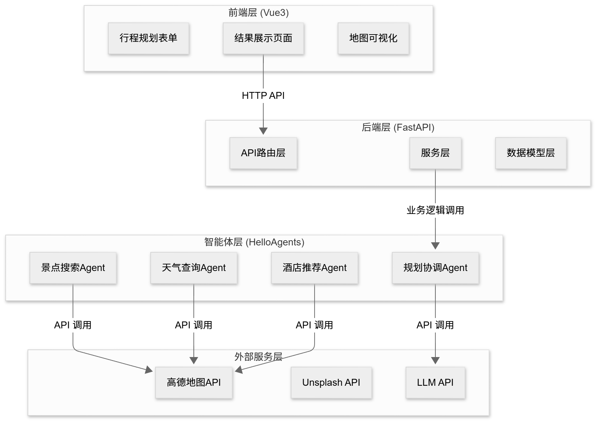
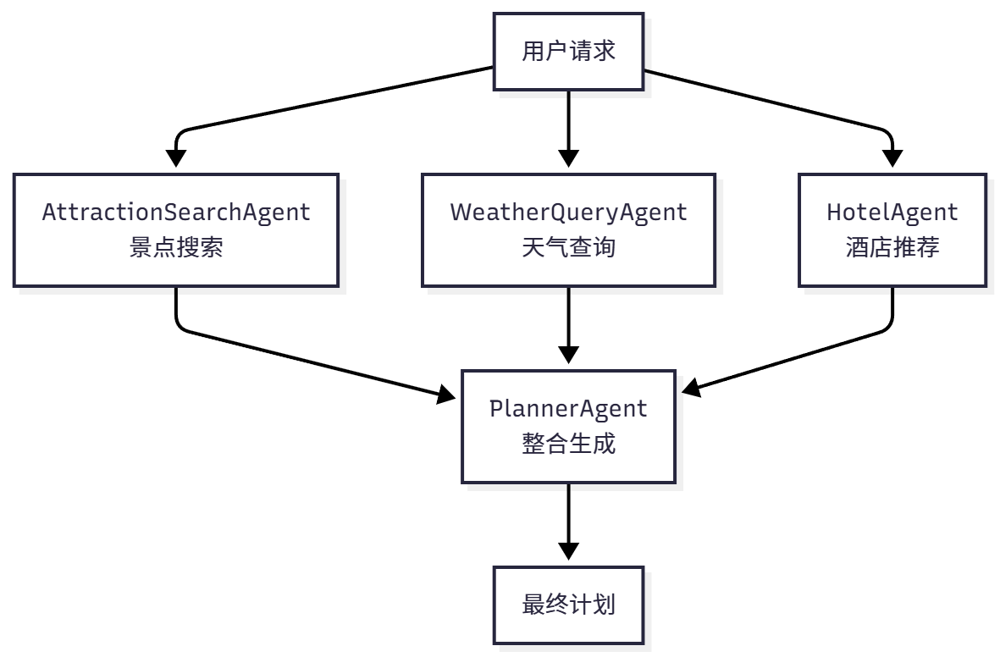
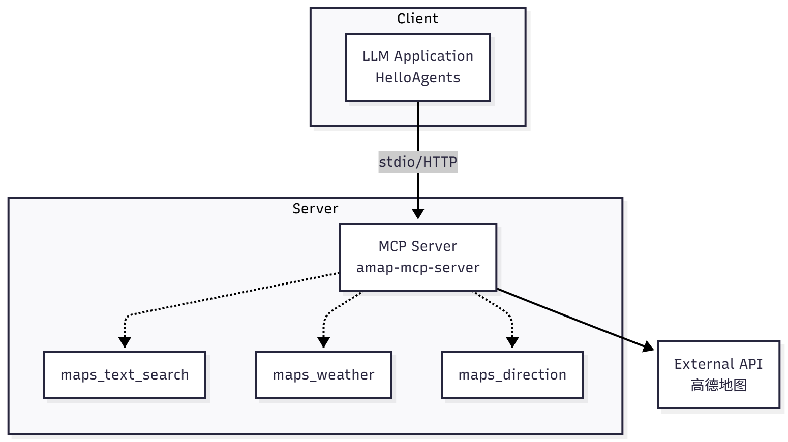
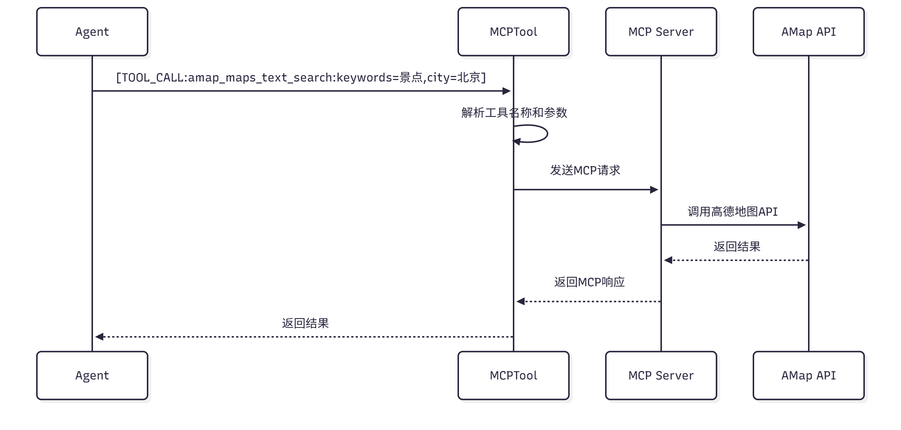

# 传统方式缺点

传统的旅行规划方式有几个痛点。

- **信息分**散：景点信息在旅游网站上，天气信息在天气网站上，酒店信息在预订网站上，你需要在多个网站之间切换，手动整合这些信息。
- **缺少个性化**：大部分攻略都是通用的，不考虑你的个人偏好、预算限制、出行时间等因素。
- **难以调整**：当你想修改行程时，可能需要重新规划整个行程，因为景点的顺序、时间安排、预算都是相互关联的。

# 技术架构

## 技术架构

（1）**前端层 (Vue3+TypeScript)**：负责用户交互和数据展示，包括表单输入、结果展示、地图可视化。

（2）**后端层 (FastAPI)**：负责 API 路由、数据验证、业务逻辑。

（3）**智能体层 (HelloAgents)**：负责任务分解、工具调用、结果整合。包含 4 个专门的 Agent。

（4）**外部服务层** ：提供数据和能力，包括高德地图 API、Unsplash API、LLM API。



## 数据流转

数据流转过程如下：

1. 用户在前端填写表单
2. 后端验证数据
3. 调用智能体系统
4. 智能体依次调用景点搜索、天气查询、酒店推荐、行程规划 Agent
5. 每个 Agent 通过 MCP 协议调用外部 API
6. 整合结果返回前端
7. 前端渲染展示。

## 项目结构

项目的结构参考如下，提供便于定位源码：

```
helloagents-trip-planner/
├── backend/                    # 后端代码
│   ├── app/
│   │   ├── agents/            # 智能体实现
│   │   ├── api/               # API路由
│   │   ├── models/            # 数据模型
│   │   ├── services/          # 服务层
│   │   └── config.py          # 配置文件
│   └── requirements.txt       # Python依赖
│
└── frontend/                   # 前端代码
    ├── src/
    │   ├── views/             # 页面组件
    │   ├── services/          # API服务
    │   ├── types/             # 类型定义
    │   └── router/            # 路由配置
    └── package.json           # npm依赖
```

# 体验

可以查看

# 数据模型设计

## Web 应用中的数据流转

核心问题：如何表示和传递旅行计划数据?

一个完整的 Web 应用中数据是如何流转的

1. 用户在前端填写的表单数据(目的地、日期、预算等)需要通过 HTTP 请求发送到后端服务器。
2. 后端接收到数据后，会调用智能体系统进行处理。
3. 智能体又会调用高德地图 API、Unsplash API 等外部服务获取数据。
4. 这些外部 API 返回的数据格式各不相同，有的用 `lng`，有的用 `lon`，有的用 `longitude`。
5. 最后，后端需要将处理好的数据返回给前端，前端再渲染成用户看到的页面。

数据经历了多次转换：

1. 前端表单
2. HTTP 请求
3. 后端 Python 对象
4. 外部 API 响应
5. 后端 Python 对象
6. HTTP 响应
7. 前端 TypeScript 对象
8. 页面展示。

## Pydantic 模型

### 字典和Pydantic模型对比

使用字典的缺点：

- 字段名不统一：
- 类型安全：数字写成字符串，导致计算出错，并且只能运行时发现
- 维护性：添加新字段，需要在代码的多个地方修改。如果遗漏了某个地方，就会导致数据不一致。

Pydantic 提供了一个解决方案。它是 **Python 的数据验证库**，可以让我们**用类来定义数据结构，并自动处理验证、转换和序列化**。

- 首先，如果我们传入了**错误的类型**(比如把 `ticket_price`设为字符串)，Pydantic 会**立即抛出异常**，告诉我们哪里出错了。
- 其次，IDE 可以**根据类型定义提供代码补全和类型检查**，大大减少了拼写错误。
- 最后，当我们需要**修改数据结构时，只需要修改类定义**，所有使用这个类的地方都会自动更新。

示例如下：

```python
from pydantic import BaseModel,Field

class Location(BaseModel):
    longitude: float = Field(...,description="经度")
    latitude: float = Field(...,description="纬度")

class Attraction(BaseModel):
    name: str
    location: Location
    ticket_price: int = 0

# 创建对象
attraction = Attraction(
    name="故宫",
    location=Location(longitude=116.397128,latitude=39.916527),
    ticket_price=60
)

# 类型安全的访问
lng = attraction.location.longitude  # IDE会提供代码补全
```

### Pydantic 核心概念

Pydantic 的基础是 `BaseModel`类，所有的数据模型都需要继承这个类。

#### 字段定义

**每个字段都可以指定类型，Pydantic 会自动进行类型检查和转换**。

字段定义使用 `b`**函数，它可以指定默认值、描述、验证规则**等。

`b`**表示这个字段是必填**的，如果创建对象时没有提供这个字段，Pydantic 会抛出异常。

可以使用 **`Optional`来表示可选字段**，或者直接提供默认值。

```python
from pydantic import BaseModel,Field
from typing import Optional,List

class Attraction(BaseModel):
    name: str = Field(...,description="景点名称")  # 必填
    rating: float = Field(default=0.0,ge=0,le=5)  # 默认值,范围验证
    visit_duration: int = Field(default=60,gt=0)  # 大于0
    description: Optional[str] = None  # 可选字段
```

#### 嵌套模型和列表

Pydantic 还支持嵌套模型和列表。

可以**在一个模型中使用另一个模型作为字段类型**,这样就可以构建复杂的数据结构。

比如，一个景点包含位置信息，一个行程包含多个景点。

```python
class DayPlan(BaseModel):
    date: str
    attractions: List[Attraction]  # 景点列表
    hotel: Optional[Hotel] = None  # 可选的酒店信息
```

#### 自定义验证器

有时候外部 API 返回的数据格式不符合我们的要求，我们可以使用 `field_validator`装饰器来自定义验证和转换逻辑。

比如，高德地图返回的温度是 `"16°C"`这样的字符串，我们需要把它转换成数字：

- 这个验证器**会在创建对象之前自动执行，将字符串转换成整数**。
- 这样我们就不需要在代码的每个地方都手动处理温度格式了。

```python
from pydantic import field_validator

class WeatherInfo(BaseModel):
    temperature: int
  
    @field_validator('temperature',mode='before')
    def parse_temperature(cls,v):
        """解析温度字符串："16°C" -> 16"""
        if isinstance(v,str):
            v = v.replace('°C','').replace('℃','').strip()
            return int(v)
        return v
```

## 自底向上的数据模型设计

开始设计智能旅行助手的数据模型。

好的设计原则是 **自底向上 ：先定义最基础的模型，然后逐步组合成复杂的结构**。

这样做的好处是每个模型都很简单，容易理解和维护。

从最基础的 `Location`，到 `Attraction`、`Meal`、`Hotel`，再到 `DayPlan`，最后到 `TripPlan`，形成了一个清晰的层次结构。

### 位置信息

最**基础的模型是：位置信息**，无论是景点、酒店还是餐厅，都需要位置信息

定义一个 `Location`类来表示经纬度坐标：

> 使用了**范围验证**(`ge`表示大于等于，`le`表示小于等于)，确保经纬度的值在合理范围内

```python
class Location(BaseModel):
    """位置信息(经纬度坐标)"""
    longitude: float = Field(...,description="经度",ge=-180,le=180)
    latitude: float = Field(...,description="纬度",ge=-90,le=90)
```

### 景点&餐饮&酒店信息

一个景点包含名称、地址、位置、游览时间、描述、评分、图片和门票价格等信息。

**使用了 `Location`作为字段类型，这就是嵌套模型**：

```python
class Attraction(BaseModel):
    """景点信息"""
    name: str = Field(...,description="景点名称")
    address: str = Field(...,description="地址")
    location: Location = Field(...,description="经纬度坐标")
    visit_duration: int = Field(...,description="建议游览时间(分钟)",gt=0)
    description: str = Field(...,description="景点描述")
    category: Optional[str] = Field(default="景点",description="景点类别")
    rating: Optional[float] = Field(default=None,ge=0,le=5,description="评分")
    image_url: Optional[str] = Field(default=None,description="图片URL")
    ticket_price: int = Field(default=0,ge=0,description="门票价格(元)")
```

类似地，我们定义 餐饮信息 和 酒店信息

这些模型的结构都很相似，都包含名称、地址、位置和费用等基本信息：

```python
class Meal(BaseModel):
    """餐饮信息"""
    type: str = Field(...,description="餐饮类型：breakfast/lunch/dinner/snack")
    name: str = Field(...,description="餐饮名称")
    address: Optional[str] = Field(default=None,description="地址")
    location: Optional[Location] = Field(default=None,description="经纬度坐标")
    description: Optional[str] = Field(default=None,description="描述")
    estimated_cost: int = Field(default=0,description="预估费用(元)")

class Hotel(BaseModel):
    """酒店信息"""
    name: str = Field(...,description="酒店名称")
    address: str = Field(default="",description="酒店地址")
    location: Optional[Location] = Field(default=None,description="酒店位置")
    price_range: str = Field(default="",description="价格范围")
    rating: str = Field(default="",description="评分")
    distance: str = Field(default="",description="距离景点距离")
    type: str = Field(default="",description="酒店类型")
    estimated_cost: int = Field(default=0,description="预估费用(元/晚)")
```

### 预算信息

是一个特殊的模型，它不包含位置信息，而是包含各项费用的汇总：

```python
class Budget(BaseModel):
    """预算信息"""
    total_attractions: int = Field(default=0,description="景点门票总费用")
    total_hotels: int = Field(default=0,description="酒店总费用")
    total_meals: int = Field(default=0,description="餐饮总费用")
    total_transportation: int = Field(default=0,description="交通总费用")
    total: int = Field(default=0,description="总费用")
```

### 单日行程

现在我们可以组合这些基础模型，构建 单日行程 。

一个单日行程包含日期、描述、交通方式、住宿安排、酒店、景点列表和餐饮列表：

注意这里使用了 `List[Attraction]`来表示景点列表，`default_factory=list`表示默认值是一个空列表。

```python
class DayPlan(BaseModel):
    """单日行程"""
    date: str = Field(...,description="日期")
    day_index: int = Field(...,description="第几天(从0开始)")
    description: str = Field(...,description="当日行程描述")
    transportation: str = Field(...,description="交通方式")
    accommodation: str = Field(...,description="住宿安排")
    hotel: Optional[Hotel] = Field(default=None,description="酒店信息")
    attractions: List[Attraction] = Field(default_factory=list,description="景点列表")
    meals: List[Meal] = Field(default_factory=list,description="餐饮安排")
```

### 天气信息

天气信息 需要特殊处理，因为高德地图返回的温度格式不规范。

我们使用自定义验证器来处理：

```python
class WeatherInfo(BaseModel):
    """天气信息"""
    date: str = Field(...,description="日期")
    day_weather: str = Field(...,description="白天天气")
    night_weather: str = Field(...,description="夜间天气")
    day_temp: int = Field(...,description="白天温度(摄氏度)")
    night_temp: int = Field(...,description="夜间温度(摄氏度)")
    wind_direction: str = Field(...,description="风向")
    wind_power: str = Field(...,description="风力")
  
    @field_validator('day_temp','night_temp',mode='before')
    def parse_temperature(cls,v):
        """解析温度字符串："16°C" -> 16"""
        if isinstance(v,str):
            v = v.replace('°C','').replace('℃','').replace('°','').strip()
            try:
                return int(v)
            except ValueError:
                return 0  # 容错处理
        return v
```

### 完整的旅行计划

最后，我们定义完整的旅行计划。

这是最顶层的模型，包含了所有的信息：

```python
class TripPlan(BaseModel):
    """旅行计划"""
    city: str = Field(...,description="目的地城市")
    start_date: str = Field(...,description="开始日期")
    end_date: str = Field(...,description="结束日期")
    days: List[DayPlan] = Field(default_factory=list,description="每日行程")
    weather_info: List[WeatherInfo] = Field(default_factory=list,description="天气信息")
    overall_suggestions: str = Field(...,description="总体建议")
    budget: Optional[Budget] = Field(default=None,description="预算信息")
```

## 数据模型在 Web 应用

这些数据模型如何在实际的 Web 应用中使用。

在 FastAPI 中，Pydantic 模型可以直接用作请求和响应的类型定义。

FastAPI 会自动进行数据验证、序列化和文档生成。

### 后端接口

当用户发送 POST 请求到 `/api/trip/plan`时，FastAPI 会自动将 JSON 数据转换成 `TripPlanRequest`对象。

如果数据格式不正确(比如缺少必填字段，或者类型不匹配)，FastAPI 会自动返回 400 错误，并告诉用户哪里出错了。

```python
from fastapi import FastAPI
from app.models.schemas import TripPlanRequest,TripPlan

app = FastAPI()

@app.post("/api/trip/plan",response_model=TripPlan)
async def create_trip_plan(request: TripPlanRequest) -> TripPlan:
    """
    创建旅行计划
  
    FastAPI自动：
    1. 验证请求数据(TripPlanRequest)
    2. 验证响应数据(TripPlan)
    3. 生成OpenAPI文档
    """
    trip_plan = await generate_trip_plan(request)
    return trip_plan
```

### 前端类型定义

虽然 TypeScript 和 Python 是不同的语言，但数据结构是一样的：

这样，前后端就使用了统一的数据格式。当后端返回 `TripPlan`对象时，前端可以直接使用，不需要任何转换。

TypeScript 的类型检查也能帮助我们避免很多错误。

```typescript
interface Location {
  longitude: number;
  latitude: number;
}

interface Attraction {
  name: string;
  address: string;
  location: Location;
  visit_duration: number;
  ticket_price: number;
}

interface TripPlan {
  city: string;
  start_date: string;
  end_date: string;
  days: DayPlan[];
}
```

# 多智能体协作设计

## 为什么要多智能体

### 工具调用问题

单智能体问题1：**工具调用的限制**

* **SimpleAgent 每次 `run()`调用只能执行一个工具**
* 意味着我们需要多次调用 `run()`方法，每次调用处理一个任务。
* 新问题：如何在多次调用之间传递信息
  * 第一次调用得到的景点信息，如何传递给第二次调用？
  * 我们需要手动管理这些中间结果，代码会变得很复杂。

可以使用 ReactAgent 来解决这个问题：**ReactAgent 可以在一次调用中执行多个工具，它会自动进行多轮思考和行动**。

- 问题：**时间成本**
- ReactAgent 的每一轮思考都需要调用 LLM，如果需要调用三个工具，就需要至少三轮思考，这意味着至少三次 LLM 调用。
- 而且这些调用是串行的，必须等前一个完成才能开始下一个，总时间会很长。

### 提示词的复杂度

第二个问题是：**提示词的复杂度，**如果我们要**让一个 Agent 完成所有任务，就需要在提示词中详细描述每个任务的执行逻辑****。**

如下：

```python
COMPLEX_PROMPT = """你是旅行规划助手。你需要：
1. 使用maps_text_search搜索景点，关键词根据用户偏好确定
2. 使用maps_weather查询天气,获取未来几天的天气预报
3. 使用maps_text_search搜索酒店,类型根据用户需求确定
4. 整合所有信息生成旅行计划,包括每天的景点、餐饮、住宿安排
注意：必须按顺序执行,每个工具只能调用一次,输出必须是JSON格式...
"""
```

这样的话，提示词会有下面几个问题：

- **难以维护** ：想修改景点搜索的逻辑(比如增加评分筛选)，就需要修改整个提示词，很容易影响到其他部分。
- **容易出错**：LLM 需要同时理解多个任务的要求，很容易搞混不同任务的格式和参数。
- **难以调试**：当生成的计划不符合预期时，我们很难知道是哪个环节出了问题，是景点搜索不准确，还是天气查询失败，还是整合逻辑有问题？

### 思考

**多 Agent 协作的核心思想：复杂的任务分解成多个简单的任务，让不同的 Agent 各司其职**

> 如现实世界中的旅行社，当你去旅行社咨询旅行计划时，不会只有一个人为你服务。

## Agent 角色设计

### 总体结构



**AttractionSearchAgent(景点搜索专家)**：专注于搜索景点信息。

- 它只需要理解用户的偏好(比如"历史文化"、"自然风光")，然后调用高德地图的 POI 搜索工具，返回相关的景点列表。
- 它的提示词很简单，只需要说明如何根据偏好选择关键词，如何调用工具。

**WeatherQueryAgent(天气查询专家)**：专注于查询天气信息。

- 它只需要知道城市名称，然后调用天气查询工具，返回未来几天的天气预报。
- 它的任务非常明确，几乎不会出错。

**HotelAgent(酒店推荐专家)**：专注于搜索酒店信息。

- 它需要理解用户的住宿需求(比如"经济型"、"豪华型")，然后调用 POI 搜索工具，返回符合要求的酒店列表。

**PlannerAgent(行程规划专家)**：负责整合所有信息。

- 它接收前三个 Agent 的输出，加上用户的原始需求(日期、预算等)，然后生成完整的旅行计划。
- 它不需要调用任何外部工具，只需要专注于信息的整合和行程的安排。

### 提示词设计

#### AttractionSearchAgent

AttractionSearchAgent 的任务是根据用户偏好搜索景点。

- 它的输入是城市名称和用户偏好(比如"历史文化"、"自然风光")。
- 它需要调用 `amap_maps_text_search`工具，参数是关键词和城市。
- 它的输出是景点列表，包含名称、地址、评分等信息。

这个提示词很简洁，但包含了所有必要的信息。

- 它明确说明了工具调用的格式，提供了具体的示例，
- 还强调了两个重要原则：必须使用工具(不能编造)，要根据用户偏好搜索。

```python
ATTRACTION_AGENT_PROMPT = """你是景点搜索专家。

**工具调用格式:**
`[TOOL_CALL:amap_maps_text_search:keywords=景点,city=城市名]`

**示例:**
- `[TOOL_CALL:amap_maps_text_search:keywords=景点,city=北京]`
- `[TOOL_CALL:amap_maps_text_search:keywords=博物馆,city=上海]`

**重要:**
- 必须使用工具搜索,不要编造信息
- 根据用户偏好({preferences})搜索{city}的景点
"""
```

#### WeatherQueryAgent

WeatherQueryAgent的任务更简单，只需要查询天气。

- 它的输入是城市名称，
- 输出是天气信息。

```python
WEATHER_AGENT_PROMPT = """你是天气查询专家。

**工具调用格式:**
`[TOOL_CALL:amap_maps_weather:city=城市名]`

请查询{city}的天气信息。
"""
```

#### HotelAgent

HotelAgent的任务是搜索酒店。

- 它的输入是城市名称和住宿类型，
- 输出是酒店列表。

```python
HOTEL_AGENT_PROMPT = """你是酒店推荐专家。

**工具调用格式:**
`[TOOL_CALL:amap_maps_text_search:keywords=酒店,city=城市名]`

请搜索{city}的{accommodation}酒店。
"""
```

#### PlannerAgent

PlannerAgent是最复杂的，因为它需要整合所有信息。

- 它的输入是用户需求和前三个 Agent 的输出，
- 输出是完整的旅行计划(JSON 格式)。

```python
PLANNER_AGENT_PROMPT = """你是行程规划专家。

**输出格式:**
严格按照以下JSON格式返回:
{
  "city": "城市名称",
  "start_date": "YYYY-MM-DD",
  "end_date": "YYYY-MM-DD",
  "days": [...],
  "weather_info": [...],
  "overall_suggestions": "总体建议",
  "budget": {...}
}

**规划要求:**
1. weather_info必须包含每天的天气
2. 温度为纯数字(不带°C)
3. 每天安排2-3个景点
4. 考虑景点距离和游览时间
5. 包含早中晚三餐
6. 提供实用建议
7. 包含预算信息
"""
```

## Agent 协作流程

整个流程可以分为五个步骤：这个流程顺序执行四个步骤，每个步骤的输出作为下一个步骤的输入。

```python
class TripPlannerAgent:
    def __init__(self):
        self.attraction_agent = SimpleAgent(name="景点搜索"prompt=ATTRACTION_PROMPT)
        self.weather_agent = SimpleAgent(name="天气查询", prompt=WEATHER_PROMPT)
        self.hotel_agent = SimpleAgent(name="酒店推荐", prompt=HOTEL_PROMPT)
        self.planner_agent = SimpleAgent(name="行程规划", prompt=PLANNER_PROMPT)

    def plan_trip(self, request: TripPlanRequest) -> TripPlan:
        # 步骤1: 景点搜索
        attraction_response = self.attraction_agent.run(
            f"请搜索{request.city}的{request.preferences}景点"
        )

        # 步骤2: 天气查询
        weather_response = self.weather_agent.run(
            f"请查询{request.city}的天气"
        )

        # 步骤3: 酒店推荐
        hotel_response = self.hotel_agent.run(
            f"请搜索{request.city}的{request.accommodation}酒店"
        )

        # 步骤4: 整合生成计划
        planner_query = self._build_planner_query(
            request, attraction_response, weather_response, hotel_response
        )
        planner_response = self.planner_agent.run(planner_query)

        # 步骤5: 解析JSON
        trip_plan = self._parse_trip_plan(planner_response)
        return trip_plan
```

## 查询构建

PlannerAgent 需要整合所有信息，这个查询需要包含所有必要的信息，而且要组织得清晰有序，让 LLM 能够准确理解。

- 通过这种多 Agent 协作的设计，我们把一个复杂的旅行规划任务分解成了四个简单的子任务。
- 每个 Agent 都专注于自己擅长的领域，
- 也为未来的功能扩展(比如添加餐厅推荐 Agent、交通规划 Agent)打下了良好的基础。

```python
def _build_planner_query(
    self,
    request: TripPlanRequest,
    attraction_response: str,
    weather_response: str,
    hotel_response: str
) -> str:
    """构建规划Agent的查询"""
    return f"""
请根据以下信息生成{request.city}的{request.days}日旅行计划:

**用户需求:**
- 目的地: {request.city}
- 日期: {request.start_date} 至 {request.end_date}
- 天数: {request.days}天
- 偏好: {request.preferences}
- 预算: {request.budget}
- 交通方式: {request.transportation}
- 住宿类型: {request.accommodation}

**景点信息:**
{attraction_response}

**天气信息:**
{weather_response}

**酒店信息:**
{hotel_response}

请生成详细的旅行计划,包括每天的景点安排、餐饮推荐、住宿信息和预算明细。
"""
```

# MCP 工具集成

## API调用缺点

**Agent 无法自主调用**：

- Agent 通过识别提示词中的工具调用标记(比如 `[TOOL_CALL:tool_name:arg1=value1]`)来调用工具。
- 直接在代码中调用 API，Agent 就失去了自主决策的能力，变成了一个简单的函数调用。

**参数传递复杂**：API接口也很多参数，要让 Agent 能够灵活使用这些参数，就需要在提示词中详细说明每个参数的含义和格式，这会让提示词变得非常复杂。

**响应解析困难**：接口返回的数据需要编写代码去解析，如果 API 的响应格式发生变化，我们就需要修改解析代码。

**工具管理混乱**：API很多，如果手动注册代码会很多，并且当我们想添加新的 API 时，需要修改多个地方。

## 高德地图 MCP 集成

MCP(Model Context Protocol)是 Anthropic 提出的标准化协议，用于连接 LLM 和外部工具。



通过 MCP 协议，我们可以很方便地在 HelloAgents 中集成:

- 首先，`command`和 `args`指定了如何启动 MCP 服务器。
- `npx -y @sugarforever/amap-mcp-server`会从 npm 仓库下载并运行 `amap-mcp-server`这个包。
  - `npx` 和 `uvx` 在设计理念上高度一致，区别仅在于所处的生态系统，
  - `npx` 面向 JavaScript/Node.js（包来自 npm），
  - 而 `uvx` 面向 Python（包来自 PyPI）。
- `env`参数传递了环境变量，这里我们传递了高德地图的 API 密钥。
- `auto_expand=True`这个参数。
  - 当设置为 True 时，`MCPTool`会自动查询 MCP 服务器提供了哪些工具，然后为每个工具创建一个独立的 Tool 对象。
  - 这就是为什么我们只创建了一个 `MCPTool`，但 Agent 却获得了 16 个工具。

```python
from hello_agents.tools import MCPTool
from app.config import get_settings

settings = get_settings()

# 创建MCP工具
mcp_tool = MCPTool(
    name="amap_mcp",
    command="npx",
    args=["-y", "@sugarforever/amap-mcp-server"],
    env={"AMAP_API_KEY": settings.amap_api_key},
    auto_expand=True
)
```

创建 `MCPTool`对象时，它会在后台启动 MCP 服务器进程，并通过标准输入输出(stdin/stdout)与服务器通信。

这是 MCP 协议的一个**特点：使用进程间通信而不是 HTTP，这样更高效，也更容易管理**。

```python
# 创建一个MCPTool
mcp_tool = MCPTool(..., auto_expand=True)
agent.add_tool(mcp_tool)

# Agent实际上获得了16个工具！
print(list(agent.tools.keys()))
# ['amap_maps_text_search', 'amap_maps_weather', ...]
```

示例如下：假设用户想搜索北京的景点，AttractionSearchAgent 接收到查询"请搜索北京的历史文化景点"。Agent 分析这个查询，决定调用 `amap_maps_text_search`工具，参数是 `keywords=景点，city=北京`。



过程如下：这个流程看起来很复杂，但对于 Agent 来说，它只需要知道有一个叫 `amap_maps_text_search`的工具，可以搜索景点。所有的底层细节都被 MCP 协议和 `MCPTool`封装起来了。

1. Tool 对象是 `MCPTool`自动创建的，它会把调**用请求发送给 MCP 服务器**。

   > 会构造一个 JSON-RPC 格式的消息，通过 stdin 发送给服务器进程：
   >

   ```json
   {
   "jsonrpc": "2.0",
   "method": "tools/call",
   "params": {
       "name": "amap_maps_text_search",
       "arguments": {
       "keywords": "景点",
       "city": "北京"
       }
   }
   }
   ```
2. **MCP 服务器接收到这个消息，解析参数**，然后调用高德地图的 HTTP API。它会构造 HTTP 请求，添加 API 密钥，发送请求，接收响应。
3. **高德地图 API 返回 JSON 格式的数据**，包含景点列表、地址、坐标等信息。**MCP 服务器解析这些数据，提取关键字段**，然后构造响应消息，通过 stdout 返回给 `MCPTool`：

   ```json
   {
   "jsonrpc": "2.0",
   "result": {
       "content": [
       {
           "type": "text",
           "text": "找到以下景点：\n1. 故宫博物院 - 地址：东城区景山前街4号\n2. 天坛公园 - 地址：东城区天坛路\n..."
       }
       ]
   }
   }
   ```
4. **接收到响应，提取文本内容，返回给 Agent**。Agent 把这个结果作为工具调用的输出，继续生成最终的回复。

## 共享 MCP 实例

让所有 Agent 共享同一个 `MCPTool`实例。这样只需要启动一个 MCP 服务器进程，所有的 API 调用都通过这个进程进行。


在 `TripPlannerAgent`的构造函数中创建一个 `MCPTool`实例，然后把它添加到每个子 Agent 的工具列表中：

- 这样，三个 Agent 都可以使用高德地图的 16 个工具，但底层只有一个 MCP 服务器进程在运行。
- 当我们调用 `TripPlannerAgent`的 `plan_trip`方法时，三个 Agent 会依次调用工具，所有的请求都通过同一个 MCP 服务器发送到高德地图 API。

```python
class TripPlannerAgent:
    def __init__(self):
        settings = get_settings()
        self.llm = HelloAgentsLLM()

        # 创建共享的MCP工具实例(只创建一次)
        self.mcp_tool = MCPTool(
            name="amap_mcp",
            command="npx",
            args=["-y", "@sugarforever/amap-mcp-server"],
            env={"AMAP_API_KEY": settings.amap_api_key},
            auto_expand=True
        )

        # 创建多个Agent,共享同一个MCP工具
        self.attraction_agent = SimpleAgent(
            name="AttractionSearchAgent",
            llm=self.llm,
            system_prompt=ATTRACTION_AGENT_PROMPT
        )
        self.attraction_agent.add_tool(self.mcp_tool)  # 共享

        self.weather_agent = SimpleAgent(
            name="WeatherQueryAgent",
            llm=self.llm,
            system_prompt=WEATHER_AGENT_PROMPT
        )
        self.weather_agent.add_tool(self.mcp_tool)  # 共享

        self.hotel_agent = SimpleAgent(
            name="HotelAgent",
            llm=self.llm,
            system_prompt=HOTEL_AGENT_PROMPT
        )
        self.hotel_agent.add_tool(self.mcp_tool)  # 共享
```

## Unsplash 图片 API 集成

Unsplash 是国外的服务，而且是为数不多可以免费使用的图片 API，所以搜索结果可能不够准确。在实际项目中，可以考虑使用必应、百度或高德的 POI 图片 API，但这些服务通常需要付费。

注意我们没有把 Unsplash 封装成 Tool 或 MCP 工具，而是直接在 API 路由中调用。这是**因为图片搜索不需要 Agent 的智能决策，只是一个简单的数据增强步骤**。如果你想让 Agent 能够自主决定是否需要图片，或者选择不同的图片来源，可以考虑把它封装成 Tool。

Unsplash API 的集成比较简单，我们创建一个 `UnsplashService`类来封装 API 调用：

```python
# backend/app/services/unsplash_service.py
import requests
from typing import Optional, List, Dict
import logging

logger = logging.getLogger(__name__)

class UnsplashService:
    """Unsplash图片服务"""

    def __init__(self, access_key: str):
        self.access_key = access_key
        self.base_url = "https://api.unsplash.com"

    def search_photos(self, query: str, per_page: int = 10) -> List[Dict]:
        """搜索图片"""
        try:
            url = f"{self.base_url}/search/photos"
            params = {
                "query": query,
                "per_page": per_page,
                "client_id": self.access_key
            }

            response = requests.get(url, params=params, timeout=10)
            response.raise_for_status()

            data = response.json()
            results = data.get("results", [])

            # 提取图片URL
            photos = []
            for result in results:
                photos.append({
                    "url": result["urls"]["regular"],
                    "description": result.get("description", ""),
                    "photographer": result["user"]["name"]
                })

            return photos

        except Exception as e:
            logger.error(f"搜索图片失败: {e}")
            return []

    def get_photo_url(self, query: str) -> Optional[str]:
        """获取单张图片URL"""
        photos = self.search_photos(query, per_page=1)
        return photos[0].get("url") if photos else None
```

这个服务类提供了两个方法：`search_photos`搜索多张图片，`get_photo_url`获取单张图片的 URL。我们在 API 路由中使用这个服务，为每个景点获取图片：

```python
# backend/app/api/routes/trip.py
from app.services.unsplash_service import UnsplashService

unsplash_service = UnsplashService(settings.unsplash_access_key)

@router.post("/plan", response_model=TripPlan)
async def create_trip_plan(request: TripPlanRequest) -> TripPlan:
    # 生成旅行计划
    trip_plan = trip_planner_agent.plan_trip(request)

    # 为每个景点获取图片
    for day in trip_plan.days:
        for attraction in day.attractions:
            if not attraction.image_url:
                image_url = unsplash_service.get_photo_url(
                    f"{attraction.name} {trip_plan.city}"
                )
                attraction.image_url = image_url

    return trip_plan
```

# 前端开发详解

# 功能实现详解

## 预算计算功能

在后端的 PlannerAgent 中实现。

> 在后端的 PlannerAgent 中实现。为什么不在前端计算？
>
> 因为预算的估算需要基于景点的门票价格、酒店的价格范围、餐饮的标准等信息，这些信息都是 PlannerAgent 在生成行程时已经获取的。
>
> 如果在前端计算，就需要重复这些逻辑，而且可能不准确。

明确要求 LLM 生成预算信息：

```python
PLANNER_AGENT_PROMPT = """
你是行程规划专家。

**输出格式：**
严格按照以下JSON格式返回：
{
  ...
  "budget": {
    "total_attractions": 180,
    "total_hotels": 1200,
    "total_meals": 480,
    "total_transportation": 200,
    "total": 2060
  }
}

**规划要求：**
...
7. 包含预算信息,根据景点门票、酒店价格、餐饮标准和交通方式估算
"""
```
